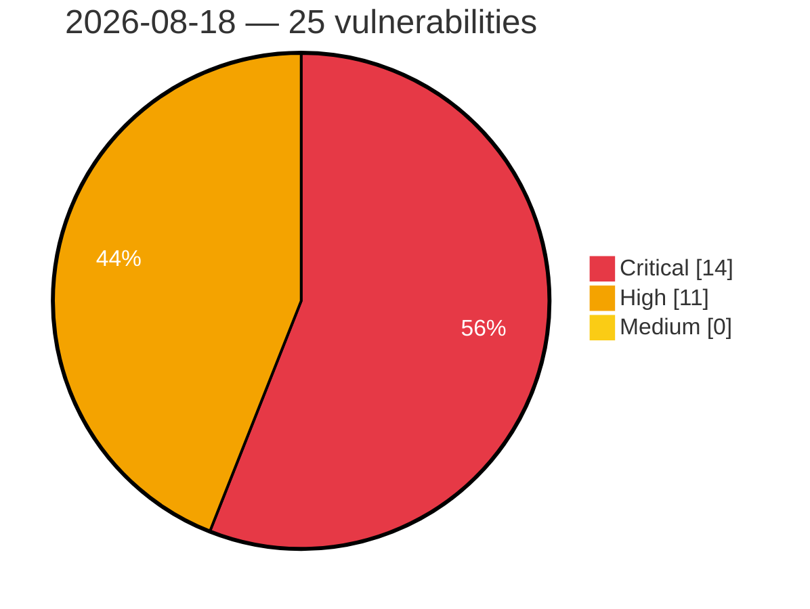

# Critical, High & Medium Severity Vulnerabilities — 2026-08-18

**Source status for this day:**

| Source | Critical | High | Medium | Total |
|--------|---------:|-----:|-------:|------:|
| cvefeed.io (High/Critical) | 14 | 11 | 0 | 25 |

**KEV (actively exploited):** 0  **Watchlist matches:** 22

## Critical (14)

| CVSS | Flags | Source | CVE / Title | Reported |
|------|-------|--------|-------------|----------|
| 9.9 | ⭐ | cvefeed.io (High/Critical) | [CVE-2026-75851 - ArcadeDB before 26.8.1 Authentication Bypass via Async Command](https://cvefeed.io/vuln/detail/CVE-2026-75851) | 58 minutes ago |
| 9.9 | ⭐ | cvefeed.io (High/Critical) | [CVE-2026-75843 - ArcadeDB before 26.8.1 Privilege Escalation via gRPC Transaction](https://cvefeed.io/vuln/detail/CVE-2026-75843) | 58 minutes ago |
| 9.8 | ⭐ | cvefeed.io (High/Critical) | [CVE-2026-15748 - Forminator Forms <= 1.56.1 - Unauthenticated Arbitrary File Upload via Forged Upload Field Configuration](https://cvefeed.io/vuln/detail/CVE-2026-15748) | 1 hour, 15 minutes ago |
| 9.8 | — | cvefeed.io (High/Critical) | [CVE-2026-75854 - ArcadeDB Redis Wire-Protocol Plugin Missing Authentication](https://cvefeed.io/vuln/detail/CVE-2026-75854) | 58 minutes ago |
| 9.8 | ⭐ | cvefeed.io (High/Critical) | [CVE-2026-75852 - ArcadeDB MongoDB wire protocol authentication bypass cross-database](https://cvefeed.io/vuln/detail/CVE-2026-75852) | 58 minutes ago |
| 9.8 | ⭐ | cvefeed.io (High/Critical) | [CVE-2026-75627 - Bastillion Authentication Bypass via Path-Prefix Routing Mismatch](https://cvefeed.io/vuln/detail/CVE-2026-75627) | 1 hour, 1 minute ago |
| 9.3 | ⭐ | cvefeed.io (High/Critical) | [CVE-2026-75837 - Grav before 2.0.14 Privilege Escalation via Group Access Field](https://cvefeed.io/vuln/detail/CVE-2026-75837) | 58 minutes ago |
| 9.3 | ⭐ | cvefeed.io (High/Critical) | [CVE-2026-75835 - Grav API Plugin before 1.0.14 Missing Authorization](https://cvefeed.io/vuln/detail/CVE-2026-75835) | 58 minutes ago |
| 9.3 | ⭐ | cvefeed.io (High/Critical) | [CVE-2026-75832 - Grav API Plugin before 1.0.14 Authorization Bypass](https://cvefeed.io/vuln/detail/CVE-2026-75832) | 58 minutes ago |
| 9.3 | ⭐ | cvefeed.io (High/Critical) | [CVE-2026-75828 - Grav before 2.0.15 Stored XSS via detectXss() Quote Bypass](https://cvefeed.io/vuln/detail/CVE-2026-75828) | 58 minutes ago |
| 9.3 | ⭐ | cvefeed.io (High/Critical) | [CVE-2026-75827 - Grav before 2.0.15 Arbitrary File Write via error_log](https://cvefeed.io/vuln/detail/CVE-2026-75827) | 58 minutes ago |
| 9.3 | ⭐ | cvefeed.io (High/Critical) | [CVE-2026-74902 - SiYuan before v3.7.4 XSS-to-RCE via malicious filename upload](https://cvefeed.io/vuln/detail/CVE-2026-74902) | 58 minutes ago |
| 9.3 | ⭐ | cvefeed.io (High/Critical) | [CVE-2026-75626 - SpiderFoot Stored Cross-Site Scripting via Correlation Titles](https://cvefeed.io/vuln/detail/CVE-2026-75626) | 1 hour, 1 minute ago |
| 9.1 | ⭐ | cvefeed.io (High/Critical) | [CVE-2026-75094 - COMFAST CF-N1-S CGI mbox-config sub_44B438 os command injection](https://cvefeed.io/vuln/detail/CVE-2026-75094) | 16 minutes ago |

## High (11)

| CVSS | Flags | Source | CVE / Title | Reported |
|------|-------|--------|-------------|----------|
| 8.8 | ⭐ | cvefeed.io (High/Critical) | [CVE-2026-75853 - ArcadeDB Gremlin Wire Protocol Authorization Bypass Cross-Database](https://cvefeed.io/vuln/detail/CVE-2026-75853) | 58 minutes ago |
| 8.8 | ⭐ | cvefeed.io (High/Critical) | [CVE-2026-75836 - Grav API Plugin before 1.0.14 Missing Authorization](https://cvefeed.io/vuln/detail/CVE-2026-75836) | 58 minutes ago |
| 8.7 | ⭐ | cvefeed.io (High/Critical) | [CVE-2026-75855 - ArcadeDB before 26.8.1 Path Traversal via create/drop database](https://cvefeed.io/vuln/detail/CVE-2026-75855) | 58 minutes ago |
| 8.7 | ⭐ | cvefeed.io (High/Critical) | [CVE-2026-75840 - ArcadeDB before 26.8.1 Arbitrary File Read via Unescaped Regex](https://cvefeed.io/vuln/detail/CVE-2026-75840) | 58 minutes ago |
| 8.7 | — | cvefeed.io (High/Critical) | [CVE-2026-74906 - SiYuan before v3.7.4 Incorrect Authorization via Publish Access](https://cvefeed.io/vuln/detail/CVE-2026-74906) | 58 minutes ago |
| 8.7 | ⭐ | cvefeed.io (High/Critical) | [CVE-2026-74904 - SiYuan before v3.7.4 Missing Authorization via block API](https://cvefeed.io/vuln/detail/CVE-2026-74904) | 58 minutes ago |
| 8.6 | ⭐ | cvefeed.io (High/Critical) | [CVE-2026-75833 - Grav API Plugin Open Redirect via Backslash Bypass](https://cvefeed.io/vuln/detail/CVE-2026-75833) | 58 minutes ago |
| 8.6 | ⭐ | cvefeed.io (High/Critical) | [CVE-2026-75829 - grav-plugin-api before 1.0.15 Twig SSTI via translate endpoint](https://cvefeed.io/vuln/detail/CVE-2026-75829) | 58 minutes ago |
| 8.3 | — | cvefeed.io (High/Critical) | [CVE-2026-75842 - ArcadeDB before 26.8.1 Arbitrary File Read via LOAD CSV](https://cvefeed.io/vuln/detail/CVE-2026-75842) | 58 minutes ago |
| 8.2 | ⭐ | cvefeed.io (High/Critical) | [CVE-2026-74907 - Grav before 2.0.15 Path Traversal via plugin-asset-map.php](https://cvefeed.io/vuln/detail/CVE-2026-74907) | 58 minutes ago |
| 8.1 | ⭐ | cvefeed.io (High/Critical) | [CVE-2026-15371 - Velociraptor Stored XSS in URL column types](https://cvefeed.io/vuln/detail/CVE-2026-15371) | 15 minutes ago |
