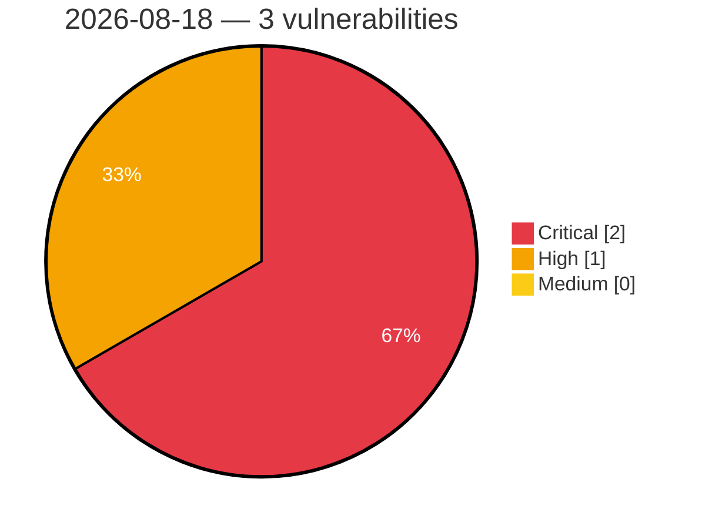

# Critical, High & Medium Severity Vulnerabilities — 2026-08-18

**Source status for this day:**

| Source | Critical | High | Medium | Total |
|--------|---------:|-----:|-------:|------:|
| cvefeed.io (High/Critical) | 2 | 1 | 0 | 3 |

**KEV (actively exploited):** 0  **Watchlist matches:** 3

## Critical (2)

| CVSS | Flags | Source | CVE / Title | Reported |
|------|-------|--------|-------------|----------|
| 9.8 | ⭐ | cvefeed.io (High/Critical) | [CVE-2026-15748 - Forminator Forms <= 1.56.1 - Unauthenticated Arbitrary File Upload via Forged Upload Field Configuration](https://cvefeed.io/vuln/detail/CVE-2026-15748) | 1 hour, 15 minutes ago |
| 9.1 | ⭐ | cvefeed.io (High/Critical) | [CVE-2026-75094 - COMFAST CF-N1-S CGI mbox-config sub_44B438 os command injection](https://cvefeed.io/vuln/detail/CVE-2026-75094) | 16 minutes ago |

## High (1)

| CVSS | Flags | Source | CVE / Title | Reported |
|------|-------|--------|-------------|----------|
| 8.1 | ⭐ | cvefeed.io (High/Critical) | [CVE-2026-15371 - Velociraptor Stored XSS in URL column types](https://cvefeed.io/vuln/detail/CVE-2026-15371) | 15 minutes ago |
