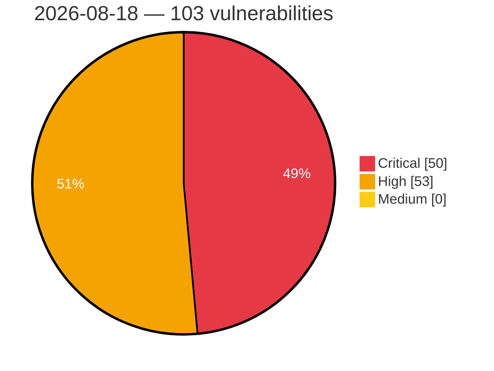

# Critical, High & Medium Severity Vulnerabilities — 2026-08-18

**Source status for this day:**

| Source | Critical | High | Medium | Total |
|--------|---------:|-----:|-------:|------:|
| cvefeed.io (High/Critical) | 50 | 53 | 0 | 103 |

**KEV (actively exploited):** 0  **Watchlist matches:** 69

## Critical (50)

| CVSS | Flags | Source | CVE / Title | Reported |
|------|-------|--------|-------------|----------|
| 10.0 | — | cvefeed.io (High/Critical) | [CVE-2026-75784 - TRENDnet TEW-WLC100 HTTP Header nginx FUN_0040da4c stack-based overflow](https://cvefeed.io/vuln/detail/CVE-2026-75784) | 23 minutes ago |
| 10.0 | ⭐ | cvefeed.io (High/Critical) | [CVE-2026-73343 - WordPress WP Compress plugin < 7.20.01 - Remote Code Execution (RCE) vulnerability](https://cvefeed.io/vuln/detail/CVE-2026-73343) | 23 minutes ago |
| 9.9 | ⭐ | cvefeed.io (High/Critical) | [CVE-2026-75851 - ArcadeDB before 26.8.1 Authentication Bypass via Async Command](https://cvefeed.io/vuln/detail/CVE-2026-75851) | 58 minutes ago |
| 9.9 | ⭐ | cvefeed.io (High/Critical) | [CVE-2026-75843 - ArcadeDB before 26.8.1 Privilege Escalation via gRPC Transaction](https://cvefeed.io/vuln/detail/CVE-2026-75843) | 58 minutes ago |
| 9.9 | ⭐ | cvefeed.io (High/Critical) | [CVE-2026-32463 - WordPress Sync Post With Other Site plugin <= 1.9.3 - Arbitrary File Upload vulnerability](https://cvefeed.io/vuln/detail/CVE-2026-32463) | 19 minutes ago |
| 9.9 | ⭐ | cvefeed.io (High/Critical) | [CVE-2026-32444 - WordPress Cwicly plugin <= 1.4.4 - Remote Code Execution (RCE) vulnerability](https://cvefeed.io/vuln/detail/CVE-2026-32444) | 19 minutes ago |
| 9.9 | ⭐ | cvefeed.io (High/Critical) | [CVE-2026-66780 - Submariner-operator: submariner-operator: flat broker trust model grants every spoke full crud on all endpoints, secrets, and endpointslices in broker namespace](https://cvefeed.io/vuln/detail/CVE-2026-66780) | 46 minutes ago |
| 9.9 | — | cvefeed.io (High/Critical) | [CVE-2026-75936 - Memory-amplification denial of service via GZIP decompression bomb in Amazon ion-java](https://cvefeed.io/vuln/detail/CVE-2026-75936) | 44 minutes ago |
| 9.9 | ⭐ | cvefeed.io (High/Critical) | [CVE-2026-55166 - Lemur: any SSO-authenticated user achieves AWS IAM compromise and permanent PKI key access via ACME acme_url SSRF and creator-equality IDOR](https://cvefeed.io/vuln/detail/CVE-2026-55166) | 1 hour, 1 minute ago |
| 9.9 | — | cvefeed.io (High/Critical) | [CVE-2026-75877 - TRENDnet TV-IP751WIC alphapd FUN_0043372C stack-based overflow](https://cvefeed.io/vuln/detail/CVE-2026-75877) | 23 minutes ago |
| 9.8 | ⭐ | cvefeed.io (High/Critical) | [CVE-2026-15748 - Forminator Forms <= 1.56.1 - Unauthenticated Arbitrary File Upload via Forged Upload Field Configuration](https://cvefeed.io/vuln/detail/CVE-2026-15748) | 1 hour, 15 minutes ago |
| 9.8 | — | cvefeed.io (High/Critical) | [CVE-2026-75854 - ArcadeDB Redis Wire-Protocol Plugin Missing Authentication](https://cvefeed.io/vuln/detail/CVE-2026-75854) | 58 minutes ago |
| 9.8 | ⭐ | cvefeed.io (High/Critical) | [CVE-2026-75852 - ArcadeDB MongoDB wire protocol authentication bypass cross-database](https://cvefeed.io/vuln/detail/CVE-2026-75852) | 58 minutes ago |
| 9.8 | ⭐ | cvefeed.io (High/Critical) | [CVE-2026-75627 - Bastillion Authentication Bypass via Path-Prefix Routing Mismatch](https://cvefeed.io/vuln/detail/CVE-2026-75627) | 1 hour, 1 minute ago |
| 9.8 | ⭐ | cvefeed.io (High/Critical) | [CVE-2026-73996 - WordPress Masteriyo - LMS plugin <= 2.3.2 - Arbitrary File Upload vulnerability](https://cvefeed.io/vuln/detail/CVE-2026-73996) | 23 minutes ago |
| 9.8 | ⭐ | cvefeed.io (High/Critical) | [CVE-2026-73397 - WordPress Youzify plugin <= 1.3.7 - Deserialization of untrusted data vulnerability](https://cvefeed.io/vuln/detail/CVE-2026-73397) | 23 minutes ago |
| 9.8 | — | cvefeed.io (High/Critical) | [CVE-2026-73380 - WordPress Popup by Supsystic plugin <= 1.13.0 - PHP Object Injection vulnerability](https://cvefeed.io/vuln/detail/CVE-2026-73380) | 23 minutes ago |
| 9.8 | — | cvefeed.io (High/Critical) | [CVE-2026-73376 - WordPress Ultimate Maps by Supsystic plugin < 1.5.0 - PHP Object Injection vulnerability](https://cvefeed.io/vuln/detail/CVE-2026-73376) | 23 minutes ago |
| 9.8 | — | cvefeed.io (High/Critical) | [CVE-2026-73366 - WordPress Easy Google Maps plugin <= 1.13.0 - PHP Object Injection vulnerability](https://cvefeed.io/vuln/detail/CVE-2026-73366) | 23 minutes ago |
| 9.8 | ⭐ | cvefeed.io (High/Critical) | [CVE-2026-67271 - Dell PowerStore SMB/CIFS Out-of-Bounds Write Vulnerability](https://cvefeed.io/vuln/detail/CVE-2026-67271) | 1 hour, 1 minute ago |
| 9.8 | ⭐ | cvefeed.io (High/Critical) | [CVE-2026-47627 - NVIDIA Triton Inference Server Path Traversal Vulnerability](https://cvefeed.io/vuln/detail/CVE-2026-47627) | 17 minutes ago |
| 9.6 | ⭐ | cvefeed.io (High/Critical) | [CVE-2026-28192 - WordPress Piotnet Addons For Elementor Pro plugin <= 7.1.67 - Arbitrary File Upload vulnerability](https://cvefeed.io/vuln/detail/CVE-2026-28192) | 19 minutes ago |
| 9.6 | — | cvefeed.io (High/Critical) | [CVE-2026-75783 - TRENDnet TEW-WLC100P DHCP blobmsg netifd stack-based overflow](https://cvefeed.io/vuln/detail/CVE-2026-75783) | 1 hour ago |
| 9.6 | ⭐ | cvefeed.io (High/Critical) | [CVE-2026-12564 - Automation-controller: automation-controller: kubernetes service account token exfiltration via hashicorp vault credential ssrf](https://cvefeed.io/vuln/detail/CVE-2026-12564) | 26 minutes ago |
| 9.4 | ⭐ | cvefeed.io (High/Critical) | [CVE-2026-57580 - authentik: Account Takeover via SAML NameID Comment Truncation](https://cvefeed.io/vuln/detail/CVE-2026-57580) | 1 hour, 1 minute ago |
| 9.3 | ⭐ | cvefeed.io (High/Critical) | [CVE-2026-75837 - Grav before 2.0.14 Privilege Escalation via Group Access Field](https://cvefeed.io/vuln/detail/CVE-2026-75837) | 58 minutes ago |
| 9.3 | ⭐ | cvefeed.io (High/Critical) | [CVE-2026-75835 - Grav API Plugin before 1.0.14 Missing Authorization](https://cvefeed.io/vuln/detail/CVE-2026-75835) | 58 minutes ago |
| 9.3 | ⭐ | cvefeed.io (High/Critical) | [CVE-2026-75832 - Grav API Plugin before 1.0.14 Authorization Bypass](https://cvefeed.io/vuln/detail/CVE-2026-75832) | 58 minutes ago |
| 9.3 | ⭐ | cvefeed.io (High/Critical) | [CVE-2026-75828 - Grav before 2.0.15 Stored XSS via detectXss() Quote Bypass](https://cvefeed.io/vuln/detail/CVE-2026-75828) | 58 minutes ago |
| 9.3 | ⭐ | cvefeed.io (High/Critical) | [CVE-2026-75827 - Grav before 2.0.15 Arbitrary File Write via error_log](https://cvefeed.io/vuln/detail/CVE-2026-75827) | 58 minutes ago |
| 9.3 | ⭐ | cvefeed.io (High/Critical) | [CVE-2026-74902 - SiYuan before v3.7.4 XSS-to-RCE via malicious filename upload](https://cvefeed.io/vuln/detail/CVE-2026-74902) | 58 minutes ago |
| 9.3 | ⭐ | cvefeed.io (High/Critical) | [CVE-2026-75626 - SpiderFoot Stored Cross-Site Scripting via Correlation Titles](https://cvefeed.io/vuln/detail/CVE-2026-75626) | 1 hour, 1 minute ago |
| 9.3 | — | cvefeed.io (High/Critical) | [CVE-2026-75913 - CodeWhale before 0.8.64 Argument Injection via git_show](https://cvefeed.io/vuln/detail/CVE-2026-75913) | 18 minutes ago |
| 9.3 | ⭐ | cvefeed.io (High/Critical) | [CVE-2026-74015 - WordPress Readabler plugin < 2.0.18 - SQL Injection vulnerability](https://cvefeed.io/vuln/detail/CVE-2026-74015) | 23 minutes ago |
| 9.3 | ⭐ | cvefeed.io (High/Critical) | [CVE-2026-73392 - WordPress Super Store Finder plugin <= 7.8 - SQL Injection vulnerability](https://cvefeed.io/vuln/detail/CVE-2026-73392) | 23 minutes ago |
| 9.3 | ⭐ | cvefeed.io (High/Critical) | [CVE-2026-73365 - WordPress JetAppointment plugin <= 2.5.2 - SQL Injection vulnerability](https://cvefeed.io/vuln/detail/CVE-2026-73365) | 23 minutes ago |
| 9.3 | ⭐ | cvefeed.io (High/Critical) | [CVE-2026-73355 - WordPress Affiliates Manager plugin <= 2.9.53 - SQL Injection vulnerability](https://cvefeed.io/vuln/detail/CVE-2026-73355) | 23 minutes ago |
| 9.3 | ⭐ | cvefeed.io (High/Critical) | [CVE-2026-75926 - Hugo 0.162.0 to 0.164.x - Node Permission Model Bypass via Default TailwindCSS Child-Process Grant](https://cvefeed.io/vuln/detail/CVE-2026-75926) | 29 minutes ago |
| 9.3 | — | cvefeed.io (High/Critical) | [CVE-2026-50161 - libre: Integer overflow in websock_decode() masked frame length check leads to heap buffer overflow](https://cvefeed.io/vuln/detail/CVE-2026-50161) | 23 minutes ago |
| 9.3 | — | cvefeed.io (High/Critical) | [CVE-2026-52735 - ZEBRA: Consensus divergence via P2SH sigop undercount in pure-Rust disabled-opcode parser](https://cvefeed.io/vuln/detail/CVE-2026-52735) | 23 minutes ago |
| 9.2 | ⭐ | cvefeed.io (High/Critical) | [CVE-2026-75856 - CodeWhale before 0.8.64 SSRF Bypass via DNS Pinning TOCTOU](https://cvefeed.io/vuln/detail/CVE-2026-75856) | 18 minutes ago |
| 9.2 | ⭐ | cvefeed.io (High/Critical) | [CVE-2026-71878 - Authentication bypass in Integrated Publishing Toolkit](https://cvefeed.io/vuln/detail/CVE-2026-71878) | 36 minutes ago |
| 9.2 | ⭐ | cvefeed.io (High/Critical) | [CVE-2026-67443 - FUXA: Unauthenticated guest JWT bypasses Node-RED secure-mode authorization gate (Remote Script Execution)](https://cvefeed.io/vuln/detail/CVE-2026-67443) | 23 minutes ago |
| 9.1 | ⭐ | cvefeed.io (High/Critical) | [CVE-2026-75094 - COMFAST CF-N1-S CGI mbox-config sub_44B438 os command injection](https://cvefeed.io/vuln/detail/CVE-2026-75094) | 16 minutes ago |
| 9.1 | — | cvefeed.io (High/Critical) | [CVE-2026-73381 - WordPress Popup by Supsystic plugin <= 1.13.0 - Broken Authentication vulnerability](https://cvefeed.io/vuln/detail/CVE-2026-73381) | 23 minutes ago |
| 9.1 | — | cvefeed.io (High/Critical) | [CVE-2026-75625 - Kraken Agents Peer-to-Peer Download Cache Poisoning via Digest Verification Bypass](https://cvefeed.io/vuln/detail/CVE-2026-75625) | 21 minutes ago |
| 9.1 | ⭐ | cvefeed.io (High/Critical) | [CVE-2026-71879 - Authentication bypass in Integrated Publishing Toolkit](https://cvefeed.io/vuln/detail/CVE-2026-71879) | 36 minutes ago |
| 9.1 | ⭐ | cvefeed.io (High/Critical) | [CVE-2026-52723 - ePA 3.x Integration: VAU Server Authentication Bypass via Circular Certificate Trust](https://cvefeed.io/vuln/detail/CVE-2026-52723) | 1 hour, 1 minute ago |
| 9.1 | ⭐ | cvefeed.io (High/Critical) | [CVE-2026-18963 - Keycloak-services: keycloak-services: unauthenticated account takeover via reset-credentials flow bypass](https://cvefeed.io/vuln/detail/CVE-2026-18963) | 1 hour, 1 minute ago |
| 9.0 | — | cvefeed.io (High/Critical) | [CVE-2026-75130 - Context7 2.1.2 Prompt Injection via Custom AI Instructions](https://cvefeed.io/vuln/detail/CVE-2026-75130) | 15 minutes ago |

## High (53)

| CVSS | Flags | Source | CVE / Title | Reported |
|------|-------|--------|-------------|----------|
| 8.9 | — | cvefeed.io (High/Critical) | [CVE-2026-73373 - Joomla! Core - [20260810] - Unrestricted uploads of SHTML files in Joomla 1.0.0-5.4.7, 6.0.0-6.1.2](https://cvefeed.io/vuln/detail/CVE-2026-73373) | 13 minutes ago |
| 8.8 | ⭐ | cvefeed.io (High/Critical) | [CVE-2026-75853 - ArcadeDB Gremlin Wire Protocol Authorization Bypass Cross-Database](https://cvefeed.io/vuln/detail/CVE-2026-75853) | 58 minutes ago |
| 8.8 | ⭐ | cvefeed.io (High/Critical) | [CVE-2026-75836 - Grav API Plugin before 1.0.14 Missing Authorization](https://cvefeed.io/vuln/detail/CVE-2026-75836) | 58 minutes ago |
| 8.8 | — | cvefeed.io (High/Critical) | [CVE-2026-32465 - WordPress Essential Real Estate plugin <= 5.3.3 - PHP Object Injection vulnerability](https://cvefeed.io/vuln/detail/CVE-2026-32465) | 19 minutes ago |
| 8.8 | ⭐ | cvefeed.io (High/Critical) | [CVE-2026-28191 - WordPress The Grid plugin <= 2.7.9.1 - Privilege Escalation vulnerability](https://cvefeed.io/vuln/detail/CVE-2026-28191) | 19 minutes ago |
| 8.8 | — | cvefeed.io (High/Critical) | [CVE-2026-24301 - Microsoft Copilot Information Disclosure Vulnerability](https://cvefeed.io/vuln/detail/CVE-2026-24301) | 59 minutes ago |
| 8.8 | — | cvefeed.io (High/Critical) | [CVE-2026-74012 - WordPress TaxoPress plugin <= 3.51.0 - PHP Object Injection vulnerability](https://cvefeed.io/vuln/detail/CVE-2026-74012) | 23 minutes ago |
| 8.8 | ⭐ | cvefeed.io (High/Critical) | [CVE-2026-61574 - authentik RAC: access any endpoint via an unrelated application](https://cvefeed.io/vuln/detail/CVE-2026-61574) | 1 hour, 1 minute ago |
| 8.8 | ⭐ | cvefeed.io (High/Critical) | [CVE-2026-49228 - Vvveb product authorization bypass allows Vendors to read, duplicate, or delete other Vendors' products](https://cvefeed.io/vuln/detail/CVE-2026-49228) | 1 hour, 1 minute ago |
| 8.8 | ⭐ | cvefeed.io (High/Critical) | [CVE-2026-48508 - Lemur: Authorization bypass in StrictRolePermission / AuthorityCreatorPermission](https://cvefeed.io/vuln/detail/CVE-2026-48508) | 23 minutes ago |
| 8.7 | ⭐ | cvefeed.io (High/Critical) | [CVE-2026-75855 - ArcadeDB before 26.8.1 Path Traversal via create/drop database](https://cvefeed.io/vuln/detail/CVE-2026-75855) | 58 minutes ago |
| 8.7 | ⭐ | cvefeed.io (High/Critical) | [CVE-2026-75840 - ArcadeDB before 26.8.1 Arbitrary File Read via Unescaped Regex](https://cvefeed.io/vuln/detail/CVE-2026-75840) | 58 minutes ago |
| 8.7 | — | cvefeed.io (High/Critical) | [CVE-2026-74906 - SiYuan before v3.7.4 Incorrect Authorization via Publish Access](https://cvefeed.io/vuln/detail/CVE-2026-74906) | 58 minutes ago |
| 8.7 | ⭐ | cvefeed.io (High/Critical) | [CVE-2026-74904 - SiYuan before v3.7.4 Missing Authorization via block API](https://cvefeed.io/vuln/detail/CVE-2026-74904) | 58 minutes ago |
| 8.7 | ⭐ | cvefeed.io (High/Critical) | [CVE-2026-45532 - DataEase has a Path Traversal Vulnerability](https://cvefeed.io/vuln/detail/CVE-2026-45532) | 1 hour, 1 minute ago |
| 8.7 | ⭐ | cvefeed.io (High/Critical) | [CVE-2026-75915 - CodeWhale before 0.8.64 Environment Variable Leak via js_execution](https://cvefeed.io/vuln/detail/CVE-2026-75915) | 18 minutes ago |
| 8.7 | ⭐ | cvefeed.io (High/Critical) | [CVE-2026-75914 - CodeWhale before 0.8.64 Path Traversal via image_analyze symlink](https://cvefeed.io/vuln/detail/CVE-2026-75914) | 18 minutes ago |
| 8.7 | — | cvefeed.io (High/Critical) | [CVE-2026-75859 - CodeWhale before 0.8.64 Arbitrary File Read via instructions](https://cvefeed.io/vuln/detail/CVE-2026-75859) | 18 minutes ago |
| 8.7 | ⭐ | cvefeed.io (High/Critical) | [CVE-2026-75924 - Managed-serviceaccount: managed-serviceaccount: hub addon-manager clusterrole grants cluster-wide secret read/write and csr approval](https://cvefeed.io/vuln/detail/CVE-2026-75924) | 1 hour, 1 minute ago |
| 8.7 | ⭐ | cvefeed.io (High/Critical) | [CVE-2026-75897 - Uncontrolled Resource Consumption in Capabilities Route in OpenSearch Dashboards](https://cvefeed.io/vuln/detail/CVE-2026-75897) | 1 hour, 1 minute ago |
| 8.7 | — | cvefeed.io (High/Critical) | [CVE-2026-69220 - RabbitMQ Java client ValueReader: Unbounded recursive table/array nesting causes StackOverflowError DoS](https://cvefeed.io/vuln/detail/CVE-2026-69220) | 1 hour, 1 minute ago |
| 8.7 | — | cvefeed.io (High/Critical) | [CVE-2026-69219 - RabbitMQ Java client ValueReader: Oversized LongString/bytes length triggers OOM via unchecked allocation](https://cvefeed.io/vuln/detail/CVE-2026-69219) | 1 hour, 1 minute ago |
| 8.7 | — | cvefeed.io (High/Critical) | [CVE-2026-75935 - Memory-amplification denial of service via declared-length preallocation in Amazon ion-java](https://cvefeed.io/vuln/detail/CVE-2026-75935) | 44 minutes ago |
| 8.7 | — | cvefeed.io (High/Critical) | [CVE-2026-52736 - ZEBRA: Block suppression via NU5 same-header body poisoning of sent-hash cache](https://cvefeed.io/vuln/detail/CVE-2026-52736) | 23 minutes ago |
| 8.6 | ⭐ | cvefeed.io (High/Critical) | [CVE-2026-75833 - Grav API Plugin Open Redirect via Backslash Bypass](https://cvefeed.io/vuln/detail/CVE-2026-75833) | 58 minutes ago |
| 8.6 | ⭐ | cvefeed.io (High/Critical) | [CVE-2026-75829 - grav-plugin-api before 1.0.15 Twig SSTI via translate endpoint](https://cvefeed.io/vuln/detail/CVE-2026-75829) | 58 minutes ago |
| 8.6 | ⭐ | cvefeed.io (High/Critical) | [CVE-2026-54730 - authentik: Authentication Flow Bypass via Unguarded challenge_valid() in AuthenticatorEndpointGDTCStage and GoogleChromeStageView](https://cvefeed.io/vuln/detail/CVE-2026-54730) | 1 hour, 1 minute ago |
| 8.5 | ⭐ | cvefeed.io (High/Critical) | [CVE-2026-23929 - Prototype pollution leading to stored XSS](https://cvefeed.io/vuln/detail/CVE-2026-23929) | 22 minutes ago |
| 8.5 | ⭐ | cvefeed.io (High/Critical) | [CVE-2026-32466 - WordPress Gravity Forms Bookings premium plugin <= 2.1 - SQL Injection vulnerability](https://cvefeed.io/vuln/detail/CVE-2026-32466) | 19 minutes ago |
| 8.5 | ⭐ | cvefeed.io (High/Critical) | [CVE-2026-75911 - CodeWhale before 0.8.64 Remote Code Execution via allow_shell](https://cvefeed.io/vuln/detail/CVE-2026-75911) | 18 minutes ago |
| 8.5 | ⭐ | cvefeed.io (High/Critical) | [CVE-2026-75858 - CodeWhale rlm_eval before 0.8.64 Remote Code Execution](https://cvefeed.io/vuln/detail/CVE-2026-75858) | 18 minutes ago |
| 8.5 | ⭐ | cvefeed.io (High/Critical) | [CVE-2026-75898 - RAGFlow < 0.26.3 - Server-Side Request Forgery via Agent Invoke Component](https://cvefeed.io/vuln/detail/CVE-2026-75898) | 23 minutes ago |
| 8.5 | — | cvefeed.io (High/Critical) | [CVE-2026-71574 - Joomla! Core - [20260803] - Inconsistent ACL checks for mutating webservice endpoints in Joomla 4.0.0-5.4.7, 6.0.0-6.1.2](https://cvefeed.io/vuln/detail/CVE-2026-71574) | 14 minutes ago |
| 8.3 | — | cvefeed.io (High/Critical) | [CVE-2026-75842 - ArcadeDB before 26.8.1 Arbitrary File Read via LOAD CSV](https://cvefeed.io/vuln/detail/CVE-2026-75842) | 58 minutes ago |
| 8.3 | — | cvefeed.io (High/Critical) | [CVE-2026-75912 - CodeWhale before 0.8.64 Argument Injection via git_blame](https://cvefeed.io/vuln/detail/CVE-2026-75912) | 18 minutes ago |
| 8.3 | ⭐ | cvefeed.io (High/Critical) | [CVE-2026-49225 - Vvveb product revision authorization bypass allows Vendors to read, restore, or delete other Vendors' product revisions](https://cvefeed.io/vuln/detail/CVE-2026-49225) | 1 hour, 1 minute ago |
| 8.3 | ⭐ | cvefeed.io (High/Critical) | [CVE-2026-49224 - Vvveb post revision authorization bypass allows Authors to read, restore, or delete other Authors' post revisions](https://cvefeed.io/vuln/detail/CVE-2026-49224) | 1 hour, 1 minute ago |
| 8.2 | ⭐ | cvefeed.io (High/Critical) | [CVE-2026-74907 - Grav before 2.0.15 Path Traversal via plugin-asset-map.php](https://cvefeed.io/vuln/detail/CVE-2026-74907) | 58 minutes ago |
| 8.2 | — | cvefeed.io (High/Critical) | [CVE-2026-73356 - WordPress Breeze plugin <= 2.5.12 - Arbitrary Content Deletion vulnerability](https://cvefeed.io/vuln/detail/CVE-2026-73356) | 23 minutes ago |
| 8.2 | — | cvefeed.io (High/Critical) | [CVE-2026-73350 - WordPress SupportCandy plugin <= 3.5.1 - Broken Authentication vulnerability](https://cvefeed.io/vuln/detail/CVE-2026-73350) | 23 minutes ago |
| 8.2 | ⭐ | cvefeed.io (High/Critical) | [CVE-2026-73337 - Joomla! Core - [20260807] - MFA Authentication Bypass in Joomla 4.0.0-5.4.7 and 6.0.0-6.1.2](https://cvefeed.io/vuln/detail/CVE-2026-73337) | 12 minutes ago |
| 8.2 | ⭐ | cvefeed.io (High/Critical) | [CVE-2026-66783 - Submariner-operator: submariner-operator: arbitrary image override enables privileged code execution on every node](https://cvefeed.io/vuln/detail/CVE-2026-66783) | 1 hour, 1 minute ago |
| 8.2 | ⭐ | cvefeed.io (High/Critical) | [CVE-2026-47719 - FUXA: Unauthenticated SSRF via Socket.IO DEVICE_WEBAPI_REQUEST and DEVICE_PROPERTY with response reading](https://cvefeed.io/vuln/detail/CVE-2026-47719) | 23 minutes ago |
| 8.1 | ⭐ | cvefeed.io (High/Critical) | [CVE-2026-15371 - Velociraptor Stored XSS in URL column types](https://cvefeed.io/vuln/detail/CVE-2026-15371) | 15 minutes ago |
| 8.1 | — | cvefeed.io (High/Critical) | [CVE-2026-32464 - WordPress Theme Test Drive plugin <= 2.9.1 - Local File Inclusion vulnerability](https://cvefeed.io/vuln/detail/CVE-2026-32464) | 19 minutes ago |
| 8.1 | — | cvefeed.io (High/Critical) | [CVE-2026-28570 - WordPress Vavo Core plugin <= 2.3.0 - Local File Inclusion vulnerability](https://cvefeed.io/vuln/detail/CVE-2026-28570) | 19 minutes ago |
| 8.1 | — | cvefeed.io (High/Critical) | [CVE-2026-73400 - WordPress Restaurant Menu by MotoPress plugin <= 2.4.11 - Local File Inclusion vulnerability](https://cvefeed.io/vuln/detail/CVE-2026-73400) | 23 minutes ago |
| 8.1 | ⭐ | cvefeed.io (High/Critical) | [CVE-2026-67262 - Dell PowerStore Missing Authorization Vulnerability](https://cvefeed.io/vuln/detail/CVE-2026-67262) | 53 minutes ago |
| 8.1 | — | cvefeed.io (High/Critical) | [CVE-2026-70415 - Dell PowerStore NFS/RPC Buffer Overflow](https://cvefeed.io/vuln/detail/CVE-2026-70415) | 1 hour, 1 minute ago |
| 8.1 | ⭐ | cvefeed.io (High/Critical) | [CVE-2026-50143 - Actor MCP path authority injection leaks Apify token](https://cvefeed.io/vuln/detail/CVE-2026-50143) | 23 minutes ago |
| 8.1 | ⭐ | cvefeed.io (High/Critical) | [CVE-2026-44472 - Saleor: Account pre-hijacking vulnerability due to unverified anonymous order merge](https://cvefeed.io/vuln/detail/CVE-2026-44472) | 23 minutes ago |
| 8.1 | ⭐ | cvefeed.io (High/Critical) | [CVE-2025-9210 - Missing JSON Web Token signature validation in Otalio Ship Property Management System](https://cvefeed.io/vuln/detail/CVE-2025-9210) | 1 hour, 1 minute ago |
| 8.1 | — | cvefeed.io (High/Critical) | [CVE-2026-71308 - Lemur: Unchecked `replaces[]` lets any user silence notifications and hijack auto-rotation for arbitrary certificates](https://cvefeed.io/vuln/detail/CVE-2026-71308) | 23 minutes ago |
