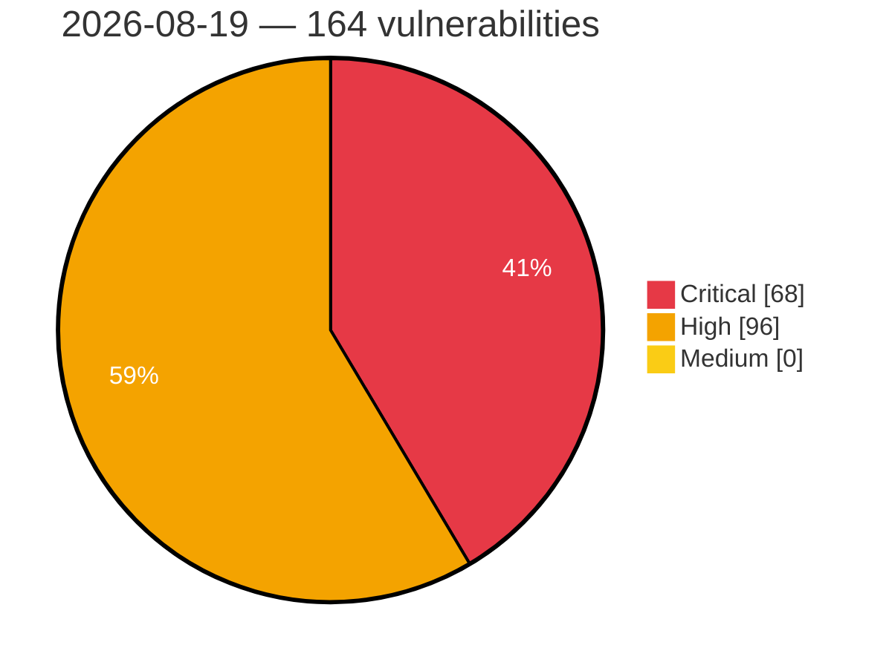

# Critical, High & Medium Severity Vulnerabilities — 2026-08-19

**Source status for this day:**

| Source | Critical | High | Medium | Total |
|--------|---------:|-----:|-------:|------:|
| cvefeed.io (High/Critical) | 68 | 96 | 0 | 164 |

**KEV (actively exploited):** 0  **Watchlist matches:** 90

## Critical (68)

| CVSS | Flags | Source | CVE / Title | Reported |
|------|-------|--------|-------------|----------|
| 10.0 | — | cvefeed.io (High/Critical) | [CVE-2026-76008 - Comfast CF-N1-S URI Parameter Parsing mbox-config get_para_from_uri stack-based overflow](https://cvefeed.io/vuln/detail/CVE-2026-76008) | 44 minutes ago |
| 10.0 | ⭐ | cvefeed.io (High/Critical) | [CVE-2026-75949 - Joomla Extension - cmsjunkie.com -  Arbitrary file upload / deletion (path traversal) in J-BusinessDirectory < 6.2.3](https://cvefeed.io/vuln/detail/CVE-2026-75949) | 43 minutes ago |
| 10.0 | — | cvefeed.io (High/Critical) | [CVE-2026-20358 - Cisco Crosswork Security Hardening Release: August 2026](https://cvefeed.io/vuln/detail/CVE-2026-20358) | 1 hour, 11 minutes ago |
| 10.0 | — | cvefeed.io (High/Critical) | [CVE-2026-20357 - Cisco Crosswork Security Hardening Release: August 2026](https://cvefeed.io/vuln/detail/CVE-2026-20357) | 1 hour, 11 minutes ago |
| 10.0 | — | cvefeed.io (High/Critical) | [CVE-2026-22306 - Critical flaw impacting OZOLS ERP's automatic update channel](https://cvefeed.io/vuln/detail/CVE-2026-22306) | 36 minutes ago |
| 9.9 | — | cvefeed.io (High/Critical) | [CVE-2026-75976 - TRENDnet TEW-823DRU NVRAM wan.cgi strcpy stack-based overflow](https://cvefeed.io/vuln/detail/CVE-2026-75976) | 2 hours, 5 minutes ago |
| 9.9 | — | cvefeed.io (High/Critical) | [CVE-2026-76004 - UTT HiPER 1250GW HTTP aspApBasicConfigUrcp strcpy stack-based overflow](https://cvefeed.io/vuln/detail/CVE-2026-76004) | 44 minutes ago |
| 9.9 | — | cvefeed.io (High/Critical) | [CVE-2026-76003 - UTT HiPER 1200GW formGroupConfig strcpy stack-based overflow](https://cvefeed.io/vuln/detail/CVE-2026-76003) | 44 minutes ago |
| 9.9 | — | cvefeed.io (High/Critical) | [CVE-2026-15068 - Vulnerabilities in IBM AIX and PowerVM VIOS](https://cvefeed.io/vuln/detail/CVE-2026-15068) | 17 minutes ago |
| 9.9 | — | cvefeed.io (High/Critical) | [CVE-2026-16816 - Vulnerabilities in IBM AIX and PowerVM VIOS](https://cvefeed.io/vuln/detail/CVE-2026-16816) | 44 minutes ago |
| 9.9 | — | cvefeed.io (High/Critical) | [CVE-2026-20359 - Cisco Crosswork Security Hardening Release: August 2026](https://cvefeed.io/vuln/detail/CVE-2026-20359) | 1 hour, 11 minutes ago |
| 9.9 | ⭐ | cvefeed.io (High/Critical) | [CVE-2026-70496 - Search-v2-operator: search-v2-operator: operator clusterrole is cluster-admin equivalent via impersonate, rbac write, csr approve, and manifestwork](https://cvefeed.io/vuln/detail/CVE-2026-70496) | 43 minutes ago |
| 9.9 | ⭐ | cvefeed.io (High/Critical) | [CVE-2026-55089 - Etherpad: JWT `admin` claim presence-only check lets non-admin OAuth users invoke every Etherpad HTTP API endpoint](https://cvefeed.io/vuln/detail/CVE-2026-55089) | 35 minutes ago |
| 9.8 | ⭐ | cvefeed.io (High/Critical) | [CVE-2026-53451 - Ground Station: Unauthenticated arbitrary file write (path traversal) in save-waterfall-snapshot leads to remote code execution](https://cvefeed.io/vuln/detail/CVE-2026-53451) | 44 minutes ago |
| 9.8 | ⭐ | cvefeed.io (High/Critical) | [CVE-2026-52889 - Formie: Server-Side Template Injection in Formie Hidden field defaults](https://cvefeed.io/vuln/detail/CVE-2026-52889) | 44 minutes ago |
| 9.8 | — | cvefeed.io (High/Critical) | [CVE-2026-16656 - Vulnerabilities in IBM AIX and PowerVM VIOS](https://cvefeed.io/vuln/detail/CVE-2026-16656) | 44 minutes ago |
| 9.8 | — | cvefeed.io (High/Critical) | [CVE-2026-75143 - FFmpeg Heap Buffer Overflow via RIST Protocol Reader](https://cvefeed.io/vuln/detail/CVE-2026-75143) | 1 hour, 8 minutes ago |
| 9.8 | — | cvefeed.io (High/Critical) | [CVE-2026-72529 - TrueConf Server Arbitrary Script Execution Vulnerability](https://cvefeed.io/vuln/detail/CVE-2026-72529) | 1 hour, 9 minutes ago |
| 9.8 | — | cvefeed.io (High/Critical) | [CVE-2026-16885 - Vulnerabilities in IBM AIX and PowerVM VIOS](https://cvefeed.io/vuln/detail/CVE-2026-16885) | 10 minutes ago |
| 9.8 | — | cvefeed.io (High/Critical) | [CVE-2026-16882 - Vulnerabilities in IBM AIX and PowerVM VIOS](https://cvefeed.io/vuln/detail/CVE-2026-16882) | 17 minutes ago |
| 9.8 | — | cvefeed.io (High/Critical) | [CVE-2026-16872 - Vulnerabilities in IBM AIX and PowerVM VIOS](https://cvefeed.io/vuln/detail/CVE-2026-16872) | 20 minutes ago |
| 9.8 | — | cvefeed.io (High/Critical) | [CVE-2026-16864 - Vulnerabilities in IBM AIX and PowerVM VIOS](https://cvefeed.io/vuln/detail/CVE-2026-16864) | 22 minutes ago |
| 9.8 | — | cvefeed.io (High/Critical) | [CVE-2026-16862 - Vulnerabilities in IBM AIX and PowerVM VIOS](https://cvefeed.io/vuln/detail/CVE-2026-16862) | 22 minutes ago |
| 9.8 | — | cvefeed.io (High/Critical) | [CVE-2026-16845 - Vulnerabilities in IBM AIX and PowerVM VIOS](https://cvefeed.io/vuln/detail/CVE-2026-16845) | 28 minutes ago |
| 9.8 | — | cvefeed.io (High/Critical) | [CVE-2026-16840 - Vulnerabilities in IBM AIX and PowerVM VIOS](https://cvefeed.io/vuln/detail/CVE-2026-16840) | 30 minutes ago |
| 9.8 | — | cvefeed.io (High/Critical) | [CVE-2026-16834 - Vulnerabilities in IBM AIX and PowerVM VIOS](https://cvefeed.io/vuln/detail/CVE-2026-16834) | 31 minutes ago |
| 9.8 | ⭐ | cvefeed.io (High/Critical) | [CVE-2026-63722 - ICEcoder 8.1 Unauthenticated RCE via terminal-xhr.php](https://cvefeed.io/vuln/detail/CVE-2026-63722) | 35 minutes ago |
| 9.8 | — | cvefeed.io (High/Critical) | [CVE-2026-16919 - Vulnerabilities in IBM AIX and PowerVM VIOS](https://cvefeed.io/vuln/detail/CVE-2026-16919) | 35 minutes ago |
| 9.8 | — | cvefeed.io (High/Critical) | [CVE-2026-16917 - Vulnerabilities in IBM AIX and PowerVM VIOS](https://cvefeed.io/vuln/detail/CVE-2026-16917) | 35 minutes ago |
| 9.8 | — | cvefeed.io (High/Critical) | [CVE-2026-16913 - Vulnerabilities in IBM AIX and PowerVM VIOS](https://cvefeed.io/vuln/detail/CVE-2026-16913) | 35 minutes ago |
| 9.8 | — | cvefeed.io (High/Critical) | [CVE-2026-16894 - Vulnerabilities in IBM AIX and PowerVM VIOS](https://cvefeed.io/vuln/detail/CVE-2026-16894) | 35 minutes ago |
| 9.8 | ⭐ | cvefeed.io (High/Critical) | [CVE-2026-76850 - LMDeploy Remote Code Execution via Unsafe Pickle Deserialization in the Disaggregated Serving Peer Connector](https://cvefeed.io/vuln/detail/CVE-2026-76850) | 45 minutes ago |
| 9.6 | — | cvefeed.io (High/Critical) | [CVE-2026-20318 - Cisco Secure Workload Software Security Hardening Release August 2026 - Improper Input Validation Vulnerabilities](https://cvefeed.io/vuln/detail/CVE-2026-20318) | 44 minutes ago |
| 9.6 | ⭐ | cvefeed.io (High/Critical) | [CVE-2026-55085 - Etherpad: Improper Neutralization of Input During Web Page Generation ('Cross-site Scripting') in etherpad-lite](https://cvefeed.io/vuln/detail/CVE-2026-55085) | 35 minutes ago |
| 9.6 | — | cvefeed.io (High/Critical) | [CVE-2026-16903 - Vulnerabilities in IBM AIX and PowerVM VIOS](https://cvefeed.io/vuln/detail/CVE-2026-16903) | 35 minutes ago |
| 9.5 | ⭐ | cvefeed.io (High/Critical) | [CVE-2026-72530 - TrueConf Server Sandbox Escape Remote Code Execution](https://cvefeed.io/vuln/detail/CVE-2026-72530) | 1 hour, 9 minutes ago |
| 9.4 | ⭐ | cvefeed.io (High/Critical) | [CVE-2026-45272 - MyBooks: Remote Code Execution via SOCIAL_AUTH Key Name Injection in Python Config File](https://cvefeed.io/vuln/detail/CVE-2026-45272) | 44 minutes ago |
| 9.4 | — | cvefeed.io (High/Critical) | [CVE-2026-16839 - Vulnerabilities in IBM AIX and PowerVM VIOS](https://cvefeed.io/vuln/detail/CVE-2026-16839) | 30 minutes ago |
| 9.3 | ⭐ | cvefeed.io (High/Critical) | [CVE-2026-71960 - Cudy WR3000 2.0 Hard-coded JWT Secret Authentication Bypass via MQTT](https://cvefeed.io/vuln/detail/CVE-2026-71960) | 23 minutes ago |
| 9.3 | ⭐ | cvefeed.io (High/Critical) | [CVE-2026-75954 - Joomla Extension - cmsjunkie.com -  SQL injection in trips search in J-BusinessDirectory < 6.2.3](https://cvefeed.io/vuln/detail/CVE-2026-75954) | 43 minutes ago |
| 9.3 | — | cvefeed.io (High/Critical) | [CVE-2026-47187 - SSHFS Symlink Escape: Rogue SFTP Server → Local File Read/Write](https://cvefeed.io/vuln/detail/CVE-2026-47187) | 44 minutes ago |
| 9.3 | ⭐ | cvefeed.io (High/Critical) | [CVE-2025-14600 - Admin Account Takeover via Path Traversal in vsDesk](https://cvefeed.io/vuln/detail/CVE-2025-14600) | 50 minutes ago |
| 9.3 | ⭐ | cvefeed.io (High/Critical) | [CVE-2026-66794 - Cluster-proxy-addon: cluster-proxy-addon: unauthenticated ssrf to arbitrary managed-cluster services via public route](https://cvefeed.io/vuln/detail/CVE-2026-66794) | 59 minutes ago |
| 9.3 | ⭐ | cvefeed.io (High/Critical) | [CVE-2026-72717 - Orval: Import-time RCE via schema default -> zod module-level template literal](https://cvefeed.io/vuln/detail/CVE-2026-72717) | 34 minutes ago |
| 9.3 | ⭐ | cvefeed.io (High/Critical) | [CVE-2026-72716 - Orval: Import-time RCE via query-parameter default -> zod module-level template literal](https://cvefeed.io/vuln/detail/CVE-2026-72716) | 34 minutes ago |
| 9.3 | ⭐ | cvefeed.io (High/Critical) | [CVE-2026-71871 - Orval: Import-time RCE via header-parameter default -> zod module-level template literal](https://cvefeed.io/vuln/detail/CVE-2026-71871) | 34 minutes ago |
| 9.3 | ⭐ | cvefeed.io (High/Critical) | [CVE-2026-71869 - Orval: Import-time RCE via array-items default -> zod module-level template literal](https://cvefeed.io/vuln/detail/CVE-2026-71869) | 34 minutes ago |
| 9.3 | ⭐ | cvefeed.io (High/Critical) | [CVE-2026-71868 - Orval: Import-time RCE via enum-typed default -> zod module-level template literal](https://cvefeed.io/vuln/detail/CVE-2026-71868) | 34 minutes ago |
| 9.3 | ⭐ | cvefeed.io (High/Critical) | [CVE-2026-71867 - Orval: RCE via schema property name -> computed-property-key injection in the MSW mock generator](https://cvefeed.io/vuln/detail/CVE-2026-71867) | 34 minutes ago |
| 9.3 | ⭐ | cvefeed.io (High/Critical) | [CVE-2026-71866 - Orval: Import-time RCE via schema property name -> computed-property-key injection in the zod client](https://cvefeed.io/vuln/detail/CVE-2026-71866) | 34 minutes ago |
| 9.3 | ⭐ | cvefeed.io (High/Critical) | [CVE-2026-71865 - Orval: Import-time RCE via query parameter name -> computed-property-key injection in the zod cli](https://cvefeed.io/vuln/detail/CVE-2026-71865) | 34 minutes ago |
| 9.3 | ⭐ | cvefeed.io (High/Critical) | [CVE-2026-71864 - Orval: Import-time RCE via header parameter name -> computed-property-key injection in the zod client](https://cvefeed.io/vuln/detail/CVE-2026-71864) | 34 minutes ago |
| 9.3 | ⭐ | cvefeed.io (High/Critical) | [CVE-2026-62682 - Orval: RCE via servers[].url -> unescaped request-URL template literal (with getBaseUrlFromSpecification)](https://cvefeed.io/vuln/detail/CVE-2026-62682) | 35 minutes ago |
| 9.3 | ⭐ | cvefeed.io (High/Critical) | [CVE-2026-62681 - Orval: RCE via OpenAPI path -> unescaped request-URL template literal (backtick breakout)](https://cvefeed.io/vuln/detail/CVE-2026-62681) | 35 minutes ago |
| 9.3 | — | cvefeed.io (High/Critical) | [CVE-2026-16822 - Vulnerabilities in IBM AIX and PowerVM VIOS](https://cvefeed.io/vuln/detail/CVE-2026-16822) | 35 minutes ago |
| 9.2 | ⭐ | cvefeed.io (High/Critical) | [CVE-2026-76243 - stigmem before 0.9.0a2 Authentication Bypass via Disabled Auth](https://cvefeed.io/vuln/detail/CVE-2026-76243) | 33 minutes ago |
| 9.1 | — | cvefeed.io (High/Critical) | [CVE-2026-11751 - Armeria xDS TLS Peer Verification Bypass Vulnerability](https://cvefeed.io/vuln/detail/CVE-2026-11751) | 26 minutes ago |
| 9.1 | — | cvefeed.io (High/Critical) | [CVE-2026-15065 - Vulnerabilities in IBM AIX and PowerVM VIOS](https://cvefeed.io/vuln/detail/CVE-2026-15065) | 17 minutes ago |
| 9.1 | ⭐ | cvefeed.io (High/Critical) | [CVE-2026-76244 - stigmem-node Insecure Federation Transport Configuration](https://cvefeed.io/vuln/detail/CVE-2026-76244) | 33 minutes ago |
| 9.1 | ⭐ | cvefeed.io (High/Critical) | [CVE-2026-76242 - stigmem Federation Peer Registration Authentication Bypass](https://cvefeed.io/vuln/detail/CVE-2026-76242) | 33 minutes ago |
| 9.1 | — | cvefeed.io (High/Critical) | [CVE-2026-76214 - phpMyFAQ before 4.1.7 WebAuthn Replay Attack via Challenge](https://cvefeed.io/vuln/detail/CVE-2026-76214) | 33 minutes ago |
| 9.1 | ⭐ | cvefeed.io (High/Critical) | [CVE-2026-76213 - phpMyFAQ before 4.1.7 2FA Brute-Force via Session-Scoped Throttle](https://cvefeed.io/vuln/detail/CVE-2026-76213) | 33 minutes ago |
| 9.1 | ⭐ | cvefeed.io (High/Critical) | [CVE-2026-71470 - Acm-search-v2-rhel9: search-v2-operator: search cr imageoverride/arguments/envvar flow unsanitized into pods running impersonating sa](https://cvefeed.io/vuln/detail/CVE-2026-71470) | 1 hour, 9 minutes ago |
| 9.1 | ⭐ | cvefeed.io (High/Critical) | [CVE-2026-49441 - Wazuh : peer-controlled metadata key in process_files_from_worker non-merged branch allows arbitrary file write under WAZUH_PATH on Wazuh manager](https://cvefeed.io/vuln/detail/CVE-2026-49441) | 1 hour, 11 minutes ago |
| 9.1 | ⭐ | cvefeed.io (High/Critical) | [CVE-2026-48162 - Wazuh: cluster peer can read arbitrary master files and forge offline REST API administrator tokens via DAPI tmp_file path injection in Wazuh manager](https://cvefeed.io/vuln/detail/CVE-2026-48162) | 1 hour, 11 minutes ago |
| 9.1 | ⭐ | cvefeed.io (High/Critical) | [CVE-2026-48024 - Wazuh: merged-file header path traversal in cluster sync allows arbitrary file write under WAZUH_PATH in Wazuh manager](https://cvefeed.io/vuln/detail/CVE-2026-48024) | 1 hour, 11 minutes ago |
| 9.1 | ⭐ | cvefeed.io (High/Critical) | [CVE-2026-76404 - Remote Code Execution (RCE) through Deserialization of Untrusted Data in Splunk MCP Server app](https://cvefeed.io/vuln/detail/CVE-2026-76404) | 51 minutes ago |
| 9.0 | ⭐ | cvefeed.io (High/Critical) | [CVE-2026-32475 - WordPress Elementor Pro plugin <= 4.2.1 - Arbitrary File Upload vulnerability](https://cvefeed.io/vuln/detail/CVE-2026-32475) | 1 hour, 5 minutes ago |

## High (96)

| CVSS | Flags | Source | CVE / Title | Reported |
|------|-------|--------|-------------|----------|
| 8.8 | — | cvefeed.io (High/Critical) | [CVE-2026-70408 - acmailer Improper Authorization Vulnerability](https://cvefeed.io/vuln/detail/CVE-2026-70408) | 43 minutes ago |
| 8.8 | ⭐ | cvefeed.io (High/Critical) | [CVE-2026-71961 - Cudy WR3000 2.0 OS Command Injection via Mesh MQTT Command Handler](https://cvefeed.io/vuln/detail/CVE-2026-71961) | 22 minutes ago |
| 8.8 | ⭐ | cvefeed.io (High/Critical) | [CVE-2026-76224 - ArcadeDB before 26.8.1 Remote Code Execution via Groovy Fallback](https://cvefeed.io/vuln/detail/CVE-2026-76224) | 33 minutes ago |
| 8.8 | ⭐ | cvefeed.io (High/Critical) | [CVE-2026-76221 - GitPython before 3.1.58 Config Injection via option-name](https://cvefeed.io/vuln/detail/CVE-2026-76221) | 33 minutes ago |
| 8.8 | — | cvefeed.io (High/Critical) | [CVE-2026-76220 - GitPython before 3.1.58 Command Execution via split_single_char_options](https://cvefeed.io/vuln/detail/CVE-2026-76220) | 33 minutes ago |
| 8.8 | ⭐ | cvefeed.io (High/Critical) | [CVE-2026-71176 - Dell OpenManage Enterprise SQL Injection Vulnerability](https://cvefeed.io/vuln/detail/CVE-2026-71176) | 43 minutes ago |
| 8.8 | — | cvefeed.io (High/Critical) | [CVE-2026-58565 - Dell Command Update Missing Authorization Vulnerability](https://cvefeed.io/vuln/detail/CVE-2026-58565) | 44 minutes ago |
| 8.8 | ⭐ | cvefeed.io (High/Critical) | [CVE-2026-49255 - electerm: Command Injection in File System Operations (rmrf, mv, cp)](https://cvefeed.io/vuln/detail/CVE-2026-49255) | 44 minutes ago |
| 8.8 | ⭐ | cvefeed.io (High/Critical) | [CVE-2026-44829 - Gotenberg: Path traversal in zip entry name via Windows-style separators in upload filename](https://cvefeed.io/vuln/detail/CVE-2026-44829) | 44 minutes ago |
| 8.8 | — | cvefeed.io (High/Critical) | [CVE-2026-16814 - Vulnerabilities in IBM AIX and PowerVM VIOS](https://cvefeed.io/vuln/detail/CVE-2026-16814) | 44 minutes ago |
| 8.8 | — | cvefeed.io (High/Critical) | [CVE-2026-75149 - marimo < 0.23.15 Code Injection via MCP Server Configuration](https://cvefeed.io/vuln/detail/CVE-2026-75149) | 41 minutes ago |
| 8.8 | ⭐ | cvefeed.io (High/Critical) | [CVE-2026-61518 - ISPConfig Authenticated SQL Injection via Remote API primary_id Parameter](https://cvefeed.io/vuln/detail/CVE-2026-61518) | 44 minutes ago |
| 8.8 | ⭐ | cvefeed.io (High/Critical) | [CVE-2025-14603 - Use of user input in raw SQL queries in vsDesk leading to blind SQL injection](https://cvefeed.io/vuln/detail/CVE-2025-14603) | 35 minutes ago |
| 8.8 | — | cvefeed.io (High/Critical) | [CVE-2026-16877 - Vulnerabilities in IBM AIX and PowerVM VIOS](https://cvefeed.io/vuln/detail/CVE-2026-16877) | 17 minutes ago |
| 8.8 | ⭐ | cvefeed.io (High/Critical) | [CVE-2026-16865 - Vulnerabilities in IBM AIX and PowerVM VIOS](https://cvefeed.io/vuln/detail/CVE-2026-16865) | 21 minutes ago |
| 8.8 | ⭐ | cvefeed.io (High/Critical) | [CVE-2026-16850 - Vulnerabilities in IBM AIX and PowerVM VIOS](https://cvefeed.io/vuln/detail/CVE-2026-16850) | 24 minutes ago |
| 8.8 | — | cvefeed.io (High/Critical) | [CVE-2026-16848 - Vulnerabilities in IBM AIX and PowerVM VIOS](https://cvefeed.io/vuln/detail/CVE-2026-16848) | 24 minutes ago |
| 8.8 | — | cvefeed.io (High/Critical) | [CVE-2026-16847 - Vulnerabilities in IBM AIX and PowerVM VIOS](https://cvefeed.io/vuln/detail/CVE-2026-16847) | 27 minutes ago |
| 8.8 | — | cvefeed.io (High/Critical) | [CVE-2026-16844 - Vulnerabilities in IBM AIX and PowerVM VIOS](https://cvefeed.io/vuln/detail/CVE-2026-16844) | 29 minutes ago |
| 8.8 | — | cvefeed.io (High/Critical) | [CVE-2026-16842 - Vulnerabilities in IBM AIX and PowerVM VIOS](https://cvefeed.io/vuln/detail/CVE-2026-16842) | 29 minutes ago |
| 8.8 | — | cvefeed.io (High/Critical) | [CVE-2026-16841 - Vulnerabilities in IBM AIX and PowerVM VIOS](https://cvefeed.io/vuln/detail/CVE-2026-16841) | 29 minutes ago |
| 8.8 | ⭐ | cvefeed.io (High/Critical) | [CVE-2026-68561 - Wekan: a low-privilege board member escalates to board admin and takes over a private board via the `sort` collection-allow rule](https://cvefeed.io/vuln/detail/CVE-2026-68561) | 35 minutes ago |
| 8.8 | — | cvefeed.io (High/Critical) | [CVE-2026-16911 - Vulnerabilities in IBM AIX and PowerVM VIOS](https://cvefeed.io/vuln/detail/CVE-2026-16911) | 35 minutes ago |
| 8.8 | — | cvefeed.io (High/Critical) | [CVE-2026-16909 - Vulnerabilities in IBM AIX and PowerVM VIOS](https://cvefeed.io/vuln/detail/CVE-2026-16909) | 35 minutes ago |
| 8.8 | — | cvefeed.io (High/Critical) | [CVE-2026-16901 - Vulnerabilities in IBM AIX and PowerVM VIOS](https://cvefeed.io/vuln/detail/CVE-2026-16901) | 35 minutes ago |
| 8.8 | ⭐ | cvefeed.io (High/Critical) | [CVE-2026-76832 - Agno PythonTools Path Traversal via joinpath file_name argument](https://cvefeed.io/vuln/detail/CVE-2026-76832) | 28 minutes ago |
| 8.8 | ⭐ | cvefeed.io (High/Critical) | [CVE-2026-76395 - Remote Code Execution (RCE) through Deserialization of Untrusted Data in the Model Loading REST API in Splunk AI Toolkit](https://cvefeed.io/vuln/detail/CVE-2026-76395) | 52 minutes ago |
| 8.8 | ⭐ | cvefeed.io (High/Critical) | [CVE-2026-76389 - Server-Side Request Forgery (SSRF) through the REST API in Cisco Talos Intelligence for Enterprise Security Cloud](https://cvefeed.io/vuln/detail/CVE-2026-76389) | 52 minutes ago |
| 8.8 | ⭐ | cvefeed.io (High/Critical) | [CVE-2026-76352 - Improper Authorization through the REST API in Splunk Enterprise](https://cvefeed.io/vuln/detail/CVE-2026-76352) | 52 minutes ago |
| 8.8 | ⭐ | cvefeed.io (High/Critical) | [CVE-2026-76351 - Server-Side Request Forgery (SSRF) through the Report Notification REST API in Splunk Secure Gateway](https://cvefeed.io/vuln/detail/CVE-2026-76351) | 52 minutes ago |
| 8.8 | — | cvefeed.io (High/Critical) | [CVE-2026-76350 - Improper Privilege Management through PDF Attachments for Email Alert Actions in Splunk Enterprise](https://cvefeed.io/vuln/detail/CVE-2026-76350) | 52 minutes ago |
| 8.8 | ⭐ | cvefeed.io (High/Critical) | [CVE-2026-76335 - Remote Code Execution (RCE) through Splunk Web Manager Configuration in Splunk Enterprise](https://cvefeed.io/vuln/detail/CVE-2026-76335) | 52 minutes ago |
| 8.8 | ⭐ | cvefeed.io (High/Critical) | [CVE-2026-76319 - Remote Code Execution (RCE) through Federated Search in Splunk Enterprise](https://cvefeed.io/vuln/detail/CVE-2026-76319) | 52 minutes ago |
| 8.8 | ⭐ | cvefeed.io (High/Critical) | [CVE-2026-76317 - Path Traversal through the Lookup Configuration REST API in Splunk Enterprise](https://cvefeed.io/vuln/detail/CVE-2026-76317) | 52 minutes ago |
| 8.8 | — | cvefeed.io (High/Critical) | [CVE-2026-76316 - Stored SPL Injection through Deployment Server Broker Registration in Splunk Enterprise](https://cvefeed.io/vuln/detail/CVE-2026-76316) | 52 minutes ago |
| 8.8 | ⭐ | cvefeed.io (High/Critical) | [CVE-2026-76315 - Code Injection through Splunk Web Manager Configuration in Splunk Enterprise](https://cvefeed.io/vuln/detail/CVE-2026-76315) | 52 minutes ago |
| 8.8 | ⭐ | cvefeed.io (High/Critical) | [CVE-2026-76314 - Remote Code Execution (RCE) through Splunk Web Manager Configuration in Splunk Enterprise](https://cvefeed.io/vuln/detail/CVE-2026-76314) | 26 minutes ago |
| 8.8 | ⭐ | cvefeed.io (High/Critical) | [CVE-2026-76313 - Remote Code Execution (RCE) through the REST API in Splunk Enterprise](https://cvefeed.io/vuln/detail/CVE-2026-76313) | 27 minutes ago |
| 8.7 | — | cvefeed.io (High/Critical) | [CVE-2026-76234 - libcrux before 0.0.6 Cryptographic Implementation Bug Fixes](https://cvefeed.io/vuln/detail/CVE-2026-76234) | 33 minutes ago |
| 8.7 | — | cvefeed.io (High/Critical) | [CVE-2026-75956 - Joomla Extension - cmsjunkie.com - DOS vector in pagination parameter handling in J-BusinessDirectory < 6.2.3](https://cvefeed.io/vuln/detail/CVE-2026-75956) | 43 minutes ago |
| 8.7 | ⭐ | cvefeed.io (High/Critical) | [CVE-2026-52792 - Algernon: Server-side script source disclosure on Windows via NTFS filename](https://cvefeed.io/vuln/detail/CVE-2026-52792) | 44 minutes ago |
| 8.7 | ⭐ | cvefeed.io (High/Critical) | [CVE-2026-49283 - SimpleSAMLphp HTTP-Artifact TLS validator confusion allows cross-IdP authentication bypass](https://cvefeed.io/vuln/detail/CVE-2026-49283) | 44 minutes ago |
| 8.7 | ⭐ | cvefeed.io (High/Critical) | [CVE-2026-45273 - MyBooks: Privilege Escalation via Missing Authorization on Admin Settings Endpoint](https://cvefeed.io/vuln/detail/CVE-2026-45273) | 44 minutes ago |
| 8.7 | ⭐ | cvefeed.io (High/Critical) | [CVE-2026-67581 - On-chain transfer proof is not single-use in mpp EVM payment method, enabling cross-challenge replay](https://cvefeed.io/vuln/detail/CVE-2026-67581) | 1 hour, 9 minutes ago |
| 8.7 | — | cvefeed.io (High/Critical) | [CVE-2026-55194 - FreeRDPHeap-buffer-overflow write in TS Gateway RPC RESPONSE reassembly due to alloc_hint capacity mismatch](https://cvefeed.io/vuln/detail/CVE-2026-55194) | 35 minutes ago |
| 8.7 | — | cvefeed.io (High/Critical) | [CVE-2026-55193 - FreeRDP: Heap-buffer-overflow write in TS Gateway RPC fragment receive due to uncapped bind_ack max_xmit_frag](https://cvefeed.io/vuln/detail/CVE-2026-55193) | 35 minutes ago |
| 8.7 | — | cvefeed.io (High/Critical) | [CVE-2026-55191 - FreeRDP: Heap-buffer-overflow write in AVC444 YUV buffer allocation](https://cvefeed.io/vuln/detail/CVE-2026-55191) | 35 minutes ago |
| 8.7 | — | cvefeed.io (High/Critical) | [CVE-2026-19198 - Akaunting 3.1.21 - Improper authorization in BulkActions handle dispatch](https://cvefeed.io/vuln/detail/CVE-2026-19198) | 44 minutes ago |
| 8.7 | ⭐ | cvefeed.io (High/Critical) | [CVE-2026-68899 - Wekan: File Upload MIME Type Validation Bypass — Stored XSS via Missing System Binary Fallback](https://cvefeed.io/vuln/detail/CVE-2026-68899) | 35 minutes ago |
| 8.7 | ⭐ | cvefeed.io (High/Critical) | [CVE-2026-63188 - logto-tunnel serves files outside --experience-path via path traversal](https://cvefeed.io/vuln/detail/CVE-2026-63188) | 35 minutes ago |
| 8.6 | — | cvefeed.io (High/Critical) | [CVE-2026-76237 - stigmem before 0.9.0a12 Cross-Tenant BOLA via quarantine](https://cvefeed.io/vuln/detail/CVE-2026-76237) | 33 minutes ago |
| 8.5 | — | cvefeed.io (High/Critical) | [CVE-2026-75144 - FFmpeg Heap Buffer Overflow in VC-2/Dirac RTP Packetizer](https://cvefeed.io/vuln/detail/CVE-2026-75144) | 1 hour, 8 minutes ago |
| 8.5 | — | cvefeed.io (High/Critical) | [CVE-2026-75142 - FFmpeg Stack Buffer Overflow in MPEG-PS Muxer via mpegenc.c](https://cvefeed.io/vuln/detail/CVE-2026-75142) | 1 hour, 8 minutes ago |
| 8.5 | — | cvefeed.io (High/Critical) | [CVE-2026-75141 - FFmpeg Heap Buffer Overflow in hvcC Box Writer via HEVC Muxing](https://cvefeed.io/vuln/detail/CVE-2026-75141) | 1 hour, 8 minutes ago |
| 8.5 | ⭐ | cvefeed.io (High/Critical) | [CVE-2026-68558 - Wekan: SSRF filter bypass via DNS-resolving hostname in outgoing webhooks (incomplete fix of CVE-2026-53446)](https://cvefeed.io/vuln/detail/CVE-2026-68558) | 35 minutes ago |
| 8.4 | ⭐ | cvefeed.io (High/Critical) | [CVE-2026-58083 - Use-after-free in kqueue copy-on-fork](https://cvefeed.io/vuln/detail/CVE-2026-58083) | 4 hours, 33 minutes ago |
| 8.4 | ⭐ | cvefeed.io (High/Critical) | [CVE-2026-76233 - Renovate 39.53.0 before 40.33.0 Command Injection via gleam manager](https://cvefeed.io/vuln/detail/CVE-2026-76233) | 33 minutes ago |
| 8.4 | ⭐ | cvefeed.io (High/Critical) | [CVE-2026-76232 - Renovate 31.51.0 before 40.33.0 Command Injection via helmv3](https://cvefeed.io/vuln/detail/CVE-2026-76232) | 33 minutes ago |
| 8.4 | ⭐ | cvefeed.io (High/Critical) | [CVE-2026-76231 - Renovate 32.135.0 before 40.33.0 Command Injection via hermit](https://cvefeed.io/vuln/detail/CVE-2026-76231) | 33 minutes ago |
| 8.4 | ⭐ | cvefeed.io (High/Critical) | [CVE-2026-76230 - Renovate 35.63.0 before 40.33.0 Command Injection via npm](https://cvefeed.io/vuln/detail/CVE-2026-76230) | 33 minutes ago |
| 8.4 | ⭐ | cvefeed.io (High/Critical) | [CVE-2026-76229 - Renovate 39.218.0 before 40.33.0 Arbitrary Command Injection via kustomize](https://cvefeed.io/vuln/detail/CVE-2026-76229) | 33 minutes ago |
| 8.4 | ⭐ | cvefeed.io (High/Critical) | [CVE-2026-76228 - Renovate before 42.68.5 Remote Code Execution via Gradle Wrapper](https://cvefeed.io/vuln/detail/CVE-2026-76228) | 33 minutes ago |
| 8.4 | ⭐ | cvefeed.io (High/Critical) | [CVE-2026-76222 - GitPython before 3.1.58 Path Traversal via .gitmodules Submodule Name](https://cvefeed.io/vuln/detail/CVE-2026-76222) | 33 minutes ago |
| 8.4 | ⭐ | cvefeed.io (High/Critical) | [CVE-2026-44901 - Wazuh Cluster DAPI Protocol Deserialization of Untrusted Data Remote Code Execution Vulnerability](https://cvefeed.io/vuln/detail/CVE-2026-44901) | 1 hour, 11 minutes ago |
| 8.4 | — | cvefeed.io (High/Critical) | [CVE-2026-17091 - Power System Integer Overflow](https://cvefeed.io/vuln/detail/CVE-2026-17091) | 16 minutes ago |
| 8.4 | ⭐ | cvefeed.io (High/Critical) | [CVE-2026-76878 - OpenStack Aodh and Watcher Authorization Bypass](https://cvefeed.io/vuln/detail/CVE-2026-76878) | 22 minutes ago |
| 8.3 | ⭐ | cvefeed.io (High/Critical) | [CVE-2026-76225 - ArcadeDB before 26.8.1 Server-Side Request Forgery via LOAD CSV](https://cvefeed.io/vuln/detail/CVE-2026-76225) | 33 minutes ago |
| 8.3 | ⭐ | cvefeed.io (High/Critical) | [CVE-2026-73541 - Tempo fee sponsorship in mpp bounds each transaction but not aggregate exposure, allowing concurrent sponsor-wallet drain](https://cvefeed.io/vuln/detail/CVE-2026-73541) | 1 hour, 10 minutes ago |
| 8.3 | ⭐ | cvefeed.io (High/Critical) | [CVE-2026-76394 - Missing Authorization in Container and Connection Management through the REST API in Splunk AI Toolkit](https://cvefeed.io/vuln/detail/CVE-2026-76394) | 52 minutes ago |
| 8.3 | — | cvefeed.io (High/Critical) | [CVE-2026-76391 - Improper Privilege Management through Agent Run History in Splunk AI Toolkit](https://cvefeed.io/vuln/detail/CVE-2026-76391) | 52 minutes ago |
| 8.2 | ⭐ | cvefeed.io (High/Critical) | [CVE-2026-15061 - Vulnerabilities in IBM AIX and PowerVM VIOS](https://cvefeed.io/vuln/detail/CVE-2026-15061) | 18 minutes ago |
| 8.2 | — | cvefeed.io (High/Critical) | [CVE-2026-16686 - Vulnerabilities in IBM AIX and PowerVM VIOS](https://cvefeed.io/vuln/detail/CVE-2026-16686) | 44 minutes ago |
| 8.2 | — | cvefeed.io (High/Critical) | [CVE-2026-19234 - This Power System update is being released to address](https://cvefeed.io/vuln/detail/CVE-2026-19234) | 27 minutes ago |
| 8.2 | ⭐ | cvefeed.io (High/Critical) | [CVE-2026-73136 - Static memo configuration in mpp Tempo disables per-challenge attribution binding, enabling third-party replay](https://cvefeed.io/vuln/detail/CVE-2026-73136) | 1 hour, 10 minutes ago |
| 8.2 | ⭐ | cvefeed.io (High/Critical) | [CVE-2026-41424 - Wazuh: Privilege Escalation via Admin-Protection Bypass in update-user API Endpoint](https://cvefeed.io/vuln/detail/CVE-2026-41424) | 1 hour, 11 minutes ago |
| 8.2 | — | cvefeed.io (High/Critical) | [CVE-2026-17093 - Power System Buffer Overflow](https://cvefeed.io/vuln/detail/CVE-2026-17093) | 21 minutes ago |
| 8.2 | — | cvefeed.io (High/Critical) | [CVE-2026-17100 - Power System Out-of-bounds Write](https://cvefeed.io/vuln/detail/CVE-2026-17100) | 25 minutes ago |
| 8.2 | — | cvefeed.io (High/Critical) | [CVE-2026-16857 - Vulnerabilities in IBM AIX and PowerVM VIOS](https://cvefeed.io/vuln/detail/CVE-2026-16857) | 22 minutes ago |
| 8.2 | — | cvefeed.io (High/Critical) | [CVE-2026-16661 - Power System Integer Overflow](https://cvefeed.io/vuln/detail/CVE-2026-16661) | 29 minutes ago |
| 8.2 | — | cvefeed.io (High/Critical) | [CVE-2026-16933 - Power System Integer Overflow](https://cvefeed.io/vuln/detail/CVE-2026-16933) | 35 minutes ago |
| 8.2 | — | cvefeed.io (High/Critical) | [CVE-2026-16707 - Power System Out-of-bounds Read](https://cvefeed.io/vuln/detail/CVE-2026-16707) | 9 minutes ago |
| 8.2 | ⭐ | cvefeed.io (High/Critical) | [CVE-2026-76402 - Server-Side Request Forgery (SSRF) through the REST API in Splunk Connect for Kafka](https://cvefeed.io/vuln/detail/CVE-2026-76402) | 51 minutes ago |
| 8.1 | ⭐ | cvefeed.io (High/Critical) | [CVE-2026-19942 - Atarim <= 5.1.1 - Authenticated (Author+) Arbitrary File Deletion via '_wp_attached_file' Meta](https://cvefeed.io/vuln/detail/CVE-2026-19942) | 44 minutes ago |
| 8.1 | — | cvefeed.io (High/Critical) | [CVE-2026-15078 - Vulnerabilities in IBM AIX and PowerVM VIOS](https://cvefeed.io/vuln/detail/CVE-2026-15078) | 16 minutes ago |
| 8.1 | — | cvefeed.io (High/Critical) | [CVE-2026-76219 - GitPython before 3.1.58 Arbitrary File Overwrite via read-tree](https://cvefeed.io/vuln/detail/CVE-2026-76219) | 33 minutes ago |
| 8.1 | — | cvefeed.io (High/Critical) | [CVE-2026-75146 - FFmpeg Out-of-Bounds Read in DASH Demuxer via dashdec.c](https://cvefeed.io/vuln/detail/CVE-2026-75146) | 1 hour, 8 minutes ago |
| 8.1 | — | cvefeed.io (High/Critical) | [CVE-2026-17414 - Power System Improper Input Validation](https://cvefeed.io/vuln/detail/CVE-2026-17414) | 27 minutes ago |
| 8.1 | ⭐ | cvefeed.io (High/Critical) | [CVE-2026-18544 - Portieris is vulnerable to Image Policy Bypass via Unvalidated ownerReference](https://cvefeed.io/vuln/detail/CVE-2026-18544) | 23 minutes ago |
| 8.1 | — | cvefeed.io (High/Critical) | [CVE-2026-76399 - Incorrect Permission Assignment for Scheduled Searches in Splunk AI Toolkit](https://cvefeed.io/vuln/detail/CVE-2026-76399) | 52 minutes ago |
| 8.1 | ⭐ | cvefeed.io (High/Critical) | [CVE-2026-76397 - Improper Access Control in Experiment History through the REST API in Splunk AI Toolkit](https://cvefeed.io/vuln/detail/CVE-2026-76397) | 52 minutes ago |
| 8.1 | ⭐ | cvefeed.io (High/Critical) | [CVE-2026-76388 - Privilege Escalation through Search Macro Permissions in Splunk Enterprise Security](https://cvefeed.io/vuln/detail/CVE-2026-76388) | 52 minutes ago |
| 8.1 | ⭐ | cvefeed.io (High/Critical) | [CVE-2026-76387 - SPL Injection through the REST API in Splunk Enterprise Security](https://cvefeed.io/vuln/detail/CVE-2026-76387) | 52 minutes ago |
| 8.1 | ⭐ | cvefeed.io (High/Critical) | [CVE-2026-76356 - Authentication Bypass through IP Address Spoofing in the Automation Broker in Splunk SOAR](https://cvefeed.io/vuln/detail/CVE-2026-76356) | 52 minutes ago |
| 8.1 | ⭐ | cvefeed.io (High/Critical) | [CVE-2026-76354 - Path Traversal through Search Head Clustering in Splunk Enterprise](https://cvefeed.io/vuln/detail/CVE-2026-76354) | 52 minutes ago |
| 8.1 | ⭐ | cvefeed.io (High/Critical) | [CVE-2026-76338 - Improper Authentication through REST API Distributed Search Token Requests in Splunk Enterprise](https://cvefeed.io/vuln/detail/CVE-2026-76338) | 52 minutes ago |
| 8.1 | ⭐ | cvefeed.io (High/Critical) | [CVE-2026-76331 - SPL Injection through the REST API in Splunk Enterprise](https://cvefeed.io/vuln/detail/CVE-2026-76331) | 52 minutes ago |
