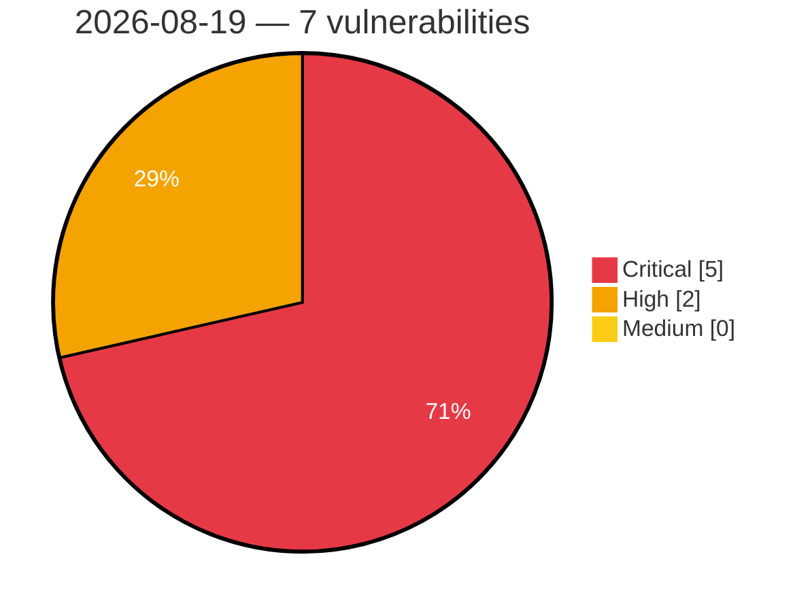

# Critical, High & Medium Severity Vulnerabilities — 2026-08-19

**Source status for this day:**

| Source | Critical | High | Medium | Total |
|--------|---------:|-----:|-------:|------:|
| cvefeed.io (High/Critical) | 5 | 2 | 0 | 7 |

**KEV (actively exploited):** 0  **Watchlist matches:** 1

## Critical (5)

| CVSS | Flags | Source | CVE / Title | Reported |
|------|-------|--------|-------------|----------|
| 10.0 | — | cvefeed.io (High/Critical) | [CVE-2026-76008 - Comfast CF-N1-S URI Parameter Parsing mbox-config get_para_from_uri stack-based overflow](https://cvefeed.io/vuln/detail/CVE-2026-76008) | 44 minutes ago |
| 9.9 | — | cvefeed.io (High/Critical) | [CVE-2026-75976 - TRENDnet TEW-823DRU NVRAM wan.cgi strcpy stack-based overflow](https://cvefeed.io/vuln/detail/CVE-2026-75976) | 2 hours, 5 minutes ago |
| 9.9 | — | cvefeed.io (High/Critical) | [CVE-2026-76004 - UTT HiPER 1250GW HTTP aspApBasicConfigUrcp strcpy stack-based overflow](https://cvefeed.io/vuln/detail/CVE-2026-76004) | 44 minutes ago |
| 9.9 | — | cvefeed.io (High/Critical) | [CVE-2026-76003 - UTT HiPER 1200GW formGroupConfig strcpy stack-based overflow](https://cvefeed.io/vuln/detail/CVE-2026-76003) | 44 minutes ago |
| 9.1 | — | cvefeed.io (High/Critical) | [CVE-2026-11751 - Armeria xDS TLS Peer Verification Bypass Vulnerability](https://cvefeed.io/vuln/detail/CVE-2026-11751) | 26 minutes ago |

## High (2)

| CVSS | Flags | Source | CVE / Title | Reported |
|------|-------|--------|-------------|----------|
| 8.8 | — | cvefeed.io (High/Critical) | [CVE-2026-70408 - acmailer Improper Authorization Vulnerability](https://cvefeed.io/vuln/detail/CVE-2026-70408) | 43 minutes ago |
| 8.1 | ⭐ | cvefeed.io (High/Critical) | [CVE-2026-19942 - Atarim <= 5.1.1 - Authenticated (Author+) Arbitrary File Deletion via '_wp_attached_file' Meta](https://cvefeed.io/vuln/detail/CVE-2026-19942) | 44 minutes ago |
