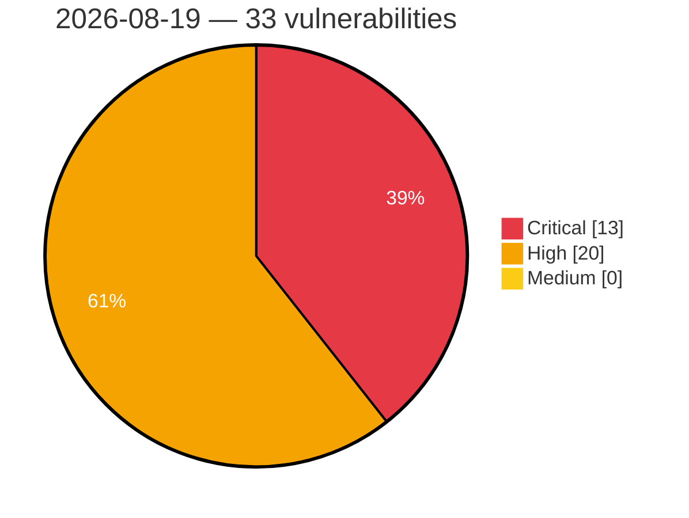

# Critical, High & Medium Severity Vulnerabilities — 2026-08-19

**Source status for this day:**

| Source | Critical | High | Medium | Total |
|--------|---------:|-----:|-------:|------:|
| cvefeed.io (High/Critical) | 13 | 20 | 0 | 33 |

**KEV (actively exploited):** 0  **Watchlist matches:** 19

## Critical (13)

| CVSS | Flags | Source | CVE / Title | Reported |
|------|-------|--------|-------------|----------|
| 10.0 | — | cvefeed.io (High/Critical) | [CVE-2026-76008 - Comfast CF-N1-S URI Parameter Parsing mbox-config get_para_from_uri stack-based overflow](https://cvefeed.io/vuln/detail/CVE-2026-76008) | 44 minutes ago |
| 9.9 | — | cvefeed.io (High/Critical) | [CVE-2026-75976 - TRENDnet TEW-823DRU NVRAM wan.cgi strcpy stack-based overflow](https://cvefeed.io/vuln/detail/CVE-2026-75976) | 2 hours, 5 minutes ago |
| 9.9 | — | cvefeed.io (High/Critical) | [CVE-2026-76004 - UTT HiPER 1250GW HTTP aspApBasicConfigUrcp strcpy stack-based overflow](https://cvefeed.io/vuln/detail/CVE-2026-76004) | 44 minutes ago |
| 9.9 | — | cvefeed.io (High/Critical) | [CVE-2026-76003 - UTT HiPER 1200GW formGroupConfig strcpy stack-based overflow](https://cvefeed.io/vuln/detail/CVE-2026-76003) | 44 minutes ago |
| 9.9 | — | cvefeed.io (High/Critical) | [CVE-2026-15068 - Vulnerabilities in IBM AIX and PowerVM VIOS](https://cvefeed.io/vuln/detail/CVE-2026-15068) | 17 minutes ago |
| 9.3 | ⭐ | cvefeed.io (High/Critical) | [CVE-2026-71960 - Cudy WR3000 2.0 Hard-coded JWT Secret Authentication Bypass via MQTT](https://cvefeed.io/vuln/detail/CVE-2026-71960) | 23 minutes ago |
| 9.2 | ⭐ | cvefeed.io (High/Critical) | [CVE-2026-76243 - stigmem before 0.9.0a2 Authentication Bypass via Disabled Auth](https://cvefeed.io/vuln/detail/CVE-2026-76243) | 33 minutes ago |
| 9.1 | — | cvefeed.io (High/Critical) | [CVE-2026-11751 - Armeria xDS TLS Peer Verification Bypass Vulnerability](https://cvefeed.io/vuln/detail/CVE-2026-11751) | 26 minutes ago |
| 9.1 | — | cvefeed.io (High/Critical) | [CVE-2026-15065 - Vulnerabilities in IBM AIX and PowerVM VIOS](https://cvefeed.io/vuln/detail/CVE-2026-15065) | 17 minutes ago |
| 9.1 | ⭐ | cvefeed.io (High/Critical) | [CVE-2026-76244 - stigmem-node Insecure Federation Transport Configuration](https://cvefeed.io/vuln/detail/CVE-2026-76244) | 33 minutes ago |
| 9.1 | ⭐ | cvefeed.io (High/Critical) | [CVE-2026-76242 - stigmem Federation Peer Registration Authentication Bypass](https://cvefeed.io/vuln/detail/CVE-2026-76242) | 33 minutes ago |
| 9.1 | — | cvefeed.io (High/Critical) | [CVE-2026-76214 - phpMyFAQ before 4.1.7 WebAuthn Replay Attack via Challenge](https://cvefeed.io/vuln/detail/CVE-2026-76214) | 33 minutes ago |
| 9.1 | ⭐ | cvefeed.io (High/Critical) | [CVE-2026-76213 - phpMyFAQ before 4.1.7 2FA Brute-Force via Session-Scoped Throttle](https://cvefeed.io/vuln/detail/CVE-2026-76213) | 33 minutes ago |

## High (20)

| CVSS | Flags | Source | CVE / Title | Reported |
|------|-------|--------|-------------|----------|
| 8.8 | — | cvefeed.io (High/Critical) | [CVE-2026-70408 - acmailer Improper Authorization Vulnerability](https://cvefeed.io/vuln/detail/CVE-2026-70408) | 43 minutes ago |
| 8.8 | ⭐ | cvefeed.io (High/Critical) | [CVE-2026-71961 - Cudy WR3000 2.0 OS Command Injection via Mesh MQTT Command Handler](https://cvefeed.io/vuln/detail/CVE-2026-71961) | 22 minutes ago |
| 8.8 | ⭐ | cvefeed.io (High/Critical) | [CVE-2026-76224 - ArcadeDB before 26.8.1 Remote Code Execution via Groovy Fallback](https://cvefeed.io/vuln/detail/CVE-2026-76224) | 33 minutes ago |
| 8.8 | ⭐ | cvefeed.io (High/Critical) | [CVE-2026-76221 - GitPython before 3.1.58 Config Injection via option-name](https://cvefeed.io/vuln/detail/CVE-2026-76221) | 33 minutes ago |
| 8.8 | — | cvefeed.io (High/Critical) | [CVE-2026-76220 - GitPython before 3.1.58 Command Execution via split_single_char_options](https://cvefeed.io/vuln/detail/CVE-2026-76220) | 33 minutes ago |
| 8.7 | — | cvefeed.io (High/Critical) | [CVE-2026-76234 - libcrux before 0.0.6 Cryptographic Implementation Bug Fixes](https://cvefeed.io/vuln/detail/CVE-2026-76234) | 33 minutes ago |
| 8.6 | — | cvefeed.io (High/Critical) | [CVE-2026-76237 - stigmem before 0.9.0a12 Cross-Tenant BOLA via quarantine](https://cvefeed.io/vuln/detail/CVE-2026-76237) | 33 minutes ago |
| 8.4 | ⭐ | cvefeed.io (High/Critical) | [CVE-2026-58083 - Use-after-free in kqueue copy-on-fork](https://cvefeed.io/vuln/detail/CVE-2026-58083) | 4 hours, 33 minutes ago |
| 8.4 | ⭐ | cvefeed.io (High/Critical) | [CVE-2026-76233 - Renovate 39.53.0 before 40.33.0 Command Injection via gleam manager](https://cvefeed.io/vuln/detail/CVE-2026-76233) | 33 minutes ago |
| 8.4 | ⭐ | cvefeed.io (High/Critical) | [CVE-2026-76232 - Renovate 31.51.0 before 40.33.0 Command Injection via helmv3](https://cvefeed.io/vuln/detail/CVE-2026-76232) | 33 minutes ago |
| 8.4 | ⭐ | cvefeed.io (High/Critical) | [CVE-2026-76231 - Renovate 32.135.0 before 40.33.0 Command Injection via hermit](https://cvefeed.io/vuln/detail/CVE-2026-76231) | 33 minutes ago |
| 8.4 | ⭐ | cvefeed.io (High/Critical) | [CVE-2026-76230 - Renovate 35.63.0 before 40.33.0 Command Injection via npm](https://cvefeed.io/vuln/detail/CVE-2026-76230) | 33 minutes ago |
| 8.4 | ⭐ | cvefeed.io (High/Critical) | [CVE-2026-76229 - Renovate 39.218.0 before 40.33.0 Arbitrary Command Injection via kustomize](https://cvefeed.io/vuln/detail/CVE-2026-76229) | 33 minutes ago |
| 8.4 | ⭐ | cvefeed.io (High/Critical) | [CVE-2026-76228 - Renovate before 42.68.5 Remote Code Execution via Gradle Wrapper](https://cvefeed.io/vuln/detail/CVE-2026-76228) | 33 minutes ago |
| 8.4 | ⭐ | cvefeed.io (High/Critical) | [CVE-2026-76222 - GitPython before 3.1.58 Path Traversal via .gitmodules Submodule Name](https://cvefeed.io/vuln/detail/CVE-2026-76222) | 33 minutes ago |
| 8.3 | ⭐ | cvefeed.io (High/Critical) | [CVE-2026-76225 - ArcadeDB before 26.8.1 Server-Side Request Forgery via LOAD CSV](https://cvefeed.io/vuln/detail/CVE-2026-76225) | 33 minutes ago |
| 8.2 | ⭐ | cvefeed.io (High/Critical) | [CVE-2026-15061 - Vulnerabilities in IBM AIX and PowerVM VIOS](https://cvefeed.io/vuln/detail/CVE-2026-15061) | 18 minutes ago |
| 8.1 | ⭐ | cvefeed.io (High/Critical) | [CVE-2026-19942 - Atarim <= 5.1.1 - Authenticated (Author+) Arbitrary File Deletion via '_wp_attached_file' Meta](https://cvefeed.io/vuln/detail/CVE-2026-19942) | 44 minutes ago |
| 8.1 | — | cvefeed.io (High/Critical) | [CVE-2026-15078 - Vulnerabilities in IBM AIX and PowerVM VIOS](https://cvefeed.io/vuln/detail/CVE-2026-15078) | 16 minutes ago |
| 8.1 | — | cvefeed.io (High/Critical) | [CVE-2026-76219 - GitPython before 3.1.58 Arbitrary File Overwrite via read-tree](https://cvefeed.io/vuln/detail/CVE-2026-76219) | 33 minutes ago |
