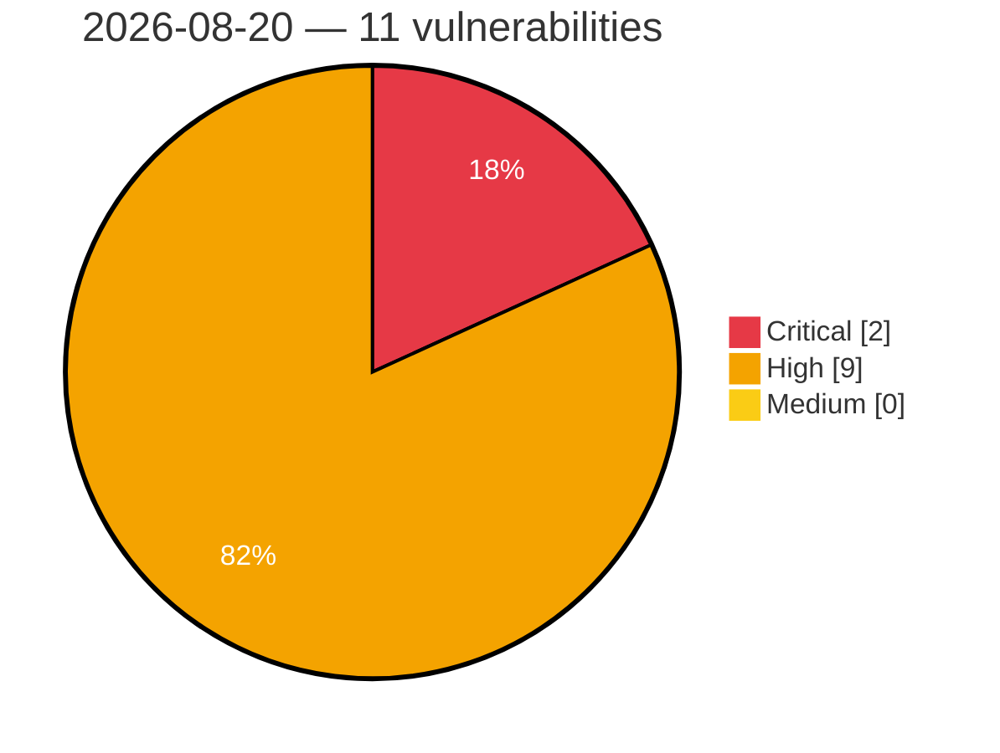

# Critical, High & Medium Severity Vulnerabilities — 2026-08-20

**Source status for this day:**

| Source | Critical | High | Medium | Total |
|--------|---------:|-----:|-------:|------:|
| cvefeed.io (High/Critical) | 2 | 9 | 0 | 11 |

**KEV (actively exploited):** 0  **Watchlist matches:** 7

## Critical (2)

| CVSS | Flags | Source | CVE / Title | Reported |
|------|-------|--------|-------------|----------|
| 9.8 | — | cvefeed.io (High/Critical) | [CVE-2026-14950 - Frauscher Sensortechnik: FDS102 for FAdC/FAdCi R2 is vulnerable to Insufficient Session Expiration due to flawed session expiration logic](https://cvefeed.io/vuln/detail/CVE-2026-14950) | 44 minutes ago |
| 9.8 | ⭐ | cvefeed.io (High/Critical) | [CVE-2026-75860 - JSON Options <= 0.0.4 - Unauthenticated Arbitrary Options Update](https://cvefeed.io/vuln/detail/CVE-2026-75860) | 4 hours, 28 minutes ago |

## High (9)

| CVSS | Flags | Source | CVE / Title | Reported |
|------|-------|--------|-------------|----------|
| 8.8 | — | cvefeed.io (High/Critical) | [CVE-2026-14948 - Frauscher Sensortechnik: FDS102 for FAdC/FAdCi R2 is vulnerable to Insertion of Sensitive Information into Log File via error log archives](https://cvefeed.io/vuln/detail/CVE-2026-14948) | 44 minutes ago |
| 8.7 | — | cvefeed.io (High/Critical) | [CVE-2026-14952 - Frauscher Sensortechnik: FDS102 for FAdC/FAdCi R2 is offering files with sensitive information for download without requiring authentication](https://cvefeed.io/vuln/detail/CVE-2026-14952) | 44 minutes ago |
| 8.6 | ⭐ | cvefeed.io (High/Critical) | [CVE-2026-75948 - Joomla Extension - icagenda.com -  Authenticated Stored XSS in iCagenda 4.0.8 to 4.0.12](https://cvefeed.io/vuln/detail/CVE-2026-75948) | 31 minutes ago |
| 8.6 | ⭐ | cvefeed.io (High/Critical) | [CVE-2026-76564 - Joomla Extension - phoca.cz -  Stored XSS via User-Agent header in Admin Order View in Phoca Cart 5.0.0-6.1.7](https://cvefeed.io/vuln/detail/CVE-2026-76564) | 31 minutes ago |
| 8.6 | ⭐ | cvefeed.io (High/Critical) | [CVE-2025-14601 - vsDesk Task Scheduler OS Command Injection](https://cvefeed.io/vuln/detail/CVE-2025-14601) | 40 minutes ago |
| 8.6 | — | cvefeed.io (High/Critical) | [CVE-2026-14951 - Frauscher Sensortechnik: FDS102 for FAdC/FAdCi R2 is vulnerable to Cross-Site Request Forgery due to missing CSFR protection headers](https://cvefeed.io/vuln/detail/CVE-2026-14951) | 44 minutes ago |
| 8.6 | ⭐ | cvefeed.io (High/Critical) | [CVE-2026-14947 - Frauscher Sensortechnik: FDS102 for FAdC/FAdCi R2 is vulnerable to Remote Code Execution via malicious ZIP file](https://cvefeed.io/vuln/detail/CVE-2026-14947) | 44 minutes ago |
| 8.6 | ⭐ | cvefeed.io (High/Critical) | [CVE-2026-14946 - Frauscher Sensortechnik: FDS102 for FAdC/FAdCi R2 is vulnerable to Remote Code Execution via malicious configuration file.](https://cvefeed.io/vuln/detail/CVE-2026-14946) | 44 minutes ago |
| 8.5 | ⭐ | cvefeed.io (High/Critical) | [CVE-2026-14949 - Frauscher Sensortechnik: FDS102 for FAdC/FAdCi R2 is vulnerable to Incorrect Authorization due to improper enforcement of role-based access control](https://cvefeed.io/vuln/detail/CVE-2026-14949) | 44 minutes ago |
