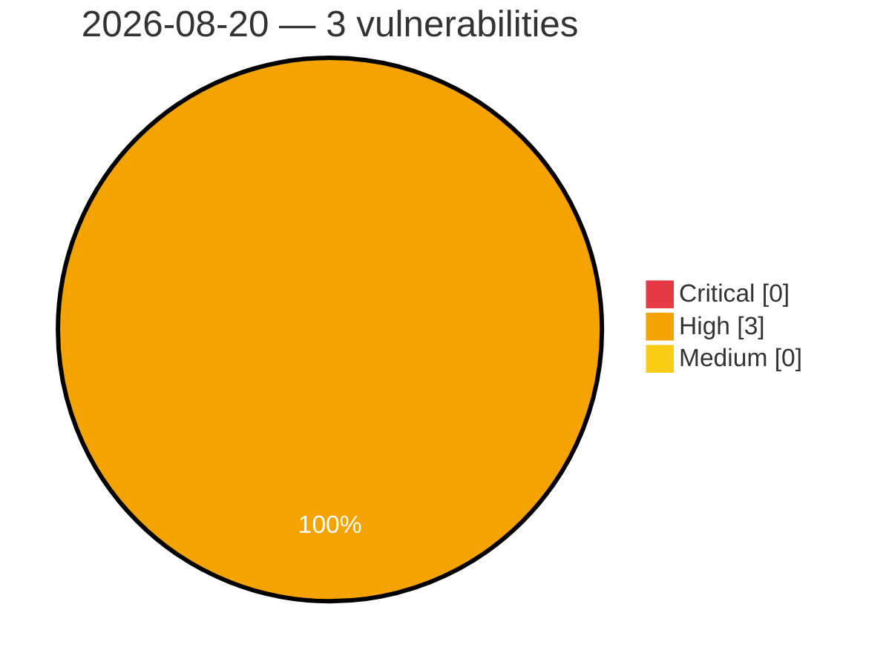

# Critical, High & Medium Severity Vulnerabilities — 2026-08-20

**Source status for this day:**

| Source | Critical | High | Medium | Total |
|--------|---------:|-----:|-------:|------:|
| cvefeed.io (High/Critical) | 0 | 3 | 0 | 3 |

**KEV (actively exploited):** 0  **Watchlist matches:** 3

## High (3)

| CVSS | Flags | Source | CVE / Title | Reported |
|------|-------|--------|-------------|----------|
| 8.6 | ⭐ | cvefeed.io (High/Critical) | [CVE-2026-75948 - Joomla Extension - icagenda.com -  Authenticated Stored XSS in iCagenda 4.0.8 to 4.0.12](https://cvefeed.io/vuln/detail/CVE-2026-75948) | 31 minutes ago |
| 8.6 | ⭐ | cvefeed.io (High/Critical) | [CVE-2026-76564 - Joomla Extension - phoca.cz -  Stored XSS via User-Agent header in Admin Order View in Phoca Cart 5.0.0-6.1.7](https://cvefeed.io/vuln/detail/CVE-2026-76564) | 31 minutes ago |
| 8.6 | ⭐ | cvefeed.io (High/Critical) | [CVE-2025-14601 - vsDesk Task Scheduler OS Command Injection](https://cvefeed.io/vuln/detail/CVE-2025-14601) | 40 minutes ago |
