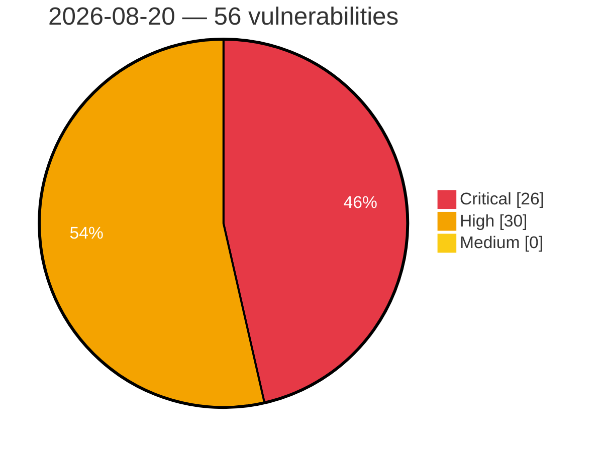

# Critical, High & Medium Severity Vulnerabilities — 2026-08-20

**Source status for this day:**

| Source | Critical | High | Medium | Total |
|--------|---------:|-----:|-------:|------:|
| cvefeed.io (High/Critical) | 26 | 30 | 0 | 56 |

**KEV (actively exploited):** 0  **Watchlist matches:** 38

## Critical (26)

| CVSS | Flags | Source | CVE / Title | Reported |
|------|-------|--------|-------------|----------|
| 9.9 | ⭐ | cvefeed.io (High/Critical) | [CVE-2026-74018 - WordPress Warehouse Cargo theme <= 2.6.9 - Arbitrary File Upload vulnerability](https://cvefeed.io/vuln/detail/CVE-2026-74018) | 12 minutes ago |
| 9.9 | ⭐ | cvefeed.io (High/Critical) | [CVE-2026-74016 - WordPress Smart Cleaning theme <= 4.8.6 - Arbitrary File Upload vulnerability](https://cvefeed.io/vuln/detail/CVE-2026-74016) | 12 minutes ago |
| 9.9 | ⭐ | cvefeed.io (High/Critical) | [CVE-2026-74014 - WordPress IT Residence theme <= 3.2.1 - Arbitrary File Upload vulnerability](https://cvefeed.io/vuln/detail/CVE-2026-74014) | 12 minutes ago |
| 9.9 | ⭐ | cvefeed.io (High/Critical) | [CVE-2026-73992 - WordPress Query Wrangler plugin <= 1.5.57 - Remote Code Execution (RCE) vulnerability](https://cvefeed.io/vuln/detail/CVE-2026-73992) | 12 minutes ago |
| 9.8 | — | cvefeed.io (High/Critical) | [CVE-2026-14950 - Frauscher Sensortechnik: FDS102 for FAdC/FAdCi R2 is vulnerable to Insufficient Session Expiration due to flawed session expiration logic](https://cvefeed.io/vuln/detail/CVE-2026-14950) | 44 minutes ago |
| 9.8 | ⭐ | cvefeed.io (High/Critical) | [CVE-2026-75860 - JSON Options <= 0.0.4 - Unauthenticated Arbitrary Options Update](https://cvefeed.io/vuln/detail/CVE-2026-75860) | 4 hours, 28 minutes ago |
| 9.8 | — | cvefeed.io (High/Critical) | [CVE-2026-74001 - WordPress User Registration & Membership Pro plugin <= 5.4.5 - Account Takeover vulnerability](https://cvefeed.io/vuln/detail/CVE-2026-74001) | 12 minutes ago |
| 9.8 | — | cvefeed.io (High/Critical) | [CVE-2026-73993 - WordPress FundEngine plugin <= 1.7.9 - PHP Object Injection vulnerability](https://cvefeed.io/vuln/detail/CVE-2026-73993) | 12 minutes ago |
| 9.8 | ⭐ | cvefeed.io (High/Critical) | [CVE-2026-66682 - WordPress Abandoned Cart Pro for WooCommerce plugin <= 10.4.0 - Privilege Escalation vulnerability](https://cvefeed.io/vuln/detail/CVE-2026-66682) | 12 minutes ago |
| 9.8 | — | cvefeed.io (High/Critical) | [CVE-2026-66672 - WordPress Flatastic theme <= 2.0 - PHP Object Injection vulnerability](https://cvefeed.io/vuln/detail/CVE-2026-66672) | 12 minutes ago |
| 9.8 | — | cvefeed.io (High/Critical) | [CVE-2026-66583 - WordPress Forminator plugin <= 1.57.0 - PHP Object Injection vulnerability](https://cvefeed.io/vuln/detail/CVE-2026-66583) | 12 minutes ago |
| 9.8 | ⭐ | cvefeed.io (High/Critical) | [CVE-2025-15689 - WordPress Capella theme <= 2.5.5 - Privilege Escalation vulnerability](https://cvefeed.io/vuln/detail/CVE-2025-15689) | 12 minutes ago |
| 9.8 | ⭐ | cvefeed.io (High/Critical) | [CVE-2026-15706 - Missing Authentication for Critical Function in Management API in Baylan Water Meters's BMS](https://cvefeed.io/vuln/detail/CVE-2026-15706) | 33 minutes ago |
| 9.8 | ⭐ | cvefeed.io (High/Critical) | [CVE-2026-18265 - OSNEXUS QuantaStor Missing Authentication Remote Code Execution Vulnerability](https://cvefeed.io/vuln/detail/CVE-2026-18265) | 29 minutes ago |
| 9.6 | — | cvefeed.io (High/Critical) | [CVE-2026-11861 - Freeipa: idm: ipa: freeipa: obtaining tgs with impersonating cname through trust relationships](https://cvefeed.io/vuln/detail/CVE-2026-11861) | 45 minutes ago |
| 9.6 | ⭐ | cvefeed.io (High/Critical) | [CVE-2026-28164 - WordPress Easy Elementor Addons plugin <= 2.3.7 - Cross Site Request Forgery (CSRF) vulnerability](https://cvefeed.io/vuln/detail/CVE-2026-28164) | 44 minutes ago |
| 9.3 | ⭐ | cvefeed.io (High/Critical) | [CVE-2026-68566 - WordPress BookingPress Appointment Booking Pro plugin <= 6.0.2 - SQL Injection vulnerability](https://cvefeed.io/vuln/detail/CVE-2026-68566) | 12 minutes ago |
| 9.3 | ⭐ | cvefeed.io (High/Critical) | [CVE-2026-66680 - WordPress Locatoraid Store Locator plugin <= 3.9.72 - SQL Injection vulnerability](https://cvefeed.io/vuln/detail/CVE-2026-66680) | 12 minutes ago |
| 9.3 | ⭐ | cvefeed.io (High/Critical) | [CVE-2026-66649 - WordPress Directory Pro plugin <= 2.5.8 - SQL Injection vulnerability](https://cvefeed.io/vuln/detail/CVE-2026-66649) | 12 minutes ago |
| 9.3 | ⭐ | cvefeed.io (High/Critical) | [CVE-2026-66609 - WordPress TheGem (Elementor) theme <= 5.12.3 - SQL Injection vulnerability](https://cvefeed.io/vuln/detail/CVE-2026-66609) | 12 minutes ago |
| 9.3 | ⭐ | cvefeed.io (High/Critical) | [CVE-2026-66593 - WordPress Security & Malware scan by CleanTalk plugin <= 2.184 - SQL Injection vulnerability](https://cvefeed.io/vuln/detail/CVE-2026-66593) | 12 minutes ago |
| 9.3 | ⭐ | cvefeed.io (High/Critical) | [CVE-2026-66592 - WordPress rtMedia for WordPress, BuddyPress and bbPress plugin <= 4.7.11 - SQL Injection vulnerability](https://cvefeed.io/vuln/detail/CVE-2026-66592) | 12 minutes ago |
| 9.3 | ⭐ | cvefeed.io (High/Critical) | [CVE-2025-15688 - WordPress Capella theme <= 2.5.5 - SQL Injection vulnerability](https://cvefeed.io/vuln/detail/CVE-2025-15688) | 12 minutes ago |
| 9.1 | ⭐ | cvefeed.io (High/Critical) | [CVE-2026-66600 - WordPress Media LIbrary Assistant plugin <= 3.39 - Arbitrary File Upload vulnerability](https://cvefeed.io/vuln/detail/CVE-2026-66600) | 12 minutes ago |
| 9.1 | ⭐ | cvefeed.io (High/Critical) | [CVE-2026-13097 - Ipa: privilege escalation via krbcanonicalname manipulation due to realm-unaware uniqueness enforcement in freeipa ldap datastore](https://cvefeed.io/vuln/detail/CVE-2026-13097) | 45 minutes ago |
| 9.1 | — | cvefeed.io (High/Critical) | [CVE-2026-16926 - Vulnerabilities in IBM AIX and PowerVM VIOS](https://cvefeed.io/vuln/detail/CVE-2026-16926) | 44 minutes ago |

## High (30)

| CVSS | Flags | Source | CVE / Title | Reported |
|------|-------|--------|-------------|----------|
| 8.8 | — | cvefeed.io (High/Critical) | [CVE-2026-14948 - Frauscher Sensortechnik: FDS102 for FAdC/FAdCi R2 is vulnerable to Insertion of Sensitive Information into Log File via error log archives](https://cvefeed.io/vuln/detail/CVE-2026-14948) | 44 minutes ago |
| 8.8 | — | cvefeed.io (High/Critical) | [CVE-2026-16932 - Vulnerabilities in IBM AIX and PowerVM VIOS](https://cvefeed.io/vuln/detail/CVE-2026-16932) | 44 minutes ago |
| 8.8 | ⭐ | cvefeed.io (High/Critical) | [CVE-2026-18264 - NoMachine getstat Command Injection Remote Code Execution Vulnerability](https://cvefeed.io/vuln/detail/CVE-2026-18264) | 29 minutes ago |
| 8.7 | — | cvefeed.io (High/Critical) | [CVE-2026-14952 - Frauscher Sensortechnik: FDS102 for FAdC/FAdCi R2 is offering files with sensitive information for download without requiring authentication](https://cvefeed.io/vuln/detail/CVE-2026-14952) | 44 minutes ago |
| 8.7 | — | cvefeed.io (High/Critical) | [CVE-2026-77080 - n8n before 1.123.69 Arbitrary File Read and Write via Snowflake](https://cvefeed.io/vuln/detail/CVE-2026-77080) | 58 minutes ago |
| 8.7 | ⭐ | cvefeed.io (High/Critical) | [CVE-2026-77068 - n8n before 2.34.1 Remote Code Execution via Path Traversal](https://cvefeed.io/vuln/detail/CVE-2026-77068) | 40 minutes ago |
| 8.7 | ⭐ | cvefeed.io (High/Critical) | [CVE-2026-64966 - Path Traversal leading to Remote Code Execution in ATutor](https://cvefeed.io/vuln/detail/CVE-2026-64966) | 1 hour, 43 minutes ago |
| 8.7 | ⭐ | cvefeed.io (High/Critical) | [CVE-2026-64960 - Remote Code Execution via Unrestricted File Upload in ATutor](https://cvefeed.io/vuln/detail/CVE-2026-64960) | 1 hour, 43 minutes ago |
| 8.7 | ⭐ | cvefeed.io (High/Critical) | [CVE-2026-75140 - jsoup Uncontrolled Resource Consumption in XmlTreeBuilder](https://cvefeed.io/vuln/detail/CVE-2026-75140) | 24 minutes ago |
| 8.6 | ⭐ | cvefeed.io (High/Critical) | [CVE-2026-75948 - Joomla Extension - icagenda.com -  Authenticated Stored XSS in iCagenda 4.0.8 to 4.0.12](https://cvefeed.io/vuln/detail/CVE-2026-75948) | 31 minutes ago |
| 8.6 | ⭐ | cvefeed.io (High/Critical) | [CVE-2026-76564 - Joomla Extension - phoca.cz -  Stored XSS via User-Agent header in Admin Order View in Phoca Cart 5.0.0-6.1.7](https://cvefeed.io/vuln/detail/CVE-2026-76564) | 31 minutes ago |
| 8.6 | ⭐ | cvefeed.io (High/Critical) | [CVE-2025-14601 - vsDesk Task Scheduler OS Command Injection](https://cvefeed.io/vuln/detail/CVE-2025-14601) | 40 minutes ago |
| 8.6 | — | cvefeed.io (High/Critical) | [CVE-2026-14951 - Frauscher Sensortechnik: FDS102 for FAdC/FAdCi R2 is vulnerable to Cross-Site Request Forgery due to missing CSFR protection headers](https://cvefeed.io/vuln/detail/CVE-2026-14951) | 44 minutes ago |
| 8.6 | ⭐ | cvefeed.io (High/Critical) | [CVE-2026-14947 - Frauscher Sensortechnik: FDS102 for FAdC/FAdCi R2 is vulnerable to Remote Code Execution via malicious ZIP file](https://cvefeed.io/vuln/detail/CVE-2026-14947) | 44 minutes ago |
| 8.6 | ⭐ | cvefeed.io (High/Critical) | [CVE-2026-14946 - Frauscher Sensortechnik: FDS102 for FAdC/FAdCi R2 is vulnerable to Remote Code Execution via malicious configuration file.](https://cvefeed.io/vuln/detail/CVE-2026-14946) | 44 minutes ago |
| 8.6 | — | cvefeed.io (High/Critical) | [CVE-2026-76633 - WeGIA < 3.9.2 Authorization Bypass Password Change via alterarSenha](https://cvefeed.io/vuln/detail/CVE-2026-76633) | 15 minutes ago |
| 8.6 | ⭐ | cvefeed.io (High/Critical) | [CVE-2026-76635 - baserCMS < 5.3.0 SQL Injection and Code Injection via BcDatabaseService.php](https://cvefeed.io/vuln/detail/CVE-2026-76635) | 1 hour, 43 minutes ago |
| 8.5 | ⭐ | cvefeed.io (High/Critical) | [CVE-2026-14949 - Frauscher Sensortechnik: FDS102 for FAdC/FAdCi R2 is vulnerable to Incorrect Authorization due to improper enforcement of role-based access control](https://cvefeed.io/vuln/detail/CVE-2026-14949) | 44 minutes ago |
| 8.5 | ⭐ | cvefeed.io (High/Critical) | [CVE-2026-74013 - WordPress eShipper Commerce plugin <= 2.16.13 - SQL Injection vulnerability](https://cvefeed.io/vuln/detail/CVE-2026-74013) | 12 minutes ago |
| 8.5 | ⭐ | cvefeed.io (High/Critical) | [CVE-2026-73998 - WordPress WP w3all phpBB plugin <= 3.0.5 - SQL Injection vulnerability](https://cvefeed.io/vuln/detail/CVE-2026-73998) | 12 minutes ago |
| 8.5 | ⭐ | cvefeed.io (High/Critical) | [CVE-2026-66594 - WordPress WordPress Persistent Login plugin <= 3.1.0 - SQL Injection vulnerability](https://cvefeed.io/vuln/detail/CVE-2026-66594) | 12 minutes ago |
| 8.5 | ⭐ | cvefeed.io (High/Critical) | [CVE-2026-73220 - CVAT: Stored XSS via annotation guides in audio tasks](https://cvefeed.io/vuln/detail/CVE-2026-73220) | 43 minutes ago |
| 8.4 | ⭐ | cvefeed.io (High/Critical) | [CVE-2026-77075 - n8n before 1.123.69 Expression Injection via Resource Locator](https://cvefeed.io/vuln/detail/CVE-2026-77075) | 58 minutes ago |
| 8.4 | ⭐ | cvefeed.io (High/Critical) | [CVE-2026-77072 - n8n before 1.123.69 Stored XSS via Form Completion Page](https://cvefeed.io/vuln/detail/CVE-2026-77072) | 40 minutes ago |
| 8.4 | — | cvefeed.io (High/Critical) | [CVE-2026-76833 - @cgauge/yaml npm Package Arbitrary Code Execution via eval() YAML Tag](https://cvefeed.io/vuln/detail/CVE-2026-76833) | 28 minutes ago |
| 8.4 | — | cvefeed.io (High/Critical) | [CVE-2026-77118 - Out-of-bounds write in GraphicsMagick PCD decoder](https://cvefeed.io/vuln/detail/CVE-2026-77118) | 42 minutes ago |
| 8.4 | ⭐ | cvefeed.io (High/Critical) | [CVE-2026-70383 - Arbitrary file overwrite vulnerability in DigiDoc4 client](https://cvefeed.io/vuln/detail/CVE-2026-70383) | 1 hour, 43 minutes ago |
| 8.2 | — | cvefeed.io (High/Critical) | [CVE-2026-49825 - lxml: javascript: URL bypass in Cleaner via xlink:href](https://cvefeed.io/vuln/detail/CVE-2026-49825) | 44 minutes ago |
| 8.1 | — | cvefeed.io (High/Critical) | [CVE-2026-28150 - WordPress Golo Framework plugin < 1.7.5 - Local File Inclusion vulnerability](https://cvefeed.io/vuln/detail/CVE-2026-28150) | 12 minutes ago |
| 8.1 | — | cvefeed.io (High/Critical) | [CVE-2025-15637 - WordPress Shuffle theme <= 1.8 - Local File Inclusion vulnerability](https://cvefeed.io/vuln/detail/CVE-2025-15637) | 12 minutes ago |
