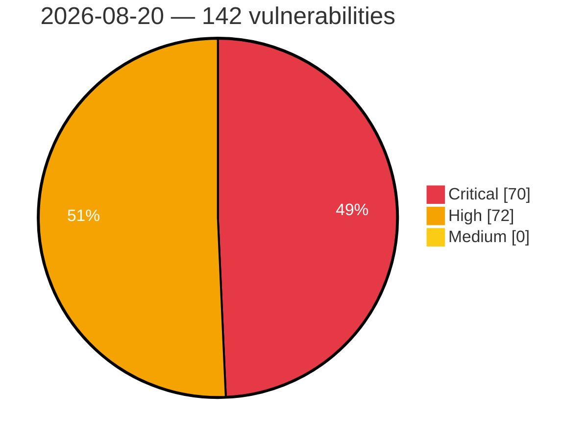

# Critical, High & Medium Severity Vulnerabilities — 2026-08-20

**Source status for this day:**

| Source | Critical | High | Medium | Total |
|--------|---------:|-----:|-------:|------:|
| cvefeed.io (High/Critical) | 70 | 72 | 0 | 142 |

**KEV (actively exploited):** 0  **Watchlist matches:** 72

## Critical (70)

| CVSS | Flags | Source | CVE / Title | Reported |
|------|-------|--------|-------------|----------|
| 10.0 | — | cvefeed.io (High/Critical) | [CVE-2026-69555 - Azure Arc Elevation of Privilege Vulnerability](https://cvefeed.io/vuln/detail/CVE-2026-69555) | 14 minutes ago |
| 10.0 | — | cvefeed.io (High/Critical) | [CVE-2026-65816 - Azure Arc Elevation of Privilege Vulnerability](https://cvefeed.io/vuln/detail/CVE-2026-65816) | 14 minutes ago |
| 10.0 | ⭐ | cvefeed.io (High/Critical) | [CVE-2026-65770 - Azure Managed Instance for Apache Cassandra Remote Code Execution Vulnerability](https://cvefeed.io/vuln/detail/CVE-2026-65770) | 14 minutes ago |
| 10.0 | ⭐ | cvefeed.io (High/Critical) | [CVE-2026-69836 - Microsoft Entra ID Remote Code Execution Vulnerability](https://cvefeed.io/vuln/detail/CVE-2026-69836) | 18 minutes ago |
| 10.0 | — | cvefeed.io (High/Critical) | [CVE-2026-65801 - Microsoft Exchange Online Elevation of Privilege Vulnerability](https://cvefeed.io/vuln/detail/CVE-2026-65801) | 18 minutes ago |
| 9.9 | ⭐ | cvefeed.io (High/Critical) | [CVE-2026-74018 - WordPress Warehouse Cargo theme <= 2.6.9 - Arbitrary File Upload vulnerability](https://cvefeed.io/vuln/detail/CVE-2026-74018) | 12 minutes ago |
| 9.9 | ⭐ | cvefeed.io (High/Critical) | [CVE-2026-74016 - WordPress Smart Cleaning theme <= 4.8.6 - Arbitrary File Upload vulnerability](https://cvefeed.io/vuln/detail/CVE-2026-74016) | 12 minutes ago |
| 9.9 | ⭐ | cvefeed.io (High/Critical) | [CVE-2026-74014 - WordPress IT Residence theme <= 3.2.1 - Arbitrary File Upload vulnerability](https://cvefeed.io/vuln/detail/CVE-2026-74014) | 12 minutes ago |
| 9.9 | ⭐ | cvefeed.io (High/Critical) | [CVE-2026-73992 - WordPress Query Wrangler plugin <= 1.5.57 - Remote Code Execution (RCE) vulnerability](https://cvefeed.io/vuln/detail/CVE-2026-73992) | 12 minutes ago |
| 9.9 | — | cvefeed.io (High/Critical) | [CVE-2026-77022 - Comfast CF-N1-S SSID Configuration mbox-config sub_44B438 stack-based overflow](https://cvefeed.io/vuln/detail/CVE-2026-77022) | 41 minutes ago |
| 9.9 | ⭐ | cvefeed.io (High/Critical) | [CVE-2026-66788 - Lighthouse: lighthouse: arbitrary local-namespace injection via attacker-controlled labelsourcenamespace](https://cvefeed.io/vuln/detail/CVE-2026-66788) | 47 minutes ago |
| 9.9 | — | cvefeed.io (High/Critical) | [CVE-2026-66785 - Submariner: submariner: unvalidated endpoint.spec.subnets propagated into wireguard allowedips / ipsec enables traffic hijack](https://cvefeed.io/vuln/detail/CVE-2026-66785) | 48 minutes ago |
| 9.9 | — | cvefeed.io (High/Critical) | [CVE-2026-77148 - Comfast CF-N1-S Web Management mbox-config sub_44B50C stack-based overflow](https://cvefeed.io/vuln/detail/CVE-2026-77148) | 57 minutes ago |
| 9.9 | ⭐ | cvefeed.io (High/Critical) | [CVE-2026-67567 - Multicloud-operators-subscription: multicloud-operators-subscription: helmrelease chart applied with controller sa without gvk or namespace restriction](https://cvefeed.io/vuln/detail/CVE-2026-67567) | 29 minutes ago |
| 9.9 | — | cvefeed.io (High/Critical) | [CVE-2026-68782 - Azure SQL Database Elevation of Privilege Vulnerability](https://cvefeed.io/vuln/detail/CVE-2026-68782) | 14 minutes ago |
| 9.9 | — | cvefeed.io (High/Critical) | [CVE-2026-63509 - Microsoft Fabric Elevation of Privilege Vulnerability](https://cvefeed.io/vuln/detail/CVE-2026-63509) | 14 minutes ago |
| 9.9 | — | cvefeed.io (High/Critical) | [CVE-2026-69851 - Microsoft Entra ID Elevation of Privilege Vulnerability](https://cvefeed.io/vuln/detail/CVE-2026-69851) | 18 minutes ago |
| 9.9 | — | cvefeed.io (High/Critical) | [CVE-2026-68789 - Azure SQL Database Elevation of Privilege Vulnerability](https://cvefeed.io/vuln/detail/CVE-2026-68789) | 18 minutes ago |
| 9.9 | — | cvefeed.io (High/Critical) | [CVE-2026-18835 - Vulnerabilities in IBM AIX and PowerVM VIOS](https://cvefeed.io/vuln/detail/CVE-2026-18835) | 16 minutes ago |
| 9.8 | — | cvefeed.io (High/Critical) | [CVE-2026-14950 - Frauscher Sensortechnik: FDS102 for FAdC/FAdCi R2 is vulnerable to Insufficient Session Expiration due to flawed session expiration logic](https://cvefeed.io/vuln/detail/CVE-2026-14950) | 44 minutes ago |
| 9.8 | ⭐ | cvefeed.io (High/Critical) | [CVE-2026-75860 - JSON Options <= 0.0.4 - Unauthenticated Arbitrary Options Update](https://cvefeed.io/vuln/detail/CVE-2026-75860) | 4 hours, 28 minutes ago |
| 9.8 | — | cvefeed.io (High/Critical) | [CVE-2026-74001 - WordPress User Registration & Membership Pro plugin <= 5.4.5 - Account Takeover vulnerability](https://cvefeed.io/vuln/detail/CVE-2026-74001) | 12 minutes ago |
| 9.8 | — | cvefeed.io (High/Critical) | [CVE-2026-73993 - WordPress FundEngine plugin <= 1.7.9 - PHP Object Injection vulnerability](https://cvefeed.io/vuln/detail/CVE-2026-73993) | 12 minutes ago |
| 9.8 | ⭐ | cvefeed.io (High/Critical) | [CVE-2026-66682 - WordPress Abandoned Cart Pro for WooCommerce plugin <= 10.4.0 - Privilege Escalation vulnerability](https://cvefeed.io/vuln/detail/CVE-2026-66682) | 12 minutes ago |
| 9.8 | — | cvefeed.io (High/Critical) | [CVE-2026-66672 - WordPress Flatastic theme <= 2.0 - PHP Object Injection vulnerability](https://cvefeed.io/vuln/detail/CVE-2026-66672) | 12 minutes ago |
| 9.8 | — | cvefeed.io (High/Critical) | [CVE-2026-66583 - WordPress Forminator plugin <= 1.57.0 - PHP Object Injection vulnerability](https://cvefeed.io/vuln/detail/CVE-2026-66583) | 12 minutes ago |
| 9.8 | ⭐ | cvefeed.io (High/Critical) | [CVE-2025-15689 - WordPress Capella theme <= 2.5.5 - Privilege Escalation vulnerability](https://cvefeed.io/vuln/detail/CVE-2025-15689) | 12 minutes ago |
| 9.8 | ⭐ | cvefeed.io (High/Critical) | [CVE-2026-15706 - Missing Authentication for Critical Function in Management API in Baylan Water Meters's BMS](https://cvefeed.io/vuln/detail/CVE-2026-15706) | 33 minutes ago |
| 9.8 | ⭐ | cvefeed.io (High/Critical) | [CVE-2026-18265 - OSNEXUS QuantaStor Missing Authentication Remote Code Execution Vulnerability](https://cvefeed.io/vuln/detail/CVE-2026-18265) | 29 minutes ago |
| 9.8 | ⭐ | cvefeed.io (High/Critical) | [CVE-2026-55642 - dbx: Unauthenticated arbitrary SQL execution in dbx-web (authentication fails open when no password is configured)](https://cvefeed.io/vuln/detail/CVE-2026-55642) | 43 minutes ago |
| 9.8 | — | cvefeed.io (High/Critical) | [CVE-2026-17118 - Vulnerabilities in IBM AIX and PowerVM VIOS](https://cvefeed.io/vuln/detail/CVE-2026-17118) | 10 minutes ago |
| 9.8 | — | cvefeed.io (High/Critical) | [CVE-2026-17040 - Vulnerabilities in IBM AIX and PowerVM VIOS](https://cvefeed.io/vuln/detail/CVE-2026-17040) | 11 minutes ago |
| 9.8 | ⭐ | cvefeed.io (High/Critical) | [CVE-2026-72843 - EverShop Missing Authorization on PATCH /api/customers/:id Allows Unauthenticated Account Takeover](https://cvefeed.io/vuln/detail/CVE-2026-72843) | 22 minutes ago |
| 9.8 | — | cvefeed.io (High/Critical) | [CVE-2026-17160 - Vulnerabilities in IBM AIX and PowerVM VIOS](https://cvefeed.io/vuln/detail/CVE-2026-17160) | 23 minutes ago |
| 9.8 | — | cvefeed.io (High/Critical) | [CVE-2026-17157 - Vulnerabilities in IBM AIX and PowerVM VIOS](https://cvefeed.io/vuln/detail/CVE-2026-17157) | 24 minutes ago |
| 9.8 | — | cvefeed.io (High/Critical) | [CVE-2026-17152 - Vulnerabilities in IBM AIX and PowerVM VIOS](https://cvefeed.io/vuln/detail/CVE-2026-17152) | 24 minutes ago |
| 9.8 | — | cvefeed.io (High/Critical) | [CVE-2026-17145 - Vulnerabilities in IBM AIX and PowerVM VIOS](https://cvefeed.io/vuln/detail/CVE-2026-17145) | 25 minutes ago |
| 9.8 | — | cvefeed.io (High/Critical) | [CVE-2026-17142 - Vulnerabilities in IBM AIX and PowerVM VIOS](https://cvefeed.io/vuln/detail/CVE-2026-17142) | 25 minutes ago |
| 9.8 | — | cvefeed.io (High/Critical) | [CVE-2026-17141 - Vulnerabilities in IBM AIX and PowerVM VIOS](https://cvefeed.io/vuln/detail/CVE-2026-17141) | 26 minutes ago |
| 9.8 | — | cvefeed.io (High/Critical) | [CVE-2026-17136 - Vulnerabilities in IBM AIX and PowerVM VIOS](https://cvefeed.io/vuln/detail/CVE-2026-17136) | 26 minutes ago |
| 9.8 | ⭐ | cvefeed.io (High/Critical) | [CVE-2026-77647 - SPIP Remote Code Execution Vulnerability](https://cvefeed.io/vuln/detail/CVE-2026-77647) | 1 hour, 48 minutes ago |
| 9.6 | — | cvefeed.io (High/Critical) | [CVE-2026-11861 - Freeipa: idm: ipa: freeipa: obtaining tgs with impersonating cname through trust relationships](https://cvefeed.io/vuln/detail/CVE-2026-11861) | 45 minutes ago |
| 9.6 | ⭐ | cvefeed.io (High/Critical) | [CVE-2026-28164 - WordPress Easy Elementor Addons plugin <= 2.3.7 - Cross Site Request Forgery (CSRF) vulnerability](https://cvefeed.io/vuln/detail/CVE-2026-28164) | 44 minutes ago |
| 9.6 | — | cvefeed.io (High/Critical) | [CVE-2026-69400 - Azure Logic Apps Elevation of Privilege Vulnerability](https://cvefeed.io/vuln/detail/CVE-2026-69400) | 14 minutes ago |
| 9.4 | ⭐ | cvefeed.io (High/Critical) | [CVE-2026-2334 - ) Missing Server-Side File Extension Validation in vsDesk](https://cvefeed.io/vuln/detail/CVE-2026-2334) | 46 minutes ago |
| 9.4 | ⭐ | cvefeed.io (High/Critical) | [CVE-2026-55769 - CloudNativePG: Overriding operators can lead to privilege escalation in CloudNativePG for SQL queries without a fixed `search_path`](https://cvefeed.io/vuln/detail/CVE-2026-55769) | 25 minutes ago |
| 9.3 | ⭐ | cvefeed.io (High/Critical) | [CVE-2026-68566 - WordPress BookingPress Appointment Booking Pro plugin <= 6.0.2 - SQL Injection vulnerability](https://cvefeed.io/vuln/detail/CVE-2026-68566) | 12 minutes ago |
| 9.3 | ⭐ | cvefeed.io (High/Critical) | [CVE-2026-66680 - WordPress Locatoraid Store Locator plugin <= 3.9.72 - SQL Injection vulnerability](https://cvefeed.io/vuln/detail/CVE-2026-66680) | 12 minutes ago |
| 9.3 | ⭐ | cvefeed.io (High/Critical) | [CVE-2026-66649 - WordPress Directory Pro plugin <= 2.5.8 - SQL Injection vulnerability](https://cvefeed.io/vuln/detail/CVE-2026-66649) | 12 minutes ago |
| 9.3 | ⭐ | cvefeed.io (High/Critical) | [CVE-2026-66609 - WordPress TheGem (Elementor) theme <= 5.12.3 - SQL Injection vulnerability](https://cvefeed.io/vuln/detail/CVE-2026-66609) | 12 minutes ago |
| 9.3 | ⭐ | cvefeed.io (High/Critical) | [CVE-2026-66593 - WordPress Security & Malware scan by CleanTalk plugin <= 2.184 - SQL Injection vulnerability](https://cvefeed.io/vuln/detail/CVE-2026-66593) | 12 minutes ago |
| 9.3 | ⭐ | cvefeed.io (High/Critical) | [CVE-2026-66592 - WordPress rtMedia for WordPress, BuddyPress and bbPress plugin <= 4.7.11 - SQL Injection vulnerability](https://cvefeed.io/vuln/detail/CVE-2026-66592) | 12 minutes ago |
| 9.3 | ⭐ | cvefeed.io (High/Critical) | [CVE-2025-15688 - WordPress Capella theme <= 2.5.5 - SQL Injection vulnerability](https://cvefeed.io/vuln/detail/CVE-2025-15688) | 12 minutes ago |
| 9.3 | ⭐ | cvefeed.io (High/Critical) | [CVE-2026-71428 - unstructured: Server-Side Request Forgery in the URL-based partitioning](https://cvefeed.io/vuln/detail/CVE-2026-71428) | 42 minutes ago |
| 9.3 | ⭐ | cvefeed.io (High/Critical) | [CVE-2026-19586 - Pre-Authentication OS Command Injection in Omada Gateways on OpenVPN Server in Omada Gateways](https://cvefeed.io/vuln/detail/CVE-2026-19586) | 31 minutes ago |
| 9.3 | ⭐ | cvefeed.io (High/Critical) | [CVE-2026-73251 - Mongoose Built-in TLS: CA-bundle certificate chain accepted without any signature verification](https://cvefeed.io/vuln/detail/CVE-2026-73251) | 46 minutes ago |
| 9.3 | — | cvefeed.io (High/Critical) | [CVE-2026-62834 - Azure Data Factory Elevation of Privilege Vulnerability](https://cvefeed.io/vuln/detail/CVE-2026-62834) | 18 minutes ago |
| 9.3 | — | cvefeed.io (High/Critical) | [CVE-2026-17422 - Vulnerabilities in IBM AIX and PowerVM VIOS](https://cvefeed.io/vuln/detail/CVE-2026-17422) | 21 minutes ago |
| 9.3 | ⭐ | cvefeed.io (High/Critical) | [CVE-2026-77644 - Critical Bypass Access Control Vulnerability Reported for Windchill Risk and Reliability (WRR) Enterprise Edition](https://cvefeed.io/vuln/detail/CVE-2026-77644) | 24 minutes ago |
| 9.2 | ⭐ | cvefeed.io (High/Critical) | [CVE-2026-63385 - Libevent: HTTP header handling bugs create risk of access control bypass.](https://cvefeed.io/vuln/detail/CVE-2026-63385) | 46 minutes ago |
| 9.2 | ⭐ | cvefeed.io (High/Critical) | [CVE-2026-63382 - libevent evhttp: Multiple HTTP Parser Bugs Enable Request Smuggling](https://cvefeed.io/vuln/detail/CVE-2026-63382) | 46 minutes ago |
| 9.2 | ⭐ | cvefeed.io (High/Critical) | [CVE-2026-77645 - Critical Remote Code Execution (RCE) vulnerability reported in Windchill](https://cvefeed.io/vuln/detail/CVE-2026-77645) | 11 minutes ago |
| 9.1 | ⭐ | cvefeed.io (High/Critical) | [CVE-2026-66600 - WordPress Media LIbrary Assistant plugin <= 3.39 - Arbitrary File Upload vulnerability](https://cvefeed.io/vuln/detail/CVE-2026-66600) | 12 minutes ago |
| 9.1 | ⭐ | cvefeed.io (High/Critical) | [CVE-2026-13097 - Ipa: privilege escalation via krbcanonicalname manipulation due to realm-unaware uniqueness enforcement in freeipa ldap datastore](https://cvefeed.io/vuln/detail/CVE-2026-13097) | 45 minutes ago |
| 9.1 | — | cvefeed.io (High/Critical) | [CVE-2026-16926 - Vulnerabilities in IBM AIX and PowerVM VIOS](https://cvefeed.io/vuln/detail/CVE-2026-16926) | 44 minutes ago |
| 9.1 | ⭐ | cvefeed.io (High/Critical) | [CVE-2026-53424 - Missing one-time-use enforcement in Samly allows replay of SAML bearer assertions](https://cvefeed.io/vuln/detail/CVE-2026-53424) | 34 minutes ago |
| 9.1 | ⭐ | cvefeed.io (High/Critical) | [CVE-2026-73257 - Mongoose: Content-Length + Transfer-Encoding coexistence enables request smuggling](https://cvefeed.io/vuln/detail/CVE-2026-73257) | 46 minutes ago |
| 9.1 | — | cvefeed.io (High/Critical) | [CVE-2026-73256 - Mongoose: HTTP/1.0 detection off-by-one enables request smuggling via chunked TE](https://cvefeed.io/vuln/detail/CVE-2026-73256) | 46 minutes ago |
| 9.1 | ⭐ | cvefeed.io (High/Critical) | [CVE-2026-73253 - Mongoose: TLS Hostname Verification Bypass via Overly Permissive Wildcard Matching](https://cvefeed.io/vuln/detail/CVE-2026-73253) | 46 minutes ago |
| 9.1 | — | cvefeed.io (High/Critical) | [CVE-2026-66309 - Azure SQL Database Elevation of Privilege Vulnerability](https://cvefeed.io/vuln/detail/CVE-2026-66309) | 14 minutes ago |

## High (72)

| CVSS | Flags | Source | CVE / Title | Reported |
|------|-------|--------|-------------|----------|
| 8.8 | — | cvefeed.io (High/Critical) | [CVE-2026-14948 - Frauscher Sensortechnik: FDS102 for FAdC/FAdCi R2 is vulnerable to Insertion of Sensitive Information into Log File via error log archives](https://cvefeed.io/vuln/detail/CVE-2026-14948) | 44 minutes ago |
| 8.8 | — | cvefeed.io (High/Critical) | [CVE-2026-16932 - Vulnerabilities in IBM AIX and PowerVM VIOS](https://cvefeed.io/vuln/detail/CVE-2026-16932) | 44 minutes ago |
| 8.8 | ⭐ | cvefeed.io (High/Critical) | [CVE-2026-18264 - NoMachine getstat Command Injection Remote Code Execution Vulnerability](https://cvefeed.io/vuln/detail/CVE-2026-18264) | 29 minutes ago |
| 8.8 | ⭐ | cvefeed.io (High/Critical) | [CVE-2026-54449 - LangBot: Authenticated RCE Via MCP Configuration](https://cvefeed.io/vuln/detail/CVE-2026-54449) | 43 minutes ago |
| 8.8 | ⭐ | cvefeed.io (High/Critical) | [CVE-2026-18279 - Sony XAV-9500ES RTSP SETUP Buffer Overflow Remote Code Execution Vulnerability](https://cvefeed.io/vuln/detail/CVE-2026-18279) | 44 minutes ago |
| 8.8 | ⭐ | cvefeed.io (High/Critical) | [CVE-2026-18420 - RCE via Prototype Pollution in OpenSearch Dashboards](https://cvefeed.io/vuln/detail/CVE-2026-18420) | 22 minutes ago |
| 8.8 | ⭐ | cvefeed.io (High/Critical) | [CVE-2026-73040 - Dockge Path Traversal via Unvalidated Stack Name Allows Arbitrary Compose and .env Disclosure and Arbitrary Directory Deletion](https://cvefeed.io/vuln/detail/CVE-2026-73040) | 34 minutes ago |
| 8.8 | — | cvefeed.io (High/Critical) | [CVE-2026-16996 - Vulnerabilities in IBM AIX and PowerVM VIOS](https://cvefeed.io/vuln/detail/CVE-2026-16996) | 13 minutes ago |
| 8.8 | — | cvefeed.io (High/Critical) | [CVE-2026-19449 - Vulnerabilities in IBM AIX and PowerVM VIOS](https://cvefeed.io/vuln/detail/CVE-2026-19449) | 15 minutes ago |
| 8.8 | — | cvefeed.io (High/Critical) | [CVE-2026-18832 - Vulnerabilities in IBM AIX and PowerVM VIOS](https://cvefeed.io/vuln/detail/CVE-2026-18832) | 17 minutes ago |
| 8.8 | — | cvefeed.io (High/Critical) | [CVE-2026-17436 - Vulnerabilities in IBM AIX and PowerVM VIOS](https://cvefeed.io/vuln/detail/CVE-2026-17436) | 20 minutes ago |
| 8.7 | — | cvefeed.io (High/Critical) | [CVE-2026-14952 - Frauscher Sensortechnik: FDS102 for FAdC/FAdCi R2 is offering files with sensitive information for download without requiring authentication](https://cvefeed.io/vuln/detail/CVE-2026-14952) | 44 minutes ago |
| 8.7 | — | cvefeed.io (High/Critical) | [CVE-2026-77080 - n8n before 1.123.69 Arbitrary File Read and Write via Snowflake](https://cvefeed.io/vuln/detail/CVE-2026-77080) | 58 minutes ago |
| 8.7 | ⭐ | cvefeed.io (High/Critical) | [CVE-2026-77068 - n8n before 2.34.1 Remote Code Execution via Path Traversal](https://cvefeed.io/vuln/detail/CVE-2026-77068) | 40 minutes ago |
| 8.7 | ⭐ | cvefeed.io (High/Critical) | [CVE-2026-64966 - Path Traversal leading to Remote Code Execution in ATutor](https://cvefeed.io/vuln/detail/CVE-2026-64966) | 1 hour, 43 minutes ago |
| 8.7 | ⭐ | cvefeed.io (High/Critical) | [CVE-2026-64960 - Remote Code Execution via Unrestricted File Upload in ATutor](https://cvefeed.io/vuln/detail/CVE-2026-64960) | 1 hour, 43 minutes ago |
| 8.7 | ⭐ | cvefeed.io (High/Critical) | [CVE-2026-75140 - jsoup Uncontrolled Resource Consumption in XmlTreeBuilder](https://cvefeed.io/vuln/detail/CVE-2026-75140) | 24 minutes ago |
| 8.7 | — | cvefeed.io (High/Critical) | [CVE-2026-76641 - Expat Out-of-Bounds Read via dtdCopy](https://cvefeed.io/vuln/detail/CVE-2026-76641) | 30 minutes ago |
| 8.7 | — | cvefeed.io (High/Critical) | [CVE-2026-63384 - Libevent: `evtag_unmarshal_header()` decodes a wire `uint32` length into a signed `int` return value.](https://cvefeed.io/vuln/detail/CVE-2026-63384) | 46 minutes ago |
| 8.7 | — | cvefeed.io (High/Critical) | [CVE-2026-63383 - Libevent: decode_tag_internal() can lead to out-of-bounds read](https://cvefeed.io/vuln/detail/CVE-2026-63383) | 46 minutes ago |
| 8.7 | ⭐ | cvefeed.io (High/Critical) | [CVE-2026-66787 - Lighthouse: lighthouse: cross-cluster dns spoofing via unvalidated endpointslice and serviceimport ips](https://cvefeed.io/vuln/detail/CVE-2026-66787) | 47 minutes ago |
| 8.7 | — | cvefeed.io (High/Critical) | [CVE-2026-72818 - NLTK TweetTokenizer URL Pattern Backtracks Catastrophically on Naked-Domain-Like Input](https://cvefeed.io/vuln/detail/CVE-2026-72818) | 22 minutes ago |
| 8.6 | ⭐ | cvefeed.io (High/Critical) | [CVE-2026-75948 - Joomla Extension - icagenda.com -  Authenticated Stored XSS in iCagenda 4.0.8 to 4.0.12](https://cvefeed.io/vuln/detail/CVE-2026-75948) | 31 minutes ago |
| 8.6 | ⭐ | cvefeed.io (High/Critical) | [CVE-2026-76564 - Joomla Extension - phoca.cz -  Stored XSS via User-Agent header in Admin Order View in Phoca Cart 5.0.0-6.1.7](https://cvefeed.io/vuln/detail/CVE-2026-76564) | 31 minutes ago |
| 8.6 | ⭐ | cvefeed.io (High/Critical) | [CVE-2025-14601 - vsDesk Task Scheduler OS Command Injection](https://cvefeed.io/vuln/detail/CVE-2025-14601) | 40 minutes ago |
| 8.6 | — | cvefeed.io (High/Critical) | [CVE-2026-14951 - Frauscher Sensortechnik: FDS102 for FAdC/FAdCi R2 is vulnerable to Cross-Site Request Forgery due to missing CSFR protection headers](https://cvefeed.io/vuln/detail/CVE-2026-14951) | 44 minutes ago |
| 8.6 | ⭐ | cvefeed.io (High/Critical) | [CVE-2026-14947 - Frauscher Sensortechnik: FDS102 for FAdC/FAdCi R2 is vulnerable to Remote Code Execution via malicious ZIP file](https://cvefeed.io/vuln/detail/CVE-2026-14947) | 44 minutes ago |
| 8.6 | ⭐ | cvefeed.io (High/Critical) | [CVE-2026-14946 - Frauscher Sensortechnik: FDS102 for FAdC/FAdCi R2 is vulnerable to Remote Code Execution via malicious configuration file.](https://cvefeed.io/vuln/detail/CVE-2026-14946) | 44 minutes ago |
| 8.6 | — | cvefeed.io (High/Critical) | [CVE-2026-76633 - WeGIA < 3.9.2 Authorization Bypass Password Change via alterarSenha](https://cvefeed.io/vuln/detail/CVE-2026-76633) | 15 minutes ago |
| 8.6 | ⭐ | cvefeed.io (High/Critical) | [CVE-2026-76635 - baserCMS < 5.3.0 SQL Injection and Code Injection via BcDatabaseService.php](https://cvefeed.io/vuln/detail/CVE-2026-76635) | 1 hour, 43 minutes ago |
| 8.6 | ⭐ | cvefeed.io (High/Critical) | [CVE-2026-50190 - Shaarli vulnerable to stored XSS via raw bookmark title in document <title> element on public permalink page](https://cvefeed.io/vuln/detail/CVE-2026-50190) | 57 minutes ago |
| 8.6 | — | cvefeed.io (High/Critical) | [CVE-2026-69558 - Microsoft Partner Center Information Disclosure Vulnerability](https://cvefeed.io/vuln/detail/CVE-2026-69558) | 14 minutes ago |
| 8.6 | — | cvefeed.io (High/Critical) | [CVE-2026-66800 - Azure Data Factory Information Disclosure Vulnerability](https://cvefeed.io/vuln/detail/CVE-2026-66800) | 14 minutes ago |
| 8.6 | — | cvefeed.io (High/Critical) | [CVE-2026-69519 - Azure Stack HCI Information Disclosure Vulnerability](https://cvefeed.io/vuln/detail/CVE-2026-69519) | 18 minutes ago |
| 8.6 | — | cvefeed.io (High/Critical) | [CVE-2026-72848 - langchain-community SitemapLoader Does Not Apply restrict_to_same_domain to Nested Sitemap Index Entries, Allowing Server-Side Request Forgery](https://cvefeed.io/vuln/detail/CVE-2026-72848) | 22 minutes ago |
| 8.5 | ⭐ | cvefeed.io (High/Critical) | [CVE-2026-14949 - Frauscher Sensortechnik: FDS102 for FAdC/FAdCi R2 is vulnerable to Incorrect Authorization due to improper enforcement of role-based access control](https://cvefeed.io/vuln/detail/CVE-2026-14949) | 44 minutes ago |
| 8.5 | ⭐ | cvefeed.io (High/Critical) | [CVE-2026-74013 - WordPress eShipper Commerce plugin <= 2.16.13 - SQL Injection vulnerability](https://cvefeed.io/vuln/detail/CVE-2026-74013) | 12 minutes ago |
| 8.5 | ⭐ | cvefeed.io (High/Critical) | [CVE-2026-73998 - WordPress WP w3all phpBB plugin <= 3.0.5 - SQL Injection vulnerability](https://cvefeed.io/vuln/detail/CVE-2026-73998) | 12 minutes ago |
| 8.5 | ⭐ | cvefeed.io (High/Critical) | [CVE-2026-66594 - WordPress WordPress Persistent Login plugin <= 3.1.0 - SQL Injection vulnerability](https://cvefeed.io/vuln/detail/CVE-2026-66594) | 12 minutes ago |
| 8.5 | ⭐ | cvefeed.io (High/Critical) | [CVE-2026-73220 - CVAT: Stored XSS via annotation guides in audio tasks](https://cvefeed.io/vuln/detail/CVE-2026-73220) | 43 minutes ago |
| 8.5 | — | cvefeed.io (High/Critical) | [CVE-2026-72852 - darknet Integer Overflow in Convolutional Layer Buffer Sizing Leads to Heap Buffer Overflow](https://cvefeed.io/vuln/detail/CVE-2026-72852) | 43 minutes ago |
| 8.5 | ⭐ | cvefeed.io (High/Critical) | [CVE-2026-66001 - Frappe: Improper Authorization in OAuth2 Consent Endpoint](https://cvefeed.io/vuln/detail/CVE-2026-66001) | 57 minutes ago |
| 8.5 | — | cvefeed.io (High/Critical) | [CVE-2026-69543 - Azure Virtual Machines Elevation of Privilege Vulnerability](https://cvefeed.io/vuln/detail/CVE-2026-69543) | 14 minutes ago |
| 8.5 | ⭐ | cvefeed.io (High/Critical) | [CVE-2026-69419 - Azure Data Manager for Energy Remote Code Execution Vulnerability](https://cvefeed.io/vuln/detail/CVE-2026-69419) | 14 minutes ago |
| 8.5 | ⭐ | cvefeed.io (High/Critical) | [CVE-2026-72860 - 9router Server-Side Request Forgery via /api/provider-nodes/validate Because the IPv4-Mapped IPv6 Denylist Check Is Unreachable](https://cvefeed.io/vuln/detail/CVE-2026-72860) | 26 minutes ago |
| 8.5 | — | cvefeed.io (High/Critical) | [CVE-2026-17168 - Vulnerabilities in IBM AIX and PowerVM VIOS](https://cvefeed.io/vuln/detail/CVE-2026-17168) | 23 minutes ago |
| 8.5 | ⭐ | cvefeed.io (High/Critical) | [CVE-2026-55765 - CloudNativePG: Cleartext role passwords recorded in pg_stat_statements allow privileged tenant  roles to recover the PostgreSQL superuser credential and achieve RCE in the database pod](https://cvefeed.io/vuln/detail/CVE-2026-55765) | 25 minutes ago |
| 8.4 | ⭐ | cvefeed.io (High/Critical) | [CVE-2026-77075 - n8n before 1.123.69 Expression Injection via Resource Locator](https://cvefeed.io/vuln/detail/CVE-2026-77075) | 58 minutes ago |
| 8.4 | ⭐ | cvefeed.io (High/Critical) | [CVE-2026-77072 - n8n before 1.123.69 Stored XSS via Form Completion Page](https://cvefeed.io/vuln/detail/CVE-2026-77072) | 40 minutes ago |
| 8.4 | — | cvefeed.io (High/Critical) | [CVE-2026-76833 - @cgauge/yaml npm Package Arbitrary Code Execution via eval() YAML Tag](https://cvefeed.io/vuln/detail/CVE-2026-76833) | 28 minutes ago |
| 8.4 | — | cvefeed.io (High/Critical) | [CVE-2026-77118 - Out-of-bounds write in GraphicsMagick PCD decoder](https://cvefeed.io/vuln/detail/CVE-2026-77118) | 42 minutes ago |
| 8.4 | ⭐ | cvefeed.io (High/Critical) | [CVE-2026-70383 - Arbitrary file overwrite vulnerability in DigiDoc4 client](https://cvefeed.io/vuln/detail/CVE-2026-70383) | 1 hour, 43 minutes ago |
| 8.4 | — | cvefeed.io (High/Critical) | [CVE-2026-63388 - Libevent: Heap out-of-bounds write in bufferevent_socket_set_conn_address_ reachable via AF_UNIX accept](https://cvefeed.io/vuln/detail/CVE-2026-63388) | 46 minutes ago |
| 8.4 | — | cvefeed.io (High/Critical) | [CVE-2026-18842 - Vulnerabilities in IBM AIX and PowerVM VIOS](https://cvefeed.io/vuln/detail/CVE-2026-18842) | 17 minutes ago |
| 8.4 | — | cvefeed.io (High/Critical) | [CVE-2026-18824 - Vulnerabilities in IBM AIX and PowerVM VIOS](https://cvefeed.io/vuln/detail/CVE-2026-18824) | 18 minutes ago |
| 8.3 | — | cvefeed.io (High/Critical) | [CVE-2026-17006 - Vulnerabilities in IBM AIX and PowerVM VIOS](https://cvefeed.io/vuln/detail/CVE-2026-17006) | 12 minutes ago |
| 8.2 | — | cvefeed.io (High/Critical) | [CVE-2026-49825 - lxml: javascript: URL bypass in Cleaner via xlink:href](https://cvefeed.io/vuln/detail/CVE-2026-49825) | 44 minutes ago |
| 8.2 | ⭐ | cvefeed.io (High/Critical) | [CVE-2026-65842 - Plate: SSRF with response disclosure in DOCX image embedding](https://cvefeed.io/vuln/detail/CVE-2026-65842) | 42 minutes ago |
| 8.2 | ⭐ | cvefeed.io (High/Critical) | [CVE-2026-40345 - deepmerge-ts: Stack exhaustion when merging recursive object graphs](https://cvefeed.io/vuln/detail/CVE-2026-40345) | 44 minutes ago |
| 8.2 | — | cvefeed.io (High/Critical) | [CVE-2026-16943 - Vulnerabilities in IBM AIX and PowerVM VIOS](https://cvefeed.io/vuln/detail/CVE-2026-16943) | 28 minutes ago |
| 8.2 | ⭐ | cvefeed.io (High/Critical) | [CVE-2026-19442 - Vulnerabilities in IBM AIX and PowerVM VIOS](https://cvefeed.io/vuln/detail/CVE-2026-19442) | 16 minutes ago |
| 8.2 | — | cvefeed.io (High/Critical) | [CVE-2026-18840 - Vulnerabilities in IBM AIX and PowerVM VIOS](https://cvefeed.io/vuln/detail/CVE-2026-18840) | 17 minutes ago |
| 8.2 | — | cvefeed.io (High/Critical) | [CVE-2026-18670 - Vulnerabilities in IBM AIX and PowerVM VIOS](https://cvefeed.io/vuln/detail/CVE-2026-18670) | 19 minutes ago |
| 8.1 | — | cvefeed.io (High/Critical) | [CVE-2026-28150 - WordPress Golo Framework plugin < 1.7.5 - Local File Inclusion vulnerability](https://cvefeed.io/vuln/detail/CVE-2026-28150) | 12 minutes ago |
| 8.1 | — | cvefeed.io (High/Critical) | [CVE-2025-15637 - WordPress Shuffle theme <= 1.8 - Local File Inclusion vulnerability](https://cvefeed.io/vuln/detail/CVE-2025-15637) | 12 minutes ago |
| 8.1 | — | cvefeed.io (High/Critical) | [CVE-2026-77176 - Kata-containers: insufficient validation of createcontainer mount and storage rules in genpolicy](https://cvefeed.io/vuln/detail/CVE-2026-77176) | 41 minutes ago |
| 8.1 | — | cvefeed.io (High/Critical) | [CVE-2026-17060 - Vulnerabilities in IBM AIX and PowerVM VIOS](https://cvefeed.io/vuln/detail/CVE-2026-17060) | 10 minutes ago |
| 8.1 | — | cvefeed.io (High/Critical) | [CVE-2026-17000 - Vulnerabilities in IBM AIX and PowerVM VIOS](https://cvefeed.io/vuln/detail/CVE-2026-17000) | 13 minutes ago |
| 8.1 | — | cvefeed.io (High/Critical) | [CVE-2026-19437 - Vulnerabilities in IBM AIX and PowerVM VIOS](https://cvefeed.io/vuln/detail/CVE-2026-19437) | 16 minutes ago |
| 8.1 | — | cvefeed.io (High/Critical) | [CVE-2026-17138 - Vulnerabilities in IBM AIX and PowerVM VIOS](https://cvefeed.io/vuln/detail/CVE-2026-17138) | 26 minutes ago |
| 8.0 | ⭐ | cvefeed.io (High/Critical) | [CVE-2026-18282 - Sony XAV-9500ES AVRCP_Br_Response_Parser Heap-based Buffer Overflow Remote Code Execution Vulnerability](https://cvefeed.io/vuln/detail/CVE-2026-18282) | 44 minutes ago |
| 8.0 | ⭐ | cvefeed.io (High/Critical) | [CVE-2026-18281 - Sony XAV-9500ES l2_reassemble_sdu Heap-based Buffer Overflow Remote Code Execution Vulnerability](https://cvefeed.io/vuln/detail/CVE-2026-18281) | 44 minutes ago |
