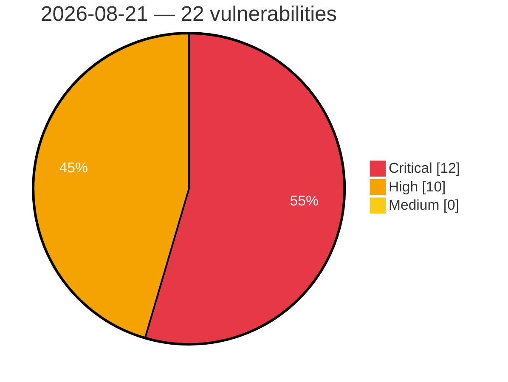

# Critical, High & Medium Severity Vulnerabilities — 2026-08-21

**Source status for this day:**

| Source | Critical | High | Medium | Total |
|--------|---------:|-----:|-------:|------:|
| cvefeed.io (High/Critical) | 12 | 10 | 0 | 22 |

**KEV (actively exploited):** 0  **Watchlist matches:** 18

## Critical (12)

| CVSS | Flags | Source | CVE / Title | Reported |
|------|-------|--------|-------------|----------|
| 9.9 | ⭐ | cvefeed.io (High/Critical) | [CVE-2026-77683 - Comfast CF-N1-S mbox-config system command injection](https://cvefeed.io/vuln/detail/CVE-2026-77683) | 1 hour, 2 minutes ago |
| 9.8 | — | cvefeed.io (High/Critical) | [CVE-2026-77651 - arrayref Supply Chain Compromise](https://cvefeed.io/vuln/detail/CVE-2026-77651) | 23 minutes ago |
| 9.8 | — | cvefeed.io (High/Critical) | [CVE-2026-77650 - append-only-vec Malicious Dependency Arbitrary Code Execution](https://cvefeed.io/vuln/detail/CVE-2026-77650) | 24 minutes ago |
| 9.8 | — | cvefeed.io (High/Critical) | [CVE-2026-77649 - Internment Rust Crate Arbitrary Code Execution Vulnerability](https://cvefeed.io/vuln/detail/CVE-2026-77649) | 26 minutes ago |
| 9.8 | ⭐ | cvefeed.io (High/Critical) | [CVE-2026-77264 - Automation Web Platform <= 4.8.6 - Unauthenticated Authentication Bypass via 'otp_transient' Token Disclosure](https://cvefeed.io/vuln/detail/CVE-2026-77264) | 26 minutes ago |
| 9.8 | ⭐ | cvefeed.io (High/Critical) | [CVE-2026-77806 - SPIP Remote Code Execution Vulnerability](https://cvefeed.io/vuln/detail/CVE-2026-77806) | 42 minutes ago |
| 9.4 | ⭐ | cvefeed.io (High/Critical) | [CVE-2026-76156 - Datiphy Data Management Center - Improper Neutralization of Special Elements used in an OS Command](https://cvefeed.io/vuln/detail/CVE-2026-76156) | 35 minutes ago |
| 9.4 | ⭐ | cvefeed.io (High/Critical) | [CVE-2026-77086 - SiYuan before v3.7.4 Path Traversal via packageName](https://cvefeed.io/vuln/detail/CVE-2026-77086) | 1 hour, 2 minutes ago |
| 9.3 | — | cvefeed.io (High/Critical) | [CVE-2026-76155 - Datiphy Data Management Center - Use of Default Credentials](https://cvefeed.io/vuln/detail/CVE-2026-76155) | 39 minutes ago |
| 9.3 | ⭐ | cvefeed.io (High/Critical) | [CVE-2026-76158 - Datiphy Data Management Center - External Control of File Name or Path](https://cvefeed.io/vuln/detail/CVE-2026-76158) | 1 hour, 3 minutes ago |
| 9.3 | ⭐ | cvefeed.io (High/Critical) | [CVE-2026-77776 - Headroom Proxy Treats the Client-Supplied x-headroom-user-id Header as an Authenticated Identity](https://cvefeed.io/vuln/detail/CVE-2026-77776) | 57 minutes ago |
| 9.2 | ⭐ | cvefeed.io (High/Critical) | [CVE-2026-76613 - Joomla Extension - yootheme.com - Authenticated, privileged SQL injection in YOOtheme Pro 1.0.0-5.0.40](https://cvefeed.io/vuln/detail/CVE-2026-76613) | 1 hour, 1 minute ago |

## High (10)

| CVSS | Flags | Source | CVE / Title | Reported |
|------|-------|--------|-------------|----------|
| 8.8 | ⭐ | cvefeed.io (High/Critical) | [CVE-2026-76157 - Datiphy Data Management Center - Missing Authentication for Critical Function](https://cvefeed.io/vuln/detail/CVE-2026-76157) | 32 minutes ago |
| 8.8 | ⭐ | cvefeed.io (High/Critical) | [CVE-2026-77751 - Path Traversal in MISP Object Template Resolution During STIX Import and Export in misp-stix library](https://cvefeed.io/vuln/detail/CVE-2026-77751) | 40 minutes ago |
| 8.7 | ⭐ | cvefeed.io (High/Critical) | [CVE-2026-16520 - Genians Genian NAC and Genian ZTNA SQL Injection and Authentication Bypass Vulnerability](https://cvefeed.io/vuln/detail/CVE-2026-16520) | 48 minutes ago |
| 8.7 | ⭐ | cvefeed.io (High/Critical) | [CVE-2026-77755 - Denial of Service in MISP-STIX Import via Malformed or Oversized STIX Documents in misp-stix library](https://cvefeed.io/vuln/detail/CVE-2026-77755) | 33 minutes ago |
| 8.7 | ⭐ | cvefeed.io (High/Critical) | [CVE-2026-77759 - IDOR and missing authorization in the Prospero Flow CRM transaction API allow cross-tenant reading of financial records](https://cvefeed.io/vuln/detail/CVE-2026-77759) | 50 minutes ago |
| 8.7 | ⭐ | cvefeed.io (High/Critical) | [CVE-2026-77767 - Reconmap Report Preview Endpoint Is Marked AllowAnonymous, Exposing Every Project and Client Organisation Without Authentication](https://cvefeed.io/vuln/detail/CVE-2026-77767) | 1 hour, 2 minutes ago |
| 8.6 | ⭐ | cvefeed.io (High/Critical) | [CVE-2026-77775 - Headroom Proxy Sends Upstream Requests to a Client-Supplied Base URL Without Address Validation](https://cvefeed.io/vuln/detail/CVE-2026-77775) | 57 minutes ago |
| 8.6 | ⭐ | cvefeed.io (High/Critical) | [CVE-2026-76612 - Joomla Extension - yootheme.com - Unauthenticated stored XSS via user-controlled fields in Zoo < 4.1.66](https://cvefeed.io/vuln/detail/CVE-2026-76612) | 1 hour, 1 minute ago |
| 8.2 | ⭐ | cvefeed.io (High/Critical) | [CVE-2026-75946 - OMEN Gaming Hub – Potential Escalation of Privilege & Information Disclosure](https://cvefeed.io/vuln/detail/CVE-2026-75946) | 29 minutes ago |
| 8.1 | ⭐ | cvefeed.io (High/Critical) | [CVE-2026-18781 - Drag and Drop Multiple File Upload for Contact Form 7 < 1.3.9.9 - Unauthenticated RCE via Control Character Filename Bypass](https://cvefeed.io/vuln/detail/CVE-2026-18781) | 7 hours, 3 minutes ago |
