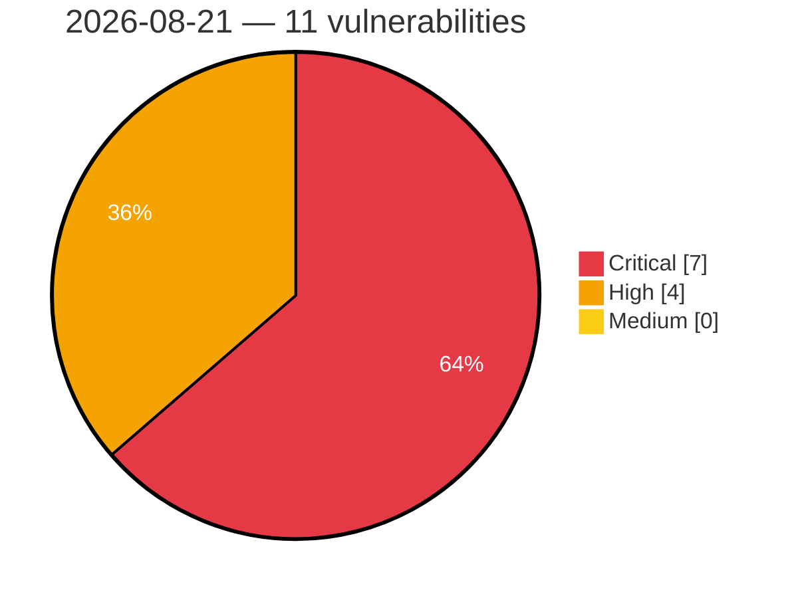

# Critical, High & Medium Severity Vulnerabilities — 2026-08-21

**Source status for this day:**

| Source | Critical | High | Medium | Total |
|--------|---------:|-----:|-------:|------:|
| cvefeed.io (High/Critical) | 7 | 4 | 0 | 11 |

**KEV (actively exploited):** 0  **Watchlist matches:** 7

## Critical (7)

| CVSS | Flags | Source | CVE / Title | Reported |
|------|-------|--------|-------------|----------|
| 9.8 | — | cvefeed.io (High/Critical) | [CVE-2026-77651 - arrayref Supply Chain Compromise](https://cvefeed.io/vuln/detail/CVE-2026-77651) | 23 minutes ago |
| 9.8 | — | cvefeed.io (High/Critical) | [CVE-2026-77650 - append-only-vec Malicious Dependency Arbitrary Code Execution](https://cvefeed.io/vuln/detail/CVE-2026-77650) | 24 minutes ago |
| 9.8 | — | cvefeed.io (High/Critical) | [CVE-2026-77649 - Internment Rust Crate Arbitrary Code Execution Vulnerability](https://cvefeed.io/vuln/detail/CVE-2026-77649) | 26 minutes ago |
| 9.8 | ⭐ | cvefeed.io (High/Critical) | [CVE-2026-77264 - Automation Web Platform <= 4.8.6 - Unauthenticated Authentication Bypass via 'otp_transient' Token Disclosure](https://cvefeed.io/vuln/detail/CVE-2026-77264) | 26 minutes ago |
| 9.4 | ⭐ | cvefeed.io (High/Critical) | [CVE-2026-76156 - Datiphy Data Management Center - Improper Neutralization of Special Elements used in an OS Command](https://cvefeed.io/vuln/detail/CVE-2026-76156) | 35 minutes ago |
| 9.3 | — | cvefeed.io (High/Critical) | [CVE-2026-76155 - Datiphy Data Management Center - Use of Default Credentials](https://cvefeed.io/vuln/detail/CVE-2026-76155) | 39 minutes ago |
| 9.3 | ⭐ | cvefeed.io (High/Critical) | [CVE-2026-76158 - Datiphy Data Management Center - External Control of File Name or Path](https://cvefeed.io/vuln/detail/CVE-2026-76158) | 1 hour, 3 minutes ago |

## High (4)

| CVSS | Flags | Source | CVE / Title | Reported |
|------|-------|--------|-------------|----------|
| 8.8 | ⭐ | cvefeed.io (High/Critical) | [CVE-2026-76157 - Datiphy Data Management Center - Missing Authentication for Critical Function](https://cvefeed.io/vuln/detail/CVE-2026-76157) | 32 minutes ago |
| 8.8 | ⭐ | cvefeed.io (High/Critical) | [CVE-2026-77751 - Path Traversal in MISP Object Template Resolution During STIX Import and Export in misp-stix library](https://cvefeed.io/vuln/detail/CVE-2026-77751) | 40 minutes ago |
| 8.7 | ⭐ | cvefeed.io (High/Critical) | [CVE-2026-16520 - Genians Genian NAC and Genian ZTNA SQL Injection and Authentication Bypass Vulnerability](https://cvefeed.io/vuln/detail/CVE-2026-16520) | 48 minutes ago |
| 8.7 | ⭐ | cvefeed.io (High/Critical) | [CVE-2026-77755 - Denial of Service in MISP-STIX Import via Malformed or Oversized STIX Documents in misp-stix library](https://cvefeed.io/vuln/detail/CVE-2026-77755) | 33 minutes ago |
