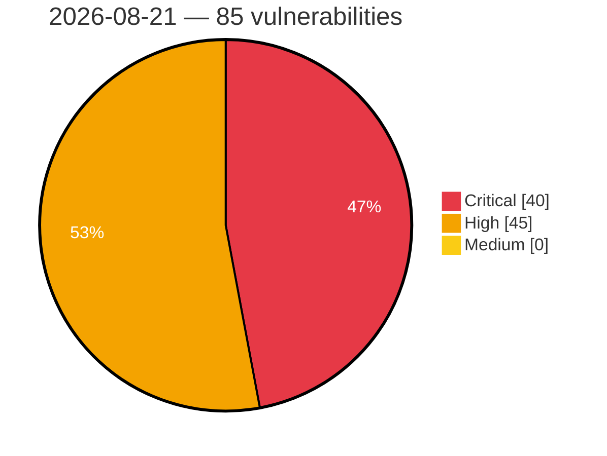

# Critical, High & Medium Severity Vulnerabilities — 2026-08-21

**Source status for this day:**

| Source | Critical | High | Medium | Total |
|--------|---------:|-----:|-------:|------:|
| cvefeed.io (High/Critical) | 40 | 45 | 0 | 85 |

**KEV (actively exploited):** 0  **Watchlist matches:** 61

## Critical (40)

| CVSS | Flags | Source | CVE / Title | Reported |
|------|-------|--------|-------------|----------|
| 10.0 | — | cvefeed.io (High/Critical) | [CVE-2026-69502 - Azure SQL Database Elevation of Privilege Vulnerability](https://cvefeed.io/vuln/detail/CVE-2026-69502) | 16 minutes ago |
| 10.0 | ⭐ | cvefeed.io (High/Critical) | [CVE-2026-61539 - Xinference: Remote code execution via unsafe `eval()` in Llama3 tool-call parsing](https://cvefeed.io/vuln/detail/CVE-2026-61539) | 45 minutes ago |
| 9.9 | ⭐ | cvefeed.io (High/Critical) | [CVE-2026-77683 - Comfast CF-N1-S mbox-config system command injection](https://cvefeed.io/vuln/detail/CVE-2026-77683) | 1 hour, 2 minutes ago |
| 9.9 | ⭐ | cvefeed.io (High/Critical) | [CVE-2026-63343 - Arbitrary File Read/Write: metadata.yaml symlink in image allows host filesystem access as root](https://cvefeed.io/vuln/detail/CVE-2026-63343) | 45 minutes ago |
| 9.9 | ⭐ | cvefeed.io (High/Critical) | [CVE-2026-63125 - Incus vulnerable to root RCE via image backup.yaml symlink](https://cvefeed.io/vuln/detail/CVE-2026-63125) | 45 minutes ago |
| 9.9 | ⭐ | cvefeed.io (High/Critical) | [CVE-2026-62941 - Incus: Cross-project instance copy bypasses target project restrictions via TOCTOU in config merge](https://cvefeed.io/vuln/detail/CVE-2026-62941) | 45 minutes ago |
| 9.9 | ⭐ | cvefeed.io (High/Critical) | [CVE-2026-62940 - Incus has a project restriction bypass via instance migration config override](https://cvefeed.io/vuln/detail/CVE-2026-62940) | 45 minutes ago |
| 9.9 | — | cvefeed.io (High/Critical) | [CVE-2026-62867 - Incus has an argument injection in storage volume block.create_options that leads to arbitrary command execution](https://cvefeed.io/vuln/detail/CVE-2026-62867) | 45 minutes ago |
| 9.9 | — | cvefeed.io (High/Critical) | [CVE-2026-48769 - Incus has an arbitrary file write on its client due to trusted image hash](https://cvefeed.io/vuln/detail/CVE-2026-48769) | 45 minutes ago |
| 9.9 | — | cvefeed.io (High/Critical) | [CVE-2026-48755 - Incus has an argument injection in backup compression algorithm leading to AFW and ACE](https://cvefeed.io/vuln/detail/CVE-2026-48755) | 45 minutes ago |
| 9.9 | ⭐ | cvefeed.io (High/Critical) | [CVE-2026-48753 - Incus has an arbitrary file write via path traversal in S3 multipart upload](https://cvefeed.io/vuln/detail/CVE-2026-48753) | 45 minutes ago |
| 9.9 | — | cvefeed.io (High/Critical) | [CVE-2026-48752 - Incus has arbitrary file read+write on host via templates/ symlink in malicious image](https://cvefeed.io/vuln/detail/CVE-2026-48752) | 45 minutes ago |
| 9.9 | — | cvefeed.io (High/Critical) | [CVE-2026-48751 - Incus has a restricted project bypass leading to arbitrary command execution](https://cvefeed.io/vuln/detail/CVE-2026-48751) | 45 minutes ago |
| 9.9 | — | cvefeed.io (High/Critical) | [CVE-2026-48750 - Incus has an arbitrary file write on host via `exec-output` symlink in crafted image](https://cvefeed.io/vuln/detail/CVE-2026-48750) | 45 minutes ago |
| 9.9 | — | cvefeed.io (High/Critical) | [CVE-2026-48749 - Incus has an arbitrary file read+write on host via rootfs/ symlink in malicious image](https://cvefeed.io/vuln/detail/CVE-2026-48749) | 45 minutes ago |
| 9.9 | ⭐ | cvefeed.io (High/Critical) | [CVE-2026-77810 - Code Injection via Gremlin Query Passthrough in Amazon Athena Neptune Connector](https://cvefeed.io/vuln/detail/CVE-2026-77810) | 46 minutes ago |
| 9.9 | — | cvefeed.io (High/Critical) | [CVE-2026-62283 - Nezha Monitoring: Cross-tenant terminal/file-manager session hijack via WebSocket stream UUID without ownership check](https://cvefeed.io/vuln/detail/CVE-2026-62283) | 45 minutes ago |
| 9.8 | — | cvefeed.io (High/Critical) | [CVE-2026-77651 - arrayref Supply Chain Compromise](https://cvefeed.io/vuln/detail/CVE-2026-77651) | 23 minutes ago |
| 9.8 | — | cvefeed.io (High/Critical) | [CVE-2026-77650 - append-only-vec Malicious Dependency Arbitrary Code Execution](https://cvefeed.io/vuln/detail/CVE-2026-77650) | 24 minutes ago |
| 9.8 | — | cvefeed.io (High/Critical) | [CVE-2026-77649 - Internment Rust Crate Arbitrary Code Execution Vulnerability](https://cvefeed.io/vuln/detail/CVE-2026-77649) | 26 minutes ago |
| 9.8 | ⭐ | cvefeed.io (High/Critical) | [CVE-2026-77264 - Automation Web Platform <= 4.8.6 - Unauthenticated Authentication Bypass via 'otp_transient' Token Disclosure](https://cvefeed.io/vuln/detail/CVE-2026-77264) | 26 minutes ago |
| 9.8 | ⭐ | cvefeed.io (High/Critical) | [CVE-2026-77806 - SPIP Remote Code Execution Vulnerability](https://cvefeed.io/vuln/detail/CVE-2026-77806) | 42 minutes ago |
| 9.8 | ⭐ | cvefeed.io (High/Critical) | [CVE-2026-76904 - GeoTools has unauthenticated SQL injection in the jsonArrayContains filter function against PostGIS layers](https://cvefeed.io/vuln/detail/CVE-2026-76904) | 45 minutes ago |
| 9.6 | ⭐ | cvefeed.io (High/Critical) | [CVE-2026-77087 - Paperclip before 0.3.1 Remote Code Execution via DNS Rebinding](https://cvefeed.io/vuln/detail/CVE-2026-77087) | 45 minutes ago |
| 9.4 | ⭐ | cvefeed.io (High/Critical) | [CVE-2026-76156 - Datiphy Data Management Center - Improper Neutralization of Special Elements used in an OS Command](https://cvefeed.io/vuln/detail/CVE-2026-76156) | 35 minutes ago |
| 9.4 | ⭐ | cvefeed.io (High/Critical) | [CVE-2026-77086 - SiYuan before v3.7.4 Path Traversal via packageName](https://cvefeed.io/vuln/detail/CVE-2026-77086) | 1 hour, 2 minutes ago |
| 9.4 | — | cvefeed.io (High/Critical) | [CVE-2026-77812 - Cleartext Exposure of DJI Drone Wi-Fi Credentials via BLE](https://cvefeed.io/vuln/detail/CVE-2026-77812) | 45 minutes ago |
| 9.3 | — | cvefeed.io (High/Critical) | [CVE-2026-76155 - Datiphy Data Management Center - Use of Default Credentials](https://cvefeed.io/vuln/detail/CVE-2026-76155) | 39 minutes ago |
| 9.3 | ⭐ | cvefeed.io (High/Critical) | [CVE-2026-76158 - Datiphy Data Management Center - External Control of File Name or Path](https://cvefeed.io/vuln/detail/CVE-2026-76158) | 1 hour, 3 minutes ago |
| 9.3 | ⭐ | cvefeed.io (High/Critical) | [CVE-2026-77776 - Headroom Proxy Treats the Client-Supplied x-headroom-user-id Header as an Authenticated Identity](https://cvefeed.io/vuln/detail/CVE-2026-77776) | 57 minutes ago |
| 9.3 | — | cvefeed.io (High/Critical) | [CVE-2026-77234 - Improper input validation in FreeRTOS-Kernel timer command handling](https://cvefeed.io/vuln/detail/CVE-2026-77234) | 40 minutes ago |
| 9.3 | — | cvefeed.io (High/Critical) | [CVE-2026-77415 - JSONata: Arbitrary Code Execution via crafted JSONata expressions](https://cvefeed.io/vuln/detail/CVE-2026-77415) | 45 minutes ago |
| 9.3 | — | cvefeed.io (High/Critical) | [CVE-2026-77414 - JSONata: Arbitrary Code Execution via crafted JSONata expressions](https://cvefeed.io/vuln/detail/CVE-2026-77414) | 45 minutes ago |
| 9.3 | — | cvefeed.io (High/Critical) | [CVE-2026-77413 - JSONata: Arbitrary Code Execution via crafted JSONata expressions](https://cvefeed.io/vuln/detail/CVE-2026-77413) | 45 minutes ago |
| 9.2 | ⭐ | cvefeed.io (High/Critical) | [CVE-2026-76613 - Joomla Extension - yootheme.com - Authenticated, privileged SQL injection in YOOtheme Pro 1.0.0-5.0.40](https://cvefeed.io/vuln/detail/CVE-2026-76613) | 1 hour, 1 minute ago |
| 9.2 | ⭐ | cvefeed.io (High/Critical) | [CVE-2026-39909 - llama.cpp Use-After-Free in RPC GRAPH_RECOMPUTE Handler](https://cvefeed.io/vuln/detail/CVE-2026-39909) | 1 hour, 3 minutes ago |
| 9.2 | ⭐ | cvefeed.io (High/Critical) | [CVE-2026-75932 - Jet Admin tenant isolation failure](https://cvefeed.io/vuln/detail/CVE-2026-75932) | 2 hours, 1 minute ago |
| 9.2 | ⭐ | cvefeed.io (High/Critical) | [CVE-2026-59989 - Phalcon Volt compiler `join` filter compile-time PHP code injection (SSTI lead to RCE)](https://cvefeed.io/vuln/detail/CVE-2026-59989) | 45 minutes ago |
| 9.1 | ⭐ | cvefeed.io (High/Critical) | [CVE-2026-49849 - xShop: Unrestricted File Upload in File Attachment Module in Admin panel leads to Arbitrary Code Execution](https://cvefeed.io/vuln/detail/CVE-2026-49849) | 1 hour, 11 minutes ago |
| 9.0 | ⭐ | cvefeed.io (High/Critical) | [CVE-2026-62674 - Omnigent: Shared Agent Bundle Overwrite Leads to Authenticated Runner RCE](https://cvefeed.io/vuln/detail/CVE-2026-62674) | 1 hour, 5 minutes ago |

## High (45)

| CVSS | Flags | Source | CVE / Title | Reported |
|------|-------|--------|-------------|----------|
| 8.8 | ⭐ | cvefeed.io (High/Critical) | [CVE-2026-76157 - Datiphy Data Management Center - Missing Authentication for Critical Function](https://cvefeed.io/vuln/detail/CVE-2026-76157) | 32 minutes ago |
| 8.8 | ⭐ | cvefeed.io (High/Critical) | [CVE-2026-77751 - Path Traversal in MISP Object Template Resolution During STIX Import and Export in misp-stix library](https://cvefeed.io/vuln/detail/CVE-2026-77751) | 40 minutes ago |
| 8.8 | ⭐ | cvefeed.io (High/Critical) | [CVE-2026-62677 - Omnigent: Unvalidated os_env.cwd in agent bundle yields arbitrary host filesystem access on runners without OMNIGENT_RUNNER_WORKSPACE](https://cvefeed.io/vuln/detail/CVE-2026-62677) | 1 hour, 5 minutes ago |
| 8.8 | ⭐ | cvefeed.io (High/Critical) | [CVE-2026-62675 - Omnigent: Uploaded Agent Bundle Allows Authenticated Runner RCE via Python Callable Tools](https://cvefeed.io/vuln/detail/CVE-2026-62675) | 1 hour, 5 minutes ago |
| 8.8 | ⭐ | cvefeed.io (High/Critical) | [CVE-2026-62316 - Microsoft UFO: DNS Rebinding → Unauthenticated File Read / Command Execution](https://cvefeed.io/vuln/detail/CVE-2026-62316) | 45 minutes ago |
| 8.8 | ⭐ | cvefeed.io (High/Critical) | [CVE-2026-50538 - libvncclient Tight decoder has an attacker-controlled heap out-of-bounds write](https://cvefeed.io/vuln/detail/CVE-2026-50538) | 45 minutes ago |
| 8.8 | ⭐ | cvefeed.io (High/Critical) | [CVE-2026-53528 - FileWiki has path traversal in RenameAsset via unsanitized oldFilename parameter](https://cvefeed.io/vuln/detail/CVE-2026-53528) | 1 hour, 11 minutes ago |
| 8.8 | ⭐ | cvefeed.io (High/Critical) | [CVE-2026-53527 - LeafWiki Vulnerable to Privilege Escalation via User Self-Service Update](https://cvefeed.io/vuln/detail/CVE-2026-53527) | 1 hour, 11 minutes ago |
| 8.8 | ⭐ | cvefeed.io (High/Critical) | [CVE-2026-33240 - Combodo iTop: Reflected XSS in foreign key search criteria](https://cvefeed.io/vuln/detail/CVE-2026-33240) | 1 hour, 11 minutes ago |
| 8.8 | — | cvefeed.io (High/Critical) | [CVE-2026-31936 - Combodo iTop: Unauthorized access to object information via search operation](https://cvefeed.io/vuln/detail/CVE-2026-31936) | 1 hour, 11 minutes ago |
| 8.7 | ⭐ | cvefeed.io (High/Critical) | [CVE-2026-16520 - Genians Genian NAC and Genian ZTNA SQL Injection and Authentication Bypass Vulnerability](https://cvefeed.io/vuln/detail/CVE-2026-16520) | 48 minutes ago |
| 8.7 | ⭐ | cvefeed.io (High/Critical) | [CVE-2026-77755 - Denial of Service in MISP-STIX Import via Malformed or Oversized STIX Documents in misp-stix library](https://cvefeed.io/vuln/detail/CVE-2026-77755) | 33 minutes ago |
| 8.7 | ⭐ | cvefeed.io (High/Critical) | [CVE-2026-77759 - IDOR and missing authorization in the Prospero Flow CRM transaction API allow cross-tenant reading of financial records](https://cvefeed.io/vuln/detail/CVE-2026-77759) | 50 minutes ago |
| 8.7 | ⭐ | cvefeed.io (High/Critical) | [CVE-2026-77767 - Reconmap Report Preview Endpoint Is Marked AllowAnonymous, Exposing Every Project and Client Organisation Without Authentication](https://cvefeed.io/vuln/detail/CVE-2026-77767) | 1 hour, 2 minutes ago |
| 8.7 | ⭐ | cvefeed.io (High/Critical) | [CVE-2026-77815 - Infinite Image Browsing Resolves Paths With normpath, Allowing Symlink Escape From Scanned Directories](https://cvefeed.io/vuln/detail/CVE-2026-77815) | 45 minutes ago |
| 8.7 | ⭐ | cvefeed.io (High/Critical) | [CVE-2026-77814 - Infinite Image Browsing is_path_trusted Prefix Comparison Omits the Trailing Path Separator](https://cvefeed.io/vuln/detail/CVE-2026-77814) | 45 minutes ago |
| 8.7 | ⭐ | cvefeed.io (High/Critical) | [CVE-2026-67359 - Joomla Extension - j2commerce.com - Order content disclosure J2Store 1.0.0-3.3.20, 4.0.0-4.0.20, 4.1.0-4.1.5](https://cvefeed.io/vuln/detail/CVE-2026-67359) | 1 hour, 1 minute ago |
| 8.7 | — | cvefeed.io (High/Critical) | [CVE-2026-50288 - @asymmetric-effort/specifyjs: URL parse failure silently allows request](https://cvefeed.io/vuln/detail/CVE-2026-50288) | 27 minutes ago |
| 8.7 | ⭐ | cvefeed.io (High/Critical) | [CVE-2026-77811 - Stored Cross-Site Scripting via Integration Template Asset in OpenSearch Dashboards](https://cvefeed.io/vuln/detail/CVE-2026-77811) | 35 minutes ago |
| 8.7 | ⭐ | cvefeed.io (High/Critical) | [CVE-2026-77354 - kin-openapi: Uncontrolled resource consumption in openapi3filter deepObject query parameter decoding](https://cvefeed.io/vuln/detail/CVE-2026-77354) | 45 minutes ago |
| 8.7 | — | cvefeed.io (High/Critical) | [CVE-2026-53530 - ratex-parser panics on `\verb` with a multibyte delimiter (UTF-8 byte-boundary slice)](https://cvefeed.io/vuln/detail/CVE-2026-53530) | 1 hour, 11 minutes ago |
| 8.6 | ⭐ | cvefeed.io (High/Critical) | [CVE-2026-77775 - Headroom Proxy Sends Upstream Requests to a Client-Supplied Base URL Without Address Validation](https://cvefeed.io/vuln/detail/CVE-2026-77775) | 57 minutes ago |
| 8.6 | ⭐ | cvefeed.io (High/Critical) | [CVE-2026-76612 - Joomla Extension - yootheme.com - Unauthenticated stored XSS via user-controlled fields in Zoo < 4.1.66](https://cvefeed.io/vuln/detail/CVE-2026-76612) | 1 hour, 1 minute ago |
| 8.6 | ⭐ | cvefeed.io (High/Critical) | [CVE-2026-74252 - Joomla Extension - j2commerce.com - Stored XSS in Guest checkout in J2Store 1.0.0-3.3.20, 4.0.0-4.0.20, 4.1.0-4.1.5](https://cvefeed.io/vuln/detail/CVE-2026-74252) | 59 minutes ago |
| 8.6 | ⭐ | cvefeed.io (High/Critical) | [CVE-2026-34741 - Combodo iTop: Authentication bypass in exec.php allows PHP file execution](https://cvefeed.io/vuln/detail/CVE-2026-34741) | 1 hour, 11 minutes ago |
| 8.5 | ⭐ | cvefeed.io (High/Critical) | [CVE-2026-22681 - OpenViking < 0.3.4 SSRF via /api/v1/resources](https://cvefeed.io/vuln/detail/CVE-2026-22681) | 7 minutes ago |
| 8.5 | ⭐ | cvefeed.io (High/Critical) | [CVE-2026-41451 - UAC < 3.3.0 Command Injection via User Substitution in parse_artifact.sh](https://cvefeed.io/vuln/detail/CVE-2026-41451) | 44 minutes ago |
| 8.5 | ⭐ | cvefeed.io (High/Critical) | [CVE-2026-41450 - UAC < 3.3.0 Command Injection via command_collector.sh](https://cvefeed.io/vuln/detail/CVE-2026-41450) | 45 minutes ago |
| 8.5 | ⭐ | cvefeed.io (High/Critical) | [CVE-2026-41449 - UAC < 3.3.0 Command Injection via run_command.sh](https://cvefeed.io/vuln/detail/CVE-2026-41449) | 46 minutes ago |
| 8.5 | ⭐ | cvefeed.io (High/Critical) | [CVE-2026-17250 - Authenticated Remote Code Execution via Stack-Based Buffer Overflow in Firmware Update Handling](https://cvefeed.io/vuln/detail/CVE-2026-17250) | 1 hour, 3 minutes ago |
| 8.5 | ⭐ | cvefeed.io (High/Critical) | [CVE-2026-75933 - Jet Admin Stored XSS](https://cvefeed.io/vuln/detail/CVE-2026-75933) | 2 hours, 1 minute ago |
| 8.3 | — | cvefeed.io (High/Critical) | [CVE-2026-77236 - Missing size validation in SecureContext_AllocateContext in FreeRTOS-Kernel](https://cvefeed.io/vuln/detail/CVE-2026-77236) | 32 minutes ago |
| 8.3 | — | cvefeed.io (High/Critical) | [CVE-2026-77235 - Missing privilege check in SecureContext_FreeContext in FreeRTOS-Kernel](https://cvefeed.io/vuln/detail/CVE-2026-77235) | 37 minutes ago |
| 8.2 | ⭐ | cvefeed.io (High/Critical) | [CVE-2026-75946 - OMEN Gaming Hub – Potential Escalation of Privilege & Information Disclosure](https://cvefeed.io/vuln/detail/CVE-2026-75946) | 29 minutes ago |
| 8.2 | — | cvefeed.io (High/Critical) | [CVE-2026-77237 - Missing type validation in xQueueAddToSet in FreeRTOS-Kernel](https://cvefeed.io/vuln/detail/CVE-2026-77237) | 27 minutes ago |
| 8.2 | ⭐ | cvefeed.io (High/Critical) | [CVE-2026-76876 - Craftplan < 0.5.1 Broken Access Control Information Disclosure via Settings API](https://cvefeed.io/vuln/detail/CVE-2026-76876) | 41 minutes ago |
| 8.2 | ⭐ | cvefeed.io (High/Critical) | [CVE-2026-54682 - DiscordChatExporter: Stored XSS in HTML export when markdown formatting is disabled](https://cvefeed.io/vuln/detail/CVE-2026-54682) | 1 hour, 3 minutes ago |
| 8.2 | ⭐ | cvefeed.io (High/Critical) | [CVE-2026-63135 - YOURLS: Stored XSS in referrer statistics chart via crafted Referer header](https://cvefeed.io/vuln/detail/CVE-2026-63135) | 45 minutes ago |
| 8.2 | ⭐ | cvefeed.io (High/Critical) | [CVE-2026-61824 - Defuddle:  XSS via unescaped attribute interpolation in site extractors](https://cvefeed.io/vuln/detail/CVE-2026-61824) | 45 minutes ago |
| 8.1 | ⭐ | cvefeed.io (High/Critical) | [CVE-2026-18781 - Drag and Drop Multiple File Upload for Contact Form 7 < 1.3.9.9 - Unauthenticated RCE via Control Character Filename Bypass](https://cvefeed.io/vuln/detail/CVE-2026-18781) | 7 hours, 3 minutes ago |
| 8.1 | ⭐ | cvefeed.io (High/Critical) | [CVE-2026-64679 - Atlantis: Path Traversal in Atlantis Workspace Handling Allows Out-of-Bounds Directory Deletion/Creation](https://cvefeed.io/vuln/detail/CVE-2026-64679) | 45 minutes ago |
| 8.0 | ⭐ | cvefeed.io (High/Critical) | [CVE-2026-31880 - Combodo iTop: Reflected XSS in universal search](https://cvefeed.io/vuln/detail/CVE-2026-31880) | 45 minutes ago |
| 8.0 | ⭐ | cvefeed.io (High/Critical) | [CVE-2026-31803 - Combodo iTop: Reflected XSS in tag admin](https://cvefeed.io/vuln/detail/CVE-2026-31803) | 45 minutes ago |
| 8.0 | ⭐ | cvefeed.io (High/Critical) | [CVE-2026-30890 - Combodo iTop: Reflected XSS in synchro/synchro_import.php](https://cvefeed.io/vuln/detail/CVE-2026-30890) | 45 minutes ago |
| 8.0 | ⭐ | cvefeed.io (High/Critical) | [CVE-2026-30826 - Combodo iTop: Reflected XSS in run_query.php](https://cvefeed.io/vuln/detail/CVE-2026-30826) | 45 minutes ago |
