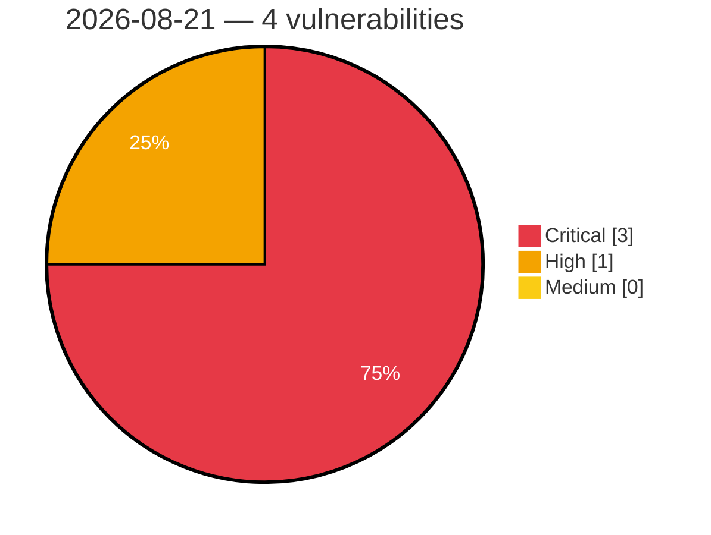

# Critical, High & Medium Severity Vulnerabilities — 2026-08-21

**Source status for this day:**

| Source | Critical | High | Medium | Total |
|--------|---------:|-----:|-------:|------:|
| cvefeed.io (High/Critical) | 3 | 1 | 0 | 4 |

**KEV (actively exploited):** 0  **Watchlist matches:** 1

## Critical (3)

| CVSS | Flags | Source | CVE / Title | Reported |
|------|-------|--------|-------------|----------|
| 9.8 | — | cvefeed.io (High/Critical) | [CVE-2026-77651 - arrayref Supply Chain Compromise](https://cvefeed.io/vuln/detail/CVE-2026-77651) | 23 minutes ago |
| 9.8 | — | cvefeed.io (High/Critical) | [CVE-2026-77650 - append-only-vec Malicious Dependency Arbitrary Code Execution](https://cvefeed.io/vuln/detail/CVE-2026-77650) | 24 minutes ago |
| 9.8 | — | cvefeed.io (High/Critical) | [CVE-2026-77649 - Internment Rust Crate Arbitrary Code Execution Vulnerability](https://cvefeed.io/vuln/detail/CVE-2026-77649) | 26 minutes ago |

## High (1)

| CVSS | Flags | Source | CVE / Title | Reported |
|------|-------|--------|-------------|----------|
| 8.7 | ⭐ | cvefeed.io (High/Critical) | [CVE-2026-16520 - Genians Genian NAC and Genian ZTNA SQL Injection and Authentication Bypass Vulnerability](https://cvefeed.io/vuln/detail/CVE-2026-16520) | 48 minutes ago |
