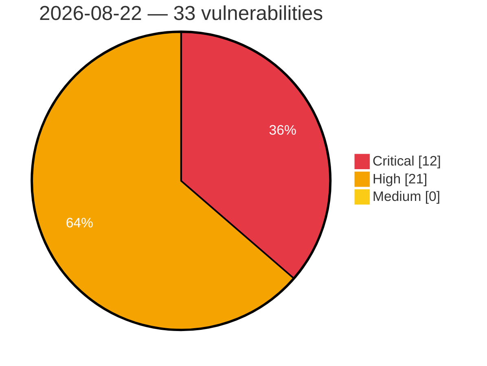

# Critical, High & Medium Severity Vulnerabilities — 2026-08-22

**Source status for this day:**

| Source | Critical | High | Medium | Total |
|--------|---------:|-----:|-------:|------:|
| cvefeed.io (High/Critical) | 12 | 21 | 0 | 33 |

**KEV (actively exploited):** 0  **Watchlist matches:** 20

## Critical (12)

| CVSS | Flags | Source | CVE / Title | Reported |
|------|-------|--------|-------------|----------|
| 10.0 | — | cvefeed.io (High/Critical) | [CVE-2026-77946 - TRENDnet TEW-821DAP NTP Timezone Configuration apply_time.cgi uci_safe_get stack-based overflow](https://cvefeed.io/vuln/detail/CVE-2026-77946) | 1 hour, 3 minutes ago |
| 10.0 | — | cvefeed.io (High/Critical) | [CVE-2026-76607 - Joomla Extension - fabrikar.com - Missing ACL check in download element in Fabrik < 4.7.3](https://cvefeed.io/vuln/detail/CVE-2026-76607) | 25 minutes ago |
| 10.0 | ⭐ | cvefeed.io (High/Critical) | [CVE-2026-76606 - Joomla Extension - fabrikar.com - Path Traversal via image element in Fabrik < 4.7.3](https://cvefeed.io/vuln/detail/CVE-2026-76606) | 25 minutes ago |
| 10.0 | ⭐ | cvefeed.io (High/Critical) | [CVE-2026-76605 - Joomla Extension - fabrikar.com - Remote code execution via image element in Fabrik < 4.7.3](https://cvefeed.io/vuln/detail/CVE-2026-76605) | 25 minutes ago |
| 10.0 | ⭐ | cvefeed.io (High/Critical) | [CVE-2026-76604 - Joomla Extension - fabrikar.com - Unauthenticated remote code execution via PHP form element in Fabrik < 4.7.3](https://cvefeed.io/vuln/detail/CVE-2026-76604) | 25 minutes ago |
| 9.8 | ⭐ | cvefeed.io (High/Critical) | [CVE-2026-78003 - Mailgun for WordPress <= 2.2.0 - Unauthenticated Server-Side Request Forgery (SSRF) via 'addresses' Array Keys](https://cvefeed.io/vuln/detail/CVE-2026-78003) | 45 minutes ago |
| 9.8 | ⭐ | cvefeed.io (High/Critical) | [CVE-2026-4703 - WS Form LITE <= 1.10.80 - Unauthenticated PHP Object Injection via Form Submission](https://cvefeed.io/vuln/detail/CVE-2026-4703) | 2 hours, 4 minutes ago |
| 9.5 | — | cvefeed.io (High/Critical) | [CVE-2026-77992 - Joomla Extension - fabrikar.com - heredoc terminator breakout in the calc element in Fabrik < 4.7.2](https://cvefeed.io/vuln/detail/CVE-2026-77992) | 25 minutes ago |
| 9.3 | ⭐ | cvefeed.io (High/Critical) | [CVE-2026-12710 - Missing Authorization in Application Integration QueryEngineTask](https://cvefeed.io/vuln/detail/CVE-2026-12710) | 1 hour, 10 minutes ago |
| 9.3 | ⭐ | cvefeed.io (High/Critical) | [CVE-2026-76602 - Joomla Extension - fabrikar.com - Unauthenticated SQL injection in ORDER BY in Fabrik < 4.7.3](https://cvefeed.io/vuln/detail/CVE-2026-76602) | 25 minutes ago |
| 9.3 | ⭐ | cvefeed.io (High/Critical) | [CVE-2026-76571 - Joomla Extension - fabrikar.com - Unauthenticated SQL injection in list filter condition parameter in Fabrik < 4.7.3](https://cvefeed.io/vuln/detail/CVE-2026-76571) | 25 minutes ago |
| 9.3 | — | cvefeed.io (High/Critical) | [CVE-2026-63310 - NLTK before 3.9.3 Missing Post-Download Integrity Verification](https://cvefeed.io/vuln/detail/CVE-2026-63310) | 25 minutes ago |

## High (21)

| CVSS | Flags | Source | CVE / Title | Reported |
|------|-------|--------|-------------|----------|
| 8.8 | ⭐ | cvefeed.io (High/Critical) | [CVE-2026-19883 - WPeMatico RSS Feed Fetcher <= 2.8.24 - Authenticated (Subscriber+) Privilege Escalation via Arbitrary Option Update to wpematico_import_settings admin_action](https://cvefeed.io/vuln/detail/CVE-2026-19883) | 45 minutes ago |
| 8.8 | ⭐ | cvefeed.io (High/Critical) | [CVE-2026-71513 - NLTK 3.10.0 through 3.10.2 Remote Code Execution via AllowlistUnpickler Dotted-Name Bypass](https://cvefeed.io/vuln/detail/CVE-2026-71513) | 28 minutes ago |
| 8.8 | ⭐ | cvefeed.io (High/Critical) | [CVE-2026-59808 - AVideo Authentication Bypass via Unkeyed Video Hash Disclosure](https://cvefeed.io/vuln/detail/CVE-2026-59808) | 45 minutes ago |
| 8.7 | — | cvefeed.io (High/Critical) | [CVE-2026-62243 - Netty 4.2.0 through 4.2.16 TLS Hostname Verification Bypass](https://cvefeed.io/vuln/detail/CVE-2026-62243) | 45 minutes ago |
| 8.7 | ⭐ | cvefeed.io (High/Critical) | [CVE-2026-60084 - SiYuan before v3.7.4 Arbitrary File Deletion via removeTemplate](https://cvefeed.io/vuln/detail/CVE-2026-60084) | 45 minutes ago |
| 8.7 | — | cvefeed.io (High/Critical) | [CVE-2026-59256 - WWBN AVideo Unbound Token Authorization Bypass via Gallery](https://cvefeed.io/vuln/detail/CVE-2026-59256) | 45 minutes ago |
| 8.7 | — | cvefeed.io (High/Critical) | [CVE-2026-76599 - Joomla Extension - fabrikar.com - Unauthenticated database table list and table-prefix disclosure in Fabrik < 4.7.2](https://cvefeed.io/vuln/detail/CVE-2026-76599) | 25 minutes ago |
| 8.7 | — | cvefeed.io (High/Critical) | [CVE-2026-76598 - Joomla Extension - fabrikar.com - Unauthenticated arbitrary directory listing via onAjax_getFolders in Fabrik < 4.7.2](https://cvefeed.io/vuln/detail/CVE-2026-76598) | 25 minutes ago |
| 8.7 | ⭐ | cvefeed.io (High/Critical) | [CVE-2026-76597 - Joomla Extension - fabrikar.com - Unauthenticated arbitrary file upload to web root via list email plugin in Fabrik < 4.7.2](https://cvefeed.io/vuln/detail/CVE-2026-76597) | 25 minutes ago |
| 8.7 | — | cvefeed.io (High/Critical) | [CVE-2026-76596 - Joomla Extension - fabrikar.com - Unauthenticated table truncation via list.doempty in Fabrik < 4.7.2](https://cvefeed.io/vuln/detail/CVE-2026-76596) | 25 minutes ago |
| 8.7 | — | cvefeed.io (High/Critical) | [CVE-2026-66393 - NLTK before 3.9.4 Denial of Service via JSONTaggedDecoder](https://cvefeed.io/vuln/detail/CVE-2026-66393) | 25 minutes ago |
| 8.7 | ⭐ | cvefeed.io (High/Critical) | [CVE-2026-63312 - NLTK StreamBackedCorpusView Bypasses pathsec.ENFORCE Arbitrary File Read](https://cvefeed.io/vuln/detail/CVE-2026-63312) | 25 minutes ago |
| 8.7 | ⭐ | cvefeed.io (High/Critical) | [CVE-2026-62388 - NLTK before 3.10.0 Insecure Default Configuration pathsec](https://cvefeed.io/vuln/detail/CVE-2026-62388) | 25 minutes ago |
| 8.7 | — | cvefeed.io (High/Critical) | [CVE-2026-62384 - NLTK FramenetCorpusReader Symlink Sandbox Bypass before 3.10.2](https://cvefeed.io/vuln/detail/CVE-2026-62384) | 25 minutes ago |
| 8.6 | ⭐ | cvefeed.io (High/Critical) | [CVE-2026-66917 - Joomla Extension - joomgalleryfriends.net - Stored XSS in JoomGallery < 4.4.0](https://cvefeed.io/vuln/detail/CVE-2026-66917) | 1 hour, 8 minutes ago |
| 8.6 | ⭐ | cvefeed.io (High/Critical) | [CVE-2026-77027 - Joomla Extension - fabrikar.com - Unauthenticated stored XSS in Fabrik < 4.7.2](https://cvefeed.io/vuln/detail/CVE-2026-77027) | 25 minutes ago |
| 8.6 | — | cvefeed.io (High/Critical) | [CVE-2026-70626 - NLTK before 3.9.4 Symlink Escape via CorpusReader](https://cvefeed.io/vuln/detail/CVE-2026-70626) | 25 minutes ago |
| 8.5 | ⭐ | cvefeed.io (High/Critical) | [CVE-2026-57998 - better-npm-audit OS Command Injection via registry flag](https://cvefeed.io/vuln/detail/CVE-2026-57998) | 45 minutes ago |
| 8.5 | — | cvefeed.io (High/Critical) | [CVE-2026-68766 - hashcat through 7.1.2 Arbitrary File Write via Restore File Option Injection](https://cvefeed.io/vuln/detail/CVE-2026-68766) | 25 minutes ago |
| 8.3 | ⭐ | cvefeed.io (High/Critical) | [CVE-2026-78122 - docker-socket-proxy through 0.5.0 Insufficient Access Control Granularity Exposes Container Filesystems](https://cvefeed.io/vuln/detail/CVE-2026-78122) | 46 minutes ago |
| 8.2 | ⭐ | cvefeed.io (High/Critical) | [CVE-2026-62385 - NLTK 3.9.4 Path Traversal via FrameNet and NKJP Readers](https://cvefeed.io/vuln/detail/CVE-2026-62385) | 25 minutes ago |
