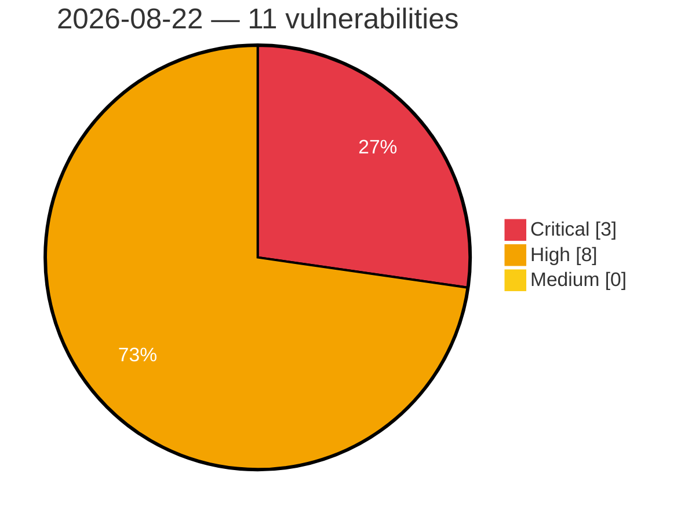

# Critical, High & Medium Severity Vulnerabilities — 2026-08-22

**Source status for this day:**

| Source | Critical | High | Medium | Total |
|--------|---------:|-----:|-------:|------:|
| cvefeed.io (High/Critical) | 3 | 8 | 0 | 11 |

**KEV (actively exploited):** 0  **Watchlist matches:** 8

## Critical (3)

| CVSS | Flags | Source | CVE / Title | Reported |
|------|-------|--------|-------------|----------|
| 10.0 | — | cvefeed.io (High/Critical) | [CVE-2026-77946 - TRENDnet TEW-821DAP NTP Timezone Configuration apply_time.cgi uci_safe_get stack-based overflow](https://cvefeed.io/vuln/detail/CVE-2026-77946) | 1 hour, 3 minutes ago |
| 9.8 | ⭐ | cvefeed.io (High/Critical) | [CVE-2026-78003 - Mailgun for WordPress <= 2.2.0 - Unauthenticated Server-Side Request Forgery (SSRF) via 'addresses' Array Keys](https://cvefeed.io/vuln/detail/CVE-2026-78003) | 45 minutes ago |
| 9.3 | ⭐ | cvefeed.io (High/Critical) | [CVE-2026-12710 - Missing Authorization in Application Integration QueryEngineTask](https://cvefeed.io/vuln/detail/CVE-2026-12710) | 1 hour, 10 minutes ago |

## High (8)

| CVSS | Flags | Source | CVE / Title | Reported |
|------|-------|--------|-------------|----------|
| 8.8 | ⭐ | cvefeed.io (High/Critical) | [CVE-2026-19883 - WPeMatico RSS Feed Fetcher <= 2.8.24 - Authenticated (Subscriber+) Privilege Escalation via Arbitrary Option Update to wpematico_import_settings admin_action](https://cvefeed.io/vuln/detail/CVE-2026-19883) | 45 minutes ago |
| 8.8 | ⭐ | cvefeed.io (High/Critical) | [CVE-2026-71513 - NLTK 3.10.0 through 3.10.2 Remote Code Execution via AllowlistUnpickler Dotted-Name Bypass](https://cvefeed.io/vuln/detail/CVE-2026-71513) | 28 minutes ago |
| 8.8 | ⭐ | cvefeed.io (High/Critical) | [CVE-2026-59808 - AVideo Authentication Bypass via Unkeyed Video Hash Disclosure](https://cvefeed.io/vuln/detail/CVE-2026-59808) | 45 minutes ago |
| 8.7 | — | cvefeed.io (High/Critical) | [CVE-2026-62243 - Netty 4.2.0 through 4.2.16 TLS Hostname Verification Bypass](https://cvefeed.io/vuln/detail/CVE-2026-62243) | 45 minutes ago |
| 8.7 | ⭐ | cvefeed.io (High/Critical) | [CVE-2026-60084 - SiYuan before v3.7.4 Arbitrary File Deletion via removeTemplate](https://cvefeed.io/vuln/detail/CVE-2026-60084) | 45 minutes ago |
| 8.7 | — | cvefeed.io (High/Critical) | [CVE-2026-59256 - WWBN AVideo Unbound Token Authorization Bypass via Gallery](https://cvefeed.io/vuln/detail/CVE-2026-59256) | 45 minutes ago |
| 8.6 | ⭐ | cvefeed.io (High/Critical) | [CVE-2026-66917 - Joomla Extension - joomgalleryfriends.net - Stored XSS in JoomGallery < 4.4.0](https://cvefeed.io/vuln/detail/CVE-2026-66917) | 1 hour, 8 minutes ago |
| 8.5 | ⭐ | cvefeed.io (High/Critical) | [CVE-2026-57998 - better-npm-audit OS Command Injection via registry flag](https://cvefeed.io/vuln/detail/CVE-2026-57998) | 45 minutes ago |
