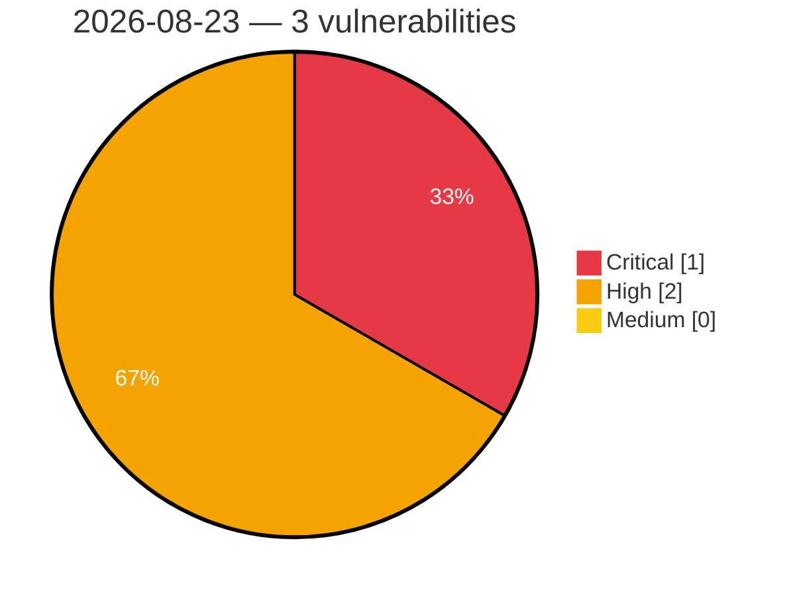

# Critical, High & Medium Severity Vulnerabilities — 2026-08-23

**Source status for this day:**

| Source | Critical | High | Medium | Total |
|--------|---------:|-----:|-------:|------:|
| cvefeed.io (High/Critical) | 1 | 2 | 0 | 3 |

**KEV (actively exploited):** 0  **Watchlist matches:** 2

## Critical (1)

| CVSS | Flags | Source | CVE / Title | Reported |
|------|-------|--------|-------------|----------|
| 9.9 | — | cvefeed.io (High/Critical) | [CVE-2026-78050 - Comfast CF-N1-S Web Management mbox-config sub_41AD7C stack-based overflow](https://cvefeed.io/vuln/detail/CVE-2026-78050) | 1 hour, 35 minutes ago |

## High (2)

| CVSS | Flags | Source | CVE / Title | Reported |
|------|-------|--------|-------------|----------|
| 8.8 | ⭐ | cvefeed.io (High/Critical) | [CVE-2026-16149 - Security Hardener <= 2.4.4 - Authenticated (Subscriber+) Privilege Escalation via REST API '/wp/v2/users' permission_callback Overwrite](https://cvefeed.io/vuln/detail/CVE-2026-16149) | 1 hour, 35 minutes ago |
| 8.8 | ⭐ | cvefeed.io (High/Critical) | [CVE-2026-0551 - PPWP – Password Protect Pages <= 1.9.18 - Authenticated (Contributor+) PHP Object Injection via post_protection_roles](https://cvefeed.io/vuln/detail/CVE-2026-0551) | 1 hour, 35 minutes ago |
