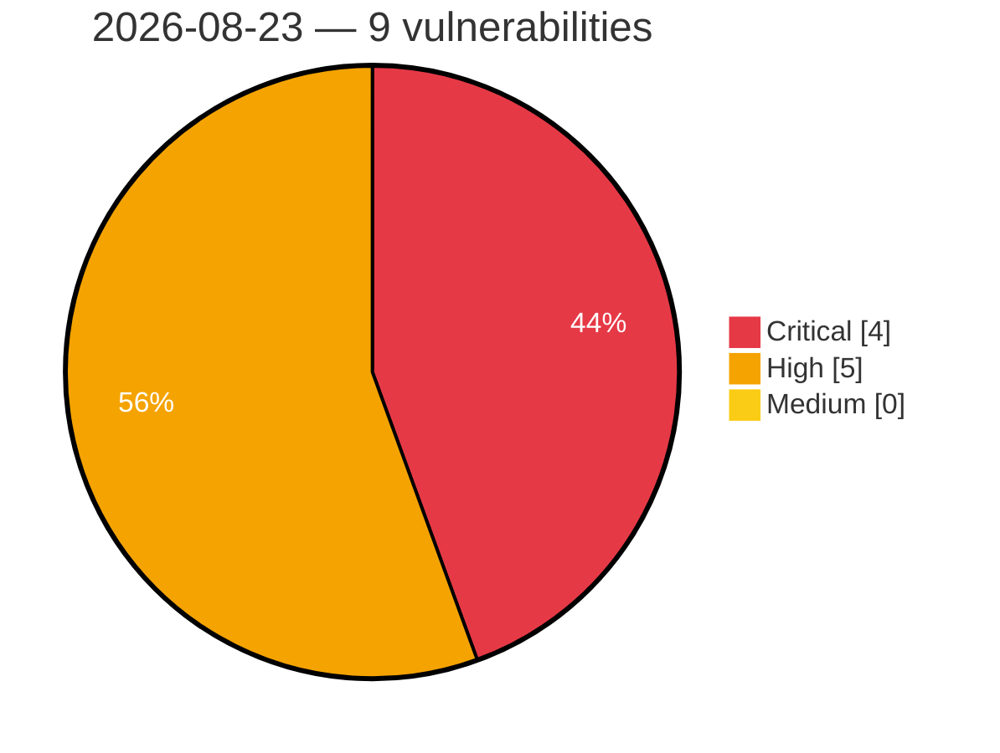

# Critical, High & Medium Severity Vulnerabilities — 2026-08-23

**Source status for this day:**

| Source | Critical | High | Medium | Total |
|--------|---------:|-----:|-------:|------:|
| cvefeed.io (High/Critical) | 4 | 5 | 0 | 9 |

**KEV (actively exploited):** 0  **Watchlist matches:** 6

## Critical (4)

| CVSS | Flags | Source | CVE / Title | Reported |
|------|-------|--------|-------------|----------|
| 9.9 | — | cvefeed.io (High/Critical) | [CVE-2026-78050 - Comfast CF-N1-S Web Management mbox-config sub_41AD7C stack-based overflow](https://cvefeed.io/vuln/detail/CVE-2026-78050) | 1 hour, 35 minutes ago |
| 9.9 | ⭐ | cvefeed.io (High/Critical) | [CVE-2026-78155 - Untrusted Search Path in StackGres](https://cvefeed.io/vuln/detail/CVE-2026-78155) | 54 minutes ago |
| 9.8 | ⭐ | cvefeed.io (High/Critical) | [CVE-2026-8445 - justhtml before 1.12.0 Sanitizer Bypass via Markdown](https://cvefeed.io/vuln/detail/CVE-2026-8445) | 31 minutes ago |
| 9.8 | ⭐ | cvefeed.io (High/Critical) | [CVE-2026-7808 - justhtml before 1.16.0 Multiple Security Issues via Sanitization](https://cvefeed.io/vuln/detail/CVE-2026-7808) | 31 minutes ago |

## High (5)

| CVSS | Flags | Source | CVE / Title | Reported |
|------|-------|--------|-------------|----------|
| 8.8 | ⭐ | cvefeed.io (High/Critical) | [CVE-2026-16149 - Security Hardener <= 2.4.4 - Authenticated (Subscriber+) Privilege Escalation via REST API '/wp/v2/users' permission_callback Overwrite](https://cvefeed.io/vuln/detail/CVE-2026-16149) | 1 hour, 35 minutes ago |
| 8.8 | ⭐ | cvefeed.io (High/Critical) | [CVE-2026-0551 - PPWP – Password Protect Pages <= 1.9.18 - Authenticated (Contributor+) PHP Object Injection via post_protection_roles](https://cvefeed.io/vuln/detail/CVE-2026-0551) | 1 hour, 35 minutes ago |
| 8.7 | — | cvefeed.io (High/Critical) | [CVE-2026-9769 - justhtml before 1.10.0 Denial of Service via deeply nested HTML](https://cvefeed.io/vuln/detail/CVE-2026-9769) | 31 minutes ago |
| 8.7 | — | cvefeed.io (High/Critical) | [CVE-2026-4671 - justhtml before 1.18.0 Denial of Service via CSS Selector](https://cvefeed.io/vuln/detail/CVE-2026-4671) | 31 minutes ago |
| 8.5 | ⭐ | cvefeed.io (High/Critical) | [CVE-2026-10053 - Improper Limitation of a Pathname to a Restricted Directory ('Path Traversal') in GitLab](https://cvefeed.io/vuln/detail/CVE-2026-10053) | 54 minutes ago |
