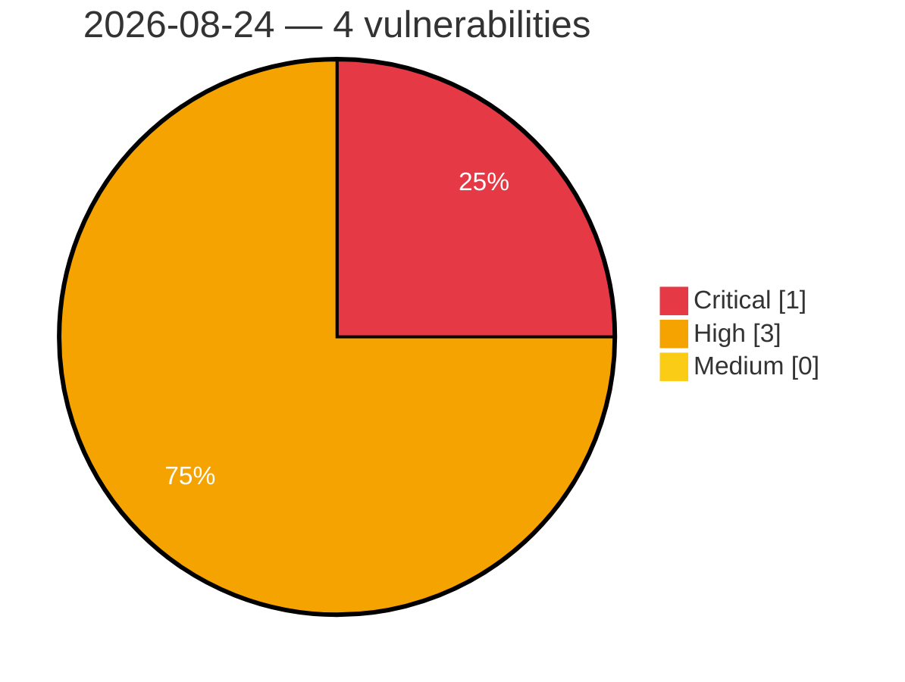

# Critical, High & Medium Severity Vulnerabilities — 2026-08-24

**Source status for this day:**

| Source | Critical | High | Medium | Total |
|--------|---------:|-----:|-------:|------:|
| cvefeed.io (High/Critical) | 1 | 3 | 0 | 4 |

**KEV (actively exploited):** 0  **Watchlist matches:** 2

## Critical (1)

| CVSS | Flags | Source | CVE / Title | Reported |
|------|-------|--------|-------------|----------|
| 9.4 | — | cvefeed.io (High/Critical) | [CVE-2026-78207 - exceljs through 4.4.0 Prototype Pollution via deepMerge Reached From Note Serialization](https://cvefeed.io/vuln/detail/CVE-2026-78207) | 46 minutes ago |

## High (3)

| CVSS | Flags | Source | CVE / Title | Reported |
|------|-------|--------|-------------|----------|
| 8.7 | ⭐ | cvefeed.io (High/Critical) | [CVE-2026-78208 - exceljs through 4.4.0 Path Traversal via Unvalidated addImage filename](https://cvefeed.io/vuln/detail/CVE-2026-78208) | 46 minutes ago |
| 8.7 | ⭐ | cvefeed.io (High/Critical) | [CVE-2026-78206 - exceljs through 4.4.0 Uncontrolled Resource Consumption via Unbounded xlsx Decompression](https://cvefeed.io/vuln/detail/CVE-2026-78206) | 46 minutes ago |
| 8.4 | — | cvefeed.io (High/Critical) | [CVE-2026-78209 - exceljs through 4.4.0 CSV Formula Injection via Unescaped Cell Values](https://cvefeed.io/vuln/detail/CVE-2026-78209) | 46 minutes ago |
