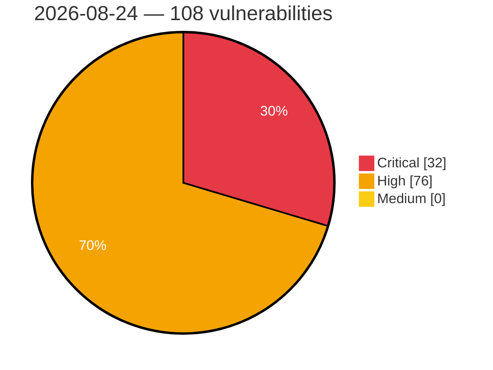

# Critical, High & Medium Severity Vulnerabilities — 2026-08-24

**Source status for this day:**

| Source | Critical | High | Medium | Total |
|--------|---------:|-----:|-------:|------:|
| cvefeed.io (High/Critical) | 32 | 76 | 0 | 108 |

**KEV (actively exploited):** 0  **Watchlist matches:** 72

## Critical (32)

| CVSS | Flags | Source | CVE / Title | Reported |
|------|-------|--------|-------------|----------|
| 10.0 | — | cvefeed.io (High/Critical) | [CVE-2026-78167 - EFM ipTIME T16000M Session Validation httpcon_check_session_url improper authentication](https://cvefeed.io/vuln/detail/CVE-2026-78167) | 2 hours, 14 minutes ago |
| 10.0 | ⭐ | cvefeed.io (High/Critical) | [CVE-2026-77995 - Joomla Extension - miniorange.com - Arbitrary account takeover in miniOrange OAuth Client < 3.2.0](https://cvefeed.io/vuln/detail/CVE-2026-77995) | 1 hour, 9 minutes ago |
| 10.0 | — | cvefeed.io (High/Critical) | [CVE-2025-36939 - OpenThread MLE Packet Denial of Service and Buffer Overflow](https://cvefeed.io/vuln/detail/CVE-2025-36939) | 1 hour, 4 minutes ago |
| 10.0 | ⭐ | cvefeed.io (High/Critical) | [CVE-2026-78555 - RansomLook API Key Disclosure Through /admin/apikeys HTML Source](https://cvefeed.io/vuln/detail/CVE-2026-78555) | 42 minutes ago |
| 9.9 | — | cvefeed.io (High/Critical) | [CVE-2026-78169 - UTT HiPER 1250GW HTTP Request aspRemoteApConfTempSend strcpy stack-based overflow](https://cvefeed.io/vuln/detail/CVE-2026-78169) | 2 hours, 14 minutes ago |
| 9.9 | ⭐ | cvefeed.io (High/Critical) | [CVE-2026-66897 - Instance template path traversal allows arbitrary host file write as root](https://cvefeed.io/vuln/detail/CVE-2026-66897) | 1 hour, 13 minutes ago |
| 9.8 | ⭐ | cvefeed.io (High/Critical) | [CVE-2026-78211 - 4MOSAn Security Technology｜4MOSAn GCB Doctor - OS Command Injection](https://cvefeed.io/vuln/detail/CVE-2026-78211) | 14 minutes ago |
| 9.8 | — | cvefeed.io (High/Critical) | [CVE-2026-66650 - WordPress FreightCo theme <= 1.1.15 - PHP Object Injection vulnerability](https://cvefeed.io/vuln/detail/CVE-2026-66650) | 8 minutes ago |
| 9.8 | ⭐ | cvefeed.io (High/Critical) | [CVE-2026-66648 - WordPress Jawn theme <= 1.4.2 - Privilege Escalation vulnerability](https://cvefeed.io/vuln/detail/CVE-2026-66648) | 8 minutes ago |
| 9.8 | — | cvefeed.io (High/Critical) | [CVE-2026-66587 - WordPress WP Cafe Pro plugin < 3.0.15 - Local File Inclusion vulnerability](https://cvefeed.io/vuln/detail/CVE-2026-66587) | 8 minutes ago |
| 9.8 | ⭐ | cvefeed.io (High/Critical) | [CVE-2026-32558 - WordPress Affiliate Pro - Affiliate Program for WooCommerce & WordPress plugin <= 8.9.1 - Privilege Escalation vulnerability](https://cvefeed.io/vuln/detail/CVE-2026-32558) | 8 minutes ago |
| 9.8 | ⭐ | cvefeed.io (High/Critical) | [CVE-2026-28165 - WordPress Digits plugin <= 9.2 - Privilege Escalation vulnerability](https://cvefeed.io/vuln/detail/CVE-2026-28165) | 8 minutes ago |
| 9.8 | ⭐ | cvefeed.io (High/Critical) | [CVE-2026-76071 - Netis NC63 V3.0.0.3327 Stack Buffer Overflow via destHost Parameter](https://cvefeed.io/vuln/detail/CVE-2026-76071) | 20 minutes ago |
| 9.8 | ⭐ | cvefeed.io (High/Critical) | [CVE-2026-76070 - Netis NC63 V3.0.0.3327 Stack Buffer Overflow via Login Password Parameter](https://cvefeed.io/vuln/detail/CVE-2026-76070) | 22 minutes ago |
| 9.8 | ⭐ | cvefeed.io (High/Critical) | [CVE-2026-77915 - rConfig 8.0.0 < 8.2.10 Unauthorized Admin Registration via web.php](https://cvefeed.io/vuln/detail/CVE-2026-77915) | 1 hour, 3 minutes ago |
| 9.8 | — | cvefeed.io (High/Critical) | [CVE-2026-19685 - Networkmanager: networkmanager: 802-1x ca-path and phase2-ca-path bypass private_user restriction, allowing wpa-enterprise server validation bypass (incomplete fix for cve-2025-9615)](https://cvefeed.io/vuln/detail/CVE-2026-19685) | 1 hour, 4 minutes ago |
| 9.8 | ⭐ | cvefeed.io (High/Critical) | [CVE-2026-71921 - DrayTek VigorSwitch Multiple Models Pre-Authentication OS Command Injection via setget.cgi](https://cvefeed.io/vuln/detail/CVE-2026-71921) | 2 hours, 4 minutes ago |
| 9.6 | — | cvefeed.io (High/Critical) | [CVE-2026-76840 - RustDesk through 1.4.9 Heap Buffer Overflow via Unvalidated CLIPRDR FileContentsResponse Length](https://cvefeed.io/vuln/detail/CVE-2026-76840) | 1 hour, 2 minutes ago |
| 9.4 | — | cvefeed.io (High/Critical) | [CVE-2026-78207 - exceljs through 4.4.0 Prototype Pollution via deepMerge Reached From Note Serialization](https://cvefeed.io/vuln/detail/CVE-2026-78207) | 46 minutes ago |
| 9.4 | ⭐ | cvefeed.io (High/Critical) | [CVE-2026-78387 - RansomLook Missing Authorization in Web Configuration Editor Allows Application Configuration Modification](https://cvefeed.io/vuln/detail/CVE-2026-78387) | 46 minutes ago |
| 9.4 | ⭐ | cvefeed.io (High/Critical) | [CVE-2026-39975 - Combodo iTop: Remote code execution using external auth variable value](https://cvefeed.io/vuln/detail/CVE-2026-39975) | 1 hour, 5 minutes ago |
| 9.3 | ⭐ | cvefeed.io (High/Critical) | [CVE-2026-77994 - Joomla Extension - joomlack.fr - Second order SQL injection in Page Builder CK < 3.6.5](https://cvefeed.io/vuln/detail/CVE-2026-77994) | 15 minutes ago |
| 9.3 | — | cvefeed.io (High/Critical) | [CVE-2026-78251 - DJI Drone FTP Service Allows Unrestricted Storage Consumption of the /blackbox Directory](https://cvefeed.io/vuln/detail/CVE-2026-78251) | 1 hour, 27 minutes ago |
| 9.3 | ⭐ | cvefeed.io (High/Critical) | [CVE-2026-32551 - WordPress Woo Essential plugin <= 4.3.0 - SQL Injection vulnerability](https://cvefeed.io/vuln/detail/CVE-2026-32551) | 8 minutes ago |
| 9.3 | ⭐ | cvefeed.io (High/Critical) | [CVE-2026-78365 - IDOR and missing authorization in Prospero Flow CRM supplier API allows cross-tenant read and modification](https://cvefeed.io/vuln/detail/CVE-2026-78365) | 16 minutes ago |
| 9.3 | ⭐ | cvefeed.io (High/Critical) | [CVE-2026-67602 - phpIPAM < 1.8.2 Authentication Bypass via REST API Object Cache](https://cvefeed.io/vuln/detail/CVE-2026-67602) | 16 minutes ago |
| 9.3 | ⭐ | cvefeed.io (High/Critical) | [CVE-2026-76835 - OAuth2 Proxy 7.15.2 through 7.15.4 Authentication Bypass via X-Forwarded-Uri Under the Default Trusted Proxy Set](https://cvefeed.io/vuln/detail/CVE-2026-76835) | 26 minutes ago |
| 9.2 | ⭐ | cvefeed.io (High/Critical) | [CVE-2026-78372 - RansomLook Missing Authorization Allows Disclosure of Private Group and Ransom Note Data](https://cvefeed.io/vuln/detail/CVE-2026-78372) | 1 hour, 5 minutes ago |
| 9.2 | ⭐ | cvefeed.io (High/Critical) | [CVE-2026-78370 - RansomLook Unauthenticated Database Export Exposes Private Data](https://cvefeed.io/vuln/detail/CVE-2026-78370) | 1 hour, 11 minutes ago |
| 9.1 | ⭐ | cvefeed.io (High/Critical) | [CVE-2026-59568 - Remote Code Execution](https://cvefeed.io/vuln/detail/CVE-2026-59568) | 30 minutes ago |
| 9.1 | ⭐ | cvefeed.io (High/Critical) | [CVE-2026-59564 - Authentication bypass between ZCC and client connector portal](https://cvefeed.io/vuln/detail/CVE-2026-59564) | 35 minutes ago |
| 9.1 | — | cvefeed.io (High/Critical) | [CVE-2026-71933 - DrayTek VigorSwitch Multiple Models Missing Authorization in Syslog Functions](https://cvefeed.io/vuln/detail/CVE-2026-71933) | 1 hour, 13 minutes ago |

## High (76)

| CVSS | Flags | Source | CVE / Title | Reported |
|------|-------|--------|-------------|----------|
| 10.0 | — | cvefeed.io (High/Critical) | [CVE-2026-78168 - EFM ipTIME T24000M Session Validation httpcon_check_session_url improper authentication](https://cvefeed.io/vuln/detail/CVE-2026-78168) | 2 hours, 14 minutes ago |
| 9.0 | — | cvefeed.io (High/Critical) | [CVE-2026-78170 - UTT HiPER 1200GW formConfigFastDirectionW strcpy buffer overflow](https://cvefeed.io/vuln/detail/CVE-2026-78170) | 2 hours, 14 minutes ago |
| 8.9 | — | cvefeed.io (High/Critical) | [CVE-2026-19200 - Velociraptor Analyst overwrites live built-in artifacts through verify()](https://cvefeed.io/vuln/detail/CVE-2026-19200) | 14 minutes ago |
| 8.9 | ⭐ | cvefeed.io (High/Critical) | [CVE-2026-30864 - Combodo iTop: Reflected XSS in dashboard revert](https://cvefeed.io/vuln/detail/CVE-2026-30864) | 1 hour, 5 minutes ago |
| 8.8 | ⭐ | cvefeed.io (High/Critical) | [CVE-2026-78317 - DIAEnergie - SQL Injection](https://cvefeed.io/vuln/detail/CVE-2026-78317) | 46 minutes ago |
| 8.8 | ⭐ | cvefeed.io (High/Critical) | [CVE-2026-78316 - DIAEnergie - SQL Injection](https://cvefeed.io/vuln/detail/CVE-2026-78316) | 46 minutes ago |
| 8.8 | ⭐ | cvefeed.io (High/Critical) | [CVE-2026-78315 - DIAEnergie - SQL Injection](https://cvefeed.io/vuln/detail/CVE-2026-78315) | 47 minutes ago |
| 8.8 | ⭐ | cvefeed.io (High/Critical) | [CVE-2026-78314 - DIAEnergie - SQL Injection](https://cvefeed.io/vuln/detail/CVE-2026-78314) | 47 minutes ago |
| 8.8 | ⭐ | cvefeed.io (High/Critical) | [CVE-2026-59567 - Local privilege escalation](https://cvefeed.io/vuln/detail/CVE-2026-59567) | 33 minutes ago |
| 8.8 | — | cvefeed.io (High/Critical) | [CVE-2026-59565 - Local and kernel denial-of-service](https://cvefeed.io/vuln/detail/CVE-2026-59565) | 34 minutes ago |
| 8.8 | — | cvefeed.io (High/Critical) | [CVE-2026-78376 - Webkitgtk: use-after-free of jscvalue function parameters](https://cvefeed.io/vuln/detail/CVE-2026-78376) | 45 minutes ago |
| 8.8 | — | cvefeed.io (High/Critical) | [CVE-2026-76847 - act 0.2.81 through 0.2.89 Missing Authorization in the Artifacts V4 Backend](https://cvefeed.io/vuln/detail/CVE-2026-76847) | 1 hour, 2 minutes ago |
| 8.8 | ⭐ | cvefeed.io (High/Critical) | [CVE-2026-76842 - Mercado Pago Node.js SDK through 3.4.0 Path Injection via Unencoded Identifiers in Payment Clients](https://cvefeed.io/vuln/detail/CVE-2026-76842) | 1 hour, 2 minutes ago |
| 8.8 | ⭐ | cvefeed.io (High/Critical) | [CVE-2026-76841 - Xinference through 2.11.0 Remote Code Execution via Hardcoded trust_remote_code in Model Loaders](https://cvefeed.io/vuln/detail/CVE-2026-76841) | 1 hour, 2 minutes ago |
| 8.8 | — | cvefeed.io (High/Critical) | [CVE-2026-78369 - Missing Authentication Allows Unauthorized Creation of Crypto Groups in RansomLook](https://cvefeed.io/vuln/detail/CVE-2026-78369) | 1 hour, 16 minutes ago |
| 8.8 | — | cvefeed.io (High/Critical) | [CVE-2026-13212 - Zephyr virtio driver calls an arbitrary function pointer from an out-of-range used-ring descriptor id](https://cvefeed.io/vuln/detail/CVE-2026-13212) | 19 minutes ago |
| 8.8 | ⭐ | cvefeed.io (High/Critical) | [CVE-2026-78391 - Stored Cross-Site Scripting via Untrusted Cryptocurrency Address Rendering in RansomLook](https://cvefeed.io/vuln/detail/CVE-2026-78391) | 46 minutes ago |
| 8.8 | ⭐ | cvefeed.io (High/Critical) | [CVE-2026-76073 - Label Studio through 1.23.0 Cross-Organization Annotation Access via Unscoped AnnotationAPI Queryset](https://cvefeed.io/vuln/detail/CVE-2026-76073) | 26 minutes ago |
| 8.8 | ⭐ | cvefeed.io (High/Critical) | [CVE-2026-76836 - AzuraCast through 0.23.8 Liquidsoap Configuration Write via Profile Edit Serialization Group Bypass](https://cvefeed.io/vuln/detail/CVE-2026-76836) | 45 minutes ago |
| 8.8 | ⭐ | cvefeed.io (High/Critical) | [CVE-2026-78551 - RansomLook Login Endpoint Allows Timing-Based Username Enumeration and Unthrottled Authentication Attempts](https://cvefeed.io/vuln/detail/CVE-2026-78551) | 1 hour, 1 minute ago |
| 8.7 | ⭐ | cvefeed.io (High/Critical) | [CVE-2026-78208 - exceljs through 4.4.0 Path Traversal via Unvalidated addImage filename](https://cvefeed.io/vuln/detail/CVE-2026-78208) | 46 minutes ago |
| 8.7 | ⭐ | cvefeed.io (High/Critical) | [CVE-2026-78206 - exceljs through 4.4.0 Uncontrolled Resource Consumption via Unbounded xlsx Decompression](https://cvefeed.io/vuln/detail/CVE-2026-78206) | 46 minutes ago |
| 8.7 | ⭐ | cvefeed.io (High/Critical) | [CVE-2026-78213 - Hepta Platforms｜Heptabase - Stored Cross-Site Scripting](https://cvefeed.io/vuln/detail/CVE-2026-78213) | 14 minutes ago |
| 8.7 | ⭐ | cvefeed.io (High/Critical) | [CVE-2026-78212 - 4MOSAn Security Technology｜4MOSAn Management Center - Arbitrary File Read](https://cvefeed.io/vuln/detail/CVE-2026-78212) | 14 minutes ago |
| 8.7 | — | cvefeed.io (High/Critical) | [CVE-2026-78255 - DJI Drone HTTP Media Server Allows Unauthenticated Access to Stored Media](https://cvefeed.io/vuln/detail/CVE-2026-78255) | 15 minutes ago |
| 8.7 | ⭐ | cvefeed.io (High/Critical) | [CVE-2026-78386 - Unauthenticated Disclosure of Scraping Credentials and Bypass Configuration via RansomLook API](https://cvefeed.io/vuln/detail/CVE-2026-78386) | 18 minutes ago |
| 8.7 | ⭐ | cvefeed.io (High/Critical) | [CVE-2026-78380 - Private Group and Market Posts Disclosed Through Public Notification Channels in RansomLook](https://cvefeed.io/vuln/detail/CVE-2026-78380) | 47 minutes ago |
| 8.7 | ⭐ | cvefeed.io (High/Critical) | [CVE-2026-76848 - TypeORM 0.2.21 through 1.1.0 SQL Injection via SelectQueryBuilder.distinctOn](https://cvefeed.io/vuln/detail/CVE-2026-76848) | 1 hour, 2 minutes ago |
| 8.7 | ⭐ | cvefeed.io (High/Critical) | [CVE-2026-78416 - Authenticated RCE via `condition.config` JSON cleanse bypass](https://cvefeed.io/vuln/detail/CVE-2026-78416) | 27 minutes ago |
| 8.7 | ⭐ | cvefeed.io (High/Critical) | [CVE-2026-9254 - Command Injection Vulnerability in Parent Control of Multiple TP-Link Archer Devices](https://cvefeed.io/vuln/detail/CVE-2026-9254) | 56 minutes ago |
| 8.7 | ⭐ | cvefeed.io (High/Critical) | [CVE-2026-40877 - Combodo iTop: PHP Object Injection Leading to Remote Code Execution on user preferences](https://cvefeed.io/vuln/detail/CVE-2026-40877) | 1 hour, 5 minutes ago |
| 8.7 | — | cvefeed.io (High/Critical) | [CVE-2026-71922 - DrayTek VigorSwitch Multiple Models Pre-Authentication NULL Pointer Dereference via setget.cgi](https://cvefeed.io/vuln/detail/CVE-2026-71922) | 2 hours, 4 minutes ago |
| 8.6 | ⭐ | cvefeed.io (High/Critical) | [CVE-2026-32477 - WordPress ShopBuilder Pro – Elementor WooCommerce Builder Addons plugin <= 2.2.0 - Arbitrary File Deletion vulnerability](https://cvefeed.io/vuln/detail/CVE-2026-32477) | 8 minutes ago |
| 8.6 | ⭐ | cvefeed.io (High/Critical) | [CVE-2026-28171 - WordPress WooCommerce File Approval plugin <= 10.7 - Arbitrary File Deletion vulnerability](https://cvefeed.io/vuln/detail/CVE-2026-28171) | 8 minutes ago |
| 8.6 | ⭐ | cvefeed.io (High/Critical) | [CVE-2026-71943 - DrayTek VigorSwitch Multiple Models OS Command Injection via setDevNet](https://cvefeed.io/vuln/detail/CVE-2026-71943) | 1 hour, 13 minutes ago |
| 8.6 | — | cvefeed.io (High/Critical) | [CVE-2026-71942 - DrayTek VigorSwitch Multiple Models Buffer Overflow via mail_mailalert](https://cvefeed.io/vuln/detail/CVE-2026-71942) | 1 hour, 13 minutes ago |
| 8.6 | — | cvefeed.io (High/Critical) | [CVE-2026-71941 - DrayTek VigorSwitch Multiple Models Buffer Overflow via diag_logmail](https://cvefeed.io/vuln/detail/CVE-2026-71941) | 1 hour, 13 minutes ago |
| 8.6 | — | cvefeed.io (High/Critical) | [CVE-2026-71940 - DrayTek VigorSwitch Multiple Models Buffer Overflow via acl_general_setup Edit ACE](https://cvefeed.io/vuln/detail/CVE-2026-71940) | 1 hour, 13 minutes ago |
| 8.6 | — | cvefeed.io (High/Critical) | [CVE-2026-71939 - DrayTek VigorSwitch Multiple Models Buffer Overflow via acl_general_setup Add ACE](https://cvefeed.io/vuln/detail/CVE-2026-71939) | 1 hour, 13 minutes ago |
| 8.6 | — | cvefeed.io (High/Critical) | [CVE-2026-71938 - DrayTek VigorSwitch Multiple Models Buffer Overflow via switch_lan_gvrp](https://cvefeed.io/vuln/detail/CVE-2026-71938) | 1 hour, 13 minutes ago |
| 8.6 | — | cvefeed.io (High/Critical) | [CVE-2026-71937 - DrayTek VigorSwitch Multiple Models Buffer Overflow via poe_schedule_profile](https://cvefeed.io/vuln/detail/CVE-2026-71937) | 1 hour, 13 minutes ago |
| 8.6 | — | cvefeed.io (High/Critical) | [CVE-2026-71936 - DrayTek VigorSwitch Multiple Models Buffer Overflow via sysreboot](https://cvefeed.io/vuln/detail/CVE-2026-71936) | 1 hour, 13 minutes ago |
| 8.6 | — | cvefeed.io (High/Critical) | [CVE-2026-71935 - DrayTek VigorSwitch Multiple Models Buffer Overflow via webBackupAction](https://cvefeed.io/vuln/detail/CVE-2026-71935) | 1 hour, 13 minutes ago |
| 8.6 | — | cvefeed.io (High/Critical) | [CVE-2026-71934 - DrayTek VigorSwitch Multiple Models Buffer Overflow via pingtrace](https://cvefeed.io/vuln/detail/CVE-2026-71934) | 1 hour, 13 minutes ago |
| 8.6 | ⭐ | cvefeed.io (High/Critical) | [CVE-2026-71931 - DrayTek VigorSwitch Multiple Models OS Command Injection via tftp_upgrade](https://cvefeed.io/vuln/detail/CVE-2026-71931) | 1 hour, 13 minutes ago |
| 8.6 | ⭐ | cvefeed.io (High/Critical) | [CVE-2026-71930 - DrayTek VigorSwitch Multiple Models OS Command Injection via setTime](https://cvefeed.io/vuln/detail/CVE-2026-71930) | 1 hour, 13 minutes ago |
| 8.6 | ⭐ | cvefeed.io (High/Critical) | [CVE-2026-71929 - DrayTek VigorSwitch Multiple Models OS Command Injection via setDevProto](https://cvefeed.io/vuln/detail/CVE-2026-71929) | 1 hour, 13 minutes ago |
| 8.6 | ⭐ | cvefeed.io (High/Critical) | [CVE-2026-71928 - DrayTek VigorSwitch Multiple Models OS Command Injection via fdftDevice](https://cvefeed.io/vuln/detail/CVE-2026-71928) | 1 hour, 13 minutes ago |
| 8.6 | ⭐ | cvefeed.io (High/Critical) | [CVE-2026-71504 - Dolibarr < 24.0.0 Members REST API Improper Authorization via Password Reset](https://cvefeed.io/vuln/detail/CVE-2026-71504) | 1 hour, 4 minutes ago |
| 8.6 | ⭐ | cvefeed.io (High/Critical) | [CVE-2026-71927 - DrayTek VigorSwitch Multiple Models OS Command Injection via rebDevice](https://cvefeed.io/vuln/detail/CVE-2026-71927) | 2 hours, 4 minutes ago |
| 8.6 | ⭐ | cvefeed.io (High/Critical) | [CVE-2026-71925 - DrayTek VigorSwitch Multiple Models OS Command Injection via getDetail](https://cvefeed.io/vuln/detail/CVE-2026-71925) | 2 hours, 4 minutes ago |
| 8.6 | ⭐ | cvefeed.io (High/Critical) | [CVE-2026-71917 - DrayTek VigorSwitch Multiple Models OS Command Injection via pingtrace](https://cvefeed.io/vuln/detail/CVE-2026-71917) | 2 hours, 4 minutes ago |
| 8.6 | ⭐ | cvefeed.io (High/Critical) | [CVE-2026-71915 - DrayTek VigorSwitch Multiple Models OS Command Injection via jsonstatus](https://cvefeed.io/vuln/detail/CVE-2026-71915) | 2 hours, 4 minutes ago |
| 8.5 | — | cvefeed.io (High/Critical) | [CVE-2026-78306 - DJI Drone Bluetooth Interface Unauthenticated DUML Command Execution](https://cvefeed.io/vuln/detail/CVE-2026-78306) | 24 minutes ago |
| 8.5 | ⭐ | cvefeed.io (High/Critical) | [CVE-2026-32478 - WordPress WP Project Manager Pro plugin <= 4.0.1 - SQL Injection vulnerability](https://cvefeed.io/vuln/detail/CVE-2026-32478) | 8 minutes ago |
| 8.5 | ⭐ | cvefeed.io (High/Critical) | [CVE-2026-32471 - WordPress ProLancer Element plugin <= 1.4.8 - SQL Injection vulnerability](https://cvefeed.io/vuln/detail/CVE-2026-32471) | 8 minutes ago |
| 8.5 | ⭐ | cvefeed.io (High/Critical) | [CVE-2025-63080 - Authenticated RCE in KAON PG5298](https://cvefeed.io/vuln/detail/CVE-2025-63080) | 51 minutes ago |
| 8.5 | — | cvefeed.io (High/Critical) | [CVE-2026-39915 - TIM Flow < 26.0.6 CRLF Injection via rt Parameter](https://cvefeed.io/vuln/detail/CVE-2026-39915) | 46 minutes ago |
| 8.5 | ⭐ | cvefeed.io (High/Critical) | [CVE-2026-76838 - Hi.Events before 1.11.1-beta Server-Side Request Forgery via Unvalidated Webhook Redirects](https://cvefeed.io/vuln/detail/CVE-2026-76838) | 45 minutes ago |
| 8.5 | ⭐ | cvefeed.io (High/Critical) | [CVE-2026-16348 - Command Injection Vulnerability in VPN connection of Archer BE800](https://cvefeed.io/vuln/detail/CVE-2026-16348) | 55 minutes ago |
| 8.5 | ⭐ | cvefeed.io (High/Critical) | [CVE-2026-78541 - Command Injection in Parent Control of TP-Link Archer BE3600 v1](https://cvefeed.io/vuln/detail/CVE-2026-78541) | 1 hour, 4 minutes ago |
| 8.4 | — | cvefeed.io (High/Critical) | [CVE-2026-78209 - exceljs through 4.4.0 CSV Formula Injection via Unescaped Cell Values](https://cvefeed.io/vuln/detail/CVE-2026-78209) | 46 minutes ago |
| 8.4 | ⭐ | cvefeed.io (High/Critical) | [CVE-2026-59561 - Sakura Editor OS Command Injection Vulnerability](https://cvefeed.io/vuln/detail/CVE-2026-59561) | 1 hour, 15 minutes ago |
| 8.4 | ⭐ | cvefeed.io (High/Critical) | [CVE-2026-59566 - Local denial-of-service](https://cvefeed.io/vuln/detail/CVE-2026-59566) | 33 minutes ago |
| 8.4 | ⭐ | cvefeed.io (High/Critical) | [CVE-2026-76843 - Flair 0.15.0 and 0.15.1 Deserialization of Untrusted Data via ClusteringModel.load](https://cvefeed.io/vuln/detail/CVE-2026-76843) | 1 hour, 2 minutes ago |
| 8.3 | ⭐ | cvefeed.io (High/Critical) | [CVE-2026-10582 - Hugo 0.91.0 through 0.165.0 Server-Side Request Forgery via security.http.urls Lacking Destination Address Validation](https://cvefeed.io/vuln/detail/CVE-2026-10582) | 18 minutes ago |
| 8.3 | ⭐ | cvefeed.io (High/Critical) | [CVE-2026-76844 - webpack-dev-middleware Path Traversal via Offset Slice on a Non-Slash-Terminated publicPath](https://cvefeed.io/vuln/detail/CVE-2026-76844) | 1 hour, 2 minutes ago |
| 8.3 | ⭐ | cvefeed.io (High/Critical) | [CVE-2026-76072 - Continue CLI through 1.5.47 Incomplete Destructive Command Denylist in Headless and Auto Mode](https://cvefeed.io/vuln/detail/CVE-2026-76072) | 26 minutes ago |
| 8.2 | ⭐ | cvefeed.io (High/Critical) | [CVE-2026-78385 - RansomLook Analysis PDF Generation Allows Server-Side Request Forgery and Arbitrary Local File Access](https://cvefeed.io/vuln/detail/CVE-2026-78385) | 24 minutes ago |
| 8.2 | ⭐ | cvefeed.io (High/Critical) | [CVE-2026-78381 - RansomLook Arbitrary File Read via Path Traversal in Post screen Field](https://cvefeed.io/vuln/detail/CVE-2026-78381) | 41 minutes ago |
| 8.1 | — | cvefeed.io (High/Critical) | [CVE-2026-66670 - WordPress Måne theme <= 1.7 - Local File Inclusion vulnerability](https://cvefeed.io/vuln/detail/CVE-2026-66670) | 8 minutes ago |
| 8.1 | — | cvefeed.io (High/Critical) | [CVE-2026-28152 - WordPress Tonda Core plugin < 2.6 - Local File Inclusion vulnerability](https://cvefeed.io/vuln/detail/CVE-2026-28152) | 8 minutes ago |
| 8.1 | — | cvefeed.io (High/Critical) | [CVE-2026-28151 - WordPress Tonda theme < 2.6 - Local File Inclusion vulnerability](https://cvefeed.io/vuln/detail/CVE-2026-28151) | 8 minutes ago |
| 8.1 | — | cvefeed.io (High/Critical) | [CVE-2026-66671 - WordPress Verdure Core plugin <= 1.2 - Local File Inclusion vulnerability](https://cvefeed.io/vuln/detail/CVE-2026-66671) | 8 minutes ago |
| 8.1 | ⭐ | cvefeed.io (High/Critical) | [CVE-2026-71506 - Dolibarr < 24.0.0 Payments REST API Improper Authorization via Delete Endpoint](https://cvefeed.io/vuln/detail/CVE-2026-71506) | 1 hour, 4 minutes ago |
| 8.0 | ⭐ | cvefeed.io (High/Critical) | [CVE-2026-78414 - Cross-site scripting in Nx Witness VMS Web Administration allows session token exfiltration via a rogue peer site name](https://cvefeed.io/vuln/detail/CVE-2026-78414) | 46 minutes ago |
