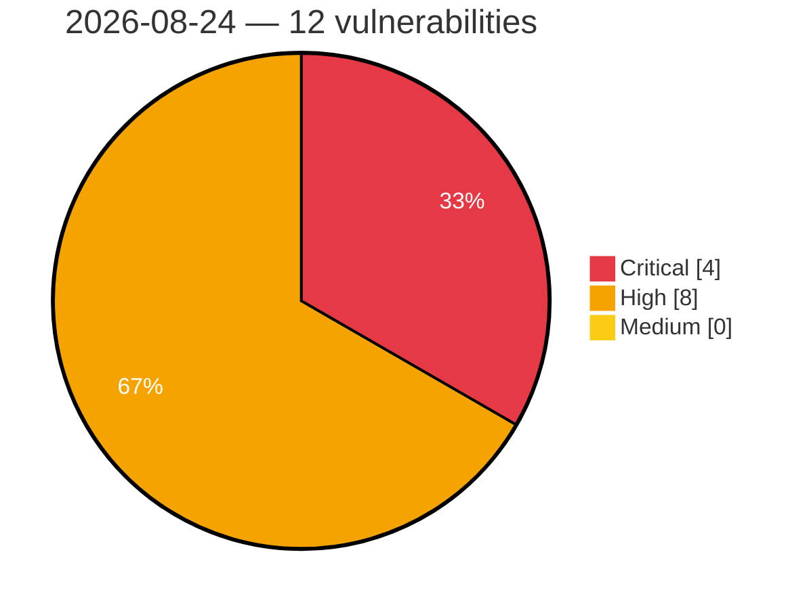

# Critical, High & Medium Severity Vulnerabilities — 2026-08-24

**Source status for this day:**

| Source | Critical | High | Medium | Total |
|--------|---------:|-----:|-------:|------:|
| cvefeed.io (High/Critical) | 4 | 8 | 0 | 12 |

**KEV (actively exploited):** 0  **Watchlist matches:** 5

## Critical (4)

| CVSS | Flags | Source | CVE / Title | Reported |
|------|-------|--------|-------------|----------|
| 10.0 | — | cvefeed.io (High/Critical) | [CVE-2026-78167 - EFM ipTIME T16000M Session Validation httpcon_check_session_url improper authentication](https://cvefeed.io/vuln/detail/CVE-2026-78167) | 2 hours, 14 minutes ago |
| 9.9 | — | cvefeed.io (High/Critical) | [CVE-2026-78169 - UTT HiPER 1250GW HTTP Request aspRemoteApConfTempSend strcpy stack-based overflow](https://cvefeed.io/vuln/detail/CVE-2026-78169) | 2 hours, 14 minutes ago |
| 9.8 | ⭐ | cvefeed.io (High/Critical) | [CVE-2026-78211 - 4MOSAn Security Technology｜4MOSAn GCB Doctor - OS Command Injection](https://cvefeed.io/vuln/detail/CVE-2026-78211) | 14 minutes ago |
| 9.4 | — | cvefeed.io (High/Critical) | [CVE-2026-78207 - exceljs through 4.4.0 Prototype Pollution via deepMerge Reached From Note Serialization](https://cvefeed.io/vuln/detail/CVE-2026-78207) | 46 minutes ago |

## High (8)

| CVSS | Flags | Source | CVE / Title | Reported |
|------|-------|--------|-------------|----------|
| 10.0 | — | cvefeed.io (High/Critical) | [CVE-2026-78168 - EFM ipTIME T24000M Session Validation httpcon_check_session_url improper authentication](https://cvefeed.io/vuln/detail/CVE-2026-78168) | 2 hours, 14 minutes ago |
| 9.0 | — | cvefeed.io (High/Critical) | [CVE-2026-78170 - UTT HiPER 1200GW formConfigFastDirectionW strcpy buffer overflow](https://cvefeed.io/vuln/detail/CVE-2026-78170) | 2 hours, 14 minutes ago |
| 8.9 | — | cvefeed.io (High/Critical) | [CVE-2026-19200 - Velociraptor Analyst overwrites live built-in artifacts through verify()](https://cvefeed.io/vuln/detail/CVE-2026-19200) | 14 minutes ago |
| 8.7 | ⭐ | cvefeed.io (High/Critical) | [CVE-2026-78208 - exceljs through 4.4.0 Path Traversal via Unvalidated addImage filename](https://cvefeed.io/vuln/detail/CVE-2026-78208) | 46 minutes ago |
| 8.7 | ⭐ | cvefeed.io (High/Critical) | [CVE-2026-78206 - exceljs through 4.4.0 Uncontrolled Resource Consumption via Unbounded xlsx Decompression](https://cvefeed.io/vuln/detail/CVE-2026-78206) | 46 minutes ago |
| 8.7 | ⭐ | cvefeed.io (High/Critical) | [CVE-2026-78213 - Hepta Platforms｜Heptabase - Stored Cross-Site Scripting](https://cvefeed.io/vuln/detail/CVE-2026-78213) | 14 minutes ago |
| 8.7 | ⭐ | cvefeed.io (High/Critical) | [CVE-2026-78212 - 4MOSAn Security Technology｜4MOSAn Management Center - Arbitrary File Read](https://cvefeed.io/vuln/detail/CVE-2026-78212) | 14 minutes ago |
| 8.4 | — | cvefeed.io (High/Critical) | [CVE-2026-78209 - exceljs through 4.4.0 CSV Formula Injection via Unescaped Cell Values](https://cvefeed.io/vuln/detail/CVE-2026-78209) | 46 minutes ago |
