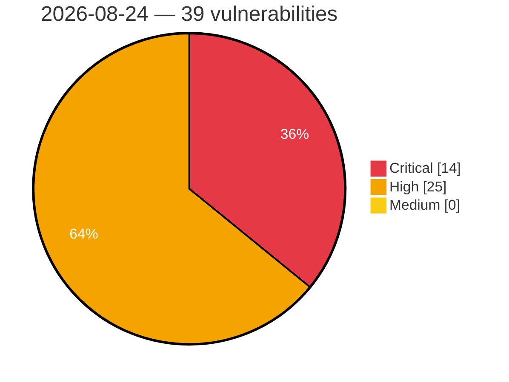

# Critical, High & Medium Severity Vulnerabilities — 2026-08-24

**Source status for this day:**

| Source | Critical | High | Medium | Total |
|--------|---------:|-----:|-------:|------:|
| cvefeed.io (High/Critical) | 14 | 25 | 0 | 39 |

**KEV (actively exploited):** 0  **Watchlist matches:** 23

## Critical (14)

| CVSS | Flags | Source | CVE / Title | Reported |
|------|-------|--------|-------------|----------|
| 10.0 | — | cvefeed.io (High/Critical) | [CVE-2026-78167 - EFM ipTIME T16000M Session Validation httpcon_check_session_url improper authentication](https://cvefeed.io/vuln/detail/CVE-2026-78167) | 2 hours, 14 minutes ago |
| 9.9 | — | cvefeed.io (High/Critical) | [CVE-2026-78169 - UTT HiPER 1250GW HTTP Request aspRemoteApConfTempSend strcpy stack-based overflow](https://cvefeed.io/vuln/detail/CVE-2026-78169) | 2 hours, 14 minutes ago |
| 9.9 | ⭐ | cvefeed.io (High/Critical) | [CVE-2026-66897 - Instance template path traversal allows arbitrary host file write as root](https://cvefeed.io/vuln/detail/CVE-2026-66897) | 1 hour, 13 minutes ago |
| 9.8 | ⭐ | cvefeed.io (High/Critical) | [CVE-2026-78211 - 4MOSAn Security Technology｜4MOSAn GCB Doctor - OS Command Injection](https://cvefeed.io/vuln/detail/CVE-2026-78211) | 14 minutes ago |
| 9.8 | — | cvefeed.io (High/Critical) | [CVE-2026-66650 - WordPress FreightCo theme <= 1.1.15 - PHP Object Injection vulnerability](https://cvefeed.io/vuln/detail/CVE-2026-66650) | 8 minutes ago |
| 9.8 | ⭐ | cvefeed.io (High/Critical) | [CVE-2026-66648 - WordPress Jawn theme <= 1.4.2 - Privilege Escalation vulnerability](https://cvefeed.io/vuln/detail/CVE-2026-66648) | 8 minutes ago |
| 9.8 | — | cvefeed.io (High/Critical) | [CVE-2026-66587 - WordPress WP Cafe Pro plugin < 3.0.15 - Local File Inclusion vulnerability](https://cvefeed.io/vuln/detail/CVE-2026-66587) | 8 minutes ago |
| 9.8 | ⭐ | cvefeed.io (High/Critical) | [CVE-2026-32558 - WordPress Affiliate Pro - Affiliate Program for WooCommerce & WordPress plugin <= 8.9.1 - Privilege Escalation vulnerability](https://cvefeed.io/vuln/detail/CVE-2026-32558) | 8 minutes ago |
| 9.8 | ⭐ | cvefeed.io (High/Critical) | [CVE-2026-28165 - WordPress Digits plugin <= 9.2 - Privilege Escalation vulnerability](https://cvefeed.io/vuln/detail/CVE-2026-28165) | 8 minutes ago |
| 9.4 | — | cvefeed.io (High/Critical) | [CVE-2026-78207 - exceljs through 4.4.0 Prototype Pollution via deepMerge Reached From Note Serialization](https://cvefeed.io/vuln/detail/CVE-2026-78207) | 46 minutes ago |
| 9.3 | ⭐ | cvefeed.io (High/Critical) | [CVE-2026-77994 - Joomla Extension - joomlack.fr - Second order SQL injection in Page Builder CK < 3.6.5](https://cvefeed.io/vuln/detail/CVE-2026-77994) | 15 minutes ago |
| 9.3 | — | cvefeed.io (High/Critical) | [CVE-2026-78251 - DJI Drone FTP Service Allows Unrestricted Storage Consumption of the /blackbox Directory](https://cvefeed.io/vuln/detail/CVE-2026-78251) | 1 hour, 27 minutes ago |
| 9.3 | ⭐ | cvefeed.io (High/Critical) | [CVE-2026-32551 - WordPress Woo Essential plugin <= 4.3.0 - SQL Injection vulnerability](https://cvefeed.io/vuln/detail/CVE-2026-32551) | 8 minutes ago |
| 9.3 | ⭐ | cvefeed.io (High/Critical) | [CVE-2026-78365 - IDOR and missing authorization in Prospero Flow CRM supplier API allows cross-tenant read and modification](https://cvefeed.io/vuln/detail/CVE-2026-78365) | 16 minutes ago |

## High (25)

| CVSS | Flags | Source | CVE / Title | Reported |
|------|-------|--------|-------------|----------|
| 10.0 | — | cvefeed.io (High/Critical) | [CVE-2026-78168 - EFM ipTIME T24000M Session Validation httpcon_check_session_url improper authentication](https://cvefeed.io/vuln/detail/CVE-2026-78168) | 2 hours, 14 minutes ago |
| 9.0 | — | cvefeed.io (High/Critical) | [CVE-2026-78170 - UTT HiPER 1200GW formConfigFastDirectionW strcpy buffer overflow](https://cvefeed.io/vuln/detail/CVE-2026-78170) | 2 hours, 14 minutes ago |
| 8.9 | — | cvefeed.io (High/Critical) | [CVE-2026-19200 - Velociraptor Analyst overwrites live built-in artifacts through verify()](https://cvefeed.io/vuln/detail/CVE-2026-19200) | 14 minutes ago |
| 8.8 | ⭐ | cvefeed.io (High/Critical) | [CVE-2026-78317 - DIAEnergie - SQL Injection](https://cvefeed.io/vuln/detail/CVE-2026-78317) | 46 minutes ago |
| 8.8 | ⭐ | cvefeed.io (High/Critical) | [CVE-2026-78316 - DIAEnergie - SQL Injection](https://cvefeed.io/vuln/detail/CVE-2026-78316) | 46 minutes ago |
| 8.8 | ⭐ | cvefeed.io (High/Critical) | [CVE-2026-78315 - DIAEnergie - SQL Injection](https://cvefeed.io/vuln/detail/CVE-2026-78315) | 47 minutes ago |
| 8.8 | ⭐ | cvefeed.io (High/Critical) | [CVE-2026-78314 - DIAEnergie - SQL Injection](https://cvefeed.io/vuln/detail/CVE-2026-78314) | 47 minutes ago |
| 8.7 | ⭐ | cvefeed.io (High/Critical) | [CVE-2026-78208 - exceljs through 4.4.0 Path Traversal via Unvalidated addImage filename](https://cvefeed.io/vuln/detail/CVE-2026-78208) | 46 minutes ago |
| 8.7 | ⭐ | cvefeed.io (High/Critical) | [CVE-2026-78206 - exceljs through 4.4.0 Uncontrolled Resource Consumption via Unbounded xlsx Decompression](https://cvefeed.io/vuln/detail/CVE-2026-78206) | 46 minutes ago |
| 8.7 | ⭐ | cvefeed.io (High/Critical) | [CVE-2026-78213 - Hepta Platforms｜Heptabase - Stored Cross-Site Scripting](https://cvefeed.io/vuln/detail/CVE-2026-78213) | 14 minutes ago |
| 8.7 | ⭐ | cvefeed.io (High/Critical) | [CVE-2026-78212 - 4MOSAn Security Technology｜4MOSAn Management Center - Arbitrary File Read](https://cvefeed.io/vuln/detail/CVE-2026-78212) | 14 minutes ago |
| 8.7 | — | cvefeed.io (High/Critical) | [CVE-2026-78255 - DJI Drone HTTP Media Server Allows Unauthenticated Access to Stored Media](https://cvefeed.io/vuln/detail/CVE-2026-78255) | 15 minutes ago |
| 8.6 | ⭐ | cvefeed.io (High/Critical) | [CVE-2026-32477 - WordPress ShopBuilder Pro – Elementor WooCommerce Builder Addons plugin <= 2.2.0 - Arbitrary File Deletion vulnerability](https://cvefeed.io/vuln/detail/CVE-2026-32477) | 8 minutes ago |
| 8.6 | ⭐ | cvefeed.io (High/Critical) | [CVE-2026-28171 - WordPress WooCommerce File Approval plugin <= 10.7 - Arbitrary File Deletion vulnerability](https://cvefeed.io/vuln/detail/CVE-2026-28171) | 8 minutes ago |
| 8.5 | — | cvefeed.io (High/Critical) | [CVE-2026-78306 - DJI Drone Bluetooth Interface Unauthenticated DUML Command Execution](https://cvefeed.io/vuln/detail/CVE-2026-78306) | 24 minutes ago |
| 8.5 | ⭐ | cvefeed.io (High/Critical) | [CVE-2026-32478 - WordPress WP Project Manager Pro plugin <= 4.0.1 - SQL Injection vulnerability](https://cvefeed.io/vuln/detail/CVE-2026-32478) | 8 minutes ago |
| 8.5 | ⭐ | cvefeed.io (High/Critical) | [CVE-2026-32471 - WordPress ProLancer Element plugin <= 1.4.8 - SQL Injection vulnerability](https://cvefeed.io/vuln/detail/CVE-2026-32471) | 8 minutes ago |
| 8.5 | ⭐ | cvefeed.io (High/Critical) | [CVE-2025-63080 - Authenticated RCE in KAON PG5298](https://cvefeed.io/vuln/detail/CVE-2025-63080) | 51 minutes ago |
| 8.4 | — | cvefeed.io (High/Critical) | [CVE-2026-78209 - exceljs through 4.4.0 CSV Formula Injection via Unescaped Cell Values](https://cvefeed.io/vuln/detail/CVE-2026-78209) | 46 minutes ago |
| 8.4 | ⭐ | cvefeed.io (High/Critical) | [CVE-2026-59561 - Sakura Editor OS Command Injection Vulnerability](https://cvefeed.io/vuln/detail/CVE-2026-59561) | 1 hour, 15 minutes ago |
| 8.3 | ⭐ | cvefeed.io (High/Critical) | [CVE-2026-10582 - Hugo 0.91.0 through 0.165.0 Server-Side Request Forgery via security.http.urls Lacking Destination Address Validation](https://cvefeed.io/vuln/detail/CVE-2026-10582) | 18 minutes ago |
| 8.1 | — | cvefeed.io (High/Critical) | [CVE-2026-66670 - WordPress Måne theme <= 1.7 - Local File Inclusion vulnerability](https://cvefeed.io/vuln/detail/CVE-2026-66670) | 8 minutes ago |
| 8.1 | — | cvefeed.io (High/Critical) | [CVE-2026-28152 - WordPress Tonda Core plugin < 2.6 - Local File Inclusion vulnerability](https://cvefeed.io/vuln/detail/CVE-2026-28152) | 8 minutes ago |
| 8.1 | — | cvefeed.io (High/Critical) | [CVE-2026-28151 - WordPress Tonda theme < 2.6 - Local File Inclusion vulnerability](https://cvefeed.io/vuln/detail/CVE-2026-28151) | 8 minutes ago |
| 8.1 | — | cvefeed.io (High/Critical) | [CVE-2026-66671 - WordPress Verdure Core plugin <= 1.2 - Local File Inclusion vulnerability](https://cvefeed.io/vuln/detail/CVE-2026-66671) | 8 minutes ago |
