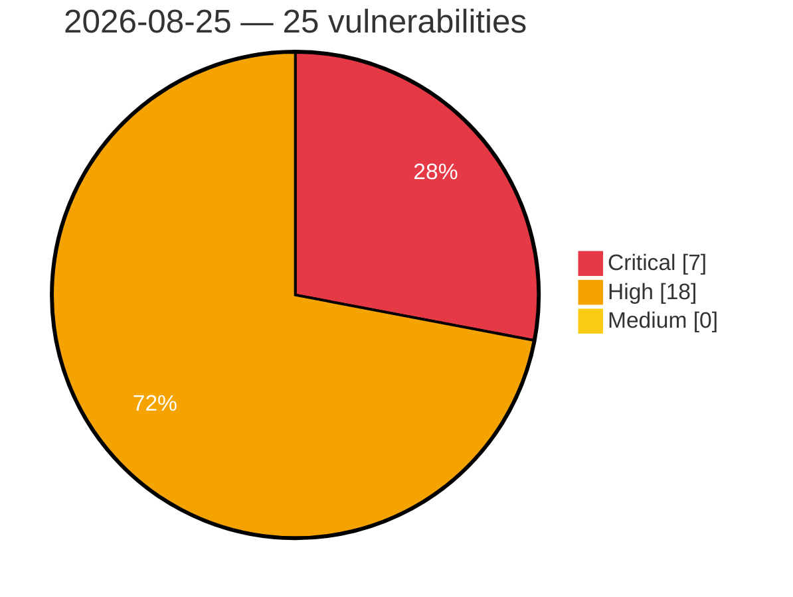

# Critical, High & Medium Severity Vulnerabilities — 2026-08-25

**Source status for this day:**

| Source | Critical | High | Medium | Total |
|--------|---------:|-----:|-------:|------:|
| cvefeed.io (High/Critical) | 7 | 18 | 0 | 25 |

**KEV (actively exploited):** 0  **Watchlist matches:** 16

## Critical (7)

| CVSS | Flags | Source | CVE / Title | Reported |
|------|-------|--------|-------------|----------|
| 9.8 | ⭐ | cvefeed.io (High/Critical) | [CVE-2026-78676 - GitPython before 3.1.59 Remote Code Execution via Config Injection](https://cvefeed.io/vuln/detail/CVE-2026-78676) | 49 minutes ago |
| 9.8 | ⭐ | cvefeed.io (High/Critical) | [CVE-2026-56710 - Grav Login Plugin before 1.0.16 Privilege Escalation via Unlock](https://cvefeed.io/vuln/detail/CVE-2026-56710) | 50 minutes ago |
| 9.8 | ⭐ | cvefeed.io (High/Critical) | [CVE-2026-56705 - Adminer before 5.4.3 Remote Code Execution via MSSQL PDO DSN Injection](https://cvefeed.io/vuln/detail/CVE-2026-56705) | 50 minutes ago |
| 9.8 | ⭐ | cvefeed.io (High/Critical) | [CVE-2026-13214 - Stack buffer overflow in OCPP GetConfiguration key parsing](https://cvefeed.io/vuln/detail/CVE-2026-13214) | 17 minutes ago |
| 9.6 | ⭐ | cvefeed.io (High/Critical) | [CVE-2026-78683 - NLTK before 3.10.0 Remote Code Execution via Unsafe Pickle Deserialization](https://cvefeed.io/vuln/detail/CVE-2026-78683) | 49 minutes ago |
| 9.3 | — | cvefeed.io (High/Critical) | [CVE-2026-72702 - Grav CMS before 2.0.16 Origin Validation Bypass via Referer](https://cvefeed.io/vuln/detail/CVE-2026-72702) | 49 minutes ago |
| 9.3 | — | cvefeed.io (High/Critical) | [CVE-2026-72699 - Grav Login Plugin before 3.9.1 Email Enumeration via Registration](https://cvefeed.io/vuln/detail/CVE-2026-72699) | 49 minutes ago |

## High (18)

| CVSS | Flags | Source | CVE / Title | Reported |
|------|-------|--------|-------------|----------|
| 8.8 | ⭐ | cvefeed.io (High/Critical) | [CVE-2026-75574 - Grav before 4.2.2 Remote Code Execution via Email Twig](https://cvefeed.io/vuln/detail/CVE-2026-75574) | 49 minutes ago |
| 8.8 | ⭐ | cvefeed.io (High/Critical) | [CVE-2026-56702 - Adminer before 5.4.3 Unrestricted File Upload via AdminerFileUpload](https://cvefeed.io/vuln/detail/CVE-2026-56702) | 50 minutes ago |
| 8.8 | ⭐ | cvefeed.io (High/Critical) | [CVE-2026-78685 - Le-yan｜Medical Practice Management System - Remote Code Execution](https://cvefeed.io/vuln/detail/CVE-2026-78685) | 43 minutes ago |
| 8.8 | ⭐ | cvefeed.io (High/Critical) | [CVE-2026-19892 - InfusedWoo Pro <= 5.1.18 - Authenticated (Subscriber+) Privilege Escalation via Password Reset Link Disclosure](https://cvefeed.io/vuln/detail/CVE-2026-19892) | 36 minutes ago |
| 8.7 | ⭐ | cvefeed.io (High/Critical) | [CVE-2026-78682 - NLTK before 3.10.3 SSRF Protection Bypass via Proxy](https://cvefeed.io/vuln/detail/CVE-2026-78682) | 49 minutes ago |
| 8.7 | — | cvefeed.io (High/Critical) | [CVE-2026-78681 - NLTK before 3.10.3 Entity Expansion DoS via ElementTree](https://cvefeed.io/vuln/detail/CVE-2026-78681) | 49 minutes ago |
| 8.7 | ⭐ | cvefeed.io (High/Critical) | [CVE-2026-78677 - GitPython before 3.1.59 Path Traversal via separate-git-dir](https://cvefeed.io/vuln/detail/CVE-2026-78677) | 49 minutes ago |
| 8.7 | — | cvefeed.io (High/Critical) | [CVE-2026-76846 - Grav before 2.0.16 Information Disclosure via Twig Sandbox](https://cvefeed.io/vuln/detail/CVE-2026-76846) | 49 minutes ago |
| 8.7 | ⭐ | cvefeed.io (High/Critical) | [CVE-2026-76839 - Grav before 2.0.16 Information Disclosure via offsetGet](https://cvefeed.io/vuln/detail/CVE-2026-76839) | 49 minutes ago |
| 8.7 | — | cvefeed.io (High/Critical) | [CVE-2026-72700 - Grav before 3.9.1 Timing Attack via Non-Constant-Time Token Comparison](https://cvefeed.io/vuln/detail/CVE-2026-72700) | 49 minutes ago |
| 8.7 | — | cvefeed.io (High/Critical) | [CVE-2026-56709 - Grav before 3.9.2 Host Header Injection via sendInvitationEmail](https://cvefeed.io/vuln/detail/CVE-2026-56709) | 50 minutes ago |
| 8.6 | — | cvefeed.io (High/Critical) | [CVE-2026-78675 - GitPython before 3.1.59 Local File Content Disclosure via .gitmodules](https://cvefeed.io/vuln/detail/CVE-2026-78675) | 49 minutes ago |
| 8.6 | — | cvefeed.io (High/Critical) | [CVE-2026-72696 - Grav CMS before 2.0.16 Symlink Following via createLockFile](https://cvefeed.io/vuln/detail/CVE-2026-72696) | 49 minutes ago |
| 8.6 | ⭐ | cvefeed.io (High/Critical) | [CVE-2026-56703 - Adminer before 5.4.3 Remote Code Execution via SQLite VACUUM INTO](https://cvefeed.io/vuln/detail/CVE-2026-56703) | 50 minutes ago |
| 8.5 | — | cvefeed.io (High/Critical) | [CVE-2026-78680 - NLTK before 3.10.3 Arbitrary Code Execution via Graphviz dot Binary](https://cvefeed.io/vuln/detail/CVE-2026-78680) | 49 minutes ago |
| 8.3 | ⭐ | cvefeed.io (High/Critical) | [CVE-2026-56707 - Grav Flex Objects 1.4.0 through 1.4.7 Authorization Bypass via Shortcode](https://cvefeed.io/vuln/detail/CVE-2026-56707) | 50 minutes ago |
| 8.1 | ⭐ | cvefeed.io (High/Critical) | [CVE-2026-72695 - Grav before 2.0.16 Path Traversal via MediaUploadTrait deleteFile](https://cvefeed.io/vuln/detail/CVE-2026-72695) | 50 minutes ago |
| 8.1 | ⭐ | cvefeed.io (High/Critical) | [CVE-2026-34968 - Adminer before 5.4.3 Arbitrary File Deletion via SQLite Drop](https://cvefeed.io/vuln/detail/CVE-2026-34968) | 50 minutes ago |
