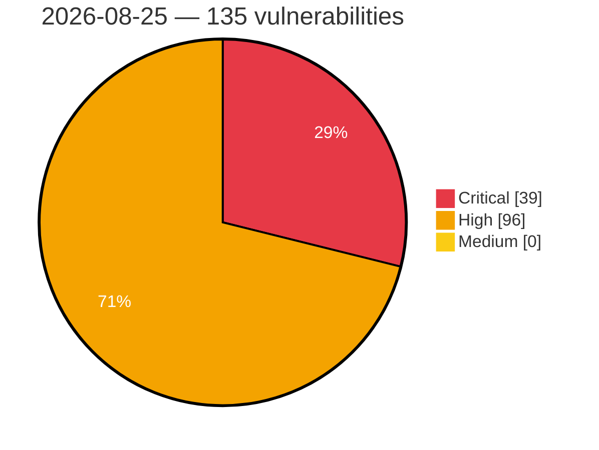

# Critical, High & Medium Severity Vulnerabilities — 2026-08-25

**Source status for this day:**

| Source | Critical | High | Medium | Total |
|--------|---------:|-----:|-------:|------:|
| cvefeed.io (High/Critical) | 39 | 96 | 0 | 135 |

**KEV (actively exploited):** 0  **Watchlist matches:** 88

## Critical (39)

| CVSS | Flags | Source | CVE / Title | Reported |
|------|-------|--------|-------------|----------|
| 10.0 | ⭐ | cvefeed.io (High/Critical) | [CVE-2026-77998 - Joomla Extension - miniorange.com - Unauthenticated Authentication Bypass via SAMLResponse Parameter in miniOrange SAML SSO < 11.0.2, SAML SP Single Sign On – Login with ADFS < 6.4,  SAML SP Single Sign On – SAML SSO login with Google Apps < 6.4](https://cvefeed.io/vuln/detail/CVE-2026-77998) | 44 minutes ago |
| 10.0 | ⭐ | cvefeed.io (High/Critical) | [CVE-2026-76197 - Adobe Campaign Classic (ACC) \| Improper Neutralization of Special Elements used in an OS Command ('OS Command Injection') (CWE-78)](https://cvefeed.io/vuln/detail/CVE-2026-76197) | 29 minutes ago |
| 10.0 | ⭐ | cvefeed.io (High/Critical) | [CVE-2026-76195 - Adobe Campaign Classic (ACC) \| Improper Neutralization of Special Elements used in an OS Command ('OS Command Injection') (CWE-78)](https://cvefeed.io/vuln/detail/CVE-2026-76195) | 29 minutes ago |
| 10.0 | ⭐ | cvefeed.io (High/Critical) | [CVE-2026-76193 - Adobe Campaign Classic (ACC) \| Server-Side Request Forgery (SSRF) (CWE-918)](https://cvefeed.io/vuln/detail/CVE-2026-76193) | 29 minutes ago |
| 9.9 | ⭐ | cvefeed.io (High/Critical) | [CVE-2026-65083 - NVIDIA OpenShell Sandbox Provisioning API Improper Input Validation](https://cvefeed.io/vuln/detail/CVE-2026-65083) | 33 minutes ago |
| 9.9 | — | cvefeed.io (High/Critical) | [CVE-2026-65093 - NVIDIA OpenShell Sandbox Escape Vulnerability](https://cvefeed.io/vuln/detail/CVE-2026-65093) | 34 minutes ago |
| 9.8 | ⭐ | cvefeed.io (High/Critical) | [CVE-2026-78676 - GitPython before 3.1.59 Remote Code Execution via Config Injection](https://cvefeed.io/vuln/detail/CVE-2026-78676) | 49 minutes ago |
| 9.8 | ⭐ | cvefeed.io (High/Critical) | [CVE-2026-56710 - Grav Login Plugin before 1.0.16 Privilege Escalation via Unlock](https://cvefeed.io/vuln/detail/CVE-2026-56710) | 50 minutes ago |
| 9.8 | ⭐ | cvefeed.io (High/Critical) | [CVE-2026-56705 - Adminer before 5.4.3 Remote Code Execution via MSSQL PDO DSN Injection](https://cvefeed.io/vuln/detail/CVE-2026-56705) | 50 minutes ago |
| 9.8 | ⭐ | cvefeed.io (High/Critical) | [CVE-2026-13214 - Stack buffer overflow in OCPP GetConfiguration key parsing](https://cvefeed.io/vuln/detail/CVE-2026-13214) | 17 minutes ago |
| 9.8 | ⭐ | cvefeed.io (High/Critical) | [CVE-2026-78477 - Jawn <= 1.4.2 - Unauthenticated Privilege Escalation](https://cvefeed.io/vuln/detail/CVE-2026-78477) | 1 hour, 27 minutes ago |
| 9.8 | ⭐ | cvefeed.io (High/Critical) | [CVE-2026-78568 - Total Donations <= 2.0.5 - Unauthenticated SQL Injection](https://cvefeed.io/vuln/detail/CVE-2026-78568) | 45 minutes ago |
| 9.8 | ⭐ | cvefeed.io (High/Critical) | [CVE-2026-63586 - Unauthenticated Remote Code Execution via Shell Injection in Web Management Interface](https://cvefeed.io/vuln/detail/CVE-2026-63586) | 46 minutes ago |
| 9.8 | ⭐ | cvefeed.io (High/Critical) | [CVE-2026-78570 - Total Donations <= 2.0.5 - Unauthenticated Privilege Escalation](https://cvefeed.io/vuln/detail/CVE-2026-78570) | 27 minutes ago |
| 9.8 | ⭐ | cvefeed.io (High/Critical) | [CVE-2026-79657 - NLTK before 3.10.3 Remote Code Execution via Unsafe Pickle Deserialization](https://cvefeed.io/vuln/detail/CVE-2026-79657) | 14 minutes ago |
| 9.8 | ⭐ | cvefeed.io (High/Critical) | [CVE-2026-16286 - File Upload in TRTEK Software's Software Repository Management](https://cvefeed.io/vuln/detail/CVE-2026-16286) | 1 hour, 5 minutes ago |
| 9.8 | — | cvefeed.io (High/Critical) | [CVE-2026-79675 - NLTK before 3.10.3 JVM Argument Injection via Per-Call Options](https://cvefeed.io/vuln/detail/CVE-2026-79675) | 1 hour, 6 minutes ago |
| 9.8 | — | cvefeed.io (High/Critical) | [CVE-2025-71407 - Nokogiri before 1.18.3 Stack Buffer Overflow and Use-After-Free](https://cvefeed.io/vuln/detail/CVE-2025-71407) | 1 hour, 6 minutes ago |
| 9.8 | — | cvefeed.io (High/Critical) | [CVE-2024-58378 - Nokogiri before 1.16.2 Use-After-Free via xmlTextReader](https://cvefeed.io/vuln/detail/CVE-2024-58378) | 1 hour, 6 minutes ago |
| 9.8 | — | cvefeed.io (High/Critical) | [CVE-2022-51000 - Nokogiri before 1.13.2 Multiple Vulnerabilities via libxml2 libxslt](https://cvefeed.io/vuln/detail/CVE-2022-51000) | 1 hour, 6 minutes ago |
| 9.8 | ⭐ | cvefeed.io (High/Critical) | [CVE-2026-55546 - QWED-MCP: Unsafe SymPy `parse_expr()` Remote Code Execution via Unsanitized Math Expression Input](https://cvefeed.io/vuln/detail/CVE-2026-55546) | 37 minutes ago |
| 9.8 | ⭐ | cvefeed.io (High/Critical) | [CVE-2026-79787 - Alluxio through 2.9.5 S3 REST Proxy Authentication Bypass via Unverified Request Signature](https://cvefeed.io/vuln/detail/CVE-2026-79787) | 23 minutes ago |
| 9.8 | ⭐ | cvefeed.io (High/Critical) | [CVE-2026-80104 - DB-GPT 0.8.0 Path Traversal Arbitrary File Write via Skill Upload Filename](https://cvefeed.io/vuln/detail/CVE-2026-80104) | 30 minutes ago |
| 9.8 | ⭐ | cvefeed.io (High/Critical) | [CVE-2026-45018 - Chainlit: Command injection via MCP stdio transport allows unauthenticated remote code execution](https://cvefeed.io/vuln/detail/CVE-2026-45018) | 32 minutes ago |
| 9.6 | ⭐ | cvefeed.io (High/Critical) | [CVE-2026-78683 - NLTK before 3.10.0 Remote Code Execution via Unsafe Pickle Deserialization](https://cvefeed.io/vuln/detail/CVE-2026-78683) | 49 minutes ago |
| 9.5 | ⭐ | cvefeed.io (High/Critical) | [CVE-2026-77136 - Server-Side Template Injection in extension "powermail" (powermail)](https://cvefeed.io/vuln/detail/CVE-2026-77136) | 46 minutes ago |
| 9.4 | ⭐ | cvefeed.io (High/Critical) | [CVE-2026-57909 - WatchGuard Agent path traversal allows unauthenticated remote code execution](https://cvefeed.io/vuln/detail/CVE-2026-57909) | 1 hour, 47 minutes ago |
| 9.3 | — | cvefeed.io (High/Critical) | [CVE-2026-72702 - Grav CMS before 2.0.16 Origin Validation Bypass via Referer](https://cvefeed.io/vuln/detail/CVE-2026-72702) | 49 minutes ago |
| 9.3 | — | cvefeed.io (High/Critical) | [CVE-2026-72699 - Grav Login Plugin before 3.9.1 Email Enumeration via Registration](https://cvefeed.io/vuln/detail/CVE-2026-72699) | 49 minutes ago |
| 9.3 | ⭐ | cvefeed.io (High/Critical) | [CVE-2026-77138 - Remote Code Execution in extension "HTML5 Video Player vs. Powermail" (html5videoplayer_powermail)](https://cvefeed.io/vuln/detail/CVE-2026-77138) | 46 minutes ago |
| 9.3 | ⭐ | cvefeed.io (High/Critical) | [CVE-2026-57910 - WatchGuard Agent improper authentication allows unauthenticated remote code execution](https://cvefeed.io/vuln/detail/CVE-2026-57910) | 1 hour, 47 minutes ago |
| 9.3 | ⭐ | cvefeed.io (High/Critical) | [CVE-2026-79782 - rclone before 1.74.4 Security Token Disclosure via HTTPS to HTTP Redirect](https://cvefeed.io/vuln/detail/CVE-2026-79782) | 1 hour, 6 minutes ago |
| 9.3 | ⭐ | cvefeed.io (High/Critical) | [CVE-2026-79774 - Winter CMS before 1.2.13 Twig Sandbox Escape via SecurityPolicy](https://cvefeed.io/vuln/detail/CVE-2026-79774) | 1 hour, 6 minutes ago |
| 9.3 | — | cvefeed.io (High/Critical) | [CVE-2024-58377 - Nokogiri before 1.16.5 libxml2 Dependency Update](https://cvefeed.io/vuln/detail/CVE-2024-58377) | 1 hour, 6 minutes ago |
| 9.2 | — | cvefeed.io (High/Critical) | [CVE-2026-78379 - Consent bypass in python_repl tool via batch kwargs forwarding in Amazon Strands Agents Tools](https://cvefeed.io/vuln/detail/CVE-2026-78379) | 46 minutes ago |
| 9.1 | — | cvefeed.io (High/Critical) | [CVE-2026-59769 - FA-50 Hard-Coded Credentials Vulnerability](https://cvefeed.io/vuln/detail/CVE-2026-59769) | 38 minutes ago |
| 9.1 | ⭐ | cvefeed.io (High/Critical) | [CVE-2026-79664 - Ech0 before 4.7.3 Access Token Revocation Bypass](https://cvefeed.io/vuln/detail/CVE-2026-79664) | 13 minutes ago |
| 9.1 | ⭐ | cvefeed.io (High/Critical) | [CVE-2026-55640 - Nextcloud MCP Server: Unauthenticated `POST /webhooks/nextcloud` allows arbitrary vector data deletion when `WEBHOOK_SECRET` is unset ( default )](https://cvefeed.io/vuln/detail/CVE-2026-55640) | 37 minutes ago |
| 9.1 | — | cvefeed.io (High/Critical) | [CVE-2026-55536 - Browser Server WebSocket origin validation bypass via unanchored regex (patch bypass of CVE-2026-40289 / GHSA-8x8f-54wf-vv92)](https://cvefeed.io/vuln/detail/CVE-2026-55536) | 37 minutes ago |

## High (96)

| CVSS | Flags | Source | CVE / Title | Reported |
|------|-------|--------|-------------|----------|
| 8.8 | ⭐ | cvefeed.io (High/Critical) | [CVE-2026-75574 - Grav before 4.2.2 Remote Code Execution via Email Twig](https://cvefeed.io/vuln/detail/CVE-2026-75574) | 49 minutes ago |
| 8.8 | ⭐ | cvefeed.io (High/Critical) | [CVE-2026-56702 - Adminer before 5.4.3 Unrestricted File Upload via AdminerFileUpload](https://cvefeed.io/vuln/detail/CVE-2026-56702) | 50 minutes ago |
| 8.8 | ⭐ | cvefeed.io (High/Critical) | [CVE-2026-78685 - Le-yan｜Medical Practice Management System - Remote Code Execution](https://cvefeed.io/vuln/detail/CVE-2026-78685) | 43 minutes ago |
| 8.8 | ⭐ | cvefeed.io (High/Critical) | [CVE-2026-19892 - InfusedWoo Pro <= 5.1.18 - Authenticated (Subscriber+) Privilege Escalation via Password Reset Link Disclosure](https://cvefeed.io/vuln/detail/CVE-2026-19892) | 36 minutes ago |
| 8.8 | ⭐ | cvefeed.io (High/Critical) | [CVE-2026-77143 - Broken Access Control in extension "Forum" (pforum)](https://cvefeed.io/vuln/detail/CVE-2026-77143) | 45 minutes ago |
| 8.8 | ⭐ | cvefeed.io (High/Critical) | [CVE-2026-77142 - Broken Access Control in extension "Industry Directory" (yellowpages2)](https://cvefeed.io/vuln/detail/CVE-2026-77142) | 45 minutes ago |
| 8.8 | ⭐ | cvefeed.io (High/Critical) | [CVE-2026-77141 - Broken Access Control in extension "Club Directory" (clubdirectory)](https://cvefeed.io/vuln/detail/CVE-2026-77141) | 46 minutes ago |
| 8.8 | — | cvefeed.io (High/Critical) | [CVE-2026-63587 - SMS Password Authorization Bypass via Failed Attempt Counter](https://cvefeed.io/vuln/detail/CVE-2026-63587) | 46 minutes ago |
| 8.8 | ⭐ | cvefeed.io (High/Critical) | [CVE-2026-16601 - CM Map Locations <= 2.1.8 - Authenticated (Subscriber+) Arbitrary File Upload via cmloc_route_image_upload AJAX Action](https://cvefeed.io/vuln/detail/CVE-2026-16601) | 1 hour, 45 minutes ago |
| 8.8 | — | cvefeed.io (High/Critical) | [CVE-2026-79665 - Ech0 before 4.5.1 Authorization Bypass via Session Tokens](https://cvefeed.io/vuln/detail/CVE-2026-79665) | 13 minutes ago |
| 8.8 | ⭐ | cvefeed.io (High/Critical) | [CVE-2026-79662 - Ech0 before 4.7.3 OAuth Redirect URI Validation Bypass](https://cvefeed.io/vuln/detail/CVE-2026-79662) | 13 minutes ago |
| 8.8 | ⭐ | cvefeed.io (High/Critical) | [CVE-2026-57863 - Crater Invoice 6.0.6 Path Traversal RCE via update/unzip endpoint](https://cvefeed.io/vuln/detail/CVE-2026-57863) | 44 minutes ago |
| 8.8 | ⭐ | cvefeed.io (High/Critical) | [CVE-2026-19949 - All-in-One WP Migration and Backup <= 7.109 - Unauthenticated Second-Order SQL Injection via Archive Restore to Remote Code Execution](https://cvefeed.io/vuln/detail/CVE-2026-19949) | 1 hour, 47 minutes ago |
| 8.8 | ⭐ | cvefeed.io (High/Critical) | [CVE-2026-55541 - PraisonAI: `--api-key` flag on `praisonai serve` is not properly enforced](https://cvefeed.io/vuln/detail/CVE-2026-55541) | 1 hour, 5 minutes ago |
| 8.8 | — | cvefeed.io (High/Critical) | [CVE-2026-79784 - Vocos through 0.1.0 Arbitrary Code Execution via Unrestricted class_path in Model Configuration](https://cvefeed.io/vuln/detail/CVE-2026-79784) | 1 hour, 6 minutes ago |
| 8.8 | ⭐ | cvefeed.io (High/Critical) | [CVE-2026-79674 - NLTK 3.10.2 Path Traversal via corpus-reader constructors](https://cvefeed.io/vuln/detail/CVE-2026-79674) | 1 hour, 6 minutes ago |
| 8.8 | — | cvefeed.io (High/Critical) | [CVE-2022-50999 - Nokogiri before 1.13.5 Integer Overflow via libxml2](https://cvefeed.io/vuln/detail/CVE-2022-50999) | 1 hour, 6 minutes ago |
| 8.8 | — | cvefeed.io (High/Critical) | [CVE-2026-24170 - NVIDIA UFM Enterprise Improper Authorization Vulnerability](https://cvefeed.io/vuln/detail/CVE-2026-24170) | 36 minutes ago |
| 8.8 | ⭐ | cvefeed.io (High/Critical) | [CVE-2026-80049 - Airbyte Platform through 2.0.0 Cross-Workspace Authorization Bypass via Caller-Supplied workspaceId](https://cvefeed.io/vuln/detail/CVE-2026-80049) | 23 minutes ago |
| 8.8 | ⭐ | cvefeed.io (High/Critical) | [CVE-2026-55637 - genieacs-mcp: DNS rebinding reaches local GenieACS MCP Streamable HTTP transport](https://cvefeed.io/vuln/detail/CVE-2026-55637) | 29 minutes ago |
| 8.8 | ⭐ | cvefeed.io (High/Critical) | [CVE-2026-55585 - QWED: Authenticated Remote Code Execution via Unsafe SymPy `parse_expr()`](https://cvefeed.io/vuln/detail/CVE-2026-55585) | 1 hour, 29 minutes ago |
| 8.8 | ⭐ | cvefeed.io (High/Critical) | [CVE-2026-65091 - NVIDIA OpenShell OS Command Injection Vulnerability](https://cvefeed.io/vuln/detail/CVE-2026-65091) | 34 minutes ago |
| 8.7 | ⭐ | cvefeed.io (High/Critical) | [CVE-2026-78682 - NLTK before 3.10.3 SSRF Protection Bypass via Proxy](https://cvefeed.io/vuln/detail/CVE-2026-78682) | 49 minutes ago |
| 8.7 | — | cvefeed.io (High/Critical) | [CVE-2026-78681 - NLTK before 3.10.3 Entity Expansion DoS via ElementTree](https://cvefeed.io/vuln/detail/CVE-2026-78681) | 49 minutes ago |
| 8.7 | ⭐ | cvefeed.io (High/Critical) | [CVE-2026-78677 - GitPython before 3.1.59 Path Traversal via separate-git-dir](https://cvefeed.io/vuln/detail/CVE-2026-78677) | 49 minutes ago |
| 8.7 | — | cvefeed.io (High/Critical) | [CVE-2026-76846 - Grav before 2.0.16 Information Disclosure via Twig Sandbox](https://cvefeed.io/vuln/detail/CVE-2026-76846) | 49 minutes ago |
| 8.7 | ⭐ | cvefeed.io (High/Critical) | [CVE-2026-76839 - Grav before 2.0.16 Information Disclosure via offsetGet](https://cvefeed.io/vuln/detail/CVE-2026-76839) | 49 minutes ago |
| 8.7 | — | cvefeed.io (High/Critical) | [CVE-2026-72700 - Grav before 3.9.1 Timing Attack via Non-Constant-Time Token Comparison](https://cvefeed.io/vuln/detail/CVE-2026-72700) | 49 minutes ago |
| 8.7 | — | cvefeed.io (High/Critical) | [CVE-2026-56709 - Grav before 3.9.2 Host Header Injection via sendInvitationEmail](https://cvefeed.io/vuln/detail/CVE-2026-56709) | 50 minutes ago |
| 8.7 | ⭐ | cvefeed.io (High/Critical) | [CVE-2026-67578 - FA-50 Authentication Bypass Vulnerability](https://cvefeed.io/vuln/detail/CVE-2026-67578) | 39 minutes ago |
| 8.7 | ⭐ | cvefeed.io (High/Critical) | [CVE-2026-77140 - Broken Access Control in extension "Telephone Directory" (telephonedirectory)](https://cvefeed.io/vuln/detail/CVE-2026-77140) | 46 minutes ago |
| 8.7 | — | cvefeed.io (High/Critical) | [CVE-2026-79658 - Ech0 before 5.0.1 Denial of Service via Accept-Language](https://cvefeed.io/vuln/detail/CVE-2026-79658) | 13 minutes ago |
| 8.7 | ⭐ | cvefeed.io (High/Critical) | [CVE-2026-59335 - Case-Sensitive Authorization Check Bypass via Identity Zone ID Case Manipulation Leads to Full UAA Compromise](https://cvefeed.io/vuln/detail/CVE-2026-59335) | 30 minutes ago |
| 8.7 | ⭐ | cvefeed.io (High/Critical) | [CVE-2026-12600 - Uncontrolled memory usage in Innodata Labs’ Poppler JPX decoderUncontrolled memory usage in Innodata Labs’ Poppler JPX decoder](https://cvefeed.io/vuln/detail/CVE-2026-12600) | 30 minutes ago |
| 8.7 | — | cvefeed.io (High/Critical) | [CVE-2026-79770 - Nokogiri before 1.19.3 ReDoS via CSS selector tokenizer](https://cvefeed.io/vuln/detail/CVE-2026-79770) | 1 hour, 6 minutes ago |
| 8.7 | ⭐ | cvefeed.io (High/Critical) | [CVE-2026-79769 - Nokogiri before 1.19.4 Invalid Memory Read via initialize_copy_with_args](https://cvefeed.io/vuln/detail/CVE-2026-79769) | 1 hour, 6 minutes ago |
| 8.7 | — | cvefeed.io (High/Critical) | [CVE-2025-71406 - Nokogiri before 1.18.4 Use-After-Free via libxslt](https://cvefeed.io/vuln/detail/CVE-2025-71406) | 1 hour, 6 minutes ago |
| 8.7 | — | cvefeed.io (High/Critical) | [CVE-2025-71346 - Nokogiri before 1.18.8 Heap Buffer Under-read via XML Schema](https://cvefeed.io/vuln/detail/CVE-2025-71346) | 1 hour, 6 minutes ago |
| 8.7 | — | cvefeed.io (High/Critical) | [CVE-2023-54354 - Nokogiri before 1.14.3 Null Pointer Dereference via libxml2](https://cvefeed.io/vuln/detail/CVE-2023-54354) | 1 hour, 6 minutes ago |
| 8.7 | — | cvefeed.io (High/Critical) | [CVE-2022-50998 - Nokogiri before 1.13.9 Multiple Vulnerabilities via libxml2](https://cvefeed.io/vuln/detail/CVE-2022-50998) | 1 hour, 6 minutes ago |
| 8.7 | — | cvefeed.io (High/Critical) | [CVE-2021-47996 - Nokogiri before 1.11.4 Multiple Vulnerabilities via libxml2](https://cvefeed.io/vuln/detail/CVE-2021-47996) | 1 hour, 6 minutes ago |
| 8.7 | — | cvefeed.io (High/Critical) | [CVE-2026-77357 - Mesop: DoS in /hot-reload endpoint allows unauthenticated attacker to exhaust worker threads and crash the server](https://cvefeed.io/vuln/detail/CVE-2026-77357) | 1 hour, 4 minutes ago |
| 8.6 | — | cvefeed.io (High/Critical) | [CVE-2026-78675 - GitPython before 3.1.59 Local File Content Disclosure via .gitmodules](https://cvefeed.io/vuln/detail/CVE-2026-78675) | 49 minutes ago |
| 8.6 | — | cvefeed.io (High/Critical) | [CVE-2026-72696 - Grav CMS before 2.0.16 Symlink Following via createLockFile](https://cvefeed.io/vuln/detail/CVE-2026-72696) | 49 minutes ago |
| 8.6 | ⭐ | cvefeed.io (High/Critical) | [CVE-2026-56703 - Adminer before 5.4.3 Remote Code Execution via SQLite VACUUM INTO](https://cvefeed.io/vuln/detail/CVE-2026-56703) | 50 minutes ago |
| 8.6 | ⭐ | cvefeed.io (High/Critical) | [CVE-2026-12878 - Codefresh Privilege Escalation Vulnerability](https://cvefeed.io/vuln/detail/CVE-2026-12878) | 1 hour, 1 minute ago |
| 8.6 | ⭐ | cvefeed.io (High/Critical) | [CVE-2026-55534 - PraisonAI serve agents --api-key is ignored, allowing unauthenticated remote agent execution](https://cvefeed.io/vuln/detail/CVE-2026-55534) | 1 hour, 5 minutes ago |
| 8.6 | ⭐ | cvefeed.io (High/Critical) | [CVE-2026-55580 - mcp-shell — Security Disabled by Default in Bare-Binary Deploy Path + Shell Interpreter in Secure-Mode Allowlist](https://cvefeed.io/vuln/detail/CVE-2026-55580) | 37 minutes ago |
| 8.6 | ⭐ | cvefeed.io (High/Critical) | [CVE-2026-55539 - PraisonAI: [Auth Bypass] PraisonAI async Jobs API (`/api/v1/runs`) has no authentication — unauthenticated job execution, result theft, cancel and delete](https://cvefeed.io/vuln/detail/CVE-2026-55539) | 37 minutes ago |
| 8.6 | ⭐ | cvefeed.io (High/Critical) | [CVE-2026-75498 - Webkul QloApps SQL injection](https://cvefeed.io/vuln/detail/CVE-2026-75498) | 1 hour, 28 minutes ago |
| 8.6 | ⭐ | cvefeed.io (High/Critical) | [CVE-2026-75497 - Webkul QloApps SQL injection](https://cvefeed.io/vuln/detail/CVE-2026-75497) | 1 hour, 28 minutes ago |
| 8.6 | ⭐ | cvefeed.io (High/Critical) | [CVE-2026-75496 - Webkul QloApps improper file upload validation](https://cvefeed.io/vuln/detail/CVE-2026-75496) | 1 hour, 28 minutes ago |
| 8.6 | ⭐ | cvefeed.io (High/Critical) | [CVE-2026-55557 - browse-mcp: Arbitrary file write via unconfined download and state paths](https://cvefeed.io/vuln/detail/CVE-2026-55557) | 1 hour, 29 minutes ago |
| 8.5 | — | cvefeed.io (High/Critical) | [CVE-2026-78680 - NLTK before 3.10.3 Arbitrary Code Execution via Graphviz dot Binary](https://cvefeed.io/vuln/detail/CVE-2026-78680) | 49 minutes ago |
| 8.5 | — | cvefeed.io (High/Critical) | [CVE-2026-69665 - SKYSEA Client View and SKYMEC IT Manager Improper Default Permissions Vulnerability](https://cvefeed.io/vuln/detail/CVE-2026-69665) | 28 minutes ago |
| 8.5 | — | cvefeed.io (High/Critical) | [CVE-2026-68960 - SKYSEA Client View and SKYMEC IT Manager Stack-Based Buffer Overflow](https://cvefeed.io/vuln/detail/CVE-2026-68960) | 28 minutes ago |
| 8.5 | ⭐ | cvefeed.io (High/Critical) | [CVE-2026-68959 - SKYSEA Client View and SKYMEC IT Manager Path Traversal Vulnerability](https://cvefeed.io/vuln/detail/CVE-2026-68959) | 28 minutes ago |
| 8.5 | ⭐ | cvefeed.io (High/Critical) | [CVE-2026-68062 - SKYSEA Client View and SKYMEC IT Manager Path Traversal Vulnerability](https://cvefeed.io/vuln/detail/CVE-2026-68062) | 28 minutes ago |
| 8.5 | — | cvefeed.io (High/Critical) | [CVE-2026-66109 - SKYSEA Client View and SKYMEC IT Manager Missing Authorization Vulnerability](https://cvefeed.io/vuln/detail/CVE-2026-66109) | 28 minutes ago |
| 8.5 | ⭐ | cvefeed.io (High/Critical) | [CVE-2026-79673 - Ech0 before 4.4.3 Scope Bypass via profile:read Token](https://cvefeed.io/vuln/detail/CVE-2026-79673) | 13 minutes ago |
| 8.5 | — | cvefeed.io (High/Critical) | [CVE-2026-70551 - Server-Side Request Forgery Via VCS remote download in JFrog Artifactory](https://cvefeed.io/vuln/detail/CVE-2026-70551) | 1 hour, 5 minutes ago |
| 8.5 | ⭐ | cvefeed.io (High/Critical) | [CVE-2026-55526 - PraisonAI: SSRF protection bypass in `spider_tools._host_is_blocked()` via DNS-resolved hostnames (`127.0.0.1.nip.io`)](https://cvefeed.io/vuln/detail/CVE-2026-55526) | 1 hour, 5 minutes ago |
| 8.5 | — | cvefeed.io (High/Critical) | [CVE-2026-16233 - Out-of-Bounds Write Vulnerability in NI LabVIEW when loading VI](https://cvefeed.io/vuln/detail/CVE-2026-16233) | 25 minutes ago |
| 8.5 | — | cvefeed.io (High/Critical) | [CVE-2026-64204 - Out-of-Bounds Write Vulnerability in NI LabVIEW when loading VI](https://cvefeed.io/vuln/detail/CVE-2026-64204) | 1 hour, 29 minutes ago |
| 8.5 | — | cvefeed.io (High/Critical) | [CVE-2026-64203 - Out-of-Bounds Read Vulnerability in NI LabVIEW when loading VI](https://cvefeed.io/vuln/detail/CVE-2026-64203) | 1 hour, 29 minutes ago |
| 8.5 | — | cvefeed.io (High/Critical) | [CVE-2026-64202 - Out-of-Bounds Read Vulnerability in NI LabVIEW when loading VI](https://cvefeed.io/vuln/detail/CVE-2026-64202) | 1 hour, 29 minutes ago |
| 8.5 | — | cvefeed.io (High/Critical) | [CVE-2026-64201 - Out-of-Bounds Read Vulnerability in NI LabVIEW when loading VI](https://cvefeed.io/vuln/detail/CVE-2026-64201) | 1 hour, 29 minutes ago |
| 8.5 | — | cvefeed.io (High/Critical) | [CVE-2026-16234 - Out-of-Bounds Read Vulnerability in NI LabVIEW when loading VI](https://cvefeed.io/vuln/detail/CVE-2026-16234) | 1 hour, 30 minutes ago |
| 8.5 | ⭐ | cvefeed.io (High/Critical) | [CVE-2026-65092 - NVIDIA OpenShell Sandbox Path Traversal Vulnerability](https://cvefeed.io/vuln/detail/CVE-2026-65092) | 34 minutes ago |
| 8.4 | ⭐ | cvefeed.io (High/Critical) | [CVE-2026-55582 - mcp-shell: Secure Mode Allowlist Bypass via Git Shell Alias](https://cvefeed.io/vuln/detail/CVE-2026-55582) | 37 minutes ago |
| 8.4 | ⭐ | cvefeed.io (High/Critical) | [CVE-2026-55581 - mcp-shell: Secure Mode Allowlist Bypass via Default `/bin/bash` Executable](https://cvefeed.io/vuln/detail/CVE-2026-55581) | 37 minutes ago |
| 8.3 | ⭐ | cvefeed.io (High/Critical) | [CVE-2026-56707 - Grav Flex Objects 1.4.0 through 1.4.7 Authorization Bypass via Shortcode](https://cvefeed.io/vuln/detail/CVE-2026-56707) | 50 minutes ago |
| 8.3 | ⭐ | cvefeed.io (High/Critical) | [CVE-2026-77146 - Broken Access Control in extension "femanager" (femanager)](https://cvefeed.io/vuln/detail/CVE-2026-77146) | 45 minutes ago |
| 8.3 | ⭐ | cvefeed.io (High/Critical) | [CVE-2026-77134 - Broken Access Control in extension "femanager" (femanager)](https://cvefeed.io/vuln/detail/CVE-2026-77134) | 46 minutes ago |
| 8.3 | ⭐ | cvefeed.io (High/Critical) | [CVE-2026-79659 - Ech0 before 4.7.3 Server-Side Request Forgery via fetchPeerConnectInfo](https://cvefeed.io/vuln/detail/CVE-2026-79659) | 13 minutes ago |
| 8.2 | — | cvefeed.io (High/Critical) | [CVE-2026-77135 - Information Disclosure in extension "femanager" (femanager)](https://cvefeed.io/vuln/detail/CVE-2026-77135) | 46 minutes ago |
| 8.2 | ⭐ | cvefeed.io (High/Critical) | [CVE-2026-79785 - X-AnyLabeling before 4.0.0-beta.9 Improper Certificate Validation in Model Downloads](https://cvefeed.io/vuln/detail/CVE-2026-79785) | 18 minutes ago |
| 8.2 | ⭐ | cvefeed.io (High/Critical) | [CVE-2026-55528 - praisonaiagents: AgentServer declares auth_token but never enforces it on any route (CWE-862)](https://cvefeed.io/vuln/detail/CVE-2026-55528) | 1 hour, 5 minutes ago |
| 8.2 | ⭐ | cvefeed.io (High/Critical) | [CVE-2026-79676 - NLTK before 3.10.3 Path Traversal via Symlink Bypass](https://cvefeed.io/vuln/detail/CVE-2026-79676) | 1 hour, 6 minutes ago |
| 8.2 | ⭐ | cvefeed.io (High/Critical) | [CVE-2026-55533 - PraisonAI: Authentication fail-open in Recipe server allows unauthenticated access when API key or JWT auth is configured without a secret](https://cvefeed.io/vuln/detail/CVE-2026-55533) | 37 minutes ago |
| 8.2 | ⭐ | cvefeed.io (High/Critical) | [CVE-2026-55571 - djust authentication bypass: a login_required / on_mount LiveView mount redirect does not close the WebSocket, allowing an unauthenticated client to dispatch event-handler calls](https://cvefeed.io/vuln/detail/CVE-2026-55571) | 1 hour, 29 minutes ago |
| 8.2 | — | cvefeed.io (High/Critical) | [CVE-2026-47626 - NVIDIA DGX Spark Firmware Out-of-Bounds Write Vulnerability](https://cvefeed.io/vuln/detail/CVE-2026-47626) | 1 hour, 29 minutes ago |
| 8.2 | — | cvefeed.io (High/Critical) | [CVE-2026-24263 - NVIDIA DGX Spark System Firmware NULL Pointer Dereference Vulnerability](https://cvefeed.io/vuln/detail/CVE-2026-24263) | 1 hour, 29 minutes ago |
| 8.2 | — | cvefeed.io (High/Critical) | [CVE-2026-24262 - NVIDIA DGX Spark Firmware Out-of-Bounds Write Vulnerability](https://cvefeed.io/vuln/detail/CVE-2026-24262) | 1 hour, 29 minutes ago |
| 8.1 | ⭐ | cvefeed.io (High/Critical) | [CVE-2026-72695 - Grav before 2.0.16 Path Traversal via MediaUploadTrait deleteFile](https://cvefeed.io/vuln/detail/CVE-2026-72695) | 50 minutes ago |
| 8.1 | ⭐ | cvefeed.io (High/Critical) | [CVE-2026-34968 - Adminer before 5.4.3 Arbitrary File Deletion via SQLite Drop](https://cvefeed.io/vuln/detail/CVE-2026-34968) | 50 minutes ago |
| 8.1 | ⭐ | cvefeed.io (High/Critical) | [CVE-2026-78478 - Måne <= 1.7 - Unauthenticated Local File Inclusion](https://cvefeed.io/vuln/detail/CVE-2026-78478) | 1 hour, 26 minutes ago |
| 8.1 | ⭐ | cvefeed.io (High/Critical) | [CVE-2026-78566 - Shuffle <= 1.8 - Unauthenticated Local File Inclusion](https://cvefeed.io/vuln/detail/CVE-2026-78566) | 45 minutes ago |
| 8.1 | ⭐ | cvefeed.io (High/Critical) | [CVE-2026-78562 - Verdure Core <= 1.2 - Unauthenticated Local File Inclusion](https://cvefeed.io/vuln/detail/CVE-2026-78562) | 45 minutes ago |
| 8.1 | ⭐ | cvefeed.io (High/Critical) | [CVE-2026-78572 - Kalles Addons <= 1.0.6 - Unauthenticated PHP Object Injection](https://cvefeed.io/vuln/detail/CVE-2026-78572) | 27 minutes ago |
| 8.1 | ⭐ | cvefeed.io (High/Critical) | [CVE-2026-16231 - hbs vulnerable to XSS via registerAsyncHelper output-escaping bypass](https://cvefeed.io/vuln/detail/CVE-2026-16231) | 27 minutes ago |
| 8.1 | ⭐ | cvefeed.io (High/Critical) | [CVE-2026-65105 - NVIDIA NemoClaw Inference Server Authentication Bypass](https://cvefeed.io/vuln/detail/CVE-2026-65105) | 33 minutes ago |
| 8.1 | — | cvefeed.io (High/Critical) | [CVE-2026-65084 - NVIDIA NemoClaw Improper Certificate Validation Vulnerability](https://cvefeed.io/vuln/detail/CVE-2026-65084) | 33 minutes ago |
| 8.1 | — | cvefeed.io (High/Critical) | [CVE-2026-65081 - NVIDIA NemoClaw Arbitrary Code Execution Vulnerability](https://cvefeed.io/vuln/detail/CVE-2026-65081) | 33 minutes ago |
| 8.1 | ⭐ | cvefeed.io (High/Critical) | [CVE-2026-65098 - NVIDIA NemoClaw Authentication Bypass Vulnerability](https://cvefeed.io/vuln/detail/CVE-2026-65098) | 33 minutes ago |
| 8.0 | ⭐ | cvefeed.io (High/Critical) | [CVE-2026-24169 - NVIDIA UFM Enterprise Plugin Management API Remote Code Execution Vulnerability](https://cvefeed.io/vuln/detail/CVE-2026-24169) | 36 minutes ago |
