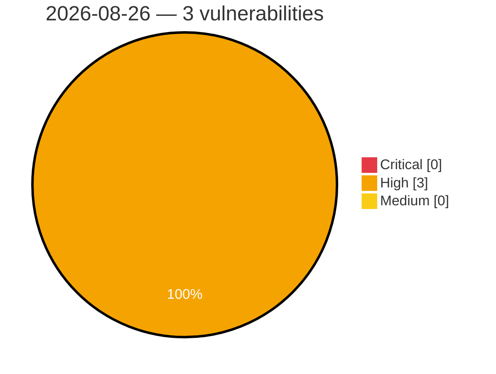

# Critical, High & Medium Severity Vulnerabilities — 2026-08-26

**Source status for this day:**

| Source | Critical | High | Medium | Total |
|--------|---------:|-----:|-------:|------:|
| cvefeed.io (High/Critical) | 0 | 3 | 0 | 3 |

**KEV (actively exploited):** 0  **Watchlist matches:** 1

## High (3)

| CVSS | Flags | Source | CVE / Title | Reported |
|------|-------|--------|-------------|----------|
| 8.6 | ⭐ | cvefeed.io (High/Critical) | [CVE-2026-80214 - LibreNMS Virtualisation Discovery Module RCE](https://cvefeed.io/vuln/detail/CVE-2026-80214) | 1 hour, 52 minutes ago |
| 8.3 | — | cvefeed.io (High/Critical) | [CVE-2026-29988 - Milesight IoT NFC Interface Information Disclosure Vulnerability](https://cvefeed.io/vuln/detail/CVE-2026-29988) | 49 minutes ago |
| 8.3 | — | cvefeed.io (High/Critical) | [CVE-2026-80216 - Milesight IoT NFC Interface Information Disclosure Vulnerability](https://cvefeed.io/vuln/detail/CVE-2026-80216) | 1 hour, 12 minutes ago |
