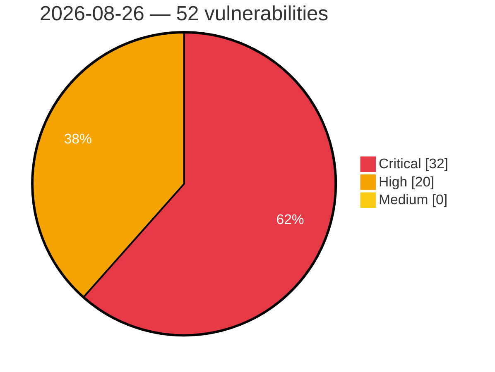

# Critical, High & Medium Severity Vulnerabilities — 2026-08-26

**Source status for this day:**

| Source | Critical | High | Medium | Total |
|--------|---------:|-----:|-------:|------:|
| cvefeed.io (High/Critical) | 32 | 20 | 0 | 52 |

**KEV (actively exploited):** 0  **Watchlist matches:** 38

## Critical (32)

| CVSS | Flags | Source | CVE / Title | Reported |
|------|-------|--------|-------------|----------|
| 10.0 | ⭐ | cvefeed.io (High/Critical) | [CVE-2026-77537 - UniFi Protect Application Command Injection Vulnerability](https://cvefeed.io/vuln/detail/CVE-2026-77537) | 42 minutes ago |
| 10.0 | — | cvefeed.io (High/Critical) | [CVE-2026-77550 - UniFi OS Improper Neutralization of CRLF Sequences Vulnerability](https://cvefeed.io/vuln/detail/CVE-2026-77550) | 27 minutes ago |
| 10.0 | ⭐ | cvefeed.io (High/Critical) | [CVE-2026-77554 - UniFi Talk Application Command Injection Vulnerability](https://cvefeed.io/vuln/detail/CVE-2026-77554) | 1 hour, 18 minutes ago |
| 9.9 | ⭐ | cvefeed.io (High/Critical) | [CVE-2026-77543 - UniFi Access Application Command Injection Vulnerability](https://cvefeed.io/vuln/detail/CVE-2026-77543) | 14 minutes ago |
| 9.9 | ⭐ | cvefeed.io (High/Critical) | [CVE-2026-77536 - UniFi OS Improper Access Control Privilege Escalation](https://cvefeed.io/vuln/detail/CVE-2026-77536) | 47 minutes ago |
| 9.9 | ⭐ | cvefeed.io (High/Critical) | [CVE-2026-77534 - UniFi OS Improper Access Control Privilege Escalation](https://cvefeed.io/vuln/detail/CVE-2026-77534) | 1 hour, 1 minute ago |
| 9.9 | ⭐ | cvefeed.io (High/Critical) | [CVE-2026-77533 - UniFi Protect Application Command Injection Vulnerability](https://cvefeed.io/vuln/detail/CVE-2026-77533) | 1 hour, 25 minutes ago |
| 9.9 | ⭐ | cvefeed.io (High/Critical) | [CVE-2026-77553 - UniFi Access Application Improper Access Control Privilege Escalation](https://cvefeed.io/vuln/detail/CVE-2026-77553) | 18 minutes ago |
| 9.9 | ⭐ | cvefeed.io (High/Critical) | [CVE-2026-77548 - UniFi Protect Application Command Injection Vulnerability](https://cvefeed.io/vuln/detail/CVE-2026-77548) | 37 minutes ago |
| 9.9 | ⭐ | cvefeed.io (High/Critical) | [CVE-2026-77547 - UniFi Access Application Command Injection Vulnerability](https://cvefeed.io/vuln/detail/CVE-2026-77547) | 40 minutes ago |
| 9.9 | ⭐ | cvefeed.io (High/Critical) | [CVE-2026-77546 - UniFi Access Application Command Injection Vulnerability](https://cvefeed.io/vuln/detail/CVE-2026-77546) | 44 minutes ago |
| 9.8 | ⭐ | cvefeed.io (High/Critical) | [CVE-2026-80349 - TarsWeb through 3.0.14 Authentication Bypass via Spoofed X-Forwarded-For and uid Parameter](https://cvefeed.io/vuln/detail/CVE-2026-80349) | 12 minutes ago |
| 9.8 | — | cvefeed.io (High/Critical) | [CVE-2026-59683 - OpenRGB: local and remote system compromise via arbitrary file write using attacker controlled strings](https://cvefeed.io/vuln/detail/CVE-2026-59683) | 57 minutes ago |
| 9.8 | ⭐ | cvefeed.io (High/Critical) | [CVE-2026-80235 - Thinking Software Technology｜EFence - Arbitrary File Upload](https://cvefeed.io/vuln/detail/CVE-2026-80235) | 1 hour, 56 minutes ago |
| 9.8 | ⭐ | cvefeed.io (High/Critical) | [CVE-2026-77552 - UniFi Enterprise Audio/Video Bridge Command Injection Vulnerability](https://cvefeed.io/vuln/detail/CVE-2026-77552) | 20 minutes ago |
| 9.8 | ⭐ | cvefeed.io (High/Critical) | [CVE-2026-80203 - Grav before 1.0.18 Authentication Bypass via Scoped API Key](https://cvefeed.io/vuln/detail/CVE-2026-80203) | 32 minutes ago |
| 9.8 | ⭐ | cvefeed.io (High/Critical) | [CVE-2026-77557 - UniFi Protect AI Key Improper Access Control Vulnerability](https://cvefeed.io/vuln/detail/CVE-2026-77557) | 1 hour, 10 minutes ago |
| 9.8 | ⭐ | cvefeed.io (High/Critical) | [CVE-2026-18080 - ERP: Complete HR, Accounting & CRM Suite Built for WooCommerce <= 1.17.8 - Unauthenticated Arbitrary File Upload via CRM Email Connect IMAP Attachment](https://cvefeed.io/vuln/detail/CVE-2026-18080) | 2 hours, 41 minutes ago |
| 9.6 | ⭐ | cvefeed.io (High/Critical) | [CVE-2026-77532 - Ubiquiti EdgeMAX EdgeSwitch Buffer Overflow Vulnerability](https://cvefeed.io/vuln/detail/CVE-2026-77532) | 1 hour, 2 minutes ago |
| 9.4 | ⭐ | cvefeed.io (High/Critical) | [CVE-2026-12717 - Remote Code Execution in BigQuery Data Transfer Service via JDBC Connection String Injection](https://cvefeed.io/vuln/detail/CVE-2026-12717) | 47 minutes ago |
| 9.3 | ⭐ | cvefeed.io (High/Critical) | [CVE-2026-15203 - Debug interfaces are accessible by default in Danfoss iC7 Automation SP, iC7 Marine and iC7 7Hybrid software](https://cvefeed.io/vuln/detail/CVE-2026-15203) | 14 minutes ago |
| 9.3 | ⭐ | cvefeed.io (High/Critical) | [CVE-2026-80204 - Grav before 1.0.18 Authentication Bypass via Scoped API Key](https://cvefeed.io/vuln/detail/CVE-2026-80204) | 32 minutes ago |
| 9.1 | ⭐ | cvefeed.io (High/Critical) | [CVE-2026-77542 - UID Enterprise Agent Command Injection Vulnerability](https://cvefeed.io/vuln/detail/CVE-2026-77542) | 21 minutes ago |
| 9.1 | ⭐ | cvefeed.io (High/Critical) | [CVE-2026-77541 - UniFi Network Application Improper Access Control Privilege Escalation](https://cvefeed.io/vuln/detail/CVE-2026-77541) | 24 minutes ago |
| 9.1 | ⭐ | cvefeed.io (High/Critical) | [CVE-2026-77540 - UniFi OS Server Command Injection Vulnerability](https://cvefeed.io/vuln/detail/CVE-2026-77540) | 28 minutes ago |
| 9.1 | ⭐ | cvefeed.io (High/Critical) | [CVE-2026-77539 - UniFi OS Server Command Injection Vulnerability](https://cvefeed.io/vuln/detail/CVE-2026-77539) | 32 minutes ago |
| 9.1 | ⭐ | cvefeed.io (High/Critical) | [CVE-2026-77535 - UniFi Network Application Command Injection Vulnerability](https://cvefeed.io/vuln/detail/CVE-2026-77535) | 55 minutes ago |
| 9.1 | — | cvefeed.io (High/Critical) | [CVE-2026-59682 - Arbitrary file overwrite and deletion local and remote in OpenRGB](https://cvefeed.io/vuln/detail/CVE-2026-59682) | 1 hour, 9 minutes ago |
| 9.1 | — | cvefeed.io (High/Critical) | [CVE-2026-75896 - Use of Hard-coded LDAP Credentials in TÜBİTAK BİLGEM's Liderahenk](https://cvefeed.io/vuln/detail/CVE-2026-75896) | 11 minutes ago |
| 9.0 | ⭐ | cvefeed.io (High/Critical) | [CVE-2026-77545 - Ubiquiti UniFi OS Active Debug Code Privilege Escalation](https://cvefeed.io/vuln/detail/CVE-2026-77545) | 8 minutes ago |
| 9.0 | ⭐ | cvefeed.io (High/Critical) | [CVE-2026-77551 - UniFi Connect Display Cast Pro Improper Access Control Privilege Escalation](https://cvefeed.io/vuln/detail/CVE-2026-77551) | 23 minutes ago |
| 9.0 | ⭐ | cvefeed.io (High/Critical) | [CVE-2026-77549 - UniFi OS CRLF Injection Authentication Bypass](https://cvefeed.io/vuln/detail/CVE-2026-77549) | 30 minutes ago |

## High (20)

| CVSS | Flags | Source | CVE / Title | Reported |
|------|-------|--------|-------------|----------|
| 8.8 | — | cvefeed.io (High/Critical) | [CVE-2026-78236 - Insecure PIN derivation mechanism in Admin By Request (ABR)](https://cvefeed.io/vuln/detail/CVE-2026-78236) | 42 minutes ago |
| 8.8 | ⭐ | cvefeed.io (High/Critical) | [CVE-2026-80348 - TarsWeb through 3.0.16 Missing Authorization on Patch Deploy, Download and Delete Endpoints](https://cvefeed.io/vuln/detail/CVE-2026-80348) | 12 minutes ago |
| 8.8 | — | cvefeed.io (High/Critical) | [CVE-2026-18794 - OpenRGB: insufficient input data checks lead to Denial-of-Service, memory overread and overwrite](https://cvefeed.io/vuln/detail/CVE-2026-18794) | 52 minutes ago |
| 8.8 | ⭐ | cvefeed.io (High/Critical) | [CVE-2026-19042 - Command Injection in TeamViewer Desktop Client for Linux through Chat Link Handling](https://cvefeed.io/vuln/detail/CVE-2026-19042) | 1 hour, 6 minutes ago |
| 8.8 | ⭐ | cvefeed.io (High/Critical) | [CVE-2026-80237 - Thinking Software Technology｜Efence - Arbitrary File Upload](https://cvefeed.io/vuln/detail/CVE-2026-80237) | 1 hour, 54 minutes ago |
| 8.8 | ⭐ | cvefeed.io (High/Critical) | [CVE-2026-80236 - Thinking Software Technology｜Efence - SQL Injection](https://cvefeed.io/vuln/detail/CVE-2026-80236) | 1 hour, 55 minutes ago |
| 8.7 | ⭐ | cvefeed.io (High/Critical) | [CVE-2026-80347 - mcp-fetch through 1.6.3 Server-Side Request Forgery via Unstripped IPv6 Literal Brackets](https://cvefeed.io/vuln/detail/CVE-2026-80347) | 12 minutes ago |
| 8.7 | — | cvefeed.io (High/Critical) | [CVE-2026-80205 - NLTK before 3.10.0 ReDoS via Text.findall() unvalidated regex](https://cvefeed.io/vuln/detail/CVE-2026-80205) | 32 minutes ago |
| 8.7 | — | cvefeed.io (High/Critical) | [CVE-2026-75960 - Insufficiently Protected Credentials in Rently Smart Home](https://cvefeed.io/vuln/detail/CVE-2026-75960) | 26 minutes ago |
| 8.7 | — | cvefeed.io (High/Critical) | [CVE-2026-73108 - RustDesk < 1.4.7 Uncontrolled Memory Allocation DoS via BytesCodec](https://cvefeed.io/vuln/detail/CVE-2026-73108) | 46 minutes ago |
| 8.6 | ⭐ | cvefeed.io (High/Critical) | [CVE-2026-80214 - LibreNMS Virtualisation Discovery Module RCE](https://cvefeed.io/vuln/detail/CVE-2026-80214) | 1 hour, 52 minutes ago |
| 8.6 | ⭐ | cvefeed.io (High/Critical) | [CVE-2026-12587 - Embedded credentials in Virtuagym](https://cvefeed.io/vuln/detail/CVE-2026-12587) | 1 hour, 26 minutes ago |
| 8.4 | — | cvefeed.io (High/Critical) | [CVE-2026-76148 - CorvusSKK Code Injection Vulnerability](https://cvefeed.io/vuln/detail/CVE-2026-76148) | 55 minutes ago |
| 8.3 | — | cvefeed.io (High/Critical) | [CVE-2026-29988 - Milesight IoT NFC Interface Information Disclosure Vulnerability](https://cvefeed.io/vuln/detail/CVE-2026-29988) | 49 minutes ago |
| 8.3 | — | cvefeed.io (High/Critical) | [CVE-2026-80216 - Milesight IoT NFC Interface Information Disclosure Vulnerability](https://cvefeed.io/vuln/detail/CVE-2026-80216) | 1 hour, 12 minutes ago |
| 8.2 | ⭐ | cvefeed.io (High/Critical) | [CVE-2026-77538 - UniFi Connect Application Improper Access Control Privilege Escalation](https://cvefeed.io/vuln/detail/CVE-2026-77538) | 34 minutes ago |
| 8.2 | ⭐ | cvefeed.io (High/Critical) | [CVE-2026-19538 - Bypass of BLOCKED ACL items on proxy protocol port over TCP or TLS](https://cvefeed.io/vuln/detail/CVE-2026-19538) | 1 hour, 35 minutes ago |
| 8.2 | — | cvefeed.io (High/Critical) | [CVE-2026-19401 - Remote UDP DoS by sending multiple DNS Cookie options](https://cvefeed.io/vuln/detail/CVE-2026-19401) | 1 hour, 38 minutes ago |
| 8.2 | ⭐ | cvefeed.io (High/Critical) | [CVE-2026-18664 - Wrong interpretation of ACL ranges](https://cvefeed.io/vuln/detail/CVE-2026-18664) | 1 hour, 48 minutes ago |
| 8.2 | — | cvefeed.io (High/Critical) | [CVE-2026-80206 - NLTK 3.10.2 Regular Expression Denial of Service via tgrep](https://cvefeed.io/vuln/detail/CVE-2026-80206) | 32 minutes ago |
