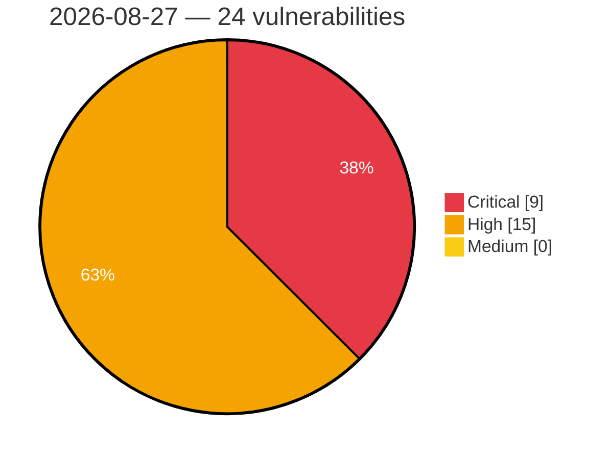

# Critical, High & Medium Severity Vulnerabilities — 2026-08-27

**Source status for this day:**

| Source | Critical | High | Medium | Total |
|--------|---------:|-----:|-------:|------:|
| cvefeed.io (High/Critical) | 9 | 15 | 0 | 24 |

**KEV (actively exploited):** 0  **Watchlist matches:** 18

## Critical (9)

| CVSS | Flags | Source | CVE / Title | Reported |
|------|-------|--------|-------------|----------|
| 9.8 | — | cvefeed.io (High/Critical) | [CVE-2026-78292 - WordPress Hash Form plugin <= 1.4.1 - PHP Object Injection vulnerability](https://cvefeed.io/vuln/detail/CVE-2026-78292) | 1 hour, 12 minutes ago |
| 9.8 | — | cvefeed.io (High/Critical) | [CVE-2026-78286 - WordPress Geo Controller plugin <= 8.9.8 - PHP Object Injection vulnerability](https://cvefeed.io/vuln/detail/CVE-2026-78286) | 1 hour, 12 minutes ago |
| 9.8 | ⭐ | cvefeed.io (High/Critical) | [CVE-2026-32566 - WordPress ACPT (Pro) - Custom Post Types Plugin for WordPress plugin <= 2.0.63 - Privilege Escalation vulnerability](https://cvefeed.io/vuln/detail/CVE-2026-32566) | 1 hour, 13 minutes ago |
| 9.4 | ⭐ | cvefeed.io (High/Critical) | [CVE-2026-77991 - Joomla Extension - joomlaeventmanager.net - Privileged remote code execution in Joomla Event Manager < 5.0.1](https://cvefeed.io/vuln/detail/CVE-2026-77991) | 5 hours, 12 minutes ago |
| 9.4 | — | cvefeed.io (High/Critical) | [CVE-2026-59270 - Spring Security embedded UnboundID LDAP server exposes well-known administrative bind DN on all network interfaces](https://cvefeed.io/vuln/detail/CVE-2026-59270) | 5 hours, 12 minutes ago |
| 9.3 | ⭐ | cvefeed.io (High/Critical) | [CVE-2026-78288 - WordPress Beautiful Taxonomy Filters plugin <= 2.4.6 - SQL Injection vulnerability](https://cvefeed.io/vuln/detail/CVE-2026-78288) | 1 hour, 12 minutes ago |
| 9.3 | ⭐ | cvefeed.io (High/Critical) | [CVE-2026-78260 - WordPress Epayco plugin <= 8.4.6 - SQL Injection vulnerability](https://cvefeed.io/vuln/detail/CVE-2026-78260) | 1 hour, 12 minutes ago |
| 9.3 | ⭐ | cvefeed.io (High/Critical) | [CVE-2026-32479 - WordPress Visitor Traffic Real Time Statistics Pro plugin <= 11.17 - SQL Injection vulnerability](https://cvefeed.io/vuln/detail/CVE-2026-32479) | 1 hour, 13 minutes ago |
| 9.1 | ⭐ | cvefeed.io (High/Critical) | [CVE-2026-78274 - WordPress Fluent Boards Pro plugin <= 2.0.11 - Arbitrary File Upload vulnerability](https://cvefeed.io/vuln/detail/CVE-2026-78274) | 1 hour, 12 minutes ago |

## High (15)

| CVSS | Flags | Source | CVE / Title | Reported |
|------|-------|--------|-------------|----------|
| 8.8 | — | cvefeed.io (High/Critical) | [CVE-2026-81625 - Stack buffer overflow in Greenbone OS and openvas-scanner](https://cvefeed.io/vuln/detail/CVE-2026-81625) | 1 hour, 12 minutes ago |
| 8.8 | ⭐ | cvefeed.io (High/Critical) | [CVE-2026-81581 - User input in WibuKey is used (without proper sanitization) to compute the address of a pointer, which can be exploited to let the user point to any storage, to which Windows responds with a denial of service.](https://cvefeed.io/vuln/detail/CVE-2026-81581) | 1 hour, 12 minutes ago |
| 8.8 | ⭐ | cvefeed.io (High/Critical) | [CVE-2026-81579 - An untrusted Pointer Dereference can be exploited to escalate privileges by an unprivileged user on Windows](https://cvefeed.io/vuln/detail/CVE-2026-81579) | 1 hour, 12 minutes ago |
| 8.8 | ⭐ | cvefeed.io (High/Critical) | [CVE-2026-81271 - WordPress GeoDirectory plugin <= 2.8.176 - Cross Site Request Forgery (CSRF) vulnerability](https://cvefeed.io/vuln/detail/CVE-2026-81271) | 1 hour, 12 minutes ago |
| 8.8 | — | cvefeed.io (High/Critical) | [CVE-2026-78257 - WordPress Booking and Rental Manager plugin <= 2.7.5 - PHP Object Injection vulnerability](https://cvefeed.io/vuln/detail/CVE-2026-78257) | 1 hour, 12 minutes ago |
| 8.7 | ⭐ | cvefeed.io (High/Critical) | [CVE-2026-75005 - Apache APISIX: Unauthenticated CPU-exhaustion DoS](https://cvefeed.io/vuln/detail/CVE-2026-75005) | 1 hour, 12 minutes ago |
| 8.6 | ⭐ | cvefeed.io (High/Critical) | [CVE-2026-81573 - Improper Access Control in Local-Only Configuration Commands](https://cvefeed.io/vuln/detail/CVE-2026-81573) | 1 hour, 12 minutes ago |
| 8.6 | ⭐ | cvefeed.io (High/Critical) | [CVE-2026-27330 - WordPress Mobile App for WooCommerce plugin <= 0.4.62 - Broken Access Control vulnerability](https://cvefeed.io/vuln/detail/CVE-2026-27330) | 1 hour, 13 minutes ago |
| 8.5 | ⭐ | cvefeed.io (High/Critical) | [CVE-2026-81277 - WordPress Suggestion Engine for WooCommerce plugin <= 2.0.11 - SQL Injection vulnerability](https://cvefeed.io/vuln/detail/CVE-2026-81277) | 1 hour, 12 minutes ago |
| 8.5 | ⭐ | cvefeed.io (High/Critical) | [CVE-2026-78285 - WordPress Like Button Rating plugin <= 2.6.61 - SQL Injection vulnerability](https://cvefeed.io/vuln/detail/CVE-2026-78285) | 1 hour, 12 minutes ago |
| 8.5 | ⭐ | cvefeed.io (High/Critical) | [CVE-2026-32564 - WordPress ACPT (Pro) - Custom Post Types Plugin for WordPress plugin <= 2.0.63 - SQL Injection vulnerability](https://cvefeed.io/vuln/detail/CVE-2026-32564) | 1 hour, 13 minutes ago |
| 8.5 | ⭐ | cvefeed.io (High/Critical) | [CVE-2026-32550 - WordPress Kadence Shop Kit plugin <= 3.0.6 - SQL Injection vulnerability](https://cvefeed.io/vuln/detail/CVE-2026-32550) | 1 hour, 13 minutes ago |
| 8.2 | — | cvefeed.io (High/Critical) | [CVE-2026-81574 - Format String Vulnerability in Logger](https://cvefeed.io/vuln/detail/CVE-2026-81574) | 1 hour, 12 minutes ago |
| 8.2 | ⭐ | cvefeed.io (High/Critical) | [CVE-2026-47877 - Spring Security Authorization Server Default Consent Page is vulnerable to Cross-Site Scripting (XSS)](https://cvefeed.io/vuln/detail/CVE-2026-47877) | 5 hours, 12 minutes ago |
| 8.1 | ⭐ | cvefeed.io (High/Critical) | [CVE-2026-81273 - WordPress FluentBooking Pro plugin <= 2.2.4 - Cross Site Request Forgery (CSRF) vulnerability](https://cvefeed.io/vuln/detail/CVE-2026-81273) | 1 hour, 12 minutes ago |
