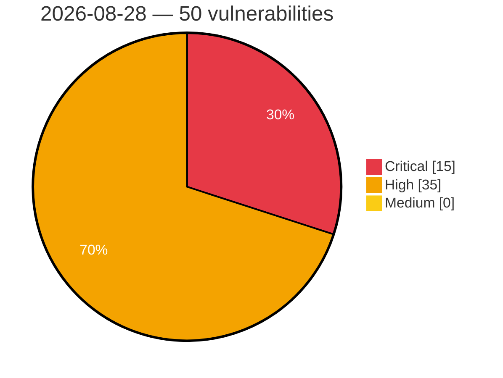

# Critical, High & Medium Severity Vulnerabilities — 2026-08-28

**Source status for this day:**

| Source | Critical | High | Medium | Total |
|--------|---------:|-----:|-------:|------:|
| cvefeed.io (High/Critical) | 15 | 35 | 0 | 50 |

**KEV (actively exploited):** 0  **Watchlist matches:** 31

## Critical (15)

| CVSS | Flags | Source | CVE / Title | Reported |
|------|-------|--------|-------------|----------|
| 10.0 | ⭐ | cvefeed.io (High/Critical) | [CVE-2026-82222 - WordPress GiveWP plugin <= 4.16.7.1 - Remote Code Execution (RCE) vulnerability](https://cvefeed.io/vuln/detail/CVE-2026-82222) | 6 hours, 48 minutes ago |
| 9.8 | ⭐ | cvefeed.io (High/Critical) | [CVE-2026-82082 - Green-Computing｜NUMail - OS Command Injection](https://cvefeed.io/vuln/detail/CVE-2026-82082) | 1 hour, 28 minutes ago |
| 9.8 | — | cvefeed.io (High/Critical) | [CVE-2026-78239 - Xiiaozet LK100W Missing Authentication for Critical Function](https://cvefeed.io/vuln/detail/CVE-2026-78239) | 6 hours, 27 minutes ago |
| 9.8 | ⭐ | cvefeed.io (High/Critical) | [CVE-2026-78032 - SOY CMS Deserialization of Untrusted Data Vulnerability](https://cvefeed.io/vuln/detail/CVE-2026-78032) | 10 hours, 48 minutes ago |
| 9.4 | — | cvefeed.io (High/Critical) | [CVE-2026-82078 - PaperCut MF/NG: Unsafe Dynamic Class Loading in Database Connector](https://cvefeed.io/vuln/detail/CVE-2026-82078) | 2 hours, 46 minutes ago |
| 9.4 | ⭐ | cvefeed.io (High/Critical) | [CVE-2026-82244 - Budibase before 3.41.3 Remote Code Execution via Plugin eval()](https://cvefeed.io/vuln/detail/CVE-2026-82244) | 6 hours, 48 minutes ago |
| 9.3 | — | cvefeed.io (High/Critical) | [CVE-2026-78174 - WatchGuard Dimension Session Hijack via Exposed Session Tokens in Diagnostic Logs](https://cvefeed.io/vuln/detail/CVE-2026-78174) | 4 hours, 28 minutes ago |
| 9.3 | ⭐ | cvefeed.io (High/Critical) | [CVE-2026-19318 - Fireware OS Pre-Authentication Stack Buffer Overflow in iked Allows Remote Code Execution](https://cvefeed.io/vuln/detail/CVE-2026-19318) | 4 hours, 28 minutes ago |
| 9.3 | ⭐ | cvefeed.io (High/Critical) | [CVE-2026-19315 - Fireware OS Pre-Authentication Type Confusion in iked Allows Remote Code Execution](https://cvefeed.io/vuln/detail/CVE-2026-19315) | 4 hours, 28 minutes ago |
| 9.3 | ⭐ | cvefeed.io (High/Critical) | [CVE-2026-19313 - Fireware OS Pre-Authentication Heap Buffer Overflow in iked Allows Remote Code Execution](https://cvefeed.io/vuln/detail/CVE-2026-19313) | 4 hours, 28 minutes ago |
| 9.3 | — | cvefeed.io (High/Critical) | [CVE-2026-13086 - Fireware OS Stack-Based Buffer Overflow in Mobile Security epm Endpoint](https://cvefeed.io/vuln/detail/CVE-2026-13086) | 4 hours, 28 minutes ago |
| 9.2 | ⭐ | cvefeed.io (High/Critical) | [CVE-2026-82090 - Pocket Cross-Site Scripting Vulnerability](https://cvefeed.io/vuln/detail/CVE-2026-82090) | 1 hour, 28 minutes ago |
| 9.1 | ⭐ | cvefeed.io (High/Critical) | [CVE-2026-61800 - Wazuh cluster worker file sync allows arbitrary file write under /var/ossec (incomplete fix for CVE-2026-30893)](https://cvefeed.io/vuln/detail/CVE-2026-61800) | 4 hours, 28 minutes ago |
| 9.1 | — | cvefeed.io (High/Critical) | [CVE-2026-42007 - Dovecot Sieve Editheader Use-After-Free Vulnerability](https://cvefeed.io/vuln/detail/CVE-2026-42007) | 6 hours, 48 minutes ago |
| 9.1 | ⭐ | cvefeed.io (High/Critical) | [CVE-2026-18918 - OAuth 1.0 session-fixation chain via unauthenticated provisional-consumer registration and insecure v1_0Allowed default](https://cvefeed.io/vuln/detail/CVE-2026-18918) | 6 hours, 48 minutes ago |

## High (35)

| CVSS | Flags | Source | CVE / Title | Reported |
|------|-------|--------|-------------|----------|
| 8.8 | ⭐ | cvefeed.io (High/Critical) | [CVE-2026-82089 - wallabag Android Application Cross-Site Scripting Vulnerability](https://cvefeed.io/vuln/detail/CVE-2026-82089) | 1 hour, 28 minutes ago |
| 8.8 | ⭐ | cvefeed.io (High/Critical) | [CVE-2026-78037 - Xiiaozet LK100W OS Command Injection](https://cvefeed.io/vuln/detail/CVE-2026-78037) | 6 hours, 27 minutes ago |
| 8.8 | ⭐ | cvefeed.io (High/Critical) | [CVE-2026-81578 - PaperCut MF/NG: Authentication Bypass](https://cvefeed.io/vuln/detail/CVE-2026-81578) | 2 hours, 46 minutes ago |
| 8.8 | — | cvefeed.io (High/Critical) | [CVE-2026-13761 - Pega Platform versions 7.1.0 through 25.1.2 are affected by an improper validation of inputs that are used for loop conditions, potentially leading to a denial of service or other consequences because of excessive looping.](https://cvefeed.io/vuln/detail/CVE-2026-13761) | 2 hours, 48 minutes ago |
| 8.7 | — | cvefeed.io (High/Critical) | [CVE-2026-78011 - Fireware OS Integer Underflow in Iked Allows Unauthenticated Denial of Service (DoS)](https://cvefeed.io/vuln/detail/CVE-2026-78011) | 4 hours, 28 minutes ago |
| 8.7 | — | cvefeed.io (High/Critical) | [CVE-2026-78010 - Fireware OS Stack-Based Buffer Overflow in iked Allows Unauthenticated Denial of Service](https://cvefeed.io/vuln/detail/CVE-2026-78010) | 4 hours, 28 minutes ago |
| 8.7 | — | cvefeed.io (High/Critical) | [CVE-2026-78009 - Fireware OS Out-of-Bounds Read in iked Allows Unauthenticated Denial of Service (DoS)](https://cvefeed.io/vuln/detail/CVE-2026-78009) | 4 hours, 28 minutes ago |
| 8.7 | — | cvefeed.io (High/Critical) | [CVE-2026-19317 - Fireware OS Pre-Authentication Out-of-Bounds Read in iked Allows Denial of Service (DoS)](https://cvefeed.io/vuln/detail/CVE-2026-19317) | 4 hours, 28 minutes ago |
| 8.7 | — | cvefeed.io (High/Critical) | [CVE-2026-19316 - Fireware OS Pre-Authentication Double Free in iked Allows Denial of Service (DoS)](https://cvefeed.io/vuln/detail/CVE-2026-19316) | 4 hours, 28 minutes ago |
| 8.7 | — | cvefeed.io (High/Critical) | [CVE-2026-19314 - Fireware OS Integer Underflow in iked Allows Unauthenticated Denial of Service (DoS)](https://cvefeed.io/vuln/detail/CVE-2026-19314) | 4 hours, 28 minutes ago |
| 8.7 | — | cvefeed.io (High/Critical) | [CVE-2026-13108 - Dimension Denial-of-Service](https://cvefeed.io/vuln/detail/CVE-2026-13108) | 4 hours, 28 minutes ago |
| 8.7 | — | cvefeed.io (High/Critical) | [CVE-2026-19412 - Hardcoded Credentials Vulnerability in CP Plus CP-XR-DE21-S Router](https://cvefeed.io/vuln/detail/CVE-2026-19412) | 2 hours, 48 minutes ago |
| 8.7 | ⭐ | cvefeed.io (High/Critical) | [CVE-2026-82261 - SvelteKit before 2.52.2 CPU Exhaustion via Remote Form Deserialization](https://cvefeed.io/vuln/detail/CVE-2026-82261) | 6 hours, 48 minutes ago |
| 8.7 | ⭐ | cvefeed.io (High/Critical) | [CVE-2026-82260 - SvelteKit before 2.52.2 Memory Exhaustion via Remote Form Deserialization](https://cvefeed.io/vuln/detail/CVE-2026-82260) | 6 hours, 48 minutes ago |
| 8.7 | ⭐ | cvefeed.io (High/Critical) | [CVE-2026-82259 - SvelteKit 2.49.0 before 2.53.3 Denial of Service via form](https://cvefeed.io/vuln/detail/CVE-2026-82259) | 6 hours, 48 minutes ago |
| 8.7 | — | cvefeed.io (High/Critical) | [CVE-2026-82254 - gitoxide before 0.69.0 Denial of Service via gix-pack](https://cvefeed.io/vuln/detail/CVE-2026-82254) | 6 hours, 48 minutes ago |
| 8.7 | ⭐ | cvefeed.io (High/Critical) | [CVE-2026-82253 - gitoxide before 0.82.0 Path Traversal via Submodule Name Validation Bypass](https://cvefeed.io/vuln/detail/CVE-2026-82253) | 6 hours, 48 minutes ago |
| 8.7 | — | cvefeed.io (High/Critical) | [CVE-2026-82252 - gitoxide before 0.52.1 Repository Boundary Violation via symlinked .gitmodules](https://cvefeed.io/vuln/detail/CVE-2026-82252) | 6 hours, 48 minutes ago |
| 8.7 | ⭐ | cvefeed.io (High/Critical) | [CVE-2026-82251 - gitoxide before 0.52.1 Path Traversal via Submodule Name](https://cvefeed.io/vuln/detail/CVE-2026-82251) | 6 hours, 48 minutes ago |
| 8.7 | — | cvefeed.io (High/Critical) | [CVE-2026-82247 - gitoxide before 0.37.1 HTTP Basic credential leak via URL parsing](https://cvefeed.io/vuln/detail/CVE-2026-82247) | 6 hours, 48 minutes ago |
| 8.7 | ⭐ | cvefeed.io (High/Critical) | [CVE-2026-78072 - Joomla Extension - Jefferson49 - Unauthenticated blind SQLi in Sexy Polling Reloaded < 5.6.1](https://cvefeed.io/vuln/detail/CVE-2026-78072) | 6 hours, 48 minutes ago |
| 8.6 | ⭐ | cvefeed.io (High/Critical) | [CVE-2026-78614 - Dimension SQL Injection in Audit Report](https://cvefeed.io/vuln/detail/CVE-2026-78614) | 4 hours, 28 minutes ago |
| 8.6 | ⭐ | cvefeed.io (High/Critical) | [CVE-2026-78613 - Dimension SQL Injection in Log Viewer](https://cvefeed.io/vuln/detail/CVE-2026-78613) | 4 hours, 28 minutes ago |
| 8.6 | ⭐ | cvefeed.io (High/Critical) | [CVE-2026-78612 - Dimension SQL Injection in Scheduled Report](https://cvefeed.io/vuln/detail/CVE-2026-78612) | 4 hours, 28 minutes ago |
| 8.6 | — | cvefeed.io (High/Critical) | [CVE-2026-78008 - Fireware OS Authenticated Buffer Overflow in wgagent](https://cvefeed.io/vuln/detail/CVE-2026-78008) | 4 hours, 28 minutes ago |
| 8.6 | ⭐ | cvefeed.io (High/Critical) | [CVE-2026-82240 - Budibase before 3.41.3 Privilege Escalation via User Update API](https://cvefeed.io/vuln/detail/CVE-2026-82240) | 6 hours, 48 minutes ago |
| 8.6 | ⭐ | cvefeed.io (High/Critical) | [CVE-2026-82239 - Budibase before 3.41.3 Authorization Bypass via datasources/query](https://cvefeed.io/vuln/detail/CVE-2026-82239) | 6 hours, 48 minutes ago |
| 8.5 | ⭐ | cvefeed.io (High/Critical) | [CVE-2026-82227 - WordPress WPBulky plugin <= 1.2.2 - SQL Injection vulnerability](https://cvefeed.io/vuln/detail/CVE-2026-82227) | 2 hours, 46 minutes ago |
| 8.4 | ⭐ | cvefeed.io (High/Critical) | [CVE-2026-78610 - Dimension CSRF Vulnerability in Administrator Passphrase Change Endpoint](https://cvefeed.io/vuln/detail/CVE-2026-78610) | 4 hours, 28 minutes ago |
| 8.4 | ⭐ | cvefeed.io (High/Critical) | [CVE-2026-82234 - SiYuan before v3.8.1 SSRF via DNS-Rebinding TOCTOU](https://cvefeed.io/vuln/detail/CVE-2026-82234) | 6 hours, 48 minutes ago |
| 8.3 | ⭐ | cvefeed.io (High/Critical) | [CVE-2026-38820 - openNDS OS Command Injection Vulnerability](https://cvefeed.io/vuln/detail/CVE-2026-38820) | 4 hours, 28 minutes ago |
| 8.3 | ⭐ | cvefeed.io (High/Critical) | [CVE-2026-82243 - Budibase Server before 3.41.3 SSRF with Credential Leakage](https://cvefeed.io/vuln/detail/CVE-2026-82243) | 6 hours, 48 minutes ago |
| 8.3 | ⭐ | cvefeed.io (High/Critical) | [CVE-2026-82242 - Budibase before 3.41.3 Cross-Application Resource Injection via Missing Authorization](https://cvefeed.io/vuln/detail/CVE-2026-82242) | 6 hours, 48 minutes ago |
| 8.1 | — | cvefeed.io (High/Critical) | [CVE-2026-77977 - Ebyte NE2-D11 Missing Authentication for Critical Function](https://cvefeed.io/vuln/detail/CVE-2026-77977) | 6 hours, 27 minutes ago |
| 8.1 | ⭐ | cvefeed.io (High/Critical) | [CVE-2026-82245 - Budibase before 3.41.3 Missing Authorization License Management](https://cvefeed.io/vuln/detail/CVE-2026-82245) | 6 hours, 48 minutes ago |
