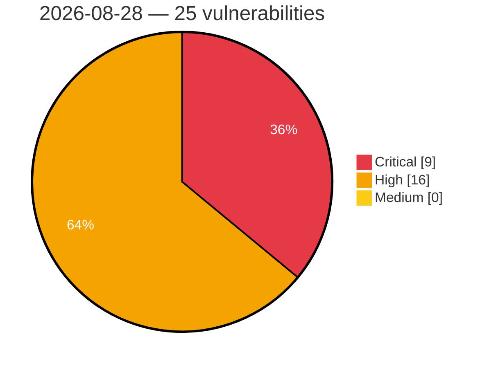

# Critical, High & Medium Severity Vulnerabilities — 2026-08-28

**Source status for this day:**

| Source | Critical | High | Medium | Total |
|--------|---------:|-----:|-------:|------:|
| cvefeed.io (High/Critical) | 9 | 16 | 0 | 25 |

**KEV (actively exploited):** 0  **Watchlist matches:** 13

## Critical (9)

| CVSS | Flags | Source | CVE / Title | Reported |
|------|-------|--------|-------------|----------|
| 9.8 | ⭐ | cvefeed.io (High/Critical) | [CVE-2026-82082 - Green-Computing｜NUMail - OS Command Injection](https://cvefeed.io/vuln/detail/CVE-2026-82082) | 1 hour, 28 minutes ago |
| 9.8 | — | cvefeed.io (High/Critical) | [CVE-2026-78239 - Xiiaozet LK100W Missing Authentication for Critical Function](https://cvefeed.io/vuln/detail/CVE-2026-78239) | 6 hours, 27 minutes ago |
| 9.3 | — | cvefeed.io (High/Critical) | [CVE-2026-78174 - WatchGuard Dimension Session Hijack via Exposed Session Tokens in Diagnostic Logs](https://cvefeed.io/vuln/detail/CVE-2026-78174) | 4 hours, 28 minutes ago |
| 9.3 | ⭐ | cvefeed.io (High/Critical) | [CVE-2026-19318 - Fireware OS Pre-Authentication Stack Buffer Overflow in iked Allows Remote Code Execution](https://cvefeed.io/vuln/detail/CVE-2026-19318) | 4 hours, 28 minutes ago |
| 9.3 | ⭐ | cvefeed.io (High/Critical) | [CVE-2026-19315 - Fireware OS Pre-Authentication Type Confusion in iked Allows Remote Code Execution](https://cvefeed.io/vuln/detail/CVE-2026-19315) | 4 hours, 28 minutes ago |
| 9.3 | ⭐ | cvefeed.io (High/Critical) | [CVE-2026-19313 - Fireware OS Pre-Authentication Heap Buffer Overflow in iked Allows Remote Code Execution](https://cvefeed.io/vuln/detail/CVE-2026-19313) | 4 hours, 28 minutes ago |
| 9.3 | — | cvefeed.io (High/Critical) | [CVE-2026-13086 - Fireware OS Stack-Based Buffer Overflow in Mobile Security epm Endpoint](https://cvefeed.io/vuln/detail/CVE-2026-13086) | 4 hours, 28 minutes ago |
| 9.2 | ⭐ | cvefeed.io (High/Critical) | [CVE-2026-82090 - Pocket Cross-Site Scripting Vulnerability](https://cvefeed.io/vuln/detail/CVE-2026-82090) | 1 hour, 28 minutes ago |
| 9.1 | ⭐ | cvefeed.io (High/Critical) | [CVE-2026-61800 - Wazuh cluster worker file sync allows arbitrary file write under /var/ossec (incomplete fix for CVE-2026-30893)](https://cvefeed.io/vuln/detail/CVE-2026-61800) | 4 hours, 28 minutes ago |

## High (16)

| CVSS | Flags | Source | CVE / Title | Reported |
|------|-------|--------|-------------|----------|
| 8.8 | ⭐ | cvefeed.io (High/Critical) | [CVE-2026-82089 - wallabag Android Application Cross-Site Scripting Vulnerability](https://cvefeed.io/vuln/detail/CVE-2026-82089) | 1 hour, 28 minutes ago |
| 8.8 | ⭐ | cvefeed.io (High/Critical) | [CVE-2026-78037 - Xiiaozet LK100W OS Command Injection](https://cvefeed.io/vuln/detail/CVE-2026-78037) | 6 hours, 27 minutes ago |
| 8.7 | — | cvefeed.io (High/Critical) | [CVE-2026-78011 - Fireware OS Integer Underflow in Iked Allows Unauthenticated Denial of Service (DoS)](https://cvefeed.io/vuln/detail/CVE-2026-78011) | 4 hours, 28 minutes ago |
| 8.7 | — | cvefeed.io (High/Critical) | [CVE-2026-78010 - Fireware OS Stack-Based Buffer Overflow in iked Allows Unauthenticated Denial of Service](https://cvefeed.io/vuln/detail/CVE-2026-78010) | 4 hours, 28 minutes ago |
| 8.7 | — | cvefeed.io (High/Critical) | [CVE-2026-78009 - Fireware OS Out-of-Bounds Read in iked Allows Unauthenticated Denial of Service (DoS)](https://cvefeed.io/vuln/detail/CVE-2026-78009) | 4 hours, 28 minutes ago |
| 8.7 | — | cvefeed.io (High/Critical) | [CVE-2026-19317 - Fireware OS Pre-Authentication Out-of-Bounds Read in iked Allows Denial of Service (DoS)](https://cvefeed.io/vuln/detail/CVE-2026-19317) | 4 hours, 28 minutes ago |
| 8.7 | — | cvefeed.io (High/Critical) | [CVE-2026-19316 - Fireware OS Pre-Authentication Double Free in iked Allows Denial of Service (DoS)](https://cvefeed.io/vuln/detail/CVE-2026-19316) | 4 hours, 28 minutes ago |
| 8.7 | — | cvefeed.io (High/Critical) | [CVE-2026-19314 - Fireware OS Integer Underflow in iked Allows Unauthenticated Denial of Service (DoS)](https://cvefeed.io/vuln/detail/CVE-2026-19314) | 4 hours, 28 minutes ago |
| 8.7 | — | cvefeed.io (High/Critical) | [CVE-2026-13108 - Dimension Denial-of-Service](https://cvefeed.io/vuln/detail/CVE-2026-13108) | 4 hours, 28 minutes ago |
| 8.6 | ⭐ | cvefeed.io (High/Critical) | [CVE-2026-78614 - Dimension SQL Injection in Audit Report](https://cvefeed.io/vuln/detail/CVE-2026-78614) | 4 hours, 28 minutes ago |
| 8.6 | ⭐ | cvefeed.io (High/Critical) | [CVE-2026-78613 - Dimension SQL Injection in Log Viewer](https://cvefeed.io/vuln/detail/CVE-2026-78613) | 4 hours, 28 minutes ago |
| 8.6 | ⭐ | cvefeed.io (High/Critical) | [CVE-2026-78612 - Dimension SQL Injection in Scheduled Report](https://cvefeed.io/vuln/detail/CVE-2026-78612) | 4 hours, 28 minutes ago |
| 8.6 | — | cvefeed.io (High/Critical) | [CVE-2026-78008 - Fireware OS Authenticated Buffer Overflow in wgagent](https://cvefeed.io/vuln/detail/CVE-2026-78008) | 4 hours, 28 minutes ago |
| 8.4 | ⭐ | cvefeed.io (High/Critical) | [CVE-2026-78610 - Dimension CSRF Vulnerability in Administrator Passphrase Change Endpoint](https://cvefeed.io/vuln/detail/CVE-2026-78610) | 4 hours, 28 minutes ago |
| 8.3 | ⭐ | cvefeed.io (High/Critical) | [CVE-2026-38820 - openNDS OS Command Injection Vulnerability](https://cvefeed.io/vuln/detail/CVE-2026-38820) | 4 hours, 28 minutes ago |
| 8.1 | — | cvefeed.io (High/Critical) | [CVE-2026-77977 - Ebyte NE2-D11 Missing Authentication for Critical Function](https://cvefeed.io/vuln/detail/CVE-2026-77977) | 6 hours, 27 minutes ago |
