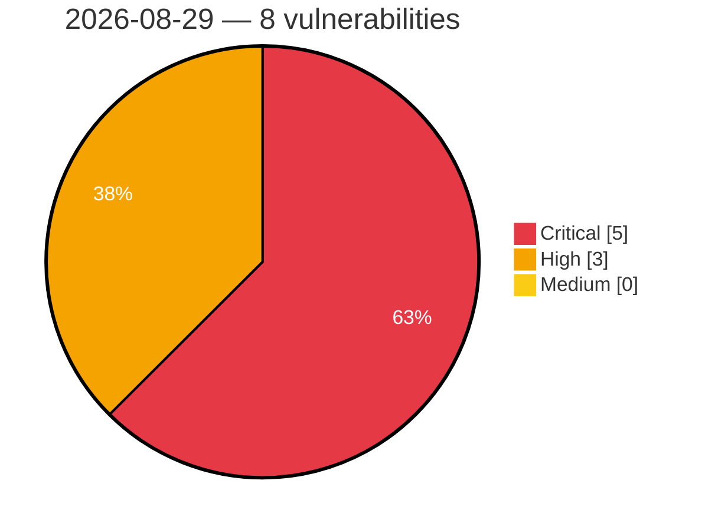

# Critical, High & Medium Severity Vulnerabilities — 2026-08-29

**Source status for this day:**

| Source | Critical | High | Medium | Total |
|--------|---------:|-----:|-------:|------:|
| cvefeed.io (High/Critical) | 5 | 3 | 0 | 8 |

**KEV (actively exploited):** 0  **Watchlist matches:** 5

## Critical (5)

| CVSS | Flags | Source | CVE / Title | Reported |
|------|-------|--------|-------------|----------|
| 10.0 | ⭐ | cvefeed.io (High/Critical) | [CVE-2026-82456 - argocd-mcp 0.8.0 Authentication Bypass via Unauthenticated HTTP](https://cvefeed.io/vuln/detail/CVE-2026-82456) | 1 hour, 52 minutes ago |
| 9.8 | — | cvefeed.io (High/Critical) | [CVE-2026-82448 - Shinobi before commit 5a76c74f Arbitrary Database Query Execution via Hardcoded Child Node Key](https://cvefeed.io/vuln/detail/CVE-2026-82448) | 14 minutes ago |
| 9.8 | ⭐ | cvefeed.io (High/Critical) | [CVE-2026-14494 - Sigma Forms Pro <= 1.4.5 - Unauthenticated Unauthenticated Arbitrary File Upload Leading to Remote Code Execution via Pre-built Template File Upload Field](https://cvefeed.io/vuln/detail/CVE-2026-14494) | 1 hour, 14 minutes ago |
| 9.8 | ⭐ | cvefeed.io (High/Critical) | [CVE-2026-82452 - rust-iot-platform Authentication Bypass via Missing Request Guards](https://cvefeed.io/vuln/detail/CVE-2026-82452) | 1 hour, 52 minutes ago |
| 9.1 | ⭐ | cvefeed.io (High/Critical) | [CVE-2026-82454 - Omnivore before android-0.227.0 Authentication Bypass via Apple Sign-in](https://cvefeed.io/vuln/detail/CVE-2026-82454) | 1 hour, 52 minutes ago |

## High (3)

| CVSS | Flags | Source | CVE / Title | Reported |
|------|-------|--------|-------------|----------|
| 8.8 | — | cvefeed.io (High/Critical) | [CVE-2026-82447 - Skyvern before 1.0.45 Sandbox Escape via TextPromptBlock](https://cvefeed.io/vuln/detail/CVE-2026-82447) | 14 minutes ago |
| 8.8 | ⭐ | cvefeed.io (High/Critical) | [CVE-2026-82450 - BookStack before 26.05.4 Remote Code Execution via Book Cover](https://cvefeed.io/vuln/detail/CVE-2026-82450) | 1 hour, 52 minutes ago |
| 8.7 | — | cvefeed.io (High/Critical) | [CVE-2026-82481 - cohttp Directory Traversal Vulnerability](https://cvefeed.io/vuln/detail/CVE-2026-82481) | 50 minutes ago |
