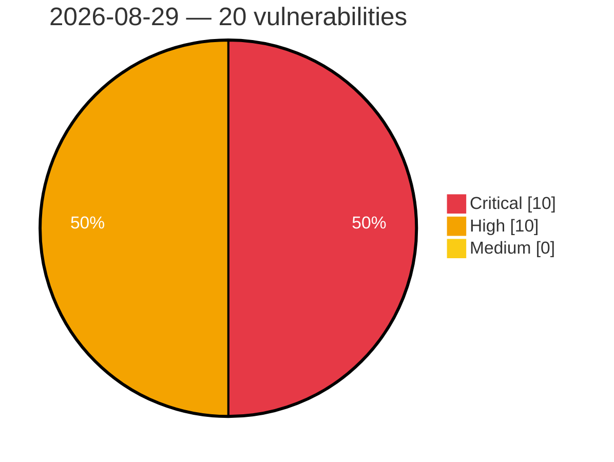

# Critical, High & Medium Severity Vulnerabilities — 2026-08-29

**Source status for this day:**

| Source | Critical | High | Medium | Total |
|--------|---------:|-----:|-------:|------:|
| cvefeed.io (High/Critical) | 10 | 10 | 0 | 20 |

**KEV (actively exploited):** 0  **Watchlist matches:** 16

## Critical (10)

| CVSS | Flags | Source | CVE / Title | Reported |
|------|-------|--------|-------------|----------|
| 10.0 | ⭐ | cvefeed.io (High/Critical) | [CVE-2026-82456 - argocd-mcp 0.8.0 Authentication Bypass via Unauthenticated HTTP](https://cvefeed.io/vuln/detail/CVE-2026-82456) | 1 hour, 52 minutes ago |
| 9.8 | — | cvefeed.io (High/Critical) | [CVE-2026-82448 - Shinobi before commit 5a76c74f Arbitrary Database Query Execution via Hardcoded Child Node Key](https://cvefeed.io/vuln/detail/CVE-2026-82448) | 14 minutes ago |
| 9.8 | ⭐ | cvefeed.io (High/Critical) | [CVE-2026-14494 - Sigma Forms Pro <= 1.4.5 - Unauthenticated Unauthenticated Arbitrary File Upload Leading to Remote Code Execution via Pre-built Template File Upload Field](https://cvefeed.io/vuln/detail/CVE-2026-14494) | 1 hour, 14 minutes ago |
| 9.8 | ⭐ | cvefeed.io (High/Critical) | [CVE-2026-82452 - rust-iot-platform Authentication Bypass via Missing Request Guards](https://cvefeed.io/vuln/detail/CVE-2026-82452) | 1 hour, 52 minutes ago |
| 9.8 | ⭐ | cvefeed.io (High/Critical) | [CVE-2026-82460 - Cloud Commander before 19.20.2 Directory Traversal via REST and Markdown](https://cvefeed.io/vuln/detail/CVE-2026-82460) | 2 hours, 50 minutes ago |
| 9.8 | ⭐ | cvefeed.io (High/Critical) | [CVE-2026-15369 - Custom User Registration Fields for WooCommerce <= 2.2.3 - Unauthenticated Privilege Escalation via 'afreg_select_user_role' Parameter in Store API Checkout](https://cvefeed.io/vuln/detail/CVE-2026-15369) | 1 hour, 23 minutes ago |
| 9.8 | ⭐ | cvefeed.io (High/Critical) | [CVE-2026-16259 - Uix UserCenter <= 1.0.3 - Unauthenticated Privilege Escalation](https://cvefeed.io/vuln/detail/CVE-2026-16259) | 22 hours, 7 minutes ago |
| 9.3 | ⭐ | cvefeed.io (High/Critical) | [CVE-2026-77012 - Icollect <= 1.0.0 - Unauthenticated Arbitrary File Read, SSRF and Path Traversal File Write via Default Publishing Password](https://cvefeed.io/vuln/detail/CVE-2026-77012) | 22 hours, 6 minutes ago |
| 9.1 | ⭐ | cvefeed.io (High/Critical) | [CVE-2026-82454 - Omnivore before android-0.227.0 Authentication Bypass via Apple Sign-in](https://cvefeed.io/vuln/detail/CVE-2026-82454) | 1 hour, 52 minutes ago |
| 9.1 | ⭐ | cvefeed.io (High/Critical) | [CVE-2026-16947 - Total Processing Card Payments for WooCommerce <= 7.3 - Unauthenticated SSRF leading to Payment Bypass and Gateway Credential Disclosure](https://cvefeed.io/vuln/detail/CVE-2026-16947) | 22 hours, 7 minutes ago |

## High (10)

| CVSS | Flags | Source | CVE / Title | Reported |
|------|-------|--------|-------------|----------|
| 8.8 | — | cvefeed.io (High/Critical) | [CVE-2026-82447 - Skyvern before 1.0.45 Sandbox Escape via TextPromptBlock](https://cvefeed.io/vuln/detail/CVE-2026-82447) | 14 minutes ago |
| 8.8 | ⭐ | cvefeed.io (High/Critical) | [CVE-2026-82450 - BookStack before 26.05.4 Remote Code Execution via Book Cover](https://cvefeed.io/vuln/detail/CVE-2026-82450) | 1 hour, 52 minutes ago |
| 8.7 | — | cvefeed.io (High/Critical) | [CVE-2026-82481 - cohttp Directory Traversal Vulnerability](https://cvefeed.io/vuln/detail/CVE-2026-82481) | 50 minutes ago |
| 8.7 | ⭐ | cvefeed.io (High/Critical) | [CVE-2026-82466 - Rodauth before 2.46.0 Authentication Bypass via webauthn_login](https://cvefeed.io/vuln/detail/CVE-2026-82466) | 2 hours, 50 minutes ago |
| 8.6 | ⭐ | cvefeed.io (High/Critical) | [CVE-2026-16061 - Rest Routes <= 5.5.5 - Unauthenticated SQLi via custom-tables/tables/{table_name}](https://cvefeed.io/vuln/detail/CVE-2026-16061) | 22 hours, 7 minutes ago |
| 8.2 | ⭐ | cvefeed.io (High/Critical) | [CVE-2026-82473 - KubeEdge CloudCore through 1.23.1 Missing Authentication on Node Task Endpoints](https://cvefeed.io/vuln/detail/CVE-2026-82473) | 2 hours, 50 minutes ago |
| 8.2 | ⭐ | cvefeed.io (High/Critical) | [CVE-2026-76548 - Profile Builder < 4.0.1 - Unauthenticated Unpublished Content and Media Modification via Front-End Upload Auth Bypass](https://cvefeed.io/vuln/detail/CVE-2026-76548) | 22 hours, 7 minutes ago |
| 8.1 | — | cvefeed.io (High/Critical) | [CVE-2026-82475 - iFlytek astron-agent through 1.1.1 Workflow Hijacking via Missing Ownership Check](https://cvefeed.io/vuln/detail/CVE-2026-82475) | 2 hours, 50 minutes ago |
| 8.1 | ⭐ | cvefeed.io (High/Critical) | [CVE-2026-82463 - pac4j-core before 6.5.6 Authorization Bypass via Reversed Profile Type Check](https://cvefeed.io/vuln/detail/CVE-2026-82463) | 2 hours, 50 minutes ago |
| 8.1 | ⭐ | cvefeed.io (High/Critical) | [CVE-2026-82461 - pac4j-oidc before 6.5.6 Privilege Escalation via Unverified Keycloak Access Token](https://cvefeed.io/vuln/detail/CVE-2026-82461) | 2 hours, 50 minutes ago |
