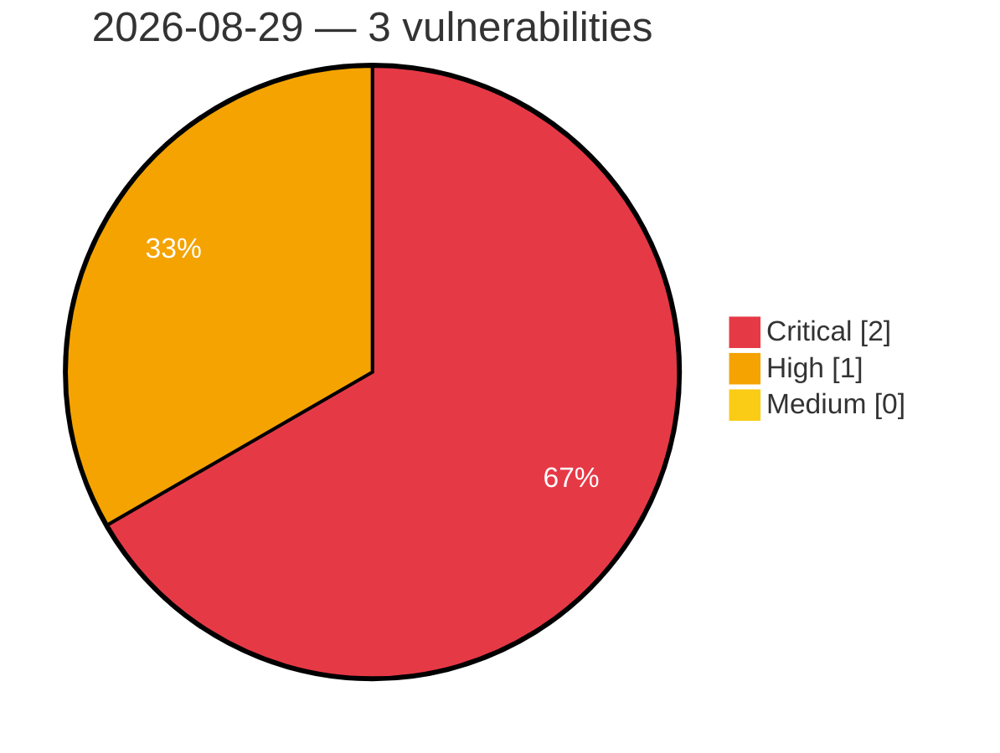

# Critical, High & Medium Severity Vulnerabilities — 2026-08-29

**Source status for this day:**

| Source | Critical | High | Medium | Total |
|--------|---------:|-----:|-------:|------:|
| cvefeed.io (High/Critical) | 2 | 1 | 0 | 3 |

**KEV (actively exploited):** 0  **Watchlist matches:** 1

## Critical (2)

| CVSS | Flags | Source | CVE / Title | Reported |
|------|-------|--------|-------------|----------|
| 9.8 | — | cvefeed.io (High/Critical) | [CVE-2026-82448 - Shinobi before commit 5a76c74f Arbitrary Database Query Execution via Hardcoded Child Node Key](https://cvefeed.io/vuln/detail/CVE-2026-82448) | 14 minutes ago |
| 9.8 | ⭐ | cvefeed.io (High/Critical) | [CVE-2026-14494 - Sigma Forms Pro <= 1.4.5 - Unauthenticated Unauthenticated Arbitrary File Upload Leading to Remote Code Execution via Pre-built Template File Upload Field](https://cvefeed.io/vuln/detail/CVE-2026-14494) | 1 hour, 14 minutes ago |

## High (1)

| CVSS | Flags | Source | CVE / Title | Reported |
|------|-------|--------|-------------|----------|
| 8.8 | — | cvefeed.io (High/Critical) | [CVE-2026-82447 - Skyvern before 1.0.45 Sandbox Escape via TextPromptBlock](https://cvefeed.io/vuln/detail/CVE-2026-82447) | 14 minutes ago |
