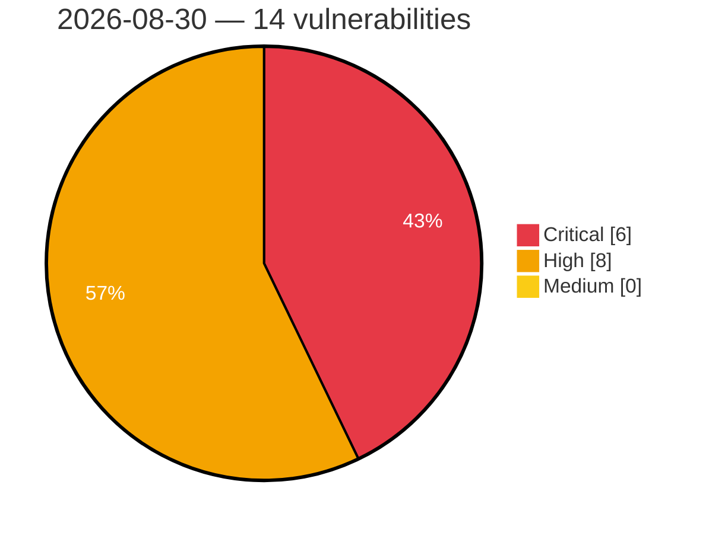

# Critical, High & Medium Severity Vulnerabilities — 2026-08-30

**Source status for this day:**

| Source | Critical | High | Medium | Total |
|--------|---------:|-----:|-------:|------:|
| cvefeed.io (High/Critical) | 6 | 8 | 0 | 14 |

**KEV (actively exploited):** 0  **Watchlist matches:** 9

## Critical (6)

| CVSS | Flags | Source | CVE / Title | Reported |
|------|-------|--------|-------------|----------|
| 10.0 | — | cvefeed.io (High/Critical) | [CVE-2026-82542 - Tenda HG10 Boa Web Server formIPv6Routing buffer overflow](https://cvefeed.io/vuln/detail/CVE-2026-82542) | 1 hour, 36 minutes ago |
| 9.8 | ⭐ | cvefeed.io (High/Critical) | [CVE-2026-15980 - MyHome Core <= 4.4.5 - Authentication Bypass to Account Takeover via Activation Token](https://cvefeed.io/vuln/detail/CVE-2026-15980) | 5 hours, 7 minutes ago |
| 9.3 | ⭐ | cvefeed.io (High/Critical) | [CVE-2026-82654 - SiYuan before v3.8.1 Stored XSS via block name](https://cvefeed.io/vuln/detail/CVE-2026-82654) | 20 minutes ago |
| 9.3 | ⭐ | cvefeed.io (High/Critical) | [CVE-2026-82653 - SiYuan before v3.8.1 Stored XSS via confirmDialog](https://cvefeed.io/vuln/detail/CVE-2026-82653) | 20 minutes ago |
| 9.2 | — | cvefeed.io (High/Critical) | [CVE-2026-82645 - AVideo Unauthenticated Stream Credential Disclosure via Forgeable Token](https://cvefeed.io/vuln/detail/CVE-2026-82645) | 20 minutes ago |
| 9.1 | — | cvefeed.io (High/Critical) | [CVE-2026-82539 - TOTOLINK A720R MAC Filtering cstecgi.cgi setMacFilterRules memory corruption](https://cvefeed.io/vuln/detail/CVE-2026-82539) | 3 hours, 36 minutes ago |

## High (8)

| CVSS | Flags | Source | CVE / Title | Reported |
|------|-------|--------|-------------|----------|
| 8.8 | — | cvefeed.io (High/Critical) | [CVE-2026-82641 - keploy 3.1.0 through 3.6.25 Unauthenticated TLS Key Exposure](https://cvefeed.io/vuln/detail/CVE-2026-82641) | 36 minutes ago |
| 8.8 | ⭐ | cvefeed.io (High/Critical) | [CVE-2026-82635 - Pake arbitrary file write via unsanitized download_file filename](https://cvefeed.io/vuln/detail/CVE-2026-82635) | 1 hour, 36 minutes ago |
| 8.7 | ⭐ | cvefeed.io (High/Critical) | [CVE-2026-82657 - Admidio before 5.0.12 Authentication Bypass via RSS feeds](https://cvefeed.io/vuln/detail/CVE-2026-82657) | 20 minutes ago |
| 8.7 | ⭐ | cvefeed.io (High/Critical) | [CVE-2026-82655 - Admidio before 5.0.12 SQL Injection via relation_type_list](https://cvefeed.io/vuln/detail/CVE-2026-82655) | 20 minutes ago |
| 8.7 | ⭐ | cvefeed.io (High/Critical) | [CVE-2026-82644 - WWBN AVideo Brute-force Rate Limiting Bypass via Missing User-Agent](https://cvefeed.io/vuln/detail/CVE-2026-82644) | 20 minutes ago |
| 8.7 | ⭐ | cvefeed.io (High/Critical) | [CVE-2026-82639 - NextChat 2.15.8 through 2.16.1 OpenAI API Key Disclosure](https://cvefeed.io/vuln/detail/CVE-2026-82639) | 36 minutes ago |
| 8.7 | ⭐ | cvefeed.io (High/Critical) | [CVE-2026-82638 - jina-ai reader Server-Side Request Forgery via disabled private-address guard](https://cvefeed.io/vuln/detail/CVE-2026-82638) | 36 minutes ago |
| 8.3 | — | cvefeed.io (High/Critical) | [CVE-2026-82549 - Linux Foundation Magma SecurityModeComplete integrity check](https://cvefeed.io/vuln/detail/CVE-2026-82549) | 2 hours, 8 minutes ago |
