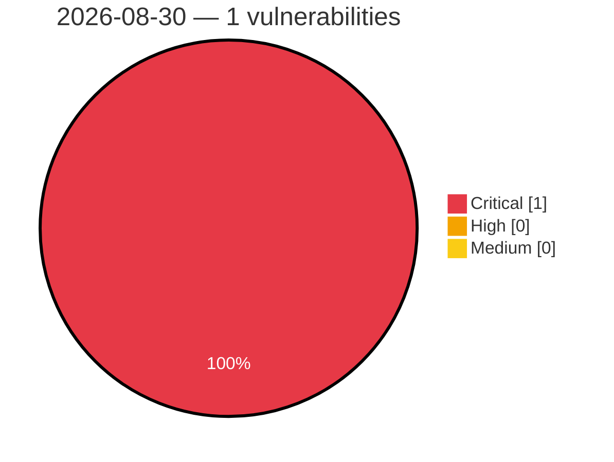

# Critical, High & Medium Severity Vulnerabilities — 2026-08-30

**Source status for this day:**

| Source | Critical | High | Medium | Total |
|--------|---------:|-----:|-------:|------:|
| cvefeed.io (High/Critical) | 1 | 0 | 0 | 1 |

**KEV (actively exploited):** 0  **Watchlist matches:** 1

## Critical (1)

| CVSS | Flags | Source | CVE / Title | Reported |
|------|-------|--------|-------------|----------|
| 9.8 | ⭐ | cvefeed.io (High/Critical) | [CVE-2026-15980 - MyHome Core <= 4.4.5 - Authentication Bypass to Account Takeover via Activation Token](https://cvefeed.io/vuln/detail/CVE-2026-15980) | 5 hours, 7 minutes ago |
