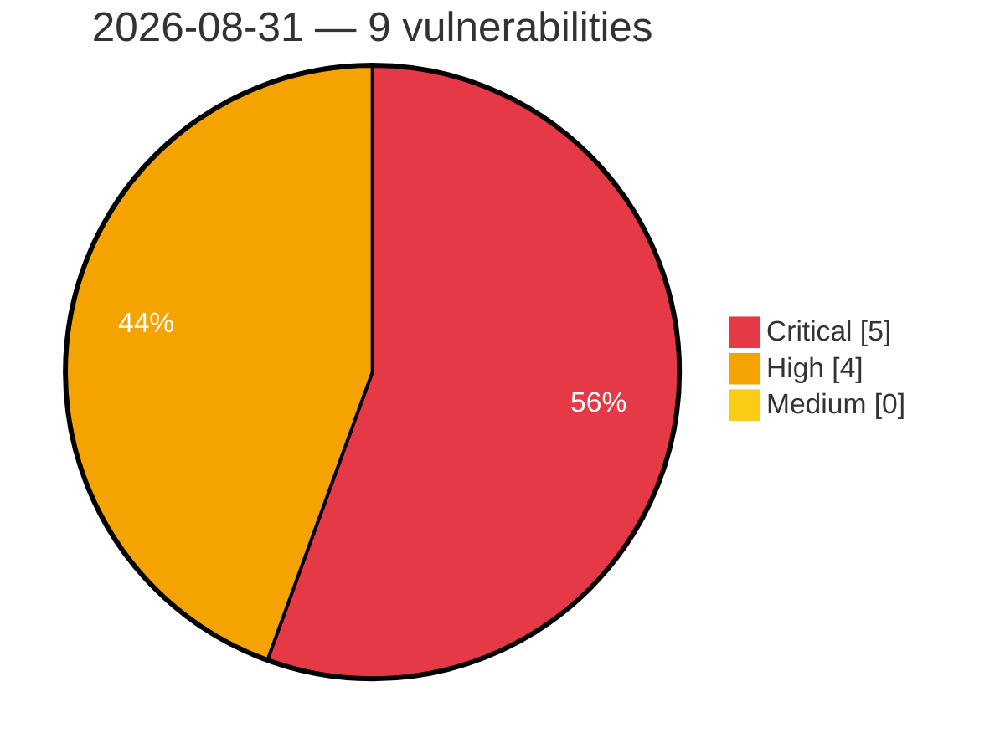

# Critical, High & Medium Severity Vulnerabilities — 2026-08-31

**Source status for this day:**

| Source | Critical | High | Medium | Total |
|--------|---------:|-----:|-------:|------:|
| cvefeed.io (High/Critical) | 5 | 4 | 0 | 9 |

**KEV (actively exploited):** 0  **Watchlist matches:** 5

## Critical (5)

| CVSS | Flags | Source | CVE / Title | Reported |
|------|-------|--------|-------------|----------|
| 10.0 | ⭐ | cvefeed.io (High/Critical) | [CVE-2026-77956 - EEx template evaluation of prompt content in AshAi enables remote code execution](https://cvefeed.io/vuln/detail/CVE-2026-77956) | 1 hour, 8 minutes ago |
| 9.9 | — | cvefeed.io (High/Critical) | [CVE-2026-82593 - D-Link DIR-825M LTE Module Firmware Upgrade formLtefotaUpgradeFibocom sub_41802C stack-based overflow](https://cvefeed.io/vuln/detail/CVE-2026-82593) | 2 hours, 8 minutes ago |
| 9.9 | — | cvefeed.io (High/Critical) | [CVE-2026-82616 - TOTOLINK NR1800X cstecgi.cgi setUploadSetting stack-based overflow](https://cvefeed.io/vuln/detail/CVE-2026-82616) | 3 hours, 8 minutes ago |
| 9.8 | — | cvefeed.io (High/Critical) | [CVE-2026-58574 - Dell PowerStore Missing Authentication for Critical Function Vulnerability](https://cvefeed.io/vuln/detail/CVE-2026-58574) | 1 hour, 7 minutes ago |
| 9.3 | — | cvefeed.io (High/Critical) | [CVE-2026-82628 - Colorful iGameCenter IOCTL Dispatch WinRing0x64.sys sub_11504 privileges management](https://cvefeed.io/vuln/detail/CVE-2026-82628) | 1 hour, 7 minutes ago |

## High (4)

| CVSS | Flags | Source | CVE / Title | Reported |
|------|-------|--------|-------------|----------|
| 8.4 | ⭐ | cvefeed.io (High/Critical) | [CVE-2026-77850 - Stored XSS in AshAdmin relationship typeahead via unescaped label_field content](https://cvefeed.io/vuln/detail/CVE-2026-77850) | 5 hours, 8 minutes ago |
| 8.3 | ⭐ | cvefeed.io (High/Critical) | [CVE-2026-82722 - AshAdmin LiveView events intern atoms from client input, exhausting the atom table (node DoS)](https://cvefeed.io/vuln/detail/CVE-2026-82722) | 5 hours, 8 minutes ago |
| 8.3 | ⭐ | cvefeed.io (High/Critical) | [CVE-2026-82673 - Path traversal in AshAdmin file uploads via unsanitized client filename](https://cvefeed.io/vuln/detail/CVE-2026-82673) | 5 hours, 8 minutes ago |
| 8.3 | ⭐ | cvefeed.io (High/Critical) | [CVE-2026-75757 - AshAdmin cookie reader matches names by substring, enabling actor/session shadowing from a sibling subdomain](https://cvefeed.io/vuln/detail/CVE-2026-75757) | 5 hours, 8 minutes ago |
