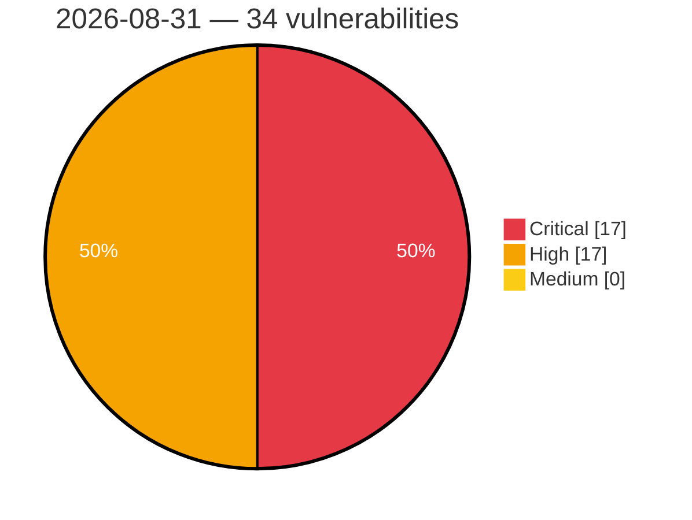

# Critical, High & Medium Severity Vulnerabilities — 2026-08-31

**Source status for this day:**

| Source | Critical | High | Medium | Total |
|--------|---------:|-----:|-------:|------:|
| cvefeed.io (High/Critical) | 17 | 17 | 0 | 34 |

**KEV (actively exploited):** 0  **Watchlist matches:** 18

## Critical (17)

| CVSS | Flags | Source | CVE / Title | Reported |
|------|-------|--------|-------------|----------|
| 10.0 | ⭐ | cvefeed.io (High/Critical) | [CVE-2026-77956 - EEx template evaluation of prompt content in AshAi enables remote code execution](https://cvefeed.io/vuln/detail/CVE-2026-77956) | 1 hour, 8 minutes ago |
| 10.0 | ⭐ | cvefeed.io (High/Critical) | [CVE-2026-82970 - WordPress WP Cookie Notice for GDPR, CCPA & ePrivacy Consent plugin <= 4.4.1 - Arbitrary File Upload vulnerability](https://cvefeed.io/vuln/detail/CVE-2026-82970) | 2 hours, 13 minutes ago |
| 10.0 | — | cvefeed.io (High/Critical) | [CVE-2026-82695 - Tenda AC18 Telnet telnet missing authentication](https://cvefeed.io/vuln/detail/CVE-2026-82695) | 4 hours, 13 minutes ago |
| 10.0 | — | cvefeed.io (High/Critical) | [CVE-2026-82694 - Tenda AC1206 Web UI ate R7WebsSecurityHandler missing authentication](https://cvefeed.io/vuln/detail/CVE-2026-82694) | 4 hours, 13 minutes ago |
| 10.0 | — | cvefeed.io (High/Critical) | [CVE-2026-82693 - Tenda AC1206 Web UI telnet TendaTelnet missing authentication](https://cvefeed.io/vuln/detail/CVE-2026-82693) | 4 hours, 13 minutes ago |
| 9.9 | — | cvefeed.io (High/Critical) | [CVE-2026-82593 - D-Link DIR-825M LTE Module Firmware Upgrade formLtefotaUpgradeFibocom sub_41802C stack-based overflow](https://cvefeed.io/vuln/detail/CVE-2026-82593) | 2 hours, 8 minutes ago |
| 9.9 | — | cvefeed.io (High/Critical) | [CVE-2026-82616 - TOTOLINK NR1800X cstecgi.cgi setUploadSetting stack-based overflow](https://cvefeed.io/vuln/detail/CVE-2026-82616) | 3 hours, 8 minutes ago |
| 9.9 | ⭐ | cvefeed.io (High/Critical) | [CVE-2026-82692 - D-Link DNS-340L/DNS-345 iscsi_mgr.cgi os command injection](https://cvefeed.io/vuln/detail/CVE-2026-82692) | 4 hours, 13 minutes ago |
| 9.9 | ⭐ | cvefeed.io (High/Critical) | [CVE-2026-82689 - D-Link DNS-320L/DNS-327L/DNS-340L/DNS-345 ISO Image isomount_mgr.cgi os command injection](https://cvefeed.io/vuln/detail/CVE-2026-82689) | 5 hours, 13 minutes ago |
| 9.8 | — | cvefeed.io (High/Critical) | [CVE-2026-58574 - Dell PowerStore Missing Authentication for Critical Function Vulnerability](https://cvefeed.io/vuln/detail/CVE-2026-58574) | 1 hour, 7 minutes ago |
| 9.8 | — | cvefeed.io (High/Critical) | [CVE-2026-76133 - Ebyte NA111-M Use of a Broken or Risky Cryptographic Algorithm](https://cvefeed.io/vuln/detail/CVE-2026-76133) | 1 hour, 12 minutes ago |
| 9.8 | — | cvefeed.io (High/Critical) | [CVE-2026-73819 - Ebyte NA111-M Weak Authentication](https://cvefeed.io/vuln/detail/CVE-2026-73819) | 1 hour, 12 minutes ago |
| 9.3 | — | cvefeed.io (High/Critical) | [CVE-2026-82628 - Colorful iGameCenter IOCTL Dispatch WinRing0x64.sys sub_11504 privileges management](https://cvefeed.io/vuln/detail/CVE-2026-82628) | 1 hour, 7 minutes ago |
| 9.3 | ⭐ | cvefeed.io (High/Critical) | [CVE-2026-59111 - Command Injection vulnerability in eObčanka-Identifikace](https://cvefeed.io/vuln/detail/CVE-2026-59111) | 2 hours, 14 minutes ago |
| 9.1 | ⭐ | cvefeed.io (High/Critical) | [CVE-2026-82691 - D-Link DNS-320L/DNS-327L/DNS-340L/DNS-345 CGI usb_device.cgi os command injection](https://cvefeed.io/vuln/detail/CVE-2026-82691) | 5 hours, 13 minutes ago |
| 9.1 | ⭐ | cvefeed.io (High/Critical) | [CVE-2026-82690 - D-Link DNS-327L/DNS-340L ve_mgr.cgi os command injection](https://cvefeed.io/vuln/detail/CVE-2026-82690) | 5 hours, 13 minutes ago |
| 9.1 | ⭐ | cvefeed.io (High/Critical) | [CVE-2026-82688 - D-Link DNS-340L/DNS-345 Virtual Volume virtual_vol.cgi os command injection](https://cvefeed.io/vuln/detail/CVE-2026-82688) | 6 hours, 14 minutes ago |

## High (17)

| CVSS | Flags | Source | CVE / Title | Reported |
|------|-------|--------|-------------|----------|
| 9.0 | — | cvefeed.io (High/Critical) | [CVE-2026-82680 - D-Link DSM-G600 Multipart load_file.cgi out-of-bounds write](https://cvefeed.io/vuln/detail/CVE-2026-82680) | 6 hours, 14 minutes ago |
| 8.9 | ⭐ | cvefeed.io (High/Critical) | [CVE-2026-78078 - Joomla Extension - joomshaper.com - Privileged File Upload Bypass via Content Spoofing in Helix Ultimate < 2.2.10](https://cvefeed.io/vuln/detail/CVE-2026-78078) | 3 hours, 14 minutes ago |
| 8.8 | — | cvefeed.io (High/Critical) | [CVE-2026-82807 - ieungSoft Ultra RAMDisk Pro Kernel Driver URDSCSI.sys privileges management](https://cvefeed.io/vuln/detail/CVE-2026-82807) | 1 hour, 12 minutes ago |
| 8.8 | — | cvefeed.io (High/Critical) | [CVE-2026-77966 - Ebyte NA111-M Missing Authorization](https://cvefeed.io/vuln/detail/CVE-2026-77966) | 1 hour, 12 minutes ago |
| 8.8 | ⭐ | cvefeed.io (High/Critical) | [CVE-2026-82217 - Eclipse Theia Path Traversal Vulnerability](https://cvefeed.io/vuln/detail/CVE-2026-82217) | 3 hours, 14 minutes ago |
| 8.8 | — | cvefeed.io (High/Critical) | [CVE-2026-78074 - Joomla Extension - miniorgange.com - Unauthenticated arbitrary extension deinstallation via various miniOrange extensions](https://cvefeed.io/vuln/detail/CVE-2026-78074) | 3 hours, 14 minutes ago |
| 8.8 | ⭐ | cvefeed.io (High/Critical) | [CVE-2026-5956 - SQLi in Ankara Hosting's Site Management Panel](https://cvefeed.io/vuln/detail/CVE-2026-5956) | 4 hours, 13 minutes ago |
| 8.8 | ⭐ | cvefeed.io (High/Critical) | [CVE-2026-12894 - Quarkus-qute: io.quarkus.qute.reflectionvalueresolver: quarkus:server-side template injection (ssti) vulnerability in reflectionvalueresolver of the quarkus qute template engine](https://cvefeed.io/vuln/detail/CVE-2026-12894) | 4 hours, 14 minutes ago |
| 8.7 | — | cvefeed.io (High/Critical) | [CVE-2026-75133 - Keep Backup Daily WordPress Plugin < 2.1.4 Sensitive Information Exposure via kbd_cron_process](https://cvefeed.io/vuln/detail/CVE-2026-75133) | 1 hour, 12 minutes ago |
| 8.7 | — | cvefeed.io (High/Critical) | [CVE-2026-82880 - YaCy Search Server through 1.941 XML External Entity Injection via Parsers](https://cvefeed.io/vuln/detail/CVE-2026-82880) | 6 hours, 14 minutes ago |
| 8.6 | ⭐ | cvefeed.io (High/Critical) | [CVE-2026-78077 - Joomla Extension - joomshaper.com -  Stored Cross-Site Scripting (XSS) in MegaMenu Layout Container & Embed Inputs in Helix Ultimate < 2.2.10](https://cvefeed.io/vuln/detail/CVE-2026-78077) | 3 hours, 14 minutes ago |
| 8.4 | ⭐ | cvefeed.io (High/Critical) | [CVE-2026-77850 - Stored XSS in AshAdmin relationship typeahead via unescaped label_field content](https://cvefeed.io/vuln/detail/CVE-2026-77850) | 5 hours, 8 minutes ago |
| 8.3 | ⭐ | cvefeed.io (High/Critical) | [CVE-2026-82722 - AshAdmin LiveView events intern atoms from client input, exhausting the atom table (node DoS)](https://cvefeed.io/vuln/detail/CVE-2026-82722) | 5 hours, 8 minutes ago |
| 8.3 | ⭐ | cvefeed.io (High/Critical) | [CVE-2026-82673 - Path traversal in AshAdmin file uploads via unsanitized client filename](https://cvefeed.io/vuln/detail/CVE-2026-82673) | 5 hours, 8 minutes ago |
| 8.3 | ⭐ | cvefeed.io (High/Critical) | [CVE-2026-75757 - AshAdmin cookie reader matches names by substring, enabling actor/session shadowing from a sibling subdomain](https://cvefeed.io/vuln/detail/CVE-2026-75757) | 5 hours, 8 minutes ago |
| 8.2 | — | cvefeed.io (High/Critical) | [CVE-2026-82876 - Phison PS3111-S11 Controller Firmware Signature Verification Bypass](https://cvefeed.io/vuln/detail/CVE-2026-82876) | 6 hours, 14 minutes ago |
| 8.1 | ⭐ | cvefeed.io (High/Critical) | [CVE-2026-66047 - ProfilePress WordPress Plugin < 4.17.2 Unauthenticated Arbitrary Plugin Installation RCE](https://cvefeed.io/vuln/detail/CVE-2026-66047) | 2 hours, 13 minutes ago |
