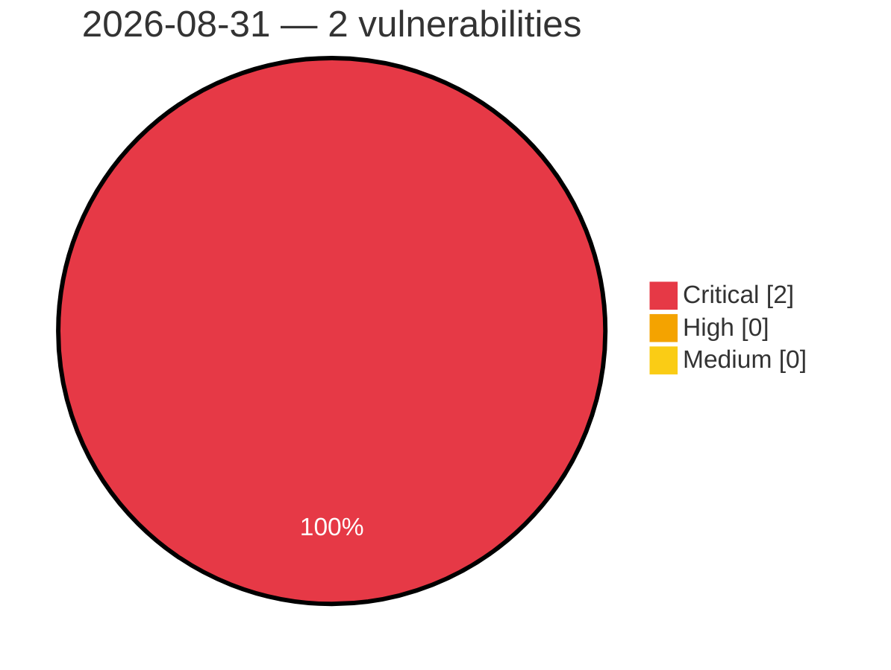

# Critical, High & Medium Severity Vulnerabilities — 2026-08-31

**Source status for this day:**

| Source | Critical | High | Medium | Total |
|--------|---------:|-----:|-------:|------:|
| cvefeed.io (High/Critical) | 2 | 0 | 0 | 2 |

**KEV (actively exploited):** 0  **Watchlist matches:** 1

## Critical (2)

| CVSS | Flags | Source | CVE / Title | Reported |
|------|-------|--------|-------------|----------|
| 10.0 | ⭐ | cvefeed.io (High/Critical) | [CVE-2026-77956 - EEx template evaluation of prompt content in AshAi enables remote code execution](https://cvefeed.io/vuln/detail/CVE-2026-77956) | 1 hour, 8 minutes ago |
| 9.9 | — | cvefeed.io (High/Critical) | [CVE-2026-82593 - D-Link DIR-825M LTE Module Firmware Upgrade formLtefotaUpgradeFibocom sub_41802C stack-based overflow](https://cvefeed.io/vuln/detail/CVE-2026-82593) | 2 hours, 8 minutes ago |
