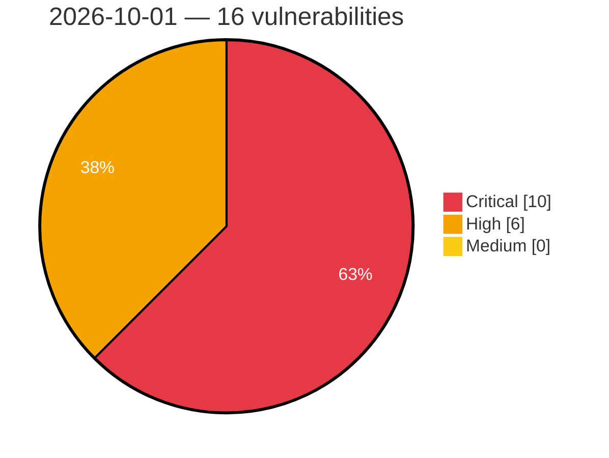

# Critical, High & Medium Severity Vulnerabilities — 2026-10-01

**Source status for this day:**

| Source | Critical | High | Medium | Total |
|--------|---------:|-----:|-------:|------:|
| cvefeed.io (High/Critical) | 10 | 6 | 0 | 16 |

**KEV (actively exploited):** 0  **Watchlist matches:** 13

## Critical (10)

| CVSS | Flags | Source | CVE / Title | Reported |
|------|-------|--------|-------------|----------|
| 9.8 | ⭐ | cvefeed.io (High/Critical) | [CVE-2026-15989 - Super Forms <= 6.3.316 - Unauthenticated Privilege Escalation via 'role' Parameter](https://cvefeed.io/vuln/detail/CVE-2026-15989) | 43 minutes ago |
| 9.8 | ⭐ | cvefeed.io (High/Critical) | [CVE-2026-75957 - Ultimate Multisite <= 2.15.0 - Unauthenticated Authentication Bypass via 'checkout_form' Parameter](https://cvefeed.io/vuln/detail/CVE-2026-75957) | 43 minutes ago |
| 9.8 | ⭐ | cvefeed.io (High/Critical) | [CVE-2025-41753 - Path traversal in dynamically created BACnet File Objects](https://cvefeed.io/vuln/detail/CVE-2025-41753) | 1 hour, 7 minutes ago |
| 9.8 | — | cvefeed.io (High/Critical) | [CVE-2026-82829 - Hidden accounts or hard-coded credentials may permit unauthorized access without the legitimate authentication process](https://cvefeed.io/vuln/detail/CVE-2026-82829) | 3 hours, 6 minutes ago |
| 9.8 | ⭐ | cvefeed.io (High/Critical) | [CVE-2026-82827 - A hard-coded JWT signing secret key may allow administrative functions to be abused using fraudulently generated Bearer tokens](https://cvefeed.io/vuln/detail/CVE-2026-82827) | 3 hours, 6 minutes ago |
| 9.8 | ⭐ | cvefeed.io (High/Critical) | [CVE-2026-82825 - Missing proper authentication for critical APIs may allow sensitive information to be obtained or modified, or unauthorized operations to be performed](https://cvefeed.io/vuln/detail/CVE-2026-82825) | 3 hours, 6 minutes ago |
| 9.8 | ⭐ | cvefeed.io (High/Critical) | [CVE-2026-82824 - Path traversal may allow arbitrary files to be viewed, created, modified, or deleted](https://cvefeed.io/vuln/detail/CVE-2026-82824) | 3 hours, 6 minutes ago |
| 9.4 | ⭐ | cvefeed.io (High/Critical) | [CVE-2026-14157 - ASUS Router Format String Vulnerability](https://cvefeed.io/vuln/detail/CVE-2026-14157) | 6 hours, 6 minutes ago |
| 9.3 | ⭐ | cvefeed.io (High/Critical) | [CVE-2026-76142 - Genians, Inc. Genian NAC/ZTNA Improper Access Control on the Internal Interface](https://cvefeed.io/vuln/detail/CVE-2026-76142) | 3 hours, 6 minutes ago |
| 9.1 | — | cvefeed.io (High/Critical) | [CVE-2026-92966 - Appointment Booking Plugin <= 5.7.0 - Unauthenticated Arbitrary Shortcode Execution via First/Last Name Field](https://cvefeed.io/vuln/detail/CVE-2026-92966) | 3 hours, 6 minutes ago |

## High (6)

| CVSS | Flags | Source | CVE / Title | Reported |
|------|-------|--------|-------------|----------|
| 8.9 | ⭐ | cvefeed.io (High/Critical) | [CVE-2026-13313 - ASUS Router Active Debug Code Command Injection Vulnerability](https://cvefeed.io/vuln/detail/CVE-2026-13313) | 6 hours, 6 minutes ago |
| 8.8 | ⭐ | cvefeed.io (High/Critical) | [CVE-2026-19807 - ByteCoreStack <= 1.2.3 - Authenticated (Subscriber+) Privilege Escalation via wp_update_user_meta MCP Tool](https://cvefeed.io/vuln/detail/CVE-2026-19807) | 43 minutes ago |
| 8.8 | ⭐ | cvefeed.io (High/Critical) | [CVE-2026-80275 - Comelit 1456B gateway allows low priviledge user to overwrite installer password via unauthorized endpoint](https://cvefeed.io/vuln/detail/CVE-2026-80275) | 2 hours, 6 minutes ago |
| 8.8 | — | cvefeed.io (High/Critical) | [CVE-2026-82828 - Improper authorization may allow a general user to perform operations equivalent to those available with administrator privileges](https://cvefeed.io/vuln/detail/CVE-2026-82828) | 3 hours, 6 minutes ago |
| 8.7 | ⭐ | cvefeed.io (High/Critical) | [CVE-2026-82826 - Authentication information or sensitive data may be intercepted in transit](https://cvefeed.io/vuln/detail/CVE-2026-82826) | 3 hours, 6 minutes ago |
| 8.4 | ⭐ | cvefeed.io (High/Critical) | [CVE-2026-76146 - Genians, Inc Genian SSL PNS OS Command Injection](https://cvefeed.io/vuln/detail/CVE-2026-76146) | 3 hours, 6 minutes ago |
