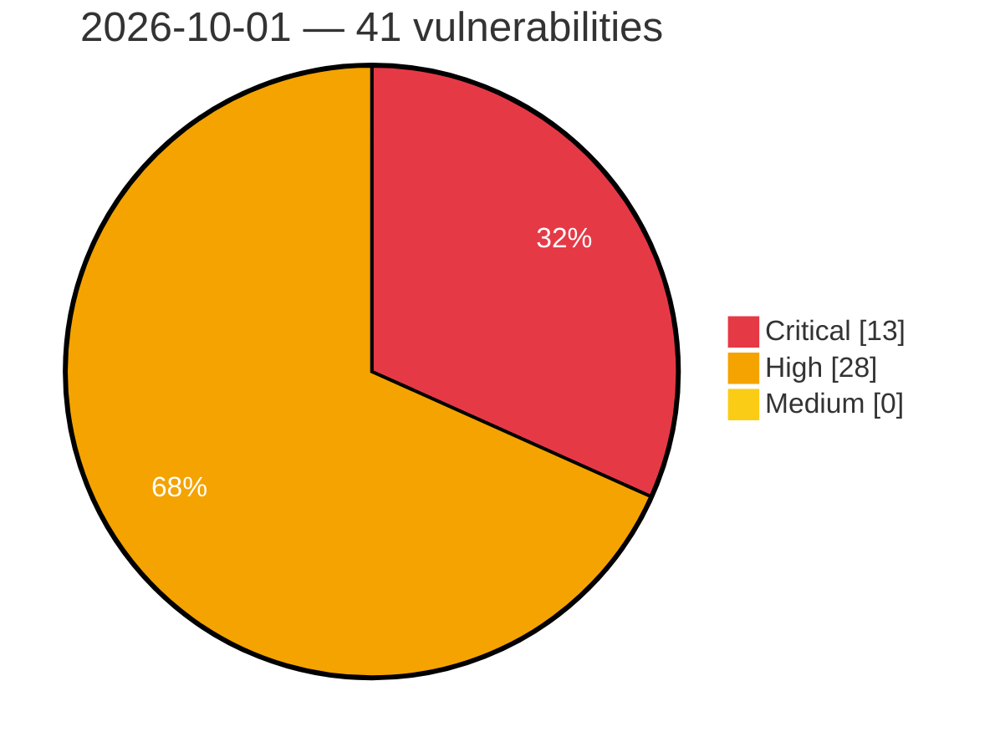

# Critical, High & Medium Severity Vulnerabilities — 2026-10-01

**Source status for this day:**

| Source | Critical | High | Medium | Total |
|--------|---------:|-----:|-------:|------:|
| cvefeed.io (High/Critical) | 13 | 28 | 0 | 41 |

**KEV (actively exploited):** 0  **Watchlist matches:** 33

## Critical (13)

| CVSS | Flags | Source | CVE / Title | Reported |
|------|-------|--------|-------------|----------|
| 9.9 | — | cvefeed.io (High/Critical) | [CVE-2026-79901 - Predictable Active Directory service-account passwords in BoKS Manager](https://cvefeed.io/vuln/detail/CVE-2026-79901) | 19 minutes ago |
| 9.8 | ⭐ | cvefeed.io (High/Critical) | [CVE-2026-15989 - Super Forms <= 6.3.316 - Unauthenticated Privilege Escalation via 'role' Parameter](https://cvefeed.io/vuln/detail/CVE-2026-15989) | 43 minutes ago |
| 9.8 | ⭐ | cvefeed.io (High/Critical) | [CVE-2026-75957 - Ultimate Multisite <= 2.15.0 - Unauthenticated Authentication Bypass via 'checkout_form' Parameter](https://cvefeed.io/vuln/detail/CVE-2026-75957) | 43 minutes ago |
| 9.8 | ⭐ | cvefeed.io (High/Critical) | [CVE-2025-41753 - Path traversal in dynamically created BACnet File Objects](https://cvefeed.io/vuln/detail/CVE-2025-41753) | 1 hour, 7 minutes ago |
| 9.8 | — | cvefeed.io (High/Critical) | [CVE-2026-82829 - Hidden accounts or hard-coded credentials may permit unauthorized access without the legitimate authentication process](https://cvefeed.io/vuln/detail/CVE-2026-82829) | 3 hours, 6 minutes ago |
| 9.8 | ⭐ | cvefeed.io (High/Critical) | [CVE-2026-82827 - A hard-coded JWT signing secret key may allow administrative functions to be abused using fraudulently generated Bearer tokens](https://cvefeed.io/vuln/detail/CVE-2026-82827) | 3 hours, 6 minutes ago |
| 9.8 | ⭐ | cvefeed.io (High/Critical) | [CVE-2026-82825 - Missing proper authentication for critical APIs may allow sensitive information to be obtained or modified, or unauthorized operations to be performed](https://cvefeed.io/vuln/detail/CVE-2026-82825) | 3 hours, 6 minutes ago |
| 9.8 | ⭐ | cvefeed.io (High/Critical) | [CVE-2026-82824 - Path traversal may allow arbitrary files to be viewed, created, modified, or deleted](https://cvefeed.io/vuln/detail/CVE-2026-82824) | 3 hours, 6 minutes ago |
| 9.4 | ⭐ | cvefeed.io (High/Critical) | [CVE-2026-14157 - ASUS Router Format String Vulnerability](https://cvefeed.io/vuln/detail/CVE-2026-14157) | 6 hours, 6 minutes ago |
| 9.3 | ⭐ | cvefeed.io (High/Critical) | [CVE-2026-76142 - Genians, Inc. Genian NAC/ZTNA Improper Access Control on the Internal Interface](https://cvefeed.io/vuln/detail/CVE-2026-76142) | 3 hours, 6 minutes ago |
| 9.3 | ⭐ | cvefeed.io (High/Critical) | [CVE-2026-103264 - Fleet before 4.87.0 Authentication Bypass via Device Identifiers](https://cvefeed.io/vuln/detail/CVE-2026-103264) | 3 hours, 19 minutes ago |
| 9.1 | — | cvefeed.io (High/Critical) | [CVE-2026-92966 - Appointment Booking Plugin <= 5.7.0 - Unauthenticated Arbitrary Shortcode Execution via First/Last Name Field](https://cvefeed.io/vuln/detail/CVE-2026-92966) | 3 hours, 6 minutes ago |
| 9.0 | ⭐ | cvefeed.io (High/Critical) | [CVE-2026-103255 - n8n before 1.123.80, 2.39.6, and 2.40.1 Path Traversal and Query Injection via Supabase](https://cvefeed.io/vuln/detail/CVE-2026-103255) | 3 hours, 19 minutes ago |

## High (28)

| CVSS | Flags | Source | CVE / Title | Reported |
|------|-------|--------|-------------|----------|
| 8.9 | ⭐ | cvefeed.io (High/Critical) | [CVE-2026-13313 - ASUS Router Active Debug Code Command Injection Vulnerability](https://cvefeed.io/vuln/detail/CVE-2026-13313) | 6 hours, 6 minutes ago |
| 8.8 | ⭐ | cvefeed.io (High/Critical) | [CVE-2026-19807 - ByteCoreStack <= 1.2.3 - Authenticated (Subscriber+) Privilege Escalation via wp_update_user_meta MCP Tool](https://cvefeed.io/vuln/detail/CVE-2026-19807) | 43 minutes ago |
| 8.8 | ⭐ | cvefeed.io (High/Critical) | [CVE-2026-80275 - Comelit 1456B gateway allows low priviledge user to overwrite installer password via unauthorized endpoint](https://cvefeed.io/vuln/detail/CVE-2026-80275) | 2 hours, 6 minutes ago |
| 8.8 | — | cvefeed.io (High/Critical) | [CVE-2026-82828 - Improper authorization may allow a general user to perform operations equivalent to those available with administrator privileges](https://cvefeed.io/vuln/detail/CVE-2026-82828) | 3 hours, 6 minutes ago |
| 8.8 | ⭐ | cvefeed.io (High/Critical) | [CVE-2026-66246 - HCL iControl is affected by multiple security vulnerabilities](https://cvefeed.io/vuln/detail/CVE-2026-66246) | 19 minutes ago |
| 8.8 | ⭐ | cvefeed.io (High/Critical) | [CVE-2026-103268 - Ghost 1.0.0 before 6.62.0 Suspension Bypass via Password Reset](https://cvefeed.io/vuln/detail/CVE-2026-103268) | 3 hours, 19 minutes ago |
| 8.7 | ⭐ | cvefeed.io (High/Critical) | [CVE-2026-82826 - Authentication information or sensitive data may be intercepted in transit](https://cvefeed.io/vuln/detail/CVE-2026-82826) | 3 hours, 6 minutes ago |
| 8.7 | ⭐ | cvefeed.io (High/Critical) | [CVE-2026-103272 - Ghost 2.10.0 before 6.63.0 Staff Enumeration via Content API](https://cvefeed.io/vuln/detail/CVE-2026-103272) | 3 hours, 19 minutes ago |
| 8.7 | ⭐ | cvefeed.io (High/Critical) | [CVE-2026-103271 - Ghost 4.0.0 before 6.63.0 Restricted Content Bypass](https://cvefeed.io/vuln/detail/CVE-2026-103271) | 3 hours, 19 minutes ago |
| 8.7 | — | cvefeed.io (High/Critical) | [CVE-2026-103262 - Tornado before 6.5.9 Denial of Service via CurlAsyncHTTPClient](https://cvefeed.io/vuln/detail/CVE-2026-103262) | 3 hours, 19 minutes ago |
| 8.7 | ⭐ | cvefeed.io (High/Critical) | [CVE-2026-103253 - n8n before 1.123.80, 2.39.6, and 2.40.1 SQL Injection via Oracle Database Drop Table](https://cvefeed.io/vuln/detail/CVE-2026-103253) | 3 hours, 19 minutes ago |
| 8.6 | ⭐ | cvefeed.io (High/Critical) | [CVE-2026-88789 - Apache Camel Quarkus: Camel Quarkus: Forced Xalan TransformerFactory drops upstream external-DTD/stylesheet hardening](https://cvefeed.io/vuln/detail/CVE-2026-88789) | 3 hours, 19 minutes ago |
| 8.6 | ⭐ | cvefeed.io (High/Critical) | [CVE-2026-103758 - Obot 0.21.1 through 0.24.1 Authorization Bypass via /mcp-connect-composite/ Route](https://cvefeed.io/vuln/detail/CVE-2026-103758) | 3 hours, 19 minutes ago |
| 8.6 | ⭐ | cvefeed.io (High/Critical) | [CVE-2026-103292 - Ghost 0.5.3 before 6.50.0 Cross-Site Scripting via ghost_head](https://cvefeed.io/vuln/detail/CVE-2026-103292) | 3 hours, 19 minutes ago |
| 8.6 | ⭐ | cvefeed.io (High/Critical) | [CVE-2026-103283 - Ghost 6.20.0 before 6.57.1 Authentication Bypass via Session Handling](https://cvefeed.io/vuln/detail/CVE-2026-103283) | 3 hours, 19 minutes ago |
| 8.6 | — | cvefeed.io (High/Critical) | [CVE-2026-103277 - Ghost 2.5.0 before 6.34.0 Untrusted Script Execution via oEmbed](https://cvefeed.io/vuln/detail/CVE-2026-103277) | 3 hours, 19 minutes ago |
| 8.5 | ⭐ | cvefeed.io (High/Critical) | [CVE-2026-103338 - WordPress Unlimited Elements For Elementor (Free Widgets, Addons, Templates) plugin <= 2.0.20 - SQL Injection vulnerability](https://cvefeed.io/vuln/detail/CVE-2026-103338) | 1 hour, 19 minutes ago |
| 8.5 | ⭐ | cvefeed.io (High/Critical) | [CVE-2026-102379 - WordPress BuildKit – Product Builder for WooCommerce – Custom PC Builder plugin <= 1.0.28 - SQL Injection vulnerability](https://cvefeed.io/vuln/detail/CVE-2026-102379) | 1 hour, 19 minutes ago |
| 8.5 | ⭐ | cvefeed.io (High/Critical) | [CVE-2026-103286 - Ghost 2.21.0 before 6.56.0 Privilege Escalation via Notifications](https://cvefeed.io/vuln/detail/CVE-2026-103286) | 3 hours, 19 minutes ago |
| 8.5 | — | cvefeed.io (High/Critical) | [CVE-2026-103278 - Ghost 5.8.0 before 6.34.0 Staff Account Takeover via Admin iframe](https://cvefeed.io/vuln/detail/CVE-2026-103278) | 3 hours, 19 minutes ago |
| 8.5 | — | cvefeed.io (High/Critical) | [CVE-2026-103259 - n8n before 2.39.6 and 2.40.x before 2.40.1 Session Token Leak via Dynamic Credentials](https://cvefeed.io/vuln/detail/CVE-2026-103259) | 3 hours, 19 minutes ago |
| 8.4 | ⭐ | cvefeed.io (High/Critical) | [CVE-2026-76146 - Genians, Inc Genian SSL PNS OS Command Injection](https://cvefeed.io/vuln/detail/CVE-2026-76146) | 3 hours, 6 minutes ago |
| 8.3 | ⭐ | cvefeed.io (High/Critical) | [CVE-2026-103757 - Budibase before 3.41.0 SSRF via uploadUrl in AI Table Generation](https://cvefeed.io/vuln/detail/CVE-2026-103757) | 3 hours, 19 minutes ago |
| 8.2 | ⭐ | cvefeed.io (High/Critical) | [CVE-2026-94250 - Apache APISIX: Batch response aggregation can exhaust worker memory](https://cvefeed.io/vuln/detail/CVE-2026-94250) | 2 hours, 19 minutes ago |
| 8.2 | ⭐ | cvefeed.io (High/Critical) | [CVE-2026-103263 - Tornado before 6.5.9 StaticFileHandler Path Traversal via Symlink](https://cvefeed.io/vuln/detail/CVE-2026-103263) | 3 hours, 19 minutes ago |
| 8.1 | ⭐ | cvefeed.io (High/Critical) | [CVE-2026-103257 - n8n before 1.123.80, 2.39.6, and 2.40.1 Path Traversal via n8n Node](https://cvefeed.io/vuln/detail/CVE-2026-103257) | 3 hours, 19 minutes ago |
| 8.1 | ⭐ | cvefeed.io (High/Critical) | [CVE-2026-103250 - n8n before 1.123.80, 2.39.6, and 2.40.1 NoSQL Injection via MongoDB Chat Memory](https://cvefeed.io/vuln/detail/CVE-2026-103250) | 3 hours, 19 minutes ago |
| 8.0 | ⭐ | cvefeed.io (High/Critical) | [CVE-2026-103067 - WordPress Memberful - Membership Plugin plugin <= 1.81.0 - Cross Site Request Forgery (CSRF) vulnerability](https://cvefeed.io/vuln/detail/CVE-2026-103067) | 1 hour, 19 minutes ago |
