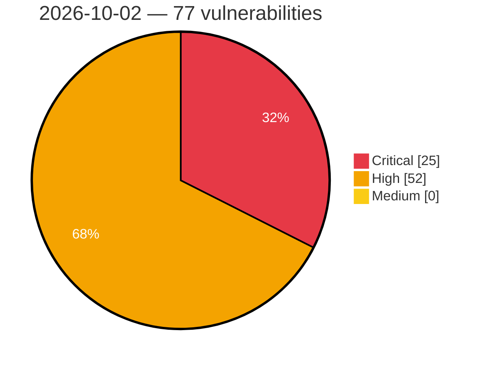

# Critical, High & Medium Severity Vulnerabilities — 2026-10-02

**Source status for this day:**

| Source | Critical | High | Medium | Total |
|--------|---------:|-----:|-------:|------:|
| cvefeed.io (High/Critical) | 25 | 52 | 0 | 77 |

**KEV (actively exploited):** 0  **Watchlist matches:** 43

## Critical (25)

| CVSS | Flags | Source | CVE / Title | Reported |
|------|-------|--------|-------------|----------|
| 10.0 | ⭐ | cvefeed.io (High/Critical) | [CVE-2026-103956 - Missing authentication for critical function in Loom for AWS](https://cvefeed.io/vuln/detail/CVE-2026-103956) | 2 hours, 48 minutes ago |
| 9.9 | — | cvefeed.io (High/Critical) | [CVE-2026-90970 - Improper Neutralization of Special Elements Used in a Template Engine in GitLab AI Gateway](https://cvefeed.io/vuln/detail/CVE-2026-90970) | 2 hours, 30 minutes ago |
| 9.9 | — | cvefeed.io (High/Critical) | [CVE-2026-82041 - UTMStack < 11.2.16 Missing Authorization via Command WebSocket](https://cvefeed.io/vuln/detail/CVE-2026-82041) | 48 minutes ago |
| 9.8 | — | cvefeed.io (High/Critical) | [CVE-2026-103764 - Mooncake transfer engine before 0.3.13 Unauthenticated Arbitrary Memory Read/Write via TCP Transport](https://cvefeed.io/vuln/detail/CVE-2026-103764) | 14 minutes ago |
| 9.8 | ⭐ | cvefeed.io (High/Critical) | [CVE-2026-19660 - Divi Membership <= 2.3.0 - Unauthenticated Authentication Bypass via 'paypal_param' Parameter](https://cvefeed.io/vuln/detail/CVE-2026-19660) | 42 minutes ago |
| 9.8 | ⭐ | cvefeed.io (High/Critical) | [CVE-2026-14378 - DevKit Pro <= 2.3.0 - Unauthenticated Authentication Bypass to Administrator Account Takeover via 'original_user_id' Cookie in Frontend Revert Switch Flow](https://cvefeed.io/vuln/detail/CVE-2026-14378) | 51 minutes ago |
| 9.8 | ⭐ | cvefeed.io (High/Critical) | [CVE-2026-94541 - WPMobile.App <= 11.82 - Unauthenticated Admin Account Takeover via 'wpapp_category[]' Parameter](https://cvefeed.io/vuln/detail/CVE-2026-94541) | 1 hour, 25 minutes ago |
| 9.8 | ⭐ | cvefeed.io (High/Critical) | [CVE-2026-97637 - JSON API Auth <= 3.1.2 - Unauthenticated Authentication Bypass via Cached 'generate_auth_cookie' Response](https://cvefeed.io/vuln/detail/CVE-2026-97637) | 3 hours, 25 minutes ago |
| 9.8 | ⭐ | cvefeed.io (High/Critical) | [CVE-2026-104846 - Seroval: `fromJSON()` Promise thenable assimilation invokes plugin-produced callables (bypass of CVE-2026-59940)](https://cvefeed.io/vuln/detail/CVE-2026-104846) | 1 hour, 30 minutes ago |
| 9.8 | ⭐ | cvefeed.io (High/Critical) | [CVE-2026-19652 - Divi Membership <= 2.2.0 - Unauthenticated Privilege Escalation via 'form_id' Parameter](https://cvefeed.io/vuln/detail/CVE-2026-19652) | 3 hours, 30 minutes ago |
| 9.8 | ⭐ | cvefeed.io (High/Critical) | [CVE-2026-82042 - UTMStack < 11.2.16 Authentication Bypass via InternalApiKeyFilter](https://cvefeed.io/vuln/detail/CVE-2026-82042) | 48 minutes ago |
| 9.8 | ⭐ | cvefeed.io (High/Critical) | [CVE-2023-54405 - H3C CVM Unauthenticated File Upload via fileUpload/upload Token](https://cvefeed.io/vuln/detail/CVE-2023-54405) | 2 hours, 48 minutes ago |
| 9.5 | ⭐ | cvefeed.io (High/Critical) | [CVE-2026-104849 - Tinypool: Prototype Pollution Gadget to RCE in run() options](https://cvefeed.io/vuln/detail/CVE-2026-104849) | 30 minutes ago |
| 9.5 | ⭐ | cvefeed.io (High/Critical) | [CVE-2026-104848 - Tinypool: Prototype Pollution gadget in worker options leads to Remote Code Execution](https://cvefeed.io/vuln/detail/CVE-2026-104848) | 30 minutes ago |
| 9.4 | — | cvefeed.io (High/Critical) | [CVE-2026-103765 - Mooncake through 0.3.13.post1 Missing Authentication in HTTP Metadata Server](https://cvefeed.io/vuln/detail/CVE-2026-103765) | 14 minutes ago |
| 9.4 | — | cvefeed.io (High/Critical) | [CVE-2026-104480 - Improper MLS Welcome roster validation in Discord libdave allows unauthorized group membership](https://cvefeed.io/vuln/detail/CVE-2026-104480) | 2 hours, 52 minutes ago |
| 9.4 | — | cvefeed.io (High/Critical) | [CVE-2026-86325 - Protocol Gateway Account Management Interface Stack-Based Buffer Overflow](https://cvefeed.io/vuln/detail/CVE-2026-86325) | 25 minutes ago |
| 9.4 | ⭐ | cvefeed.io (High/Critical) | [CVE-2026-95102 - Monta monta.app Missing Authentication for Critical Function](https://cvefeed.io/vuln/detail/CVE-2026-95102) | 30 minutes ago |
| 9.4 | ⭐ | cvefeed.io (High/Critical) | [CVE-2026-75937 - OS Command Injection in Digi Accelerated Linux (DAL OS)](https://cvefeed.io/vuln/detail/CVE-2026-75937) | 48 minutes ago |
| 9.3 | ⭐ | cvefeed.io (High/Critical) | [CVE-2026-104019 - OS command injection in the Studio Space startup validation script in Amazon SageMaker Distribution when running on Amazon SageMaker Unified Studio](https://cvefeed.io/vuln/detail/CVE-2026-104019) | 1 hour, 48 minutes ago |
| 9.3 | ⭐ | cvefeed.io (High/Critical) | [CVE-2026-102795 - Apache Traffic Server: SNI to Host header matching policy is not properly enforced](https://cvefeed.io/vuln/detail/CVE-2026-102795) | 3 hours, 48 minutes ago |
| 9.2 | — | cvefeed.io (High/Critical) | [CVE-2026-91135 - Apache Thrift: C++ `THeaderTransport::transform()` heap buffer overflow (write direction)](https://cvefeed.io/vuln/detail/CVE-2026-91135) | 25 minutes ago |
| 9.2 | ⭐ | cvefeed.io (High/Critical) | [CVE-2026-83632 - Apache Thrift: C++ THttpTransport grows its line buffer without bound](https://cvefeed.io/vuln/detail/CVE-2026-83632) | 4 hours, 29 minutes ago |
| 9.1 | ⭐ | cvefeed.io (High/Critical) | [CVE-2026-103648 - Improper Limitation of a Pathname to a Restricted Directory ('Path Traversal') in image-downloader](https://cvefeed.io/vuln/detail/CVE-2026-103648) | 1 hour, 30 minutes ago |
| 9.0 | — | cvefeed.io (High/Critical) | [CVE-2026-86345 - 389-ds-base: 389-ds-base: starttls plaintext-buffer retention allows on-path attacker to forge an ldap client's authentication result](https://cvefeed.io/vuln/detail/CVE-2026-86345) | 14 minutes ago |

## High (52)

| CVSS | Flags | Source | CVE / Title | Reported |
|------|-------|--------|-------------|----------|
| 8.8 | ⭐ | cvefeed.io (High/Critical) | [CVE-2026-80298 - SQL Injection in HAVELSAN's Sef - AI Chatbot Platform](https://cvefeed.io/vuln/detail/CVE-2026-80298) | 1 hour, 25 minutes ago |
| 8.8 | ⭐ | cvefeed.io (High/Critical) | [CVE-2026-104851 - fsspec: Server-Side Template Injection in ReferenceFileSystem leads to Remote Code Execution](https://cvefeed.io/vuln/detail/CVE-2026-104851) | 30 minutes ago |
| 8.8 | — | cvefeed.io (High/Critical) | [CVE-2026-94422 - xdg-dbus-proxy: message filtering bypass via reply serial allows sandbox escape](https://cvefeed.io/vuln/detail/CVE-2026-94422) | 3 hours, 30 minutes ago |
| 8.8 | ⭐ | cvefeed.io (High/Critical) | [CVE-2026-82039 - UTMStack < 11.2.16 SQL Injection via searchGroupsByFilter](https://cvefeed.io/vuln/detail/CVE-2026-82039) | 1 hour, 48 minutes ago |
| 8.8 | ⭐ | cvefeed.io (High/Critical) | [CVE-2026-39718 - WordPress Wallstreet theme <= 2.8.6 - Cross Site Request Forgery (CSRF) vulnerability](https://cvefeed.io/vuln/detail/CVE-2026-39718) | 1 hour, 48 minutes ago |
| 8.8 | — | cvefeed.io (High/Critical) | [CVE-2026-96940 - Microsoft Exchange Server Elevation of Privilege Vulnerability](https://cvefeed.io/vuln/detail/CVE-2026-96940) | 2 hours, 48 minutes ago |
| 8.7 | — | cvefeed.io (High/Critical) | [CVE-2026-94642 - Apache Thrift: PHP `TSimpleServer` exits the whole process on any non-transport exception](https://cvefeed.io/vuln/detail/CVE-2026-94642) | 25 minutes ago |
| 8.7 | — | cvefeed.io (High/Critical) | [CVE-2026-94633 - Apache Thrift: Dart `TBinaryProtocol.readMessageBegin` allocates from the pre-versioned name length](https://cvefeed.io/vuln/detail/CVE-2026-94633) | 25 minutes ago |
| 8.7 | ⭐ | cvefeed.io (High/Critical) | [CVE-2026-93926 - Apache Thrift: C++ `THeaderTransport::untransform()` leaks the zlib stream on the error path](https://cvefeed.io/vuln/detail/CVE-2026-93926) | 25 minutes ago |
| 8.7 | — | cvefeed.io (High/Critical) | [CVE-2026-93925 - Apache Thrift: C++ `THeaderTransport::writeVarint32()` stack buffer overflow on a negative protocol id](https://cvefeed.io/vuln/detail/CVE-2026-93925) | 25 minutes ago |
| 8.7 | ⭐ | cvefeed.io (High/Critical) | [CVE-2026-91137 - Apache Thrift: PHP `thrift_protocol` accelerator: zero-byte container elements](https://cvefeed.io/vuln/detail/CVE-2026-91137) | 25 minutes ago |
| 8.7 | ⭐ | cvefeed.io (High/Critical) | [CVE-2026-85494 - Apache Thrift, Apache Thrift, Apache Thrift, Apache Thrift, Apache Thrift, Apache Thrift, Apache Thrift, Apache Thrift, Apache Thrift: Framed transport and binary protocol size read buffers from a peer-declared length without a limit (multi-language)](https://cvefeed.io/vuln/detail/CVE-2026-85494) | 25 minutes ago |
| 8.7 | — | cvefeed.io (High/Critical) | [CVE-2026-85493 - Apache Thrift, Apache Thrift: TProtocolUtil.skip follows peer-chosen nesting to any depth the stack allows (Dart, Java ME)](https://cvefeed.io/vuln/detail/CVE-2026-85493) | 25 minutes ago |
| 8.7 | — | cvefeed.io (High/Critical) | [CVE-2026-96294 - Apache Thrift: nodejs web server: no `error` listener on an upgraded WebSocket connection](https://cvefeed.io/vuln/detail/CVE-2026-96294) | 32 minutes ago |
| 8.7 | ⭐ | cvefeed.io (High/Critical) | [CVE-2026-61373 - Apache Thrift: Java TSaslNonblockingServer pre-auth unbounded SASL frame allocation](https://cvefeed.io/vuln/detail/CVE-2026-61373) | 35 minutes ago |
| 8.7 | ⭐ | cvefeed.io (High/Critical) | [CVE-2026-94635 - Apache Thrift: Lua `TBinaryProtocol:readMessageBegin` bypasses `checkStringSize` on the pre-versioned name](https://cvefeed.io/vuln/detail/CVE-2026-94635) | 1 hour, 25 minutes ago |
| 8.7 | — | cvefeed.io (High/Critical) | [CVE-2026-96277 - Apache Thrift: Ruby `SimpleServer` ends `serve()` on any non-Transport/Protocol exception](https://cvefeed.io/vuln/detail/CVE-2026-96277) | 4 hours, 29 minutes ago |
| 8.7 | — | cvefeed.io (High/Critical) | [CVE-2026-94658 - Apache Thrift: Lua `TFramedTransport`/`THttpTransport` re-slice the buffer on every read (quadratic)](https://cvefeed.io/vuln/detail/CVE-2026-94658) | 4 hours, 29 minutes ago |
| 8.7 | — | cvefeed.io (High/Critical) | [CVE-2026-83745 - Apache Thrift, Apache Thrift: WebSocket frame decoders allocate the payload buffer from the declared length, not the bytes received (Node.js, D)](https://cvefeed.io/vuln/detail/CVE-2026-83745) | 4 hours, 29 minutes ago |
| 8.7 | — | cvefeed.io (High/Critical) | [CVE-2026-83663 - Apache Thrift: TFramedTransport and THeaderTransport re-enter Read once per frame that carries no payload (Go)](https://cvefeed.io/vuln/detail/CVE-2026-83663) | 4 hours, 29 minutes ago |
| 8.7 | — | cvefeed.io (High/Critical) | [CVE-2026-66859 - Apache Thrift: c_glib multiplexed processor crashes on a message it cannot route](https://cvefeed.io/vuln/detail/CVE-2026-66859) | 4 hours, 29 minutes ago |
| 8.7 | ⭐ | cvefeed.io (High/Critical) | [CVE-2020-37278 - Weaver e-Bridge Unauthenticated Arbitrary File Read via saveYZJFile](https://cvefeed.io/vuln/detail/CVE-2020-37278) | 2 hours, 48 minutes ago |
| 8.7 | — | cvefeed.io (High/Critical) | [CVE-2014-125130 - CodeArt Google MP3 Audio Player 1.0.11 Arbitrary File Read via direct_download.php](https://cvefeed.io/vuln/detail/CVE-2014-125130) | 2 hours, 48 minutes ago |
| 8.6 | ⭐ | cvefeed.io (High/Critical) | [CVE-2026-103766 - ClipBucket v5 through 5.5.3-#197 SQL Injection via ads_manager.php delete Parameter](https://cvefeed.io/vuln/detail/CVE-2026-103766) | 14 minutes ago |
| 8.6 | — | cvefeed.io (High/Critical) | [CVE-2026-86326 - Protocol Gateway Improper Cryptographic Signature Verification Vulnerability](https://cvefeed.io/vuln/detail/CVE-2026-86326) | 25 minutes ago |
| 8.6 | — | cvefeed.io (High/Critical) | [CVE-2026-94591 - Armatura LLC Armatura One Use of Hard-coded Cryptographic Key](https://cvefeed.io/vuln/detail/CVE-2026-94591) | 10 minutes ago |
| 8.6 | — | cvefeed.io (High/Critical) | [CVE-2026-94592 - Armatura LLC Armatura One Use of Hard-coded Credentials](https://cvefeed.io/vuln/detail/CVE-2026-94592) | 12 minutes ago |
| 8.5 | — | cvefeed.io (High/Critical) | [CVE-2026-104854 - Nx daemon and plugin worker sockets are accessible to other local users](https://cvefeed.io/vuln/detail/CVE-2026-104854) | 30 minutes ago |
| 8.5 | ⭐ | cvefeed.io (High/Critical) | [CVE-2026-104847 - ProseMirror: XSS vulnerability in prosemirror-view's paste handling](https://cvefeed.io/vuln/detail/CVE-2026-104847) | 1 hour, 30 minutes ago |
| 8.5 | — | cvefeed.io (High/Critical) | [CVE-2026-94593 - Armatura LLC Armatura One Insertion of Sensitive Information into Log File](https://cvefeed.io/vuln/detail/CVE-2026-94593) | 14 minutes ago |
| 8.3 | — | cvefeed.io (High/Critical) | [CVE-2026-94483 - Next.js: Server-Side Request Forgery in Image Optimization](https://cvefeed.io/vuln/detail/CVE-2026-94483) | 1 hour, 30 minutes ago |
| 8.3 | ⭐ | cvefeed.io (High/Critical) | [CVE-2026-103958 - Server-side request forgery in the tool server and remote agent connection handling in Loom for AWS](https://cvefeed.io/vuln/detail/CVE-2026-103958) | 2 hours, 48 minutes ago |
| 8.2 | ⭐ | cvefeed.io (High/Critical) | [CVE-2026-96288 - Apache Thrift: Erlang generated struct reads have no recursion-depth guard (unbounded memory)](https://cvefeed.io/vuln/detail/CVE-2026-96288) | 24 minutes ago |
| 8.2 | ⭐ | cvefeed.io (High/Critical) | [CVE-2026-96990 - Apache Thrift: Erlang thrift_json_protocol reads a whole message with no size bound](https://cvefeed.io/vuln/detail/CVE-2026-96990) | 25 minutes ago |
| 8.2 | ⭐ | cvefeed.io (High/Critical) | [CVE-2026-94651 - Apache Thrift: Java `TSaslNonblockingServer` `Computation.run` orphans a connection on a pre-auth parse error](https://cvefeed.io/vuln/detail/CVE-2026-94651) | 25 minutes ago |
| 8.2 | — | cvefeed.io (High/Critical) | [CVE-2026-94650 - Apache Thrift: c_glib generated struct readers have no recursion-depth guard (native stack exhaustion)](https://cvefeed.io/vuln/detail/CVE-2026-94650) | 25 minutes ago |
| 8.2 | ⭐ | cvefeed.io (High/Critical) | [CVE-2026-94645 - Apache Thrift: Node.js `TJSONProtocol` uses a peer-declared container size as an unbounded loop bound](https://cvefeed.io/vuln/detail/CVE-2026-94645) | 25 minutes ago |
| 8.2 | ⭐ | cvefeed.io (High/Critical) | [CVE-2026-94644 - Apache Thrift: PHP `TJSONProtocol` string/number readers have no size bound](https://cvefeed.io/vuln/detail/CVE-2026-94644) | 25 minutes ago |
| 8.2 | — | cvefeed.io (High/Critical) | [CVE-2026-96292 - Apache Thrift: Lua `THttpTransport:_parseHeaders` matches each header line with a backtracking pattern (quadratic)](https://cvefeed.io/vuln/detail/CVE-2026-96292) | 31 minutes ago |
| 8.2 | ⭐ | cvefeed.io (High/Critical) | [CVE-2026-94639 - Apache Thrift: Java `TSaslNonblockingServer`: residual of CVE-2026-61373 (thread-death black hole + no cross-connection budget)](https://cvefeed.io/vuln/detail/CVE-2026-94639) | 1 hour, 25 minutes ago |
| 8.2 | ⭐ | cvefeed.io (High/Critical) | [CVE-2026-94634 - Apache Thrift: Python `TJSONProtocol` has a string length limit that is off by default](https://cvefeed.io/vuln/detail/CVE-2026-94634) | 1 hour, 25 minutes ago |
| 8.2 | — | cvefeed.io (High/Critical) | [CVE-2026-96289 - Apache Thrift: php `--gen php:inlined` struct readers (and `TProtocol::skipBinary`) have no recursion-depth guard](https://cvefeed.io/vuln/detail/CVE-2026-96289) | 4 hours, 29 minutes ago |
| 8.2 | — | cvefeed.io (High/Critical) | [CVE-2026-96287 - Apache Thrift: Perl `FramedTransport` reads and TLS socket writes re-slice the remaining buffer on every call (quadratic)](https://cvefeed.io/vuln/detail/CVE-2026-96287) | 4 hours, 29 minutes ago |
| 8.2 | — | cvefeed.io (High/Critical) | [CVE-2026-96286 - Apache Thrift: Perl servers end `serve()` when serving one connection fails](https://cvefeed.io/vuln/detail/CVE-2026-96286) | 4 hours, 29 minutes ago |
| 8.2 | ⭐ | cvefeed.io (High/Critical) | [CVE-2026-94657 - Apache Thrift: javame `TJsonProtocol`/`TJSONProtocol` has no string size bound](https://cvefeed.io/vuln/detail/CVE-2026-94657) | 4 hours, 29 minutes ago |
| 8.2 | ⭐ | cvefeed.io (High/Critical) | [CVE-2026-94656 - Apache Thrift: rb `TJsonProtocol`/`TJSONProtocol` has no string size bound](https://cvefeed.io/vuln/detail/CVE-2026-94656) | 4 hours, 29 minutes ago |
| 8.2 | ⭐ | cvefeed.io (High/Critical) | [CVE-2026-94655 - Apache Thrift: Lua `TJsonProtocol` string/number readers have no size bound and are quadratic](https://cvefeed.io/vuln/detail/CVE-2026-94655) | 4 hours, 29 minutes ago |
| 8.2 | — | cvefeed.io (High/Critical) | [CVE-2026-94654 - Apache Thrift: Python `TNonblockingServer` busy-loops and stops selecting all fds after an 8192-byte-boundary frame](https://cvefeed.io/vuln/detail/CVE-2026-94654) | 4 hours, 29 minutes ago |
| 8.2 | — | cvefeed.io (High/Critical) | [CVE-2026-85476 - Apache Thrift: c_glib `read_all` spins when the underlying read returns 0](https://cvefeed.io/vuln/detail/CVE-2026-85476) | 4 hours, 29 minutes ago |
| 8.2 | ⭐ | cvefeed.io (High/Critical) | [CVE-2026-103957 - Server-side request forgery in the OAuth2 discovery handling in Loom for AWS](https://cvefeed.io/vuln/detail/CVE-2026-103957) | 2 hours, 48 minutes ago |
| 8.1 | ⭐ | cvefeed.io (High/Critical) | [CVE-2026-104988 - Pki-core: dogtag-pki: redhat-pki: pki: est fullcmc authentication bypass allows certificate mis-issuance with arbitrary subject](https://cvefeed.io/vuln/detail/CVE-2026-104988) | 1 hour, 48 minutes ago |
| 8.1 | ⭐ | cvefeed.io (High/Critical) | [CVE-2026-51907 - TaskingAI QR Code Generator Plugin Path Traversal Vulnerability](https://cvefeed.io/vuln/detail/CVE-2026-51907) | 5 hours, 48 minutes ago |
