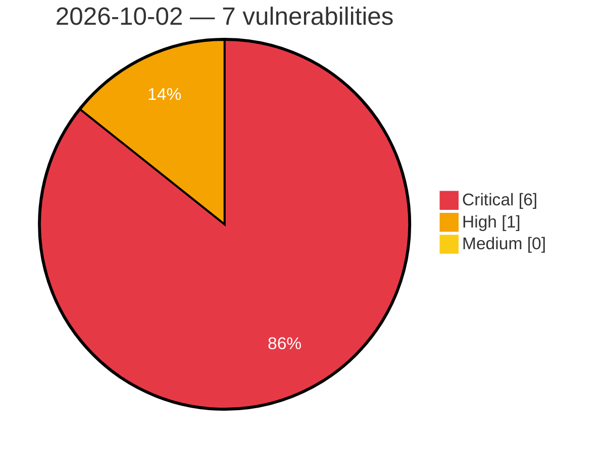

# Critical, High & Medium Severity Vulnerabilities — 2026-10-02

**Source status for this day:**

| Source | Critical | High | Medium | Total |
|--------|---------:|-----:|-------:|------:|
| cvefeed.io (High/Critical) | 6 | 1 | 0 | 7 |

**KEV (actively exploited):** 0  **Watchlist matches:** 3

## Critical (6)

| CVSS | Flags | Source | CVE / Title | Reported |
|------|-------|--------|-------------|----------|
| 9.8 | — | cvefeed.io (High/Critical) | [CVE-2026-103764 - Mooncake transfer engine before 0.3.13 Unauthenticated Arbitrary Memory Read/Write via TCP Transport](https://cvefeed.io/vuln/detail/CVE-2026-103764) | 14 minutes ago |
| 9.8 | ⭐ | cvefeed.io (High/Critical) | [CVE-2026-19660 - Divi Membership <= 2.3.0 - Unauthenticated Authentication Bypass via 'paypal_param' Parameter](https://cvefeed.io/vuln/detail/CVE-2026-19660) | 42 minutes ago |
| 9.8 | ⭐ | cvefeed.io (High/Critical) | [CVE-2026-14378 - DevKit Pro <= 2.3.0 - Unauthenticated Authentication Bypass to Administrator Account Takeover via 'original_user_id' Cookie in Frontend Revert Switch Flow](https://cvefeed.io/vuln/detail/CVE-2026-14378) | 51 minutes ago |
| 9.4 | — | cvefeed.io (High/Critical) | [CVE-2026-103765 - Mooncake through 0.3.13.post1 Missing Authentication in HTTP Metadata Server](https://cvefeed.io/vuln/detail/CVE-2026-103765) | 14 minutes ago |
| 9.4 | — | cvefeed.io (High/Critical) | [CVE-2026-104480 - Improper MLS Welcome roster validation in Discord libdave allows unauthorized group membership](https://cvefeed.io/vuln/detail/CVE-2026-104480) | 2 hours, 52 minutes ago |
| 9.0 | — | cvefeed.io (High/Critical) | [CVE-2026-86345 - 389-ds-base: 389-ds-base: starttls plaintext-buffer retention allows on-path attacker to forge an ldap client's authentication result](https://cvefeed.io/vuln/detail/CVE-2026-86345) | 14 minutes ago |

## High (1)

| CVSS | Flags | Source | CVE / Title | Reported |
|------|-------|--------|-------------|----------|
| 8.6 | ⭐ | cvefeed.io (High/Critical) | [CVE-2026-103766 - ClipBucket v5 through 5.5.3-#197 SQL Injection via ads_manager.php delete Parameter](https://cvefeed.io/vuln/detail/CVE-2026-103766) | 14 minutes ago |
