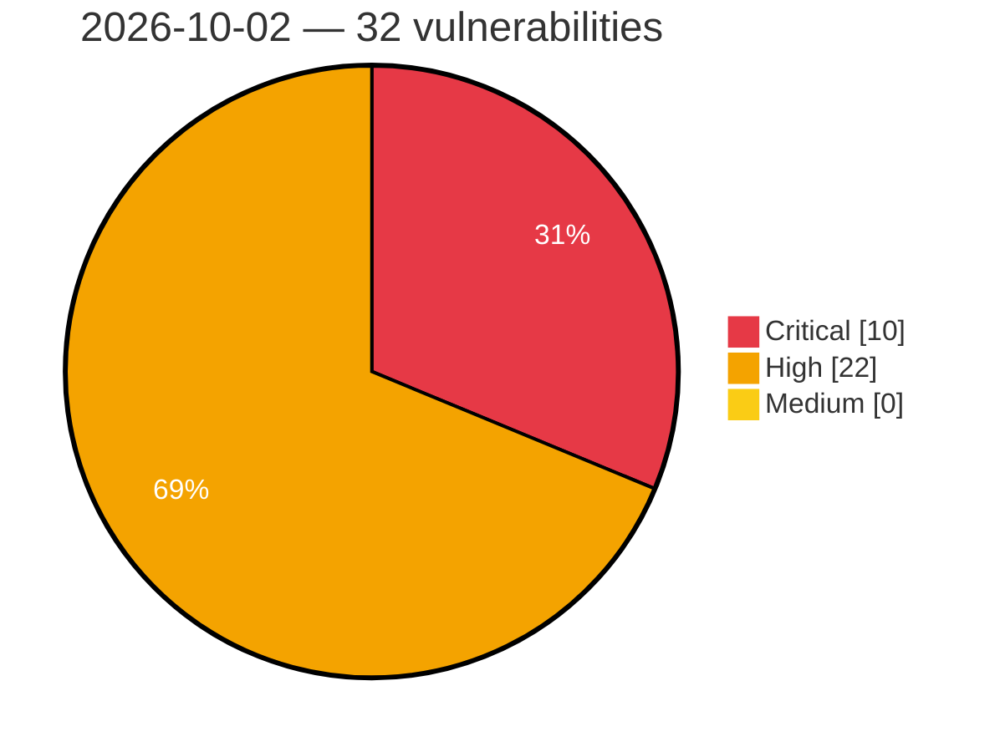

# Critical, High & Medium Severity Vulnerabilities — 2026-10-02

**Source status for this day:**

| Source | Critical | High | Medium | Total |
|--------|---------:|-----:|-------:|------:|
| cvefeed.io (High/Critical) | 10 | 22 | 0 | 32 |

**KEV (actively exploited):** 0  **Watchlist matches:** 18

## Critical (10)

| CVSS | Flags | Source | CVE / Title | Reported |
|------|-------|--------|-------------|----------|
| 9.8 | — | cvefeed.io (High/Critical) | [CVE-2026-103764 - Mooncake transfer engine before 0.3.13 Unauthenticated Arbitrary Memory Read/Write via TCP Transport](https://cvefeed.io/vuln/detail/CVE-2026-103764) | 14 minutes ago |
| 9.8 | ⭐ | cvefeed.io (High/Critical) | [CVE-2026-19660 - Divi Membership <= 2.3.0 - Unauthenticated Authentication Bypass via 'paypal_param' Parameter](https://cvefeed.io/vuln/detail/CVE-2026-19660) | 42 minutes ago |
| 9.8 | ⭐ | cvefeed.io (High/Critical) | [CVE-2026-14378 - DevKit Pro <= 2.3.0 - Unauthenticated Authentication Bypass to Administrator Account Takeover via 'original_user_id' Cookie in Frontend Revert Switch Flow](https://cvefeed.io/vuln/detail/CVE-2026-14378) | 51 minutes ago |
| 9.8 | ⭐ | cvefeed.io (High/Critical) | [CVE-2026-94541 - WPMobile.App <= 11.82 - Unauthenticated Admin Account Takeover via 'wpapp_category[]' Parameter](https://cvefeed.io/vuln/detail/CVE-2026-94541) | 1 hour, 25 minutes ago |
| 9.8 | ⭐ | cvefeed.io (High/Critical) | [CVE-2026-97637 - JSON API Auth <= 3.1.2 - Unauthenticated Authentication Bypass via Cached 'generate_auth_cookie' Response](https://cvefeed.io/vuln/detail/CVE-2026-97637) | 3 hours, 25 minutes ago |
| 9.4 | — | cvefeed.io (High/Critical) | [CVE-2026-103765 - Mooncake through 0.3.13.post1 Missing Authentication in HTTP Metadata Server](https://cvefeed.io/vuln/detail/CVE-2026-103765) | 14 minutes ago |
| 9.4 | — | cvefeed.io (High/Critical) | [CVE-2026-104480 - Improper MLS Welcome roster validation in Discord libdave allows unauthorized group membership](https://cvefeed.io/vuln/detail/CVE-2026-104480) | 2 hours, 52 minutes ago |
| 9.4 | — | cvefeed.io (High/Critical) | [CVE-2026-86325 - Protocol Gateway Account Management Interface Stack-Based Buffer Overflow](https://cvefeed.io/vuln/detail/CVE-2026-86325) | 25 minutes ago |
| 9.2 | — | cvefeed.io (High/Critical) | [CVE-2026-91135 - Apache Thrift: C++ `THeaderTransport::transform()` heap buffer overflow (write direction)](https://cvefeed.io/vuln/detail/CVE-2026-91135) | 25 minutes ago |
| 9.0 | — | cvefeed.io (High/Critical) | [CVE-2026-86345 - 389-ds-base: 389-ds-base: starttls plaintext-buffer retention allows on-path attacker to forge an ldap client's authentication result](https://cvefeed.io/vuln/detail/CVE-2026-86345) | 14 minutes ago |

## High (22)

| CVSS | Flags | Source | CVE / Title | Reported |
|------|-------|--------|-------------|----------|
| 8.8 | ⭐ | cvefeed.io (High/Critical) | [CVE-2026-80298 - SQL Injection in HAVELSAN's Sef - AI Chatbot Platform](https://cvefeed.io/vuln/detail/CVE-2026-80298) | 1 hour, 25 minutes ago |
| 8.7 | — | cvefeed.io (High/Critical) | [CVE-2026-94642 - Apache Thrift: PHP `TSimpleServer` exits the whole process on any non-transport exception](https://cvefeed.io/vuln/detail/CVE-2026-94642) | 25 minutes ago |
| 8.7 | — | cvefeed.io (High/Critical) | [CVE-2026-94633 - Apache Thrift: Dart `TBinaryProtocol.readMessageBegin` allocates from the pre-versioned name length](https://cvefeed.io/vuln/detail/CVE-2026-94633) | 25 minutes ago |
| 8.7 | ⭐ | cvefeed.io (High/Critical) | [CVE-2026-93926 - Apache Thrift: C++ `THeaderTransport::untransform()` leaks the zlib stream on the error path](https://cvefeed.io/vuln/detail/CVE-2026-93926) | 25 minutes ago |
| 8.7 | — | cvefeed.io (High/Critical) | [CVE-2026-93925 - Apache Thrift: C++ `THeaderTransport::writeVarint32()` stack buffer overflow on a negative protocol id](https://cvefeed.io/vuln/detail/CVE-2026-93925) | 25 minutes ago |
| 8.7 | ⭐ | cvefeed.io (High/Critical) | [CVE-2026-91137 - Apache Thrift: PHP `thrift_protocol` accelerator: zero-byte container elements](https://cvefeed.io/vuln/detail/CVE-2026-91137) | 25 minutes ago |
| 8.7 | ⭐ | cvefeed.io (High/Critical) | [CVE-2026-85494 - Apache Thrift, Apache Thrift, Apache Thrift, Apache Thrift, Apache Thrift, Apache Thrift, Apache Thrift, Apache Thrift, Apache Thrift: Framed transport and binary protocol size read buffers from a peer-declared length without a limit (multi-language)](https://cvefeed.io/vuln/detail/CVE-2026-85494) | 25 minutes ago |
| 8.7 | — | cvefeed.io (High/Critical) | [CVE-2026-85493 - Apache Thrift, Apache Thrift: TProtocolUtil.skip follows peer-chosen nesting to any depth the stack allows (Dart, Java ME)](https://cvefeed.io/vuln/detail/CVE-2026-85493) | 25 minutes ago |
| 8.7 | — | cvefeed.io (High/Critical) | [CVE-2026-96294 - Apache Thrift: nodejs web server: no `error` listener on an upgraded WebSocket connection](https://cvefeed.io/vuln/detail/CVE-2026-96294) | 32 minutes ago |
| 8.7 | ⭐ | cvefeed.io (High/Critical) | [CVE-2026-61373 - Apache Thrift: Java TSaslNonblockingServer pre-auth unbounded SASL frame allocation](https://cvefeed.io/vuln/detail/CVE-2026-61373) | 35 minutes ago |
| 8.7 | ⭐ | cvefeed.io (High/Critical) | [CVE-2026-94635 - Apache Thrift: Lua `TBinaryProtocol:readMessageBegin` bypasses `checkStringSize` on the pre-versioned name](https://cvefeed.io/vuln/detail/CVE-2026-94635) | 1 hour, 25 minutes ago |
| 8.6 | ⭐ | cvefeed.io (High/Critical) | [CVE-2026-103766 - ClipBucket v5 through 5.5.3-#197 SQL Injection via ads_manager.php delete Parameter](https://cvefeed.io/vuln/detail/CVE-2026-103766) | 14 minutes ago |
| 8.6 | — | cvefeed.io (High/Critical) | [CVE-2026-86326 - Protocol Gateway Improper Cryptographic Signature Verification Vulnerability](https://cvefeed.io/vuln/detail/CVE-2026-86326) | 25 minutes ago |
| 8.2 | ⭐ | cvefeed.io (High/Critical) | [CVE-2026-96288 - Apache Thrift: Erlang generated struct reads have no recursion-depth guard (unbounded memory)](https://cvefeed.io/vuln/detail/CVE-2026-96288) | 24 minutes ago |
| 8.2 | ⭐ | cvefeed.io (High/Critical) | [CVE-2026-96990 - Apache Thrift: Erlang thrift_json_protocol reads a whole message with no size bound](https://cvefeed.io/vuln/detail/CVE-2026-96990) | 25 minutes ago |
| 8.2 | ⭐ | cvefeed.io (High/Critical) | [CVE-2026-94651 - Apache Thrift: Java `TSaslNonblockingServer` `Computation.run` orphans a connection on a pre-auth parse error](https://cvefeed.io/vuln/detail/CVE-2026-94651) | 25 minutes ago |
| 8.2 | — | cvefeed.io (High/Critical) | [CVE-2026-94650 - Apache Thrift: c_glib generated struct readers have no recursion-depth guard (native stack exhaustion)](https://cvefeed.io/vuln/detail/CVE-2026-94650) | 25 minutes ago |
| 8.2 | ⭐ | cvefeed.io (High/Critical) | [CVE-2026-94645 - Apache Thrift: Node.js `TJSONProtocol` uses a peer-declared container size as an unbounded loop bound](https://cvefeed.io/vuln/detail/CVE-2026-94645) | 25 minutes ago |
| 8.2 | ⭐ | cvefeed.io (High/Critical) | [CVE-2026-94644 - Apache Thrift: PHP `TJSONProtocol` string/number readers have no size bound](https://cvefeed.io/vuln/detail/CVE-2026-94644) | 25 minutes ago |
| 8.2 | — | cvefeed.io (High/Critical) | [CVE-2026-96292 - Apache Thrift: Lua `THttpTransport:_parseHeaders` matches each header line with a backtracking pattern (quadratic)](https://cvefeed.io/vuln/detail/CVE-2026-96292) | 31 minutes ago |
| 8.2 | ⭐ | cvefeed.io (High/Critical) | [CVE-2026-94639 - Apache Thrift: Java `TSaslNonblockingServer`: residual of CVE-2026-61373 (thread-death black hole + no cross-connection budget)](https://cvefeed.io/vuln/detail/CVE-2026-94639) | 1 hour, 25 minutes ago |
| 8.2 | ⭐ | cvefeed.io (High/Critical) | [CVE-2026-94634 - Apache Thrift: Python `TJSONProtocol` has a string length limit that is off by default](https://cvefeed.io/vuln/detail/CVE-2026-94634) | 1 hour, 25 minutes ago |
