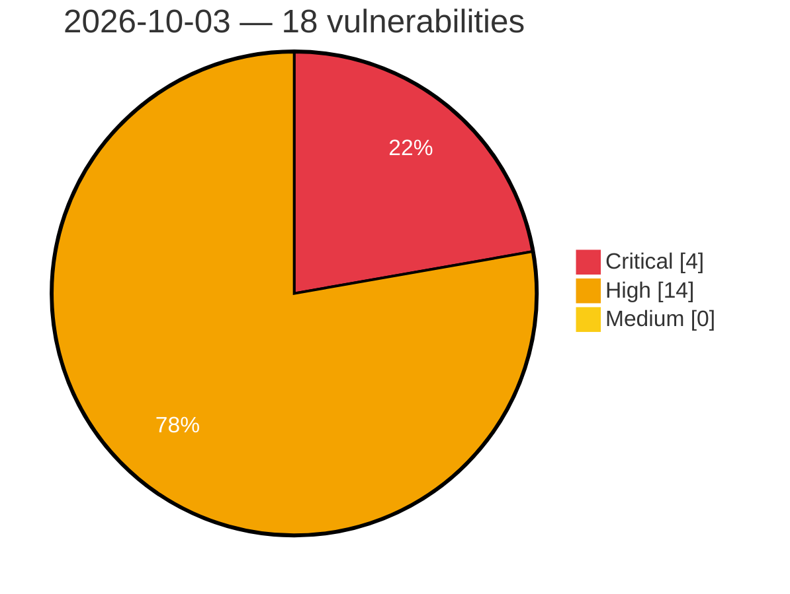

# Critical, High & Medium Severity Vulnerabilities — 2026-10-03

**Source status for this day:**

| Source | Critical | High | Medium | Total |
|--------|---------:|-----:|-------:|------:|
| cvefeed.io (High/Critical) | 4 | 14 | 0 | 18 |

**KEV (actively exploited):** 0  **Watchlist matches:** 10

## Critical (4)

| CVSS | Flags | Source | CVE / Title | Reported |
|------|-------|--------|-------------|----------|
| 9.9 | — | cvefeed.io (High/Critical) | [CVE-2026-105080 - ConvertX Arbitrary Code Execution](https://cvefeed.io/vuln/detail/CVE-2026-105080) | 4 hours, 30 minutes ago |
| 9.2 | — | cvefeed.io (High/Critical) | [CVE-2026-71885 - MLS X.509 credential not bound to the LeafNode signature key](https://cvefeed.io/vuln/detail/CVE-2026-71885) | 1 hour, 17 minutes ago |
| 9.1 | — | cvefeed.io (High/Critical) | [CVE-2026-92084 - Beaver Builder Page Builder <= 2.11.0.5 - Unauthenticated Arbitrary Shortcode Execution via Sidebar Module Widget Output](https://cvefeed.io/vuln/detail/CVE-2026-92084) | 2 hours, 18 minutes ago |
| 9.1 | ⭐ | cvefeed.io (High/Critical) | [CVE-2026-87115 - VikAppointments Services Booking Calendar <= 1.2.21 - Unauthenticated Arbitrary File Deletion via 'old_vapcfN' Parameter](https://cvefeed.io/vuln/detail/CVE-2026-87115) | 3 hours, 18 minutes ago |

## High (14)

| CVSS | Flags | Source | CVE / Title | Reported |
|------|-------|--------|-------------|----------|
| 8.8 | ⭐ | cvefeed.io (High/Critical) | [CVE-2026-97644 - Groundhogg <= 4.9 - Authenticated (Sales Person+) Privilege Escalation via Contact Identity Rebinding leading to Administrator Account Takeover to 'user_id' Parameter (v3 /contacts) chained with v4 /emails/test](https://cvefeed.io/vuln/detail/CVE-2026-97644) | 1 hour, 29 minutes ago |
| 8.8 | ⭐ | cvefeed.io (High/Critical) | [CVE-2026-92536 - Paid Membership Plugin, Ecommerce, User Registration Form, Login Form, User Profile & Restrict Content <= 4.17.4 - Authenticated (Subscriber+) Sensitive Information Exposure via Shortcode Injection via Nickname and Biographical Info Profile Fields](https://cvefeed.io/vuln/detail/CVE-2026-92536) | 1 hour, 29 minutes ago |
| 8.8 | ⭐ | cvefeed.io (High/Critical) | [CVE-2026-18443 - Smart Manager <= 8.97.0 - Authenticated (Subscriber+) SQL Injection to Privilege Escalation via 'access_privileges' Parameter](https://cvefeed.io/vuln/detail/CVE-2026-18443) | 3 hours, 18 minutes ago |
| 8.7 | — | cvefeed.io (High/Critical) | [CVE-2026-104433 - Mooncake before 0.3.12 Out-of-Bounds Read via P2P Handshake readString](https://cvefeed.io/vuln/detail/CVE-2026-104433) | 5 hours, 31 minutes ago |
| 8.7 | ⭐ | cvefeed.io (High/Critical) | [CVE-2026-71890 - MLS external commit can remove an arbitrary group member](https://cvefeed.io/vuln/detail/CVE-2026-71890) | 1 hour, 17 minutes ago |
| 8.7 | — | cvefeed.io (High/Critical) | [CVE-2026-71889 - PKIXCertPathReviewer does not apply X.509 name constraints to the target certificate](https://cvefeed.io/vuln/detail/CVE-2026-71889) | 1 hour, 17 minutes ago |
| 8.7 | — | cvefeed.io (High/Critical) | [CVE-2026-71888 - CMS AuthenticatedData exposes attacker-inserted authAttrs when digestAlgorithm is absent](https://cvefeed.io/vuln/detail/CVE-2026-71888) | 1 hour, 17 minutes ago |
| 8.2 | — | cvefeed.io (High/Critical) | [CVE-2026-104476 - Backdrop CMS before 1.35.1 Information Disclosure via Configuration Export Archive](https://cvefeed.io/vuln/detail/CVE-2026-104476) | 5 hours, 30 minutes ago |
| 8.2 | ⭐ | cvefeed.io (High/Critical) | [CVE-2026-85515 - OpenPGP message truncation not reported, bypassing the SEIPDv1 integrity check](https://cvefeed.io/vuln/detail/CVE-2026-85515) | 1 hour, 17 minutes ago |
| 8.2 | ⭐ | cvefeed.io (High/Critical) | [CVE-2026-71887 - OpenPGP data signature accepted from a signing subkey without cross-certification](https://cvefeed.io/vuln/detail/CVE-2026-71887) | 1 hour, 17 minutes ago |
| 8.2 | ⭐ | cvefeed.io (High/Critical) | [CVE-2026-71886 - OpenPGP certification accepted from a subkey without certification authority](https://cvefeed.io/vuln/detail/CVE-2026-71886) | 1 hour, 17 minutes ago |
| 8.2 | ⭐ | cvefeed.io (High/Critical) | [CVE-2026-71883 - Native AES packet cipher returns the raw AES key on an alias](https://cvefeed.io/vuln/detail/CVE-2026-71883) | 1 hour, 17 minutes ago |
| 8.1 | — | cvefeed.io (High/Critical) | [CVE-2026-94505 - Nelio Content <= 4.5.0 - Missing Authorization to Authenticated (Contributor+) Arbitrary Reusable Message Deletion via 'id' Parameter](https://cvefeed.io/vuln/detail/CVE-2026-94505) | 3 hours, 18 minutes ago |
| 8.1 | ⭐ | cvefeed.io (High/Critical) | [CVE-2026-101923 - Photo Reviews for WooCommerce <= 1.2.30 - Missing Authorization to Unauthenticated Arbitrary Post Deletion via 'wcpr_image_upload_id' Parameter](https://cvefeed.io/vuln/detail/CVE-2026-101923) | 4 hours, 18 minutes ago |
