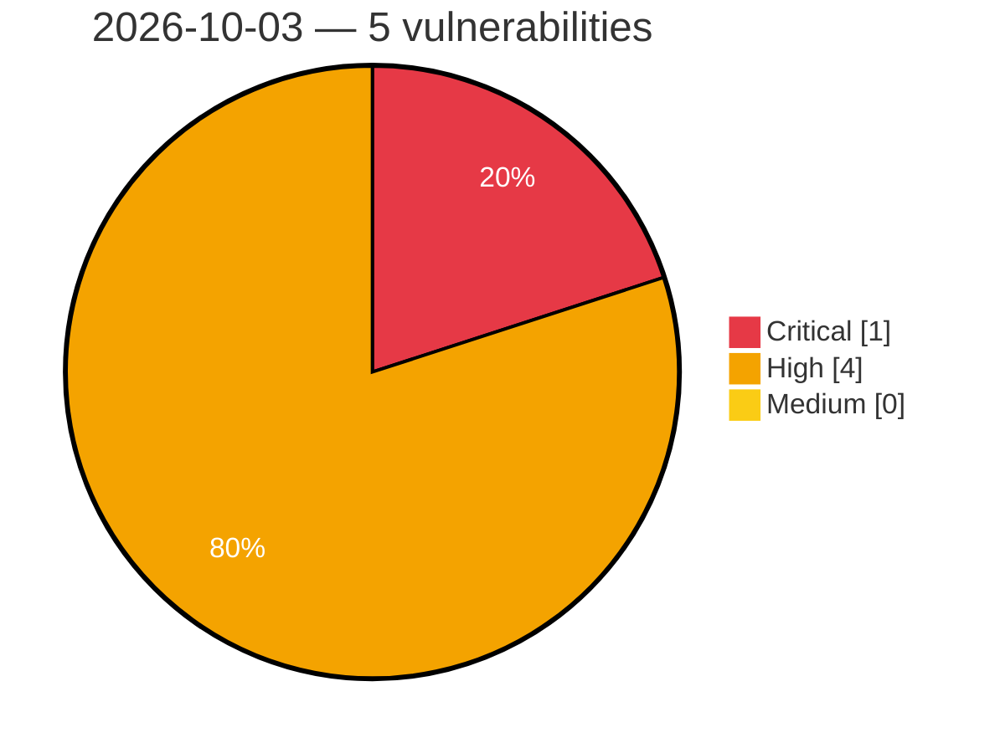

# Critical, High & Medium Severity Vulnerabilities — 2026-10-03

**Source status for this day:**

| Source | Critical | High | Medium | Total |
|--------|---------:|-----:|-------:|------:|
| cvefeed.io (High/Critical) | 1 | 4 | 0 | 5 |

**KEV (actively exploited):** 0  **Watchlist matches:** 2

## Critical (1)

| CVSS | Flags | Source | CVE / Title | Reported |
|------|-------|--------|-------------|----------|
| 9.9 | — | cvefeed.io (High/Critical) | [CVE-2026-105080 - ConvertX Arbitrary Code Execution](https://cvefeed.io/vuln/detail/CVE-2026-105080) | 4 hours, 30 minutes ago |

## High (4)

| CVSS | Flags | Source | CVE / Title | Reported |
|------|-------|--------|-------------|----------|
| 8.8 | ⭐ | cvefeed.io (High/Critical) | [CVE-2026-97644 - Groundhogg <= 4.9 - Authenticated (Sales Person+) Privilege Escalation via Contact Identity Rebinding leading to Administrator Account Takeover to 'user_id' Parameter (v3 /contacts) chained with v4 /emails/test](https://cvefeed.io/vuln/detail/CVE-2026-97644) | 1 hour, 29 minutes ago |
| 8.8 | ⭐ | cvefeed.io (High/Critical) | [CVE-2026-92536 - Paid Membership Plugin, Ecommerce, User Registration Form, Login Form, User Profile & Restrict Content <= 4.17.4 - Authenticated (Subscriber+) Sensitive Information Exposure via Shortcode Injection via Nickname and Biographical Info Profile Fields](https://cvefeed.io/vuln/detail/CVE-2026-92536) | 1 hour, 29 minutes ago |
| 8.7 | — | cvefeed.io (High/Critical) | [CVE-2026-104433 - Mooncake before 0.3.12 Out-of-Bounds Read via P2P Handshake readString](https://cvefeed.io/vuln/detail/CVE-2026-104433) | 5 hours, 31 minutes ago |
| 8.2 | — | cvefeed.io (High/Critical) | [CVE-2026-104476 - Backdrop CMS before 1.35.1 Information Disclosure via Configuration Export Archive](https://cvefeed.io/vuln/detail/CVE-2026-104476) | 5 hours, 30 minutes ago |
