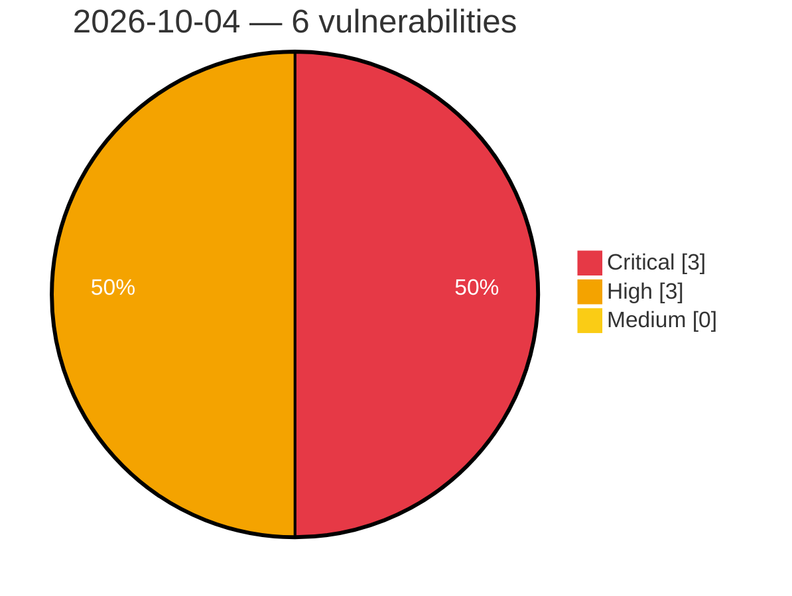

# Critical, High & Medium Severity Vulnerabilities — 2026-10-04

**Source status for this day:**

| Source | Critical | High | Medium | Total |
|--------|---------:|-----:|-------:|------:|
| cvefeed.io (High/Critical) | 3 | 3 | 0 | 6 |

**KEV (actively exploited):** 0  **Watchlist matches:** 4

## Critical (3)

| CVSS | Flags | Source | CVE / Title | Reported |
|------|-------|--------|-------------|----------|
| 10.0 | — | cvefeed.io (High/Critical) | [CVE-2026-105135 - InternLM MindSearch Planner Agent graph.py ExecutionAction.run code injection](https://cvefeed.io/vuln/detail/CVE-2026-105135) | 5 hours, 14 minutes ago |
| 10.0 | ⭐ | cvefeed.io (High/Critical) | [CVE-2026-105134 - Ahsay AhsayCBS Replication Receiver UpdateReceivers.do os command injection](https://cvefeed.io/vuln/detail/CVE-2026-105134) | 5 hours, 14 minutes ago |
| 9.3 | ⭐ | cvefeed.io (High/Critical) | [CVE-2026-103355 - WordPress Unlimited Elements For Elementor (Free Widgets, Addons, Templates) plugin <= 2.0.20 - SQL Injection vulnerability](https://cvefeed.io/vuln/detail/CVE-2026-103355) | 3 hours, 14 minutes ago |

## High (3)

| CVSS | Flags | Source | CVE / Title | Reported |
|------|-------|--------|-------------|----------|
| 8.8 | ⭐ | cvefeed.io (High/Critical) | [CVE-2026-105123 - W (wcms) through 3.18.0 RCE and Arbitrary File Write via Media Upload API](https://cvefeed.io/vuln/detail/CVE-2026-105123) | 18 minutes ago |
| 8.7 | — | cvefeed.io (High/Critical) | [CVE-2026-88779 - Memory overflow vulnerability  leading to Denial of Service](https://cvefeed.io/vuln/detail/CVE-2026-88779) | 2 hours, 55 minutes ago |
| 8.6 | ⭐ | cvefeed.io (High/Critical) | [CVE-2026-105126 - LaraDashboard before 1.4.8 Privilege Escalation via Superadmin Role Tampering](https://cvefeed.io/vuln/detail/CVE-2026-105126) | 18 minutes ago |
