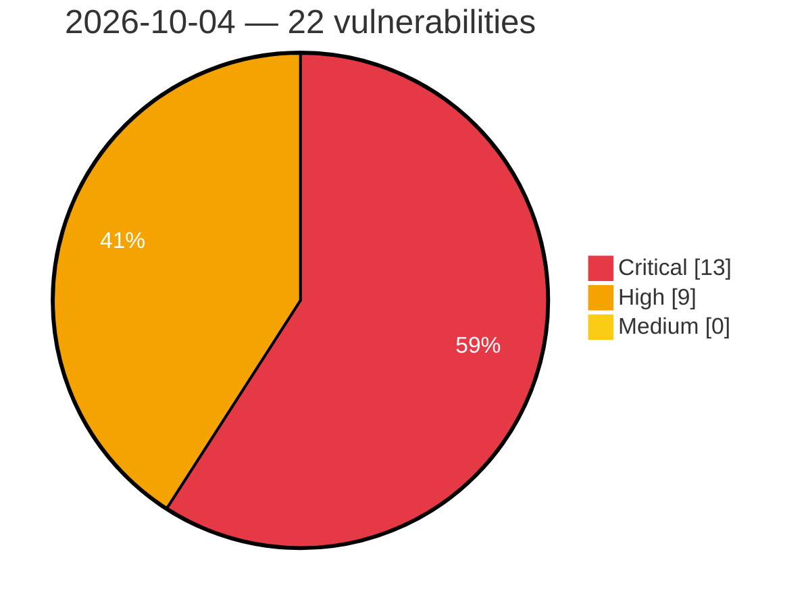

# Critical, High & Medium Severity Vulnerabilities — 2026-10-04

**Source status for this day:**

| Source | Critical | High | Medium | Total |
|--------|---------:|-----:|-------:|------:|
| cvefeed.io (High/Critical) | 13 | 9 | 0 | 22 |

**KEV (actively exploited):** 0  **Watchlist matches:** 15

## Critical (13)

| CVSS | Flags | Source | CVE / Title | Reported |
|------|-------|--------|-------------|----------|
| 10.0 | — | cvefeed.io (High/Critical) | [CVE-2026-105135 - InternLM MindSearch Planner Agent graph.py ExecutionAction.run code injection](https://cvefeed.io/vuln/detail/CVE-2026-105135) | 5 hours, 14 minutes ago |
| 10.0 | ⭐ | cvefeed.io (High/Critical) | [CVE-2026-105134 - Ahsay AhsayCBS Replication Receiver UpdateReceivers.do os command injection](https://cvefeed.io/vuln/detail/CVE-2026-105134) | 5 hours, 14 minutes ago |
| 9.8 | — | cvefeed.io (High/Critical) | [CVE-2026-105207 - ZITADEL before 4.17.3 Account Takeover via External IdP Linking](https://cvefeed.io/vuln/detail/CVE-2026-105207) | 1 hour, 19 minutes ago |
| 9.6 | — | cvefeed.io (High/Critical) | [CVE-2026-105209 - ZITADEL before 3.4.15 and 4.17.1 Cross-Organization Account Takeover via Passkey Enrollment](https://cvefeed.io/vuln/detail/CVE-2026-105209) | 1 hour, 19 minutes ago |
| 9.3 | ⭐ | cvefeed.io (High/Critical) | [CVE-2026-103355 - WordPress Unlimited Elements For Elementor (Free Widgets, Addons, Templates) plugin <= 2.0.20 - SQL Injection vulnerability](https://cvefeed.io/vuln/detail/CVE-2026-103355) | 3 hours, 14 minutes ago |
| 9.3 | ⭐ | cvefeed.io (High/Critical) | [CVE-2026-105089 - WWBN AVideo through 29.2.0 Stored XSS via trailer1 in YouPHPFlix2 Templates](https://cvefeed.io/vuln/detail/CVE-2026-105089) | 19 minutes ago |
| 9.3 | ⭐ | cvefeed.io (High/Critical) | [CVE-2026-105086 - WWBN AVideo 12.4 through 29.2.0 Stored XSS via Double-Encoded Video Title](https://cvefeed.io/vuln/detail/CVE-2026-105086) | 19 minutes ago |
| 9.3 | ⭐ | cvefeed.io (High/Critical) | [CVE-2026-105215 - ZITADEL before 4.16.2 Account Pre-Hijacking via Forged External IdP Callback](https://cvefeed.io/vuln/detail/CVE-2026-105215) | 1 hour, 19 minutes ago |
| 9.2 | ⭐ | cvefeed.io (High/Critical) | [CVE-2026-105211 - ZITADEL before 4.17.1 Authentication Bypass via Login V2 OTP returnCode](https://cvefeed.io/vuln/detail/CVE-2026-105211) | 1 hour, 19 minutes ago |
| 9.1 | ⭐ | cvefeed.io (High/Critical) | [CVE-2026-105218 - gopay before 1.5.119 Disabled TLS Certificate Verification in xhttp Client](https://cvefeed.io/vuln/detail/CVE-2026-105218) | 2 hours, 19 minutes ago |
| 9.1 | ⭐ | cvefeed.io (High/Critical) | [CVE-2026-105216 - go-micro before 6.0.0 Disabled TLS Certificate Verification via tls.Config Helper](https://cvefeed.io/vuln/detail/CVE-2026-105216) | 2 hours, 19 minutes ago |
| 9.1 | ⭐ | cvefeed.io (High/Critical) | [CVE-2026-105222 - alexpechkarev/google-maps through 12.16 Disabled TLS Certificate Verification via ssl_verify_peer](https://cvefeed.io/vuln/detail/CVE-2026-105222) | 3 hours, 19 minutes ago |
| 9.1 | ⭐ | cvefeed.io (High/Critical) | [CVE-2026-105221 - Gist RubyGem before 6.1.0 Disabled TLS Certificate Verification](https://cvefeed.io/vuln/detail/CVE-2026-105221) | 3 hours, 19 minutes ago |

## High (9)

| CVSS | Flags | Source | CVE / Title | Reported |
|------|-------|--------|-------------|----------|
| 8.8 | ⭐ | cvefeed.io (High/Critical) | [CVE-2026-105123 - W (wcms) through 3.18.0 RCE and Arbitrary File Write via Media Upload API](https://cvefeed.io/vuln/detail/CVE-2026-105123) | 18 minutes ago |
| 8.8 | ⭐ | cvefeed.io (High/Critical) | [CVE-2026-105213 - ZITADEL before 4.17.1 Authentication Bypass via Login V2 for Deactivated Organizations](https://cvefeed.io/vuln/detail/CVE-2026-105213) | 1 hour, 19 minutes ago |
| 8.8 | — | cvefeed.io (High/Critical) | [CVE-2026-105210 - ZITADEL before 4.17.1 Unauthenticated MFA Enrollment via Login V1 Init Handlers](https://cvefeed.io/vuln/detail/CVE-2026-105210) | 1 hour, 19 minutes ago |
| 8.7 | — | cvefeed.io (High/Critical) | [CVE-2026-88779 - Memory overflow vulnerability  leading to Denial of Service](https://cvefeed.io/vuln/detail/CVE-2026-88779) | 2 hours, 55 minutes ago |
| 8.7 | ⭐ | cvefeed.io (High/Critical) | [CVE-2026-105212 - ZITADEL before 3.4.14 and 4.16.2 Account Takeover via Passkey Enrollment](https://cvefeed.io/vuln/detail/CVE-2026-105212) | 1 hour, 19 minutes ago |
| 8.7 | — | cvefeed.io (High/Critical) | [CVE-2026-105208 - ZITADEL before 4.17.3 Session Hijacking via Forgeable IdP Intent Tokens](https://cvefeed.io/vuln/detail/CVE-2026-105208) | 1 hour, 19 minutes ago |
| 8.7 | — | cvefeed.io (High/Critical) | [CVE-2026-105219 - Mammoth.js 1.3.0 before 1.12.3 ReDoS via Style Map Tokeniser](https://cvefeed.io/vuln/detail/CVE-2026-105219) | 2 hours, 19 minutes ago |
| 8.6 | ⭐ | cvefeed.io (High/Critical) | [CVE-2026-105126 - LaraDashboard before 1.4.8 Privilege Escalation via Superadmin Role Tampering](https://cvefeed.io/vuln/detail/CVE-2026-105126) | 18 minutes ago |
| 8.5 | ⭐ | cvefeed.io (High/Critical) | [CVE-2026-105220 - Twine 2 Desktop through 2.12.0 Arbitrary Code Execution via Imported Story Files](https://cvefeed.io/vuln/detail/CVE-2026-105220) | 3 hours, 19 minutes ago |
