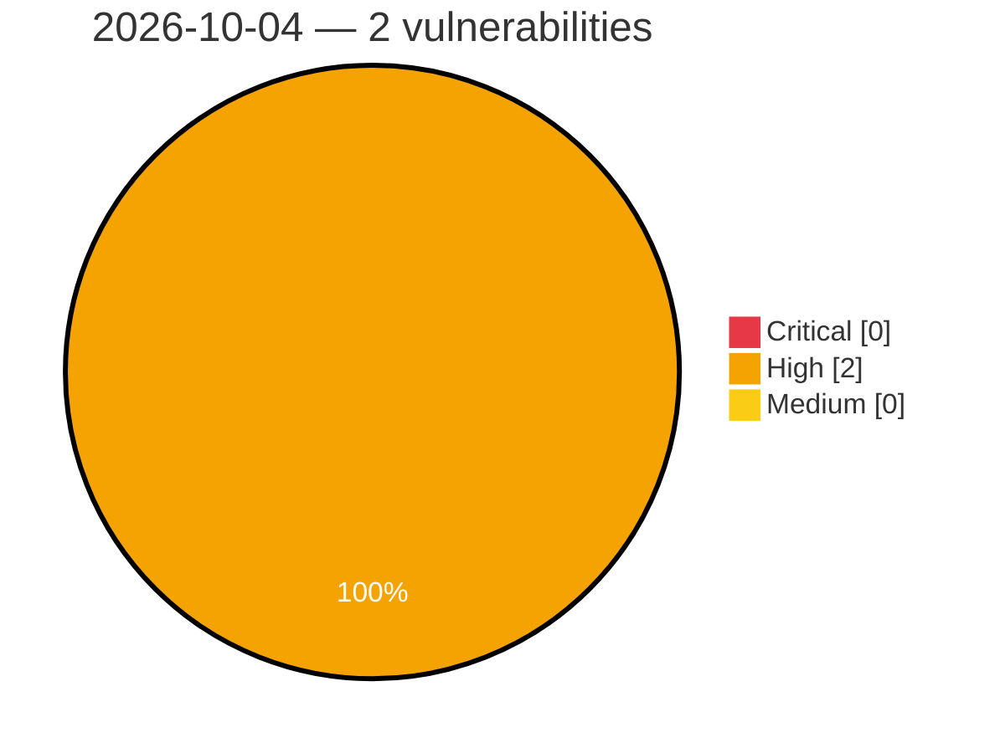

# Critical, High & Medium Severity Vulnerabilities — 2026-10-04

**Source status for this day:**

| Source | Critical | High | Medium | Total |
|--------|---------:|-----:|-------:|------:|
| cvefeed.io (High/Critical) | 0 | 2 | 0 | 2 |

**KEV (actively exploited):** 0  **Watchlist matches:** 2

## High (2)

| CVSS | Flags | Source | CVE / Title | Reported |
|------|-------|--------|-------------|----------|
| 8.8 | ⭐ | cvefeed.io (High/Critical) | [CVE-2026-105123 - W (wcms) through 3.18.0 RCE and Arbitrary File Write via Media Upload API](https://cvefeed.io/vuln/detail/CVE-2026-105123) | 18 minutes ago |
| 8.6 | ⭐ | cvefeed.io (High/Critical) | [CVE-2026-105126 - LaraDashboard before 1.4.8 Privilege Escalation via Superadmin Role Tampering](https://cvefeed.io/vuln/detail/CVE-2026-105126) | 18 minutes ago |
