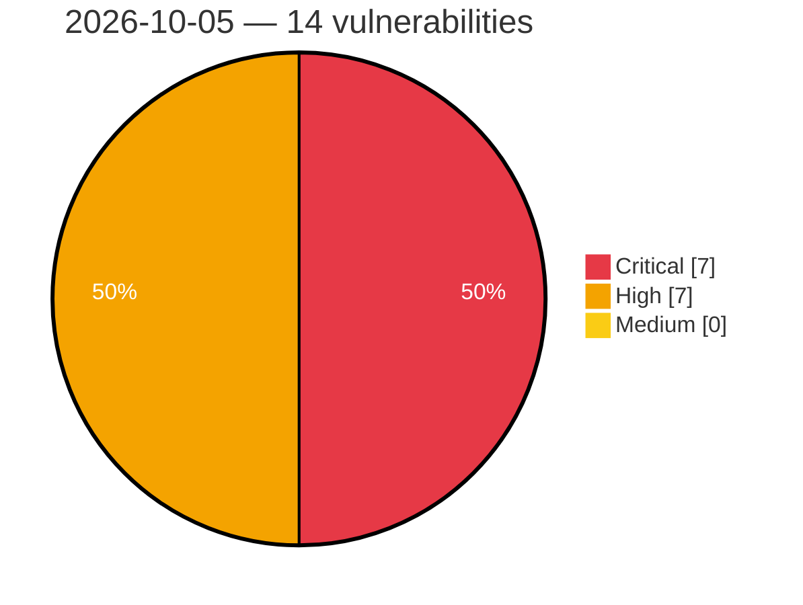

# Critical, High & Medium Severity Vulnerabilities — 2026-10-05

**Source status for this day:**

| Source | Critical | High | Medium | Total |
|--------|---------:|-----:|-------:|------:|
| cvefeed.io (High/Critical) | 7 | 7 | 0 | 14 |

**KEV (actively exploited):** 0  **Watchlist matches:** 12

## Critical (7)

| CVSS | Flags | Source | CVE / Title | Reported |
|------|-------|--------|-------------|----------|
| 10.0 | — | cvefeed.io (High/Critical) | [CVE-2026-105284 - Totolink A3002MU Authentication Check boa sub_40FCFC improper authorization](https://cvefeed.io/vuln/detail/CVE-2026-105284) | 1 hour, 11 minutes ago |
| 10.0 | ⭐ | cvefeed.io (High/Critical) | [CVE-2026-100103 - Authentication bypass via default auth token in P4Search](https://cvefeed.io/vuln/detail/CVE-2026-100103) | 1 hour, 12 minutes ago |
| 9.5 | ⭐ | cvefeed.io (High/Critical) | [CVE-2026-103510 - Authentication bypass via blank auth token in P4Search](https://cvefeed.io/vuln/detail/CVE-2026-103510) | 1 hour, 12 minutes ago |
| 9.5 | ⭐ | cvefeed.io (High/Critical) | [CVE-2026-100102 - RCE via exposed JDWP debug agent in P4Search](https://cvefeed.io/vuln/detail/CVE-2026-100102) | 1 hour, 12 minutes ago |
| 9.2 | ⭐ | cvefeed.io (High/Critical) | [CVE-2026-105293 - Legcord 1.1.0 through 1.3.0 Path Traversal via Theme IPC Handlers](https://cvefeed.io/vuln/detail/CVE-2026-105293) | 1 hour, 19 minutes ago |
| 9.1 | ⭐ | cvefeed.io (High/Critical) | [CVE-2026-105294 - Legcord 1.1.0 through 1.3.0 Chromium Switch Injection via settings.setConfig](https://cvefeed.io/vuln/detail/CVE-2026-105294) | 1 hour, 19 minutes ago |
| 9.1 | ⭐ | cvefeed.io (High/Critical) | [CVE-2026-105223 - maclof kubernetes-client 0.17.0 before 0.32.0 Disabled TLS Certificate Verification](https://cvefeed.io/vuln/detail/CVE-2026-105223) | 1 hour, 19 minutes ago |

## High (7)

| CVSS | Flags | Source | CVE / Title | Reported |
|------|-------|--------|-------------|----------|
| 8.5 | ⭐ | cvefeed.io (High/Critical) | [CVE-2026-104805 - Mitel MiVoice Office 400 Backup Restoration Arbitrary File Write Leading to Root Code Execution](https://cvefeed.io/vuln/detail/CVE-2026-104805) | 1 hour, 11 minutes ago |
| 8.5 | ⭐ | cvefeed.io (High/Critical) | [CVE-2026-104389 - WordPress Sirv plugin <= 8.2.5 - SQL Injection vulnerability](https://cvefeed.io/vuln/detail/CVE-2026-104389) | 1 hour, 12 minutes ago |
| 8.4 | ⭐ | cvefeed.io (High/Critical) | [CVE-2026-19184 - Out-of-bounds write in the NXP GAU ADC driver due to byte-versus-sample buffer size validation mismatch](https://cvefeed.io/vuln/detail/CVE-2026-19184) | 1 hour, 11 minutes ago |
| 8.4 | ⭐ | cvefeed.io (High/Critical) | [CVE-2026-104811 - Mitel MiVoice Office 400 Music on Hold WAV File Upload Code Execution](https://cvefeed.io/vuln/detail/CVE-2026-104811) | 1 hour, 11 minutes ago |
| 8.4 | ⭐ | cvefeed.io (High/Critical) | [CVE-2026-104810 - Mitel MiVoice Office 400 File Management File Browser path traversal vulnerability](https://cvefeed.io/vuln/detail/CVE-2026-104810) | 1 hour, 11 minutes ago |
| 8.4 | — | cvefeed.io (High/Critical) | [CVE-2026-104809 - Mitel MiVoice Office 400 Shared Object Hijacking Leading to Arbitrary Code Execution](https://cvefeed.io/vuln/detail/CVE-2026-104809) | 1 hour, 11 minutes ago |
| 8.4 | ⭐ | cvefeed.io (High/Critical) | [CVE-2026-104706 - Mitel MiVoice Office 400 view system files path traversal](https://cvefeed.io/vuln/detail/CVE-2026-104706) | 1 hour, 11 minutes ago |
