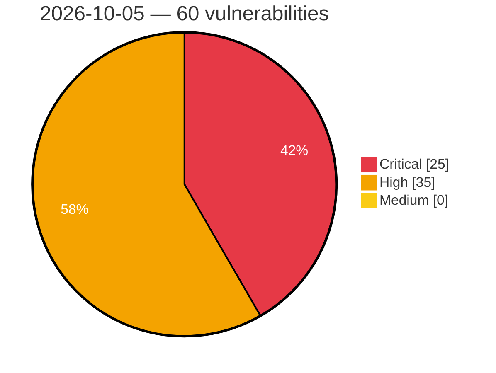

# Critical, High & Medium Severity Vulnerabilities — 2026-10-05

**Source status for this day:**

| Source | Critical | High | Medium | Total |
|--------|---------:|-----:|-------:|------:|
| cvefeed.io (High/Critical) | 25 | 35 | 0 | 60 |

**KEV (actively exploited):** 0  **Watchlist matches:** 53

## Critical (25)

| CVSS | Flags | Source | CVE / Title | Reported |
|------|-------|--------|-------------|----------|
| 10.0 | — | cvefeed.io (High/Critical) | [CVE-2026-105284 - Totolink A3002MU Authentication Check boa sub_40FCFC improper authorization](https://cvefeed.io/vuln/detail/CVE-2026-105284) | 1 hour, 11 minutes ago |
| 10.0 | ⭐ | cvefeed.io (High/Critical) | [CVE-2026-100103 - Authentication bypass via default auth token in P4Search](https://cvefeed.io/vuln/detail/CVE-2026-100103) | 1 hour, 12 minutes ago |
| 10.0 | — | cvefeed.io (High/Critical) | [CVE-2026-92931 - CWE-918: Server-Side Request Forgery in the Progress Sitefinity Next.js Renderer SDK](https://cvefeed.io/vuln/detail/CVE-2026-92931) | 4 hours, 19 minutes ago |
| 10.0 | — | cvefeed.io (High/Critical) | [CVE-2026-105285 - Totolink A3002MU QoS Rule formIpQoS stack-based overflow](https://cvefeed.io/vuln/detail/CVE-2026-105285) | 8 hours, 19 minutes ago |
| 9.9 | ⭐ | cvefeed.io (High/Critical) | [CVE-2026-105740 - Langflow: Authenticated RCE via MCP Stdio transport allows any user to execute arbitrary OS commands on the server](https://cvefeed.io/vuln/detail/CVE-2026-105740) | 1 hour, 57 minutes ago |
| 9.9 | ⭐ | cvefeed.io (High/Critical) | [CVE-2026-105697 - Langflow: OS command injection (RCE) via arbitrary command in MCP stdio server configuration](https://cvefeed.io/vuln/detail/CVE-2026-105697) | 1 hour, 57 minutes ago |
| 9.9 | ⭐ | cvefeed.io (High/Critical) | [CVE-2026-105691 - Penpot: Authenticated OS Command Injection in Penpot SVG Exporter via Legacy fill-color](https://cvefeed.io/vuln/detail/CVE-2026-105691) | 2 hours, 56 minutes ago |
| 9.9 | ⭐ | cvefeed.io (High/Critical) | [CVE-2026-105636 - Plane: SSRF via HTTP redirect in webhook delivery (allow_redirects not set)](https://cvefeed.io/vuln/detail/CVE-2026-105636) | 3 hours, 56 minutes ago |
| 9.8 | ⭐ | cvefeed.io (High/Critical) | [CVE-2026-97283 - WordPress Advanced Post Manager plugin <= 4.5.5 - PHP Object Injection vulnerability](https://cvefeed.io/vuln/detail/CVE-2026-97283) | 27 minutes ago |
| 9.8 | ⭐ | cvefeed.io (High/Critical) | [CVE-2026-105641 - Plane: Hardcoded SECRET_KEY and LIVE_SERVER_SECRET_KEY shipped in aio/cli community deployment manifests — session forgery and live-server auth bypass](https://cvefeed.io/vuln/detail/CVE-2026-105641) | 3 hours, 56 minutes ago |
| 9.8 | ⭐ | cvefeed.io (High/Critical) | [CVE-2026-105639 - Plane: Pre-auth workspace invitation hijack via email-squat and self-served invitation token leak in Plane](https://cvefeed.io/vuln/detail/CVE-2026-105639) | 3 hours, 56 minutes ago |
| 9.6 | ⭐ | cvefeed.io (High/Critical) | [CVE-2026-105637 - Plane: Cross-Project Asset Hijacking via 'ProjectBulkAssetEndpoint' (sibling of CVE-2026-46558)](https://cvefeed.io/vuln/detail/CVE-2026-105637) | 3 hours, 56 minutes ago |
| 9.5 | ⭐ | cvefeed.io (High/Critical) | [CVE-2026-103510 - Authentication bypass via blank auth token in P4Search](https://cvefeed.io/vuln/detail/CVE-2026-103510) | 1 hour, 12 minutes ago |
| 9.5 | ⭐ | cvefeed.io (High/Critical) | [CVE-2026-100102 - RCE via exposed JDWP debug agent in P4Search](https://cvefeed.io/vuln/detail/CVE-2026-100102) | 1 hour, 12 minutes ago |
| 9.3 | ⭐ | cvefeed.io (High/Critical) | [CVE-2026-103352 - WordPress WP BASE Booking plugin <= 6.4.0 - SQL Injection vulnerability](https://cvefeed.io/vuln/detail/CVE-2026-103352) | 27 minutes ago |
| 9.3 | ⭐ | cvefeed.io (High/Critical) | [CVE-2026-102428 - Joomla Extension - ordasoft.com - Unauthenticated SQL injection in OrdaSoft Joomla CCK < 8.3.16](https://cvefeed.io/vuln/detail/CVE-2026-102428) | 2 hours, 19 minutes ago |
| 9.3 | ⭐ | cvefeed.io (High/Critical) | [CVE-2026-91107 - openSIS Classic 9.3 - Insecure Direct Object Reference (IDOR)](https://cvefeed.io/vuln/detail/CVE-2026-91107) | 56 minutes ago |
| 9.3 | — | cvefeed.io (High/Critical) | [CVE-2026-21589 - Atlassian Data Center and Server Arbitrary File Access Vulnerability](https://cvefeed.io/vuln/detail/CVE-2026-21589) | 56 minutes ago |
| 9.2 | ⭐ | cvefeed.io (High/Critical) | [CVE-2026-105293 - Legcord 1.1.0 through 1.3.0 Path Traversal via Theme IPC Handlers](https://cvefeed.io/vuln/detail/CVE-2026-105293) | 1 hour, 19 minutes ago |
| 9.2 | ⭐ | cvefeed.io (High/Critical) | [CVE-2026-77226 - Camunda 7.24.0 < 7.24.15 Incorrect Authorization via SetupResource Endpoint](https://cvefeed.io/vuln/detail/CVE-2026-77226) | 1 hour, 57 minutes ago |
| 9.1 | ⭐ | cvefeed.io (High/Critical) | [CVE-2026-105294 - Legcord 1.1.0 through 1.3.0 Chromium Switch Injection via settings.setConfig](https://cvefeed.io/vuln/detail/CVE-2026-105294) | 1 hour, 19 minutes ago |
| 9.1 | ⭐ | cvefeed.io (High/Critical) | [CVE-2026-105223 - maclof kubernetes-client 0.17.0 before 0.32.0 Disabled TLS Certificate Verification](https://cvefeed.io/vuln/detail/CVE-2026-105223) | 1 hour, 19 minutes ago |
| 9.1 | ⭐ | cvefeed.io (High/Critical) | [CVE-2026-105640 - Plane: Account Takeover via Unverified OAuth Email Match (Gitea, self-managed GitLab)](https://cvefeed.io/vuln/detail/CVE-2026-105640) | 3 hours, 56 minutes ago |
| 9.1 | ⭐ | cvefeed.io (High/Critical) | [CVE-2026-105638 - Plane: Magic-code verifier endpoint has no rate limit, enabling 6-digit OTP brute force](https://cvefeed.io/vuln/detail/CVE-2026-105638) | 3 hours, 56 minutes ago |
| 9.0 | ⭐ | cvefeed.io (High/Critical) | [CVE-2026-79820 - HPE Integrated Lights-Out Authentication Bypass Vulnerability](https://cvefeed.io/vuln/detail/CVE-2026-79820) | 3 hours, 19 minutes ago |

## High (35)

| CVSS | Flags | Source | CVE / Title | Reported |
|------|-------|--------|-------------|----------|
| 8.8 | ⭐ | cvefeed.io (High/Critical) | [CVE-2026-101919 - Hypershift: hypershift: unsanitized kubeconfig passthrough from tenant namespace to control plane](https://cvefeed.io/vuln/detail/CVE-2026-101919) | 18 minutes ago |
| 8.8 | ⭐ | cvefeed.io (High/Critical) | [CVE-2026-97257 - WordPress Simple Event Planner plugin <= 1.5.7 - PHP Object Injection vulnerability](https://cvefeed.io/vuln/detail/CVE-2026-97257) | 2 hours, 56 minutes ago |
| 8.8 | ⭐ | cvefeed.io (High/Critical) | [CVE-2026-100511 - WordPress VK Google Job Posting Manager plugin <= 1.3.1 - PHP Object Injection vulnerability](https://cvefeed.io/vuln/detail/CVE-2026-100511) | 2 hours, 56 minutes ago |
| 8.8 | ⭐ | cvefeed.io (High/Critical) | [CVE-2026-58835 - Bluetooth btif_storage Heap Buffer Overflow](https://cvefeed.io/vuln/detail/CVE-2026-58835) | 3 hours, 56 minutes ago |
| 8.8 | — | cvefeed.io (High/Critical) | [CVE-2026-55280 - Microsoft Windows Uninitialized Memory Out-of-Bounds Write](https://cvefeed.io/vuln/detail/CVE-2026-55280) | 3 hours, 56 minutes ago |
| 8.8 | ⭐ | cvefeed.io (High/Critical) | [CVE-2026-45524 - Android WifiPermissionsUtil Sandbox Escape Local Privilege Escalation](https://cvefeed.io/vuln/detail/CVE-2026-45524) | 3 hours, 56 minutes ago |
| 8.8 | ⭐ | cvefeed.io (High/Critical) | [CVE-2026-105642 - Ghost: Remote Code Execution via Bookmark Card Images](https://cvefeed.io/vuln/detail/CVE-2026-105642) | 3 hours, 56 minutes ago |
| 8.7 | ⭐ | cvefeed.io (High/Critical) | [CVE-2026-105632 - Plane: Broken Access Control - joinProject GraphQL mutation allows self-join into private (secret) projects](https://cvefeed.io/vuln/detail/CVE-2026-105632) | 18 minutes ago |
| 8.7 | ⭐ | cvefeed.io (High/Critical) | [CVE-2026-105630 - Plane: Stored XSS via SVG attachment served inline on the application origin (account takeover)](https://cvefeed.io/vuln/detail/CVE-2026-105630) | 18 minutes ago |
| 8.7 | ⭐ | cvefeed.io (High/Critical) | [CVE-2026-104979 - Plane: Cross-tenant stored XSS in intake enables account takeover](https://cvefeed.io/vuln/detail/CVE-2026-104979) | 18 minutes ago |
| 8.7 | ⭐ | cvefeed.io (High/Critical) | [CVE-2026-104976 - Plane: SSRF in Gitea OAuth](https://cvefeed.io/vuln/detail/CVE-2026-104976) | 18 minutes ago |
| 8.7 | ⭐ | cvefeed.io (High/Critical) | [CVE-2026-104968 - Plane: Cross-workspace member enumeration via /api/workspaces/{slug}/entity-search/](https://cvefeed.io/vuln/detail/CVE-2026-104968) | 1 hour, 19 minutes ago |
| 8.7 | ⭐ | cvefeed.io (High/Critical) | [CVE-2026-104966 - Plane: Cross-Workspace IDOR in Estimate and Comment Endpoints Allows Read, Modify, and Inject Across Workspaces](https://cvefeed.io/vuln/detail/CVE-2026-104966) | 1 hour, 19 minutes ago |
| 8.7 | ⭐ | cvefeed.io (High/Critical) | [CVE-2026-104892 - Plane: Plaintext logging of API token](https://cvefeed.io/vuln/detail/CVE-2026-104892) | 2 hours, 19 minutes ago |
| 8.7 | ⭐ | cvefeed.io (High/Critical) | [CVE-2026-102775 - Joomla Extension - phoca.cz - Authorisation bypass through user-controlled key (IDOR) in Order View in Phoca Cart 5.0.0 - 6.1.8](https://cvefeed.io/vuln/detail/CVE-2026-102775) | 2 hours, 19 minutes ago |
| 8.5 | ⭐ | cvefeed.io (High/Critical) | [CVE-2026-104805 - Mitel MiVoice Office 400 Backup Restoration Arbitrary File Write Leading to Root Code Execution](https://cvefeed.io/vuln/detail/CVE-2026-104805) | 1 hour, 11 minutes ago |
| 8.5 | ⭐ | cvefeed.io (High/Critical) | [CVE-2026-104389 - WordPress Sirv plugin <= 8.2.5 - SQL Injection vulnerability](https://cvefeed.io/vuln/detail/CVE-2026-104389) | 1 hour, 12 minutes ago |
| 8.5 | ⭐ | cvefeed.io (High/Critical) | [CVE-2026-104971 - Plane: Cross-Workspace Asset Duplication IDOR + WorkspaceFileAssetEndpoint and FileAssetEndpoint Missing Authorization](https://cvefeed.io/vuln/detail/CVE-2026-104971) | 18 minutes ago |
| 8.5 | ⭐ | cvefeed.io (High/Critical) | [CVE-2026-63277 - RCE via calcext:data-mappings, sql provider and jdbc connector](https://cvefeed.io/vuln/detail/CVE-2026-63277) | 6 hours, 19 minutes ago |
| 8.5 | ⭐ | cvefeed.io (High/Critical) | [CVE-2026-103066 - WordPress WP BASE Booking plugin <= 6.4.0 - SQL Injection vulnerability](https://cvefeed.io/vuln/detail/CVE-2026-103066) | 2 hours, 56 minutes ago |
| 8.4 | ⭐ | cvefeed.io (High/Critical) | [CVE-2026-19184 - Out-of-bounds write in the NXP GAU ADC driver due to byte-versus-sample buffer size validation mismatch](https://cvefeed.io/vuln/detail/CVE-2026-19184) | 1 hour, 11 minutes ago |
| 8.4 | ⭐ | cvefeed.io (High/Critical) | [CVE-2026-104811 - Mitel MiVoice Office 400 Music on Hold WAV File Upload Code Execution](https://cvefeed.io/vuln/detail/CVE-2026-104811) | 1 hour, 11 minutes ago |
| 8.4 | ⭐ | cvefeed.io (High/Critical) | [CVE-2026-104810 - Mitel MiVoice Office 400 File Management File Browser path traversal vulnerability](https://cvefeed.io/vuln/detail/CVE-2026-104810) | 1 hour, 11 minutes ago |
| 8.4 | — | cvefeed.io (High/Critical) | [CVE-2026-104809 - Mitel MiVoice Office 400 Shared Object Hijacking Leading to Arbitrary Code Execution](https://cvefeed.io/vuln/detail/CVE-2026-104809) | 1 hour, 11 minutes ago |
| 8.4 | ⭐ | cvefeed.io (High/Critical) | [CVE-2026-104706 - Mitel MiVoice Office 400 view system files path traversal](https://cvefeed.io/vuln/detail/CVE-2026-104706) | 1 hour, 11 minutes ago |
| 8.4 | ⭐ | cvefeed.io (High/Critical) | [CVE-2026-86671 - Eclipse Che Server-Side Request Forgery Vulnerability](https://cvefeed.io/vuln/detail/CVE-2026-86671) | 1 hour, 19 minutes ago |
| 8.4 | ⭐ | cvefeed.io (High/Critical) | [CVE-2026-12171 - auto-changelog: code execution via untrusted in-repository configuration (handlebarsSetup/plugins), plus argument injection, path traversal, and SSRF](https://cvefeed.io/vuln/detail/CVE-2026-12171) | 1 hour, 19 minutes ago |
| 8.2 | ⭐ | cvefeed.io (High/Critical) | [CVE-2026-104978 - Plane: Invitation Hijack in Project Join Flow via Missing Authorization and Email-Only Acceptance](https://cvefeed.io/vuln/detail/CVE-2026-104978) | 18 minutes ago |
| 8.2 | ⭐ | cvefeed.io (High/Critical) | [CVE-2026-94201 - Filtering an :atom attribute with unsafe_to_atom? can exhaust the BEAM atom table in Ash](https://cvefeed.io/vuln/detail/CVE-2026-94201) | 2 hours, 56 minutes ago |
| 8.2 | ⭐ | cvefeed.io (High/Critical) | [CVE-2026-104852 - GraphQL Tools has prototype pollution in well-established utility function `mergeDeep`](https://cvefeed.io/vuln/detail/CVE-2026-104852) | 8 hours, 5 minutes ago |
| 8.1 | ⭐ | cvefeed.io (High/Critical) | [CVE-2026-104974 - Plane: Disabled User Auto-Reactivation on Login](https://cvefeed.io/vuln/detail/CVE-2026-104974) | 18 minutes ago |
| 8.1 | — | cvefeed.io (High/Critical) | [CVE-2026-104905 - FacturaScripts < 2026.7 PHP Object Injection via WidgetSelect](https://cvefeed.io/vuln/detail/CVE-2026-104905) | 18 minutes ago |
| 8.1 | ⭐ | cvefeed.io (High/Critical) | [CVE-2026-104970 - Plane: InstanceAdminSignUpEndpoint TOCTOU race allows two concurrent unauthenticated callers to both bootstrap as Plane instance admins](https://cvefeed.io/vuln/detail/CVE-2026-104970) | 1 hour, 19 minutes ago |
| 8.1 | ⭐ | cvefeed.io (High/Critical) | [CVE-2026-105650 - Ghost: Stored XSS via oEmbed Photo Responses](https://cvefeed.io/vuln/detail/CVE-2026-105650) | 2 hours, 56 minutes ago |
| 8.1 | ⭐ | cvefeed.io (High/Critical) | [CVE-2026-105634 - Plane: Privilege Escalation: Project Guest Can Demote Admin/Member Roles](https://cvefeed.io/vuln/detail/CVE-2026-105634) | 3 hours, 56 minutes ago |
