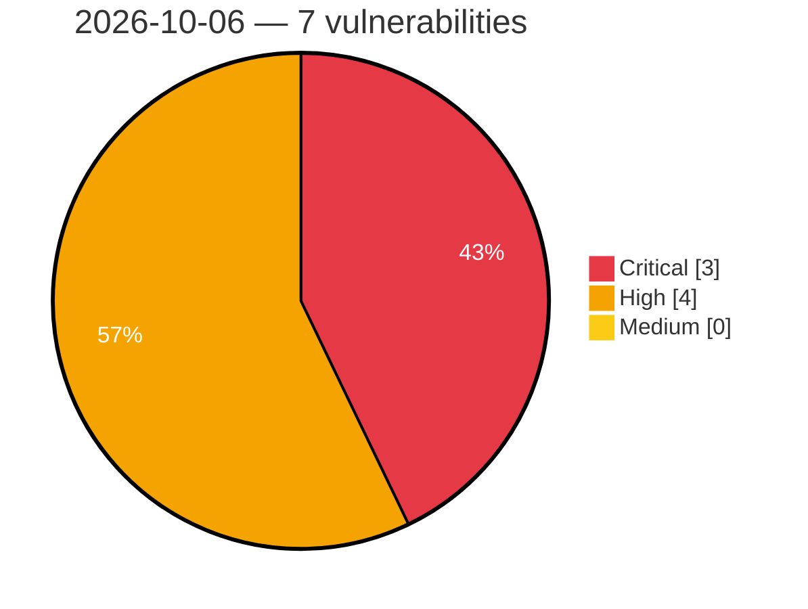

# Critical, High & Medium Severity Vulnerabilities — 2026-10-06

**Source status for this day:**

| Source | Critical | High | Medium | Total |
|--------|---------:|-----:|-------:|------:|
| cvefeed.io (High/Critical) | 3 | 4 | 0 | 7 |

**KEV (actively exploited):** 0  **Watchlist matches:** 7

## Critical (3)

| CVSS | Flags | Source | CVE / Title | Reported |
|------|-------|--------|-------------|----------|
| 10.0 | ⭐ | cvefeed.io (High/Critical) | [CVE-2026-105484 - TOTOLINK X6000R UploadFirmwareFile cstecgi.cgi firmware_check os command injection](https://cvefeed.io/vuln/detail/CVE-2026-105484) | 5 hours, 5 minutes ago |
| 9.8 | ⭐ | cvefeed.io (High/Critical) | [CVE-2026-94293 - Missing authentication for critical function in the aas-edge-client REST API](https://cvefeed.io/vuln/detail/CVE-2026-94293) | 44 minutes ago |
| 9.6 | ⭐ | cvefeed.io (High/Critical) | [CVE-2026-105763 - Twenty: Plaintext IMAP/SMTP/CalDAV password disclosure to any workspace member via /metadata GraphQL](https://cvefeed.io/vuln/detail/CVE-2026-105763) | 7 hours, 5 minutes ago |

## High (4)

| CVSS | Flags | Source | CVE / Title | Reported |
|------|-------|--------|-------------|----------|
| 8.8 | ⭐ | cvefeed.io (High/Critical) | [CVE-2026-105701 - ACPT (Premium) <= 2.0.66 - Authenticated (Subscriber+) Remote Code Execution via REST API Email Template](https://cvefeed.io/vuln/detail/CVE-2026-105701) | 40 minutes ago |
| 8.5 | ⭐ | cvefeed.io (High/Critical) | [CVE-2026-105786 - Joplin: Unauthenticated account takeover via an attacker-chosen application-authorisation identifier](https://cvefeed.io/vuln/detail/CVE-2026-105786) | 7 hours, 5 minutes ago |
| 8.3 | ⭐ | cvefeed.io (High/Critical) | [CVE-2026-105762 - Dify: Unauthenticated Server-Side Request Forgery in /console/api/remote-files/upload endpoint](https://cvefeed.io/vuln/detail/CVE-2026-105762) | 7 hours, 5 minutes ago |
| 8.0 | ⭐ | cvefeed.io (High/Critical) | [CVE-2026-105783 - Joplin Web Clipper pairing allows cross-origin theft of a permanent API token](https://cvefeed.io/vuln/detail/CVE-2026-105783) | 7 hours, 5 minutes ago |
